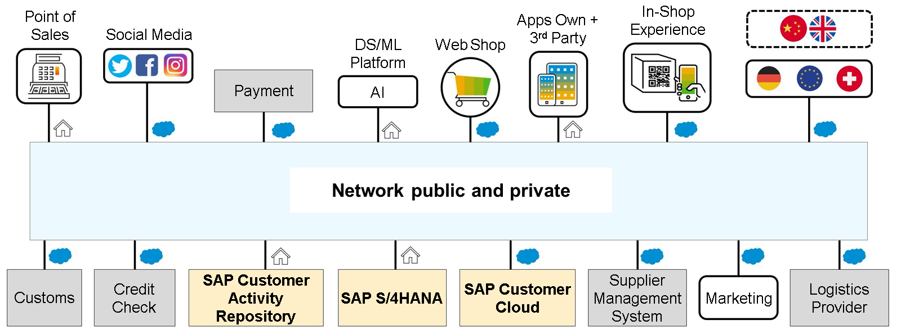
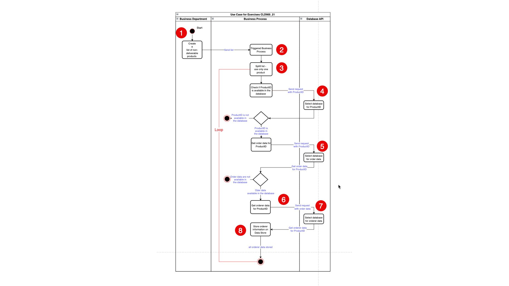

# ♠ 1 - [EXPLAINING DISTRIBUTED ARCHITECTURE AND ITS CHALLENGES](https://learning.sap.com/learning-journeys/developing-with-sap-integration-suite/explaining-distributed-architecture-and-their-challenges_ebcaa544-f5ca-4351-b6b6-5eb471ec1464)

> :exclamation: Objectifs
>
> - [ ] Describe the distributed architecture
>
> - [ ] Describe the whole scenario
>
> Topics
>
> - Qu'est-ce qu'une `architecture distribuée` (distributed architecture) ?
>
> - Quels défis doivent être résolus ?

## DISTRIBUTED ARCHITECTURE AND ITS CHALLENGES

### QU'EST-CE QU'UNE ARCHITECTURE DISTRIBUEE ?

#### `Distributed IT System` :

    "Un système informatique distribué comprend des sous-systèmes (des composants au sens le plus large) qui sont couplés entre eux dans le cadre d'une architecture spécifique et gèrent les tâches de manière coopérative."

    En revanche, dans un système informatique monolithique, les fonctions d’un système sont regroupées (centralisées). La répartition logique des fonctions du système entre les composants peut s'accompagner d'une décentralisation physique coordonnée dans un réseau informatique.

    Nous considérons toutes les installations et services informatiques comme des composants. Par exemple, les applications ERP On-Premise, SAP S/4HANA On-Premise et/ou SaaS.

    Exemple de paysage client. Vous voyez que de nombreux systèmes techniques différents communiquent entre eux avec toutes leurs particularités techniques.

### QUELS DEFIS DOIVENT ETRE RESOLUS ?

En raison de l’hétérogénéité, des solutions coûteuses et complexes doivent être recherchées, trouvées et mises en œuvre pour relever les défis suivants :

- De nombreux protocoles de transport et de messages différents

- Gestion des versions

- Surveillance

- Identification et correction des erreurs

- Latence

- Qualité de service

- Sécurité

- Disponibilité des implémentations

- Observabilité

- Documentation

Une façon de surmonter ces défis consiste à utiliser une approche [API first]().

#### [API first approach]()

Une approche API first est une méthodologie de conception dans laquelle l'accent principal du processus de développement est mis sur la conception de l'interface de programmation d'application (API) avant tout autre aspect de la solution logicielle. Cette approche met l'accent sur la création d'une API bien définie et robuste qui répond aux besoins des développeurs et des intégrateurs qui l'utilisent pour créer des applications, des services ou des intégrations.

Les principaux aspects d’une approche [API-first]() incluent :

- Centré sur la conception :

  la conception d'API devient un élément central du cycle de vie du développement logiciel. Les décisions de conception donnent la priorité à la clarté, à la cohérence et à la convivialité pour garantir que les développeurs peuvent facilement comprendre et utiliser l'API.

- Développement itératif :

  les développeurs itèrent sur la conception de l'API en fonction des commentaires et de l'évolution des exigences avant de passer à l'implémentation backend ou à d'autres aspects de l'application.

- Facilite la collaboration :

  en définissant l'API dès le début, différentes équipes (développeurs front-end, backend, mobiles, tiers) peuvent travailler simultanément et de manière synchronisée. Cela réduit les dépendances et accélère le développement.

- Garantit l'évolutivité et la flexibilité :

  une approche axée sur l'API favorise l'évolutivité car elle encourage les composants modulaires et réutilisables. Il offre également la flexibilité nécessaire pour s’adapter aux exigences commerciales changeantes et aux avancées technologiques.

- Focus sur l'expérience du développeur (DX) :

  DX devient crucial, dans le but de fournir aux développeurs une documentation claire, des SDK (Software Development Kits), des exemples de code et des outils de test pour faciliter l'intégration et l'utilisation de l'API.

- Prend en charge la croissance des écosystèmes :

  les API conçues avec une approche [API-first]() peuvent favoriser un écosystème autour de la plate-forme ou du service, permettant des intégrations tierces, des partenariats et l'innovation.

### RESUME

Pour les processus techniques automatisés, de nombreux composants logiciels, installations, technologies et disponibilités spatiales différents sont souvent couplés via des réseaux avec des protocoles différents. Les fonctionnalités de ces implémentations sont appelées services. L'interface est fournie via des API (Application Programming Interfaces). Le type, l’emplacement et la mise en œuvre des API ne sont pas pertinents pour l’instant. Ces API sont indépendantes du langage. C’est pourquoi on parle également d’une architecture ou d’une approche API first. Les architectures cloud natives sont basées sur des API. Cela s’accompagne de nouveaux défis.

## DECRIRE UN SCENARIO ENTIER

### EXEMPLE METIER

Un détaillant bien connu est confronté à un défi majeur en raison des perturbations de la chaîne d’approvisionnement mondiale, de la congestion des ports et des problèmes logistiques. Cela entraîne des retards dans la livraison de produits populaires tels que l’électronique, les appareils électroménagers et les articles spécialisés. En conséquence, de nombreux clients sont concernés, ce qui met en danger leur satisfaction et la réputation de fiabilité de l'entreprise.

Pour remédier efficacement à cette situation, l'entreprise a élaboré un plan complet pour informer tous les clients concernés des retards et gérer leurs attentes.

Vous faites partie de l'équipe IT, qui doit identifier toutes les commandes impactées par les retards de livraison.

### FLUX DE MESSAGE DE L'EXERCICE

La figure suivante montre l'exemple métier sous la forme d'un processus étape par étape :

### DESCRIPTION

1.  Le service responsable crée une liste de ProductID non livrables.

2.  Le processus métier démarre avec cette liste.

3.  Tout d’abord, la liste est divisée et traitée pour chaque produit de la liste l’un après l’autre (séquentiellement). Pour ce faire, le processus s’exécute en boucle.

4.  Il convient de vérifier si le produit transformé peut être trouvé dans la base de données. Pour ce faire, une requête doit être envoyée à la base de données avec son ProductID.

5.  Si le produit est disponible dans la base de données, une autre demande sera envoyée à la base de données pour obtenir les données de la commande.

6.  Nous obtenons les données de commande correspondantes à nos produits à partir de la base de données.

7.  Pour chaque produit, diverses informations de commande sont associées à différents clients. Pour connaître tous les clients pour chaque information de commande, une autre demande doit être envoyée à la base de données.

8.  Les informations client sont stockées dans un magasin de données.

9.  Une fois que tous les produits de la liste ont été traités et que les informations client ont été enregistrées, le processus se termine.

Lors d'un processus commercial ultérieur, les informations client sont extraites du magasin de données et les clients sont informés par e-mail du retard de livraison. Toutefois, ce processus ne fait pas l’objet de l’exercice.

### SOLUTION ARCHITECTURE

Dans une phase précédente, l'architecture de solution correspondante a été définie à l'aide de la méthodologie [SAP Integration Solution Advisory (ISA-M)](). L'ensemble du processus doit être réalisé avec les outils et les concepts de SAP Integration Suite.

La liste des produits ne pouvant être livrés à temps est établie par le service spécialisé (1).

L'[iFlow]() in [Cloud Integration]() (2) est démarré via une requête. La gestion des API (3) encapsule l'API de la base de données de commandes réelle (4).

L'autorisation s'effectue via [SAP Cloud Identity Service]() (5).

### PREREQUIS

La connaissance de la conception, du développement et du fonctionnement des API est utile.

D'un point de vue technique, il vous faut soit :

- Compte d'essai SAP BTP
- Modèle de niveau gratuit pour SAP BTP
- Compte SAP BTP Entreprise

La SAP Integration Suite doit être provisionnée dans votre sous-compte. Les fonctionnalités suivantes doivent être activées dans SAP Integration Suite :

- Gestion des API
- Intégration cloud

Les collections de rôles appropriées doivent ensuite être attribuées à l'utilisateur. Nous développerons cela plus tard dans les exercices.

### CONFIGURER LES PREREQUIS POUR VOTRE COMPTE D'ESSAI SAP BTP

Si vous décidez d'utiliser un compte d'essai SAP BTP, l'article de blog suivant vous montrera comment configurer un [compte d'essai SAP BTP et comment activer SAP Integration Suite](https://community.sap.com/t5/technology-blogs-by-members/sap-btp-trial-account-creation-and-enabling-integration-suite-service-sap/ba-p/13702052) : Création de compte d'essai SAP BTP et activation du service Integration Suite.

Veuillez vous assurer que tout est configuré en conséquence avant de continuer.

- [Exercices](hhttps://learning.sap.com/learning-journeys/developing-with-sap-integration-suite/explaining-distributed-architecture-and-their-challenges_ebcaa544-f5ca-4351-b6b6-5eb471ec1464)
