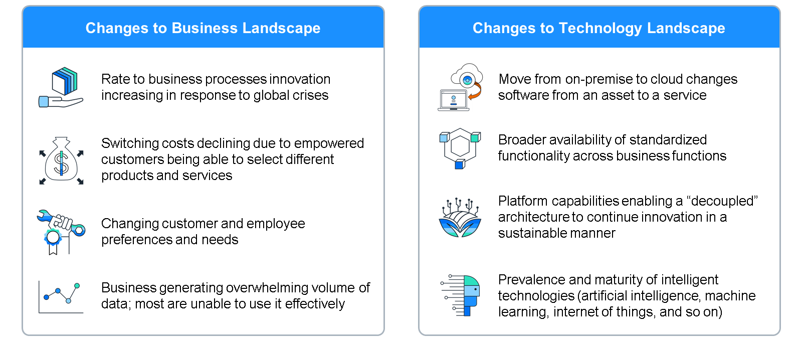
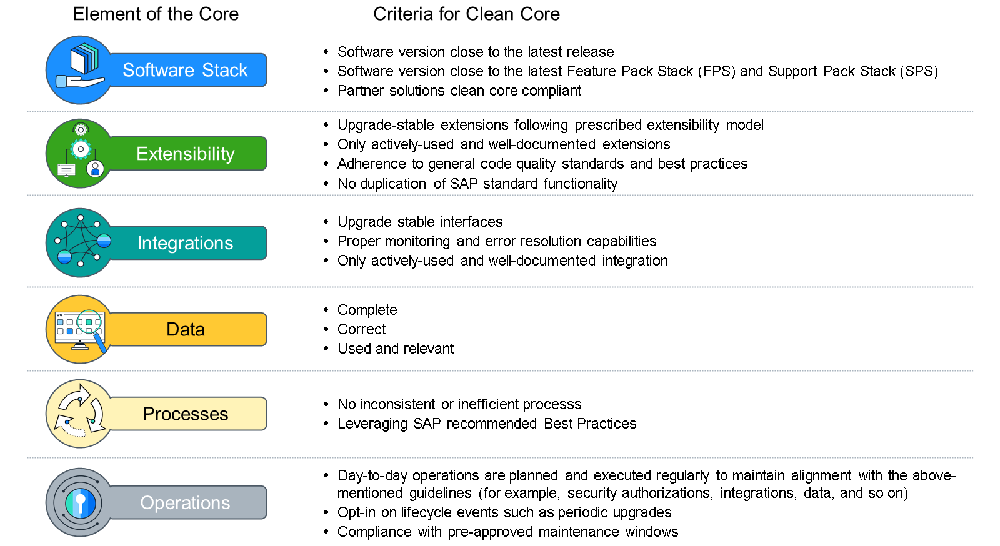
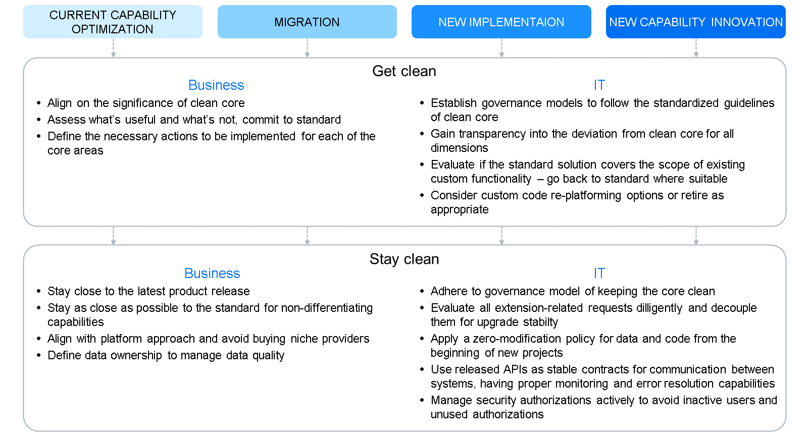

# ♠ 3 - [EXPLAINING THE CLEAN CORE APPROACH](https://learning.sap.com/learning-journeys/developing-with-sap-integration-suite/explaining-the-clean-core-approach)

> :exclamation: Objectifs
>
> - [ ] Explain the Clean Core Approach

## CLEAN CORE CONCEPT

Pour prospérer à l’ère du numérique, les organisations doivent s’adapter à des environnements commerciaux changeants et adopter de nouvelles capacités.

Les organisations dépendent de l'informatique pour fournir les capacités qui pilotent leurs initiatives stratégiques. La flexibilité et la rapidité pour soutenir les changements stratégiques ou favoriser l’innovation sont cruciales. Cependant, les systèmes existants lourdement chargés d’une dette technique importante peuvent nuire à l’agilité organisationnelle. Les logiciels de planification des ressources d'entreprise (ERP) modernes servent désormais de plate-forme dynamique et évolutive, offrant des fonctionnalités étendues telles que des informations intégrées, l'automatisation, des flux de travail, des intégrations standard et une extensibilité facile. Ces fonctionnalités offrent des avantages distinctifs sans l’encombrement d’une dette technique. Pour appliquer ces nouvelles technologies et permettre l'évolution de l'entreprise, les organisations doivent faire face à la complexité de leurs systèmes existants.

## ORGANIZATIONS DEPEND ON IT TO DELIVER THE CAPABILITIES TAHT DRIVE THEIR STRATEGY

L’informatique doit fournir des fonctionnalités essentielles tout en conservant l’agilité organisationnelle. L’objectif principal de l’informatique est d’améliorer l’avantage concurrentiel d’une organisation en la dotant des capacités technologiques appropriées.

Historiquement, cela a conduit à des variations au sein des systèmes ERP, telles que des modifications des données, des processus, des intégrations, des extensions et du code. Dans certains cas, ces changements ont été cruciaux pour fournir des fonctionnalités critiques à l'entreprise ou pour intégrer des systèmes disparates. Toutefois, certains changements n’ont pas donné de résultats intéressants. Quelle que soit leur nécessité, les méthodes utilisées pour étendre les fonctionnalités standards introduisent souvent une dette technique, exigeant des efforts de maintenance importants.

Les changements dans le paysage commercial et technologique obligent les organisations à résoudre les complexités héritées. Les perturbations des chaînes d'approvisionnement mondiales, l'évolution des préférences des clients et l'évolution de la dynamique des employés obligent les entreprises à s'adapter rapidement aux nouvelles demandes. Les progrès technologiques offrent de nouvelles capacités à un rythme accéléré. Cependant, une dette technique importante entrave l’adoption de ces nouvelles technologies, 10 à 20 % du budget technologique destiné aux nouveaux produits étant détourné pour résoudre les problèmes liés à la dette technologique. Ce détournement limite la capacité de répondre efficacement aux exigences commerciales émergentes.

## A "CORE" SERVES AS THE FOUNDATION OF IT'S ABILITY TO SUPPORT AND ENABLE THE STRATEGY

Il concerne les dimensions utilisées pour fournir des capacités via un système ERP. Nous considérons six dimensions lorsque nous discutons du cœur d’une organisation. Ces aspects techniques et procéduraux fonctionnent ensemble pour doter votre entreprise des capacités nécessaires pour atteindre les résultats souhaités.

L’approche clean core vise à créer des ERP modernes, flexibles et compatibles avec le cloud. Parvenir à un noyau propre implique d'intégrer et d'étendre un système pour garantir qu'il est conforme aux normes de conformité du cloud, tout en maintenant une gouvernance efficace des données de référence et des processus métier.

Une idée fausse courante est qu’un noyau propre signifie un système exempt de personnalisation du noyau. En réalité, un noyau véritablement « propre » adhère à des directives standardisées pour tous ses éléments. Cette adhésion garantit que lorsque des mises à niveau du système sont nécessaires, les modifications peuvent être mises en œuvre avec un minimum d'effort manuel pour tester et adapter les structures existantes.

Les organisations peuvent avoir du mal à obtenir un noyau parfaitement propre. Cependant, plus ils peuvent intégrer ces éléments dans leur environnement, plus ils bénéficieront d’avantages en termes de performances commerciales et de fourniture de cloud.

## ELEMENTS AND CRITERIA FOR CLEAN CORE

## A CLEAN CORE ENHANCES CURRENT OPERATIONS AND ESTABLISHED A SOLID FOUNDATION FOR THE FUTURE

Le respect des directives standard en matière d'innovation permet de créer un avantage concurrentiel tout en évitant la dette technique. L’introduction de nouvelles capacités dans l’organisation génère souvent des avantages à la fois en termes de chiffre d’affaires et de résultat net. Les organisations opérant dans des environnements standard peuvent adopter rapidement et à moindre coût de nouvelles fonctionnalités par rapport à celles qui s'écartent des pratiques standard. Les avantages projetés grâce aux nouvelles capacités se concrétisent plus rapidement et plus largement lorsque le cœur est propre. L'établissement d'un noyau propre, que ce soit en préparation pour la transition vers le cloud ou déjà au sein de celui-ci, optimise les avantages de la fourniture dans le cloud.

## TRANSITIONING TO A CLEAN CORE NECESSITATE AN OVERARCHING STRATEGIC DIRECTION

Les organisations doivent commencer par comprendre l’étendue des changements nécessaires et l’urgence avec laquelle ils doivent être mis en œuvre.

Quantité de changement : les organisations ayant une demande importante de nouvelles fonctionnalités pour répondre aux exigences commerciales peuvent envisager un projet de transition vers un système ERP moderne. À l’inverse, ceux qui disposent déjà de capacités adéquates privilégient l’optimisation ou l’innovation au sein de l’environnement existant.

Vitesse de changement requise : les organisations qui ont besoin d'une innovation rapide pour s'adapter à la dynamique du marché doivent passer à des plates-formes modernes pour des capacités améliorées. À l’inverse, ceux qui sont confrontés à un besoin de changement moins urgent cherchent à améliorer l’accès aux capacités existantes. Ces considérations déterminent si l’accent peut être mis sur l’optimisation du noyau actuel, la migration vers un paysage moins complexe, le lancement d’une transformation complète avec un nouveau système ou l’innovation de capacités différenciatrices au-delà du noyau. Comprendre cette orientation stratégique globale guidera les actions précises nécessaires pour améliorer l’agilité dans un avenir proche et préparer l’organisation aux initiatives à venir comme la transition vers le cloud. Étant donné que chaque organisation varie dans son niveau de standardisation, nous vous conseillons de collaborer avec SAP pour identifier l'approche de transformation la plus adaptée à vos besoins spécifiques.

## ONCE THE STRATIEGIC DIRECTION IS DEFINED, ORGANIZATIONS NEED TO INITIATE ACTION

Certaines organisations parviennent à la propreté grâce à la transformation de la migration, tandis que d'autres y parviennent grâce à de nouvelles implémentations. Quelle que soit l’approche adoptée, le maintien de la propreté nécessite la mise en place d’une gouvernance solide. La transition vers et le maintien d’un noyau propre exigent un dévouement de la part des secteurs commercial et informatique.

## RECOGNIZING THE POTENTIAL VALUE WIL BOLSTER INVESTMENT IN THIS INITIATIVE

Grâce à la collaboration entre l'entreprise, l'informatique et les partenaires, il devient possible d'obtenir un noyau propre. SAP fournit une méthodologie éprouvée pour aider les organisations à comprendre les impératifs commerciaux et technologiques, ainsi que l'ensemble des avantages de la transformation. Notre processus consiste à comparer les indicateurs de performance clés (KPI) de l'entreprise par rapport à ses pairs du secteur et à évaluer la maturité numérique par rapport aux normes du secteur afin de proposer des recommandations sur les domaines à prioriser, ainsi que les capacités habilitantes nécessaires. Nous travaillons avec vous pour articuler les avantages qualitatifs et quantitatifs de la résolution des lacunes identifiées.

## TACKLING THE CLEAN CORE IS A CONTINUOUS STRATEGIC ENDEAVOR

Conclusion : le « CLEAN CORE » est une méthode visant à atteindre et à préserver la propreté des systèmes de gestion d'entreprise de base d'une organisation afin d'améliorer la « maintenabilité » et de réduire le coût total de possession (TCO). Cela englobe les activités liées aux logiciels, aux données, aux interfaces, aux processus et aux opérations.

