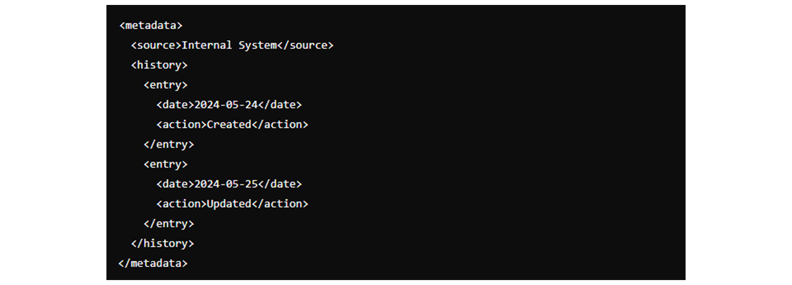
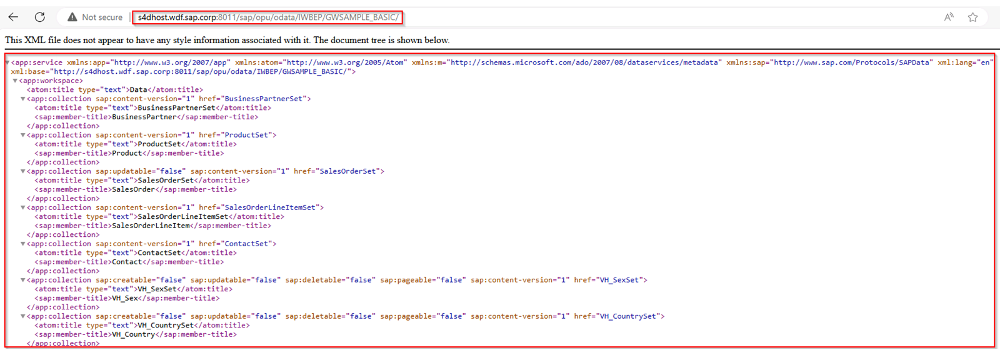
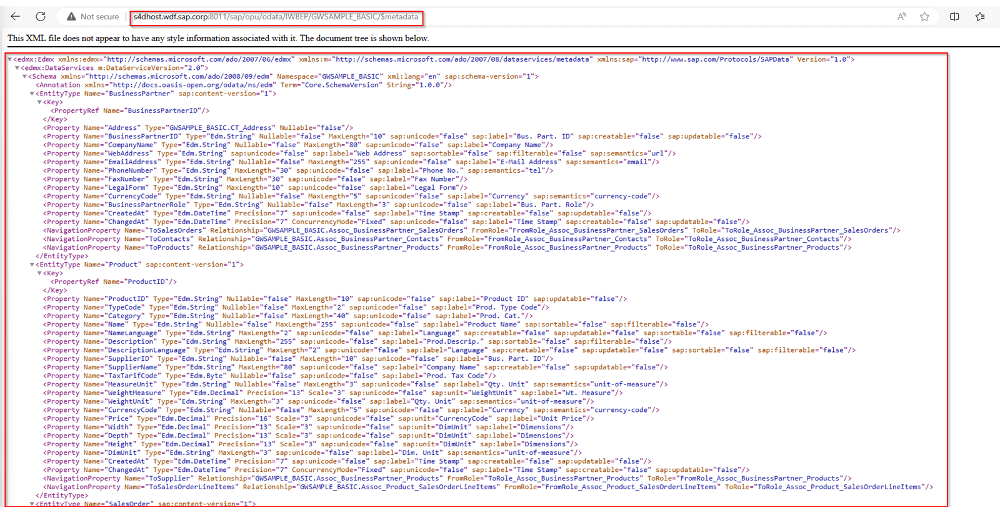

# ♠ 4 [DESCRIBING COMMON USES OF METADATA IN XML](https://learning.sap.com/learning-journeys/developing-with-sap-integration-suite/describing-common-uses-of-metadata-in-xml)

> :exclamation: Objectifs
>
> - [ ] Describe common uses of Metadata in XML

## METADATA IN XML

La fonctionnalité de métadonnées remplit plusieurs fonctions importantes, en particulier dans les contextes où les données doivent être comprises, traitées ou partagées par différents systèmes et utilisateurs. Voici les utilisations courantes des métadonnées en XML.

## DESCRIPTIVE INFORMATION

Objectif : Fournir une description de haut niveau du document XML.

- Auteur : Identifie le créateur du document.
- Titre : Fournit un titre ou un nom bref pour le document.
- Description : Offre un résumé du contenu et de l'objectif du document.
- Mots-clés : répertorie les mots-clés pertinents pour le document, facilitant ainsi la recherche et la catégorisation.


## STRUCTURAL INFORMATION

Objectif : Décrire la structure et le format du document XML.

- Emplacement du schéma : pointe vers le fichier de schéma (XSD) qui définit la structure du document.
- Espaces de noms : déclare les espaces de noms XML utilisés dans le document, garantissant que les noms d'éléments et d'attributs sont uniques et évitant les conflits.


## ADMINISTRATIVE INFORMATION

Objectif : Gérer et contrôler l’utilisation et la gestion des versions du document.

Version : Spécifie la version du document.
Date de création : Indique quand le document a été créé.
Date de modification : Enregistre la dernière fois que le document a été modifié.
Droits d'accès : définit qui peut accéder ou modifier le document.


## TECHNICAL INFORMATION

Objectif : Fournir des détails techniques qui facilitent le traitement du document.

Taille du fichier : indique la taille du document.
Format : Spécifie le format ou l'encodage utilisé dans le document.
Somme de contrôle : fournit une valeur de somme de contrôle pour vérifier l'intégrité du document.


## PROVENANCE INFORMATION

Objectif : Retracer l'origine et l'historique du document.

Source : Indique la source d'où provient le document.
Historique : enregistre les modifications et les mises à jour apportées au document au fil du temps.



## RIGHTS MANAGEMENT

Objectif : Gérer les droits de propriété intellectuelle et les conditions d’utilisation.

Licence : Spécifie les conditions de licence sous lesquelles le document peut être utilisé.
Copyright : indique le détenteur du droit d’auteur et les informations associées.
Restrictions d'utilisation : répertorie toutes les restrictions sur l'utilisation ou la distribution du document.


## ENHANCING METADATA IN ODATA SERVICES

Pour relever les défis que nous avons rencontrés, une solution proposée consiste à étendre le point de terminaison « $metadata » pour fonctionner lui-même comme un service OData.

Pour utiliser la fonctionnalité $metadata, utilisez l'URL GET suivante, où vous devez insérer vos paramètres individuels comme suit :

```xml
http://<yourAPI>:<PORT>/$metadata
```





## SUMMARY

Les métadonnées XML sont essentielles pour fournir le contexte, la structure et le contrôle des documents XML. Il améliore la convivialité du document en offrant des informations descriptives, structurelles, administratives, techniques, de provenance et de gestion des droits. En intégrant des métadonnées dans XML, les utilisateurs et les systèmes peuvent mieux comprendre, gérer et utiliser les données efficacement.
