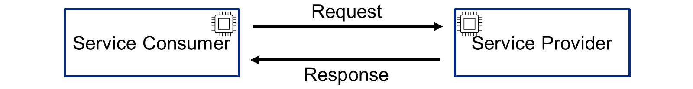

# ♠ 5 - [DESCRIBING OPERATING MODES OF API ARCHITECTURES](https://learning.sap.com/learning-journeys/developing-with-sap-integration-suite/describing-operating-modes-of-api-architectures_b47895bf-cd5c-45f0-8bef-11384e978629)

> Objectifs
>
> - Describe operating modes of API architectures

## WHAT IS A REQUEST-DRIVEN ARCHITECTURE ?

Une architecture basée sur les requêtes est basée sur une communication directe entre un fournisseur de services et un consommateur de services. Cette communication est synchrone.

Sample Request
Un exemple de requête SOAP peut ressembler à ceci :

Sample Response
Un exemple de réponse SOAP peut ressembler à ce qui suit :

## EVENT-DRIVEN ARCHITECTURE

### What are Events?

D'un point de vue technique, un événement est un petit message qui fournit des informations sur un événement commercial. Un événement peut être, par exemple, la création d'une commande dans un système SAP S/4HANA. L'événement est déclenché via push (de manière asynchrone) vers un courtier.

Un événement peut ressembler à ceci :

## EVENT PRODUCER AT SAP

SAP propose le module complémentaire Event Enablement dans ECC et SAP S/4HANA (Cloud et On-Premise) pour vous aider.

### What is an event-driven architecture?

L'architecture basée sur les événements (EDA) est un modèle de conception logicielle dans lequel des applications découplées peuvent publier et s'abonner de manière asynchrone à des événements via un courtier d'événements. Un courtier d'événements est un middleware moderne orienté message, par exemple Service Mesh chez SAP.

Pour en savoir plus, cliquez ici : [Qu'est-ce que l'EDA (Event-Driven Architecture)](https://aws.amazon.com/what-is/eda/) ?

## PULL VARIANT

Le fournisseur d'événements (n° 1) déclenche un événement (n° 2) avec une désignation appelée Sujet (n° 3). Un sujet peut être, par exemple, BusinessPartner_Changed. Il s'agit d'une communication asynchrone. Le sujet est abonné via une file d'attente (s'abonner au sujet). Dans ce cas, depuis la file d'attente A (n°4). Le message peut désormais être activement récupéré par le consommateur d'événement (n° 5). À cet effet, Event Mesh fournit une API. La communication provient du consommateur d'événements, déclenchée par un pull sur la file d'attente. Il s'agit d'une communication synchrone.

## PUSH VARIANT

Le fournisseur d'événements (n° 1) déclenche un événement (n° 2) avec une désignation appelée Sujet (n° 3). Un sujet peut être, par exemple, BusinessPartner_Changed. Il s'agit d'une communication asynchrone. Le sujet est abonné via une file d'attente (s'abonner au sujet). Dans ce cas, depuis la file d'attente B (n°4). Un webhook est désormais attribué à cette file d'attente. (N°5). Si un événement avec un sujet arrive dans la file d'attente correspondante, le webhook est appelé et l'événement est envoyé directement au consommateur d'événement (n°6) via push. La communication provient de l'Event Mesh, déclenchée par un événement entrant. Il s'agit également d'une communication asynchrone.

## WEBHOOKS

Un webhook est un rappel HTTP : un HTTP POST qui se produit lorsqu'un changement d'état est effectué, c'est-à-dire une notification d'événement via HTTP POST. Les webhooks sont utilisés pour les notifications en temps réel, afin que votre système puisse être mis à jour directement au moment de l'événement. En principe, un webhook est une simple URL que vous pouvez également appeler régulièrement dans le navigateur. Dans le cadre de SAP Service Mesh, l'URL du webhook est utilisée lors de l'abonnement. Cela permet au service de savoir où envoyer le message avec le sujet souscrit.

En combinaison avec l'Event Mesh, une URL de webhook est incluse dans l'abonnement d'un sujet à une file d'attente.

## COMBINATION OF REQUEST-DRIVEN AND EVENT-BASED ARCHITECTURE

En réalité, les demandes et événements classiques se combinent.

Les numéros 1 à 6 fonctionnent comme décrit dans une section précédente, mais ce qui est nouveau, c'est que le consommateur d'événements (n° 7) soumet une demande au producteur d'événements (n° 1). Par exemple, pour lire les données du produit qui ont été modifiées. Le consommateur d'événements peut ensuite traiter l'ensemble de données.

## SUMMARY

Il existe deux types d’exploitation de l’approche API First. Celui, piloté par la demande, est basé sur une communication synchrone des partenaires impliqués. Le second, événementiel, fonctionne de manière asynchrone et découple l'émetteur du récepteur en termes de temps et de contenu. Cet accouplement libre offre de nombreux avantages. Les deux types sont souvent utilisés l’un après l’autre.
