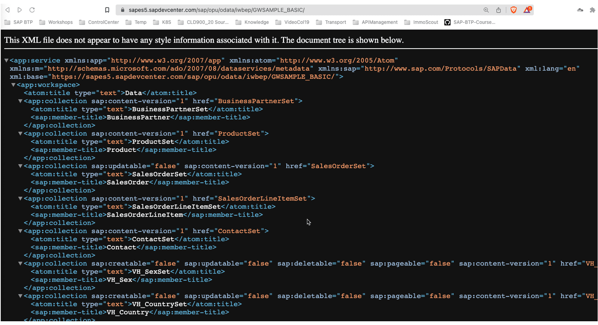
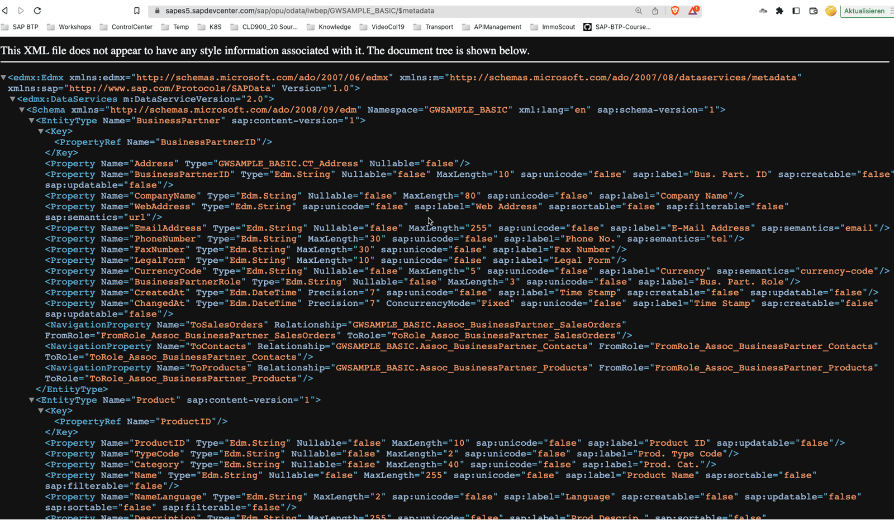
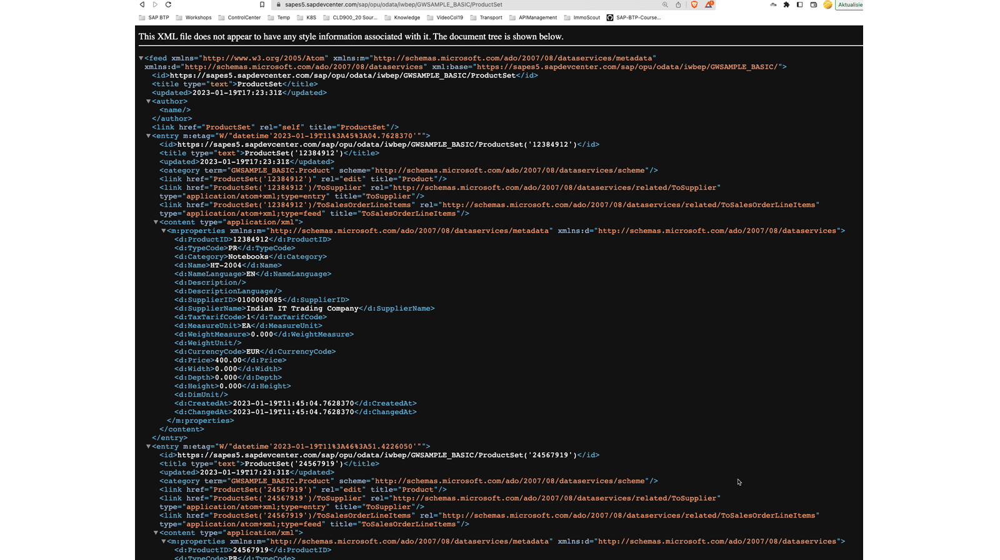
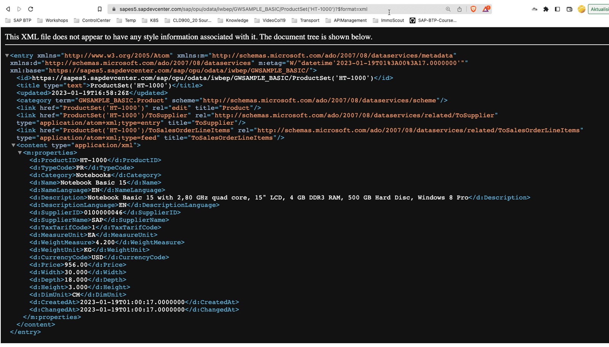
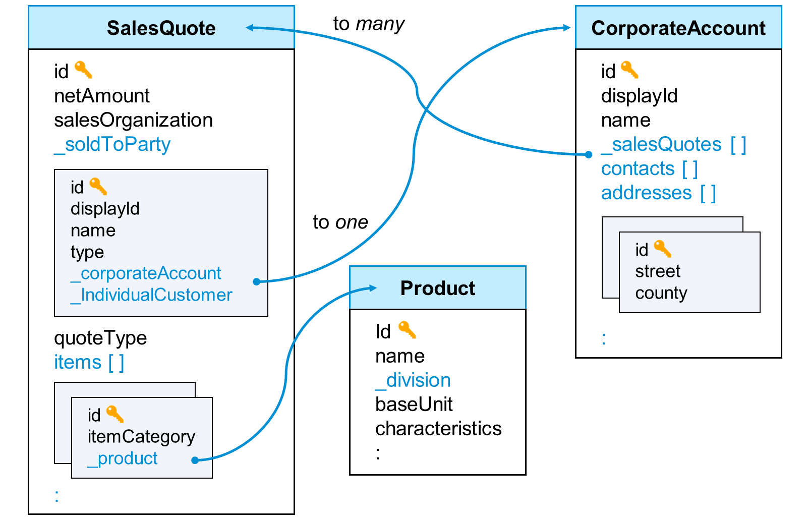

# ♠ 6 [USING COMMON APIS](https://learning.sap.com/learning-journeys/developing-with-sap-integration-suite/introducing-rest_fb9a2610-c990-4e0c-9140-0802b642019e)

> :exclamation: Objectifs
>
> - [ ] Be able to use API used in SAP

## :closed_book: INTRODUCING TO REST

### WHAT IS REST?

> #### :bookmark: [REST](../☼%20UNIT%200%20-%20Lexicon/♠%20API.md)
>
> Généralement, REST décrit une interface machine à machine. Dans le développement Web, REST permet au contenu d'être restitué lorsqu'il est demandé, souvent appelé contenu dynamique. RESTful Dynamic Content utilise le rendu côté serveur pour générer un site Web et envoyer le contenu au navigateur Web demandeur, qui interprète le code du serveur et affiche la page dans le navigateur Web de l'utilisateur.

### ARCHITECTURAL PROPERTIES

Les contraintes du style architectural REST affectent les propriétés architecturales suivantes :

- Performances dans les interactions des composants, qui peuvent être le facteur dominant dans les performances perçues par l'utilisateur et dans l'efficacité du réseau.

- Évolutivité permettant la prise en charge d’un grand nombre de composants et d’interactions entre composants.

- Simplicité d'une interface uniforme.

- Modifiabilité des composants pour répondre aux besoins changeants (même lorsque l'application est en cours d'exécution).

- Visibilité de la communication entre les composants par les agents de service.

- Portabilité des composants en déplaçant le code du programme avec les données.

- Fiabilité dans la résistance aux pannes au niveau du système en présence de pannes au sein des composants, des connecteurs ou des données.

### ARCHITECTURAL CONSTRAINTS

Le style architectural REST définit les six contraintes directrices suivantes :

- Architecture client-serveur

- Apatride

- Capacité de cache

- Système en couches

- Code sur demande (facultatif)

- Interface uniforme

### REALIZATION AS A WEB API

Les API Web service qui adhèrent aux contraintes et propriétés architecturales REST sont appelées API RESTful. Les API RESTful basées sur HTTP sont définies avec les aspects suivants :

- Une URL de base, telle que http://api.example.com/.

- Méthodes HTTP standard (par exemple : GET, POST, PUT et DELETE).

- Un type de média qui définit les éléments de données de transition d'état (par exemple, Atom, microformats, application/vnd.collection+json). La représentation actuelle indique au client comment composer des demandes de transitions vers tous les prochains états d'application disponibles.

### SOURCES

De nombreuses informations peuvent être trouvées sur Internet sous forme de textes, vidéos, podcasts, etc. sur REST. Il existe également divers livres sur ce sujet sous différents angles :

- [Transfert d'état représentatif](https://en.wikipedia.org/wiki/Representational_state_transfer)

- [Services REST dans ABAP](https://developers4sap.blog/rest-services-in-abap/)

### SUMMARY

Une API Web RESTful est créée avec le style d'architecture logicielle REST. L'interface doit correspondre à la fois aux propriétés architecturales et aux contraintes. Il en résulte une implémentation qui, en plus d'un URI de base, utilise des méthodes HTTP standard et prend en charge de nombreux types de médias. Cela place les API Web RESTful au cœur d’une approche (architecture) API First.

## :closed_book: INTRODUCING TO ODATA

### WHAT IS ODATA?

En informatique, Open Data Protocol (OData) est un protocole ouvert qui permet la création et la consommation d'API RESTful interrogeables et interopérables de manière simple et standard. OData s'appuie sur HTTP, AtomPub et JSON en utilisant des URI pour adresser et accéder aux ressources de flux de données. Il permet d'accéder aux informations à partir de diverses sources, y compris (mais sans s'y limiter) des bases de données relationnelles et des systèmes de fichiers.

### ARCHITECTURAL CONSTRAINTS

Les contraintes suivantes doivent être remplies :

- Identification des ressources

- Documents fixes

- Le document de service

- Le document de métadonnées

- Ressources dynamiques

- Opération de ressources

- Interrogation

- Représentation des ressources

### EXPLENATIONS ABOUT THE CONSTRAINTS

#### :small_red_triangle_down: Identification des ressources

OData utilise des URL pour identifier les ressources. Nous utilisons l'URL de base suivante avec :

https://sapes5.sapdevcenter.com/sap/opu/odata/iwbep/GWSAMPLE_BASIC/

#### :small_red_triangle_down: Fixed documents

- Les ressources fixes suivantes peuvent être trouvées :

  - Le document de service

    Le document de service répertorie les ensembles d'entités (collections), les fonctions et les singletons qui peuvent être récupérés. Les clients peuvent utiliser le document de service pour naviguer dans le modèle de manière hypermédia. Le document de service est accessible directement avec l'URL de base : https://sapes5.sapdevcenter.com/sap/opu/odata/iwbep/GWSAMPLE_BASIC/. Vous trouverez ci-dessous un exemple tiré d’un exercice ultérieur.

    

  - Document Metadata

    Le document de métadonnées décrit les types, ensembles, fonctions et actions compris par le service OData. Les clients peuvent utiliser le document de métadonnées pour comprendre comment interroger et interagir avec les entités du service.

    Le document de métadonnées est disponible à l'adresse : https://sapes5.sapdevcenter.com/sap/opu/odata/iwbep/GWSAMPLE_BASIC/$metadata.

    

#### :small_red_triangle_down: Ressources dynamiques

Les URL des ressources dynamiques peuvent être calculées à partir des informations hypermédia contenues dans les documents de service et de métadonnées. Le flux de données de la collection ProductSet contient également des liens vers d'autres entités. L'URL est la suivante : https://sapes5.sapdevcenter.com/sap/opu/odata/iwbep/GWSAMPLE_BASIC/ProductSet

#### :small_red_triangle_down: Resource operation

OData utilise les verbes HTTP pour indiquer les opérations sur les ressources. Il s’agit d’un aspect REST, comme nous l’avons déjà vu.

#### :small_red_triangle_down: Querying (Interrogation)

Les URL demandées à partir d'un point de terminaison OData peuvent inclure des options de requête. Le protocole OData spécifie diverses options de requête système que les points de terminaison peuvent accepter. Elles peuvent être utilisées pour filtrer, trier, mapper ou paginer des données. Dans ce qui suit, seul le produit portant le numéro de produit HT-1000 est récupéré. L'URL est : https://sapes5.sapdevcenter.com/sap/opu/odata/iwbep/GWSAMPLE_BASIC/ProductSet('HT-1000')

#### :small_red_triangle_down: Resource representation

OData utilise différents formats pour représenter les données et le modèle de données. Dans la version 4.0 du protocole OData, le format JSON est la norme pour représenter les données, le format Atom étant encore au stade de spécification du comité. Pour représenter le modèle de données, le Common Schema Definition Language (CSDL) est utilisé, qui définit une représentation XML du modèle de données d'entité exposé par les services OData.

- En JSON

  L'URL est : https://sapes5.sapdevcenter.com/sap/opu/odata/iwbep/GWSAMPLE_BASIC/ProductSet('HT-1000')?$format=json

  

- En XML

  L'URL est : https://sapes5.sapdevcenter.com/sap/opu/odata/iwbep/GWSAMPLE_BASIC/ProductSet('HT-1000')?$format=xml

  

### TUTORIAL: LEARN ABOUT ODATA FUNDAMENTALS

Il existe un didacticiel fantastique pour découvrir les [principes fondamentaux d'OData](https://developers.sap.com/tutorials/odata-01-intro-origins.html) avec les sujets suivants :

- D’où vient OData et pourquoi il a été conçu ainsi.

- Quelles sont les opérations OData standard et comment elles sont liées à HTTP.

- Ce que le service public Northwind OData a à offrir.

- Ce que décrivent les documents du service OData et les documents de métadonnées.

- Les bases des types, ensembles et relations d’entités OData.

Il est recommandé de suivre ce didacticiel pour vous familiariser pleinement avec OData chez SAP.

### SUMMARY

Le protocole OData décrit une API Web RESTful. Outre les principes REST, il offre également d’autres avantages bénéfiques dans le milieu professionnel. L'interface elle-même fournit deux métadocuments, un service et un métadocument. Ceci décrit de manière exhaustive l’interface. La fonction la plus efficace est la possibilité de filtrer, rechercher et exécuter des fonctions telles que $count via des paramètres de requête sur l'interface. La représentation s'effectue soit en XML, soit en JSON.

## :closed_book: EXPLORE THE APIS FROM THE SAP GATEWAY DEMO SYSTEM

- [Exercices](https://learning.sap.com/learning-journeys/developing-with-sap-integration-suite/introducing-rest_fb9a2610-c990-4e0c-9140-0802b642019e?userlogin=true)

## :closed_book: SAP GRAPH

### WHAT IS SAP GRAPH?

SAP Graph est une API unifiée pour SAP, utilisant des normes ouvertes modernes comme OData v4. SAP Graph est une connexion à vos données d'entreprise. SAP Graph introduit une nouvelle API unifiée pour accéder à toutes les données d'entreprise sous la forme d'un Business Data Graph unique et sémantiquement connecté.

En résumé :

- SAP Graph est basé sur _OData v4_.

- N'importe quel backend SAP peut être utilisé comme fournisseur de données.

- Il existe déjà des API entièrement implémentées sur : https://api.sap.com/graph.

- Vous pouvez créer vos propres API avec différentes procédures.

### SAP GRAPH IS A DATA GRAPH

Data Graphs supporte les Queries qui explore les données et les relations.

Un graphe de données représente des entités (objets de données) en tant que nœuds d'un graphe :

- Les entités sont regroupées dans des espaces de noms.

- Les champs d'une entité sont appelés attributs.

Les arêtes représentent des relations sémantiques :

- Entre un nœud racine et ses sous-nœuds : une composition.

- Entre nœuds indépendants : une association.

Une API SAP Graph avec le nom product, utilisant l'espace de noms sap.graph est liée aux entités de produit de SAP S/4HANA\* (n° 2) et de SAP Sales Cloud (n° 3). La nouvelle API offre ainsi une vue étendue des données produits stockées dans différents systèmes SAP.

### DEVELOPPING SAP GRAPH APIS

Il existe deux options pour créer une API SAP Graph. Vous pouvez créer des API directement via une implémentation avec le module SAP Graph dans Node.js. Sous Source, vous trouverez 26 didacticiels vidéo qui montrent en détail toutes les étapes de développement. Une deuxième approche issue du domaine du low code est proposée via SAP API Management.

### RESOURCES

- Blogs: [SAP Graph Multi-Part Tutorial: Information Map](https://blogs.sap.com/2021/06/08/sap-graph-multi-part-tutorial-information-map/)

- SAP Graph Community: [Graph](https://community.sap.com/topics/graph)

### SUMMARY

SAP Graph est une API basée sur OData v4 qui connecte des entités de différentes sources dans une seule API. Par exemple, les données produit de divers systèmes SAP, tels que SAP S/4HANA, Sales Cloud et autres, sont proposées dans une seule API. Il existe déjà des API SAP Graph standard pour diverses entités. Les API SAP Graph peuvent être programmées avec Node.js ainsi que créées via SAP API Management en mode low code.
