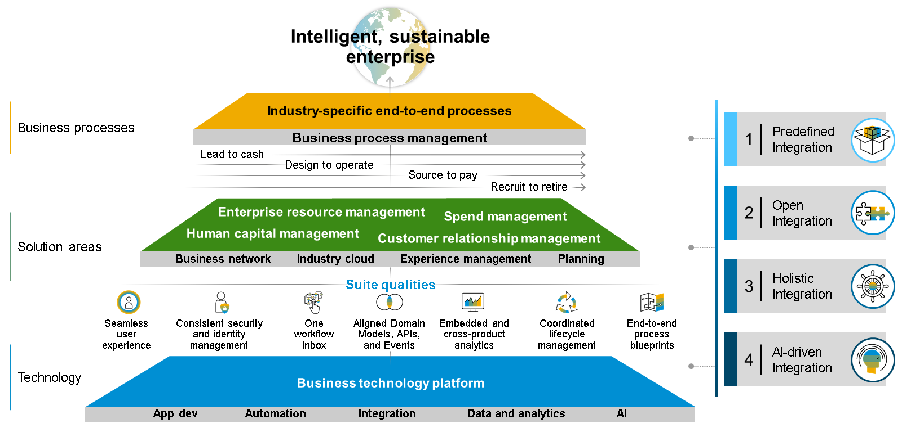

# `♠ 1 - DESCRIBING THE INTEGRATION STRATEGY OF SAP`

> Objectifs
>
> - Explain the significance of integration within the realm of SAP BTP

## THE INTEGRATION STRATEGY OF SAP

### SAP'S INTEGRATION STRATEGY FOR INTELLIGENT ENTERPRISES

La stratégie d’intégration repose sur quatre principes :

- N°1 : Intégration prédéfinie

  SAP a exposé sa stratégie et sa feuille de route pour l'intégration des processus de bout en bout de sa suite intelligente (de logiciel SAP à logiciel SAP) sur la base de qualités de suite bien définies. À titre d'exemple, l'alignement des modèles de domaine permet de garantir que les données de base peuvent être échangées de manière efficace et pratique entre les applications SAP, y compris les intégrations prédéfinies dans SAP Business Accelerator Hub.

- N°2 : Intégration ouverte

  Outre les intégrations de logiciels SAP aux logiciels SAP et de logiciels SAP aux logiciels partenaires, SAP est ouvert à toute intégration tierce ainsi qu'aux extensions personnalisées qui exploitent les API publiques. Grâce à la fonctionnalité Open Connectors de SAP Integration Suite, SAP fournit des connecteurs prédéfinis riches en fonctionnalités pour plus de 170 applications tierces.

- N°3 : Intégration holistique

  SAP propose un portefeuille technologique d'intégration holistique qui couvre la plupart des types d'intégration requis dans les paysages cloud et hybrides. Basé sur SAP Integration Suite, SAP prend en charge divers cas d'utilisation d'intégration, allant des processus, données, utilisateurs et « objets » à l'intégration centrée sur l'analyse.

- N°4 : Intégration basée sur l'IA

  En plus d'apporter de l'intelligence aux processus métier fondamentaux, SAP utilise des techniques d'IA pour simplifier le développement de scénarios d'intégration. Un exemple est la capacité de conseiller en intégration de SAP Integration Suite.

### HOW DOES IT FULFILL THESE PROMIESES?

Si l'on regarde le positionnement de SAP BTP, nous pouvons voir que l'un des pilliers les plus important est l'intégration.

Intégrez des applications sur site, dans le cloud ou dans un modèle hybride, tout en connectant en toute sécurité les applications, les processus et les personnes.

- Intégration de SAP et au-delà pour inclure des tiers, y compris la gestion des API, le support B2B/B2G, l'intégration de données, le support IoT basé sur les événements et l'intégration des processus.
- Contenu prêt à l'emploi comprenant des packs d'intégration, des API, des événements commerciaux et des connecteurs.
- Accès continu aux meilleures pratiques grâce au contenu métier SAP pré-packagé.
- Conseiller de contenu basé sur l'IA pour accélérer le développement de l'intégration et réduire les coûts de support continus.

### SUMMARY

SAP souhaite offrir à ses clients une solution d'intégration complète, sécurisée et complète. Ceci repose sur quatre principes. Ces principes sont les suivants :

- Intégration prédéfinie
- Intégration ouverte
- Intégration holistique
- Intégration basée sur l'IA

Cette réclamation est satisfaite par les services sur SAP BTP.
