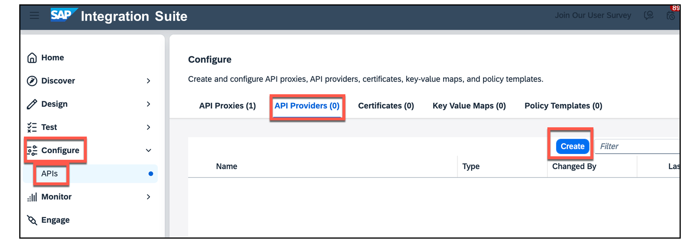
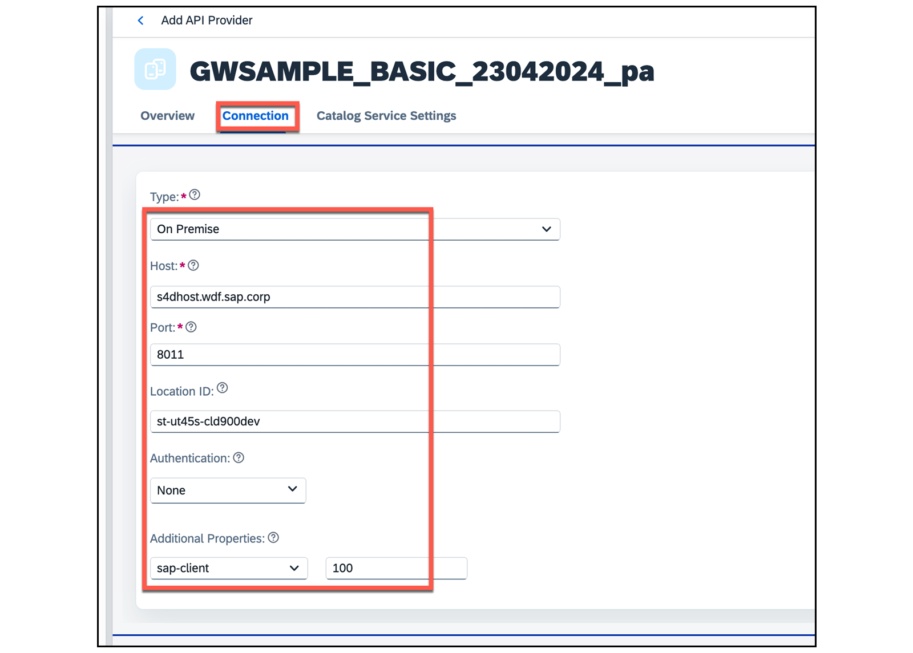
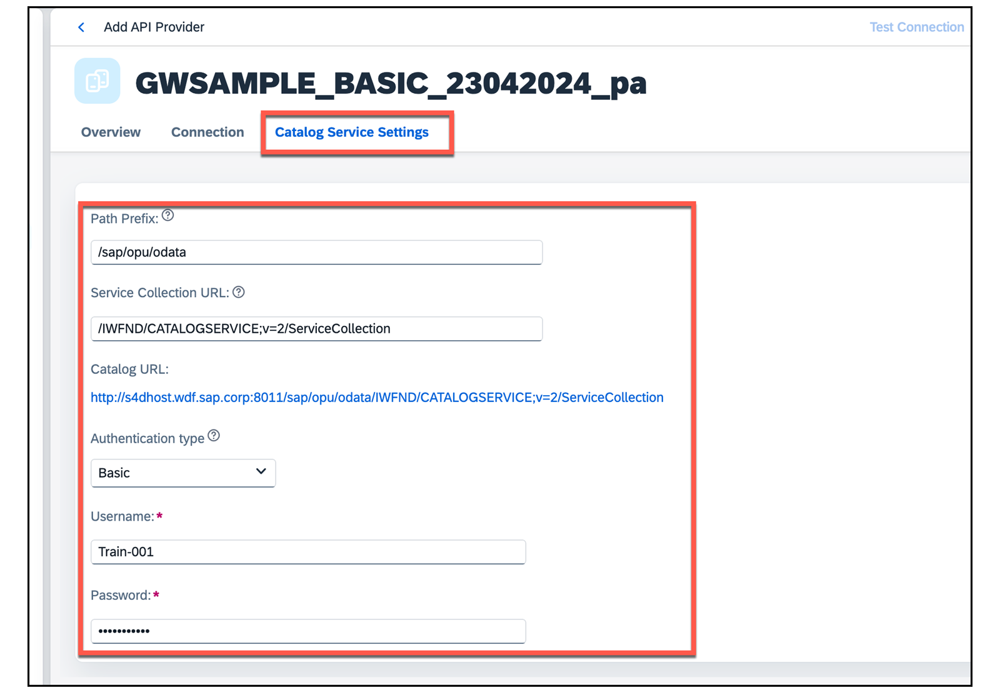
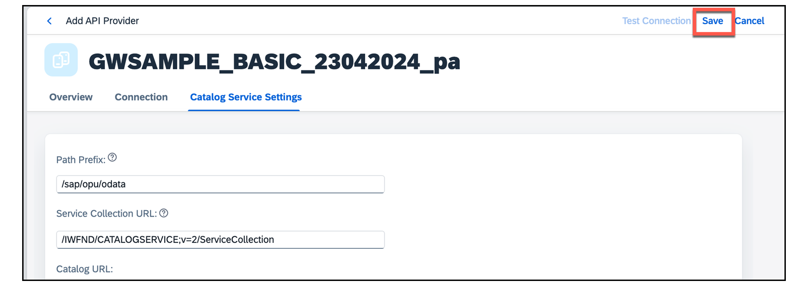
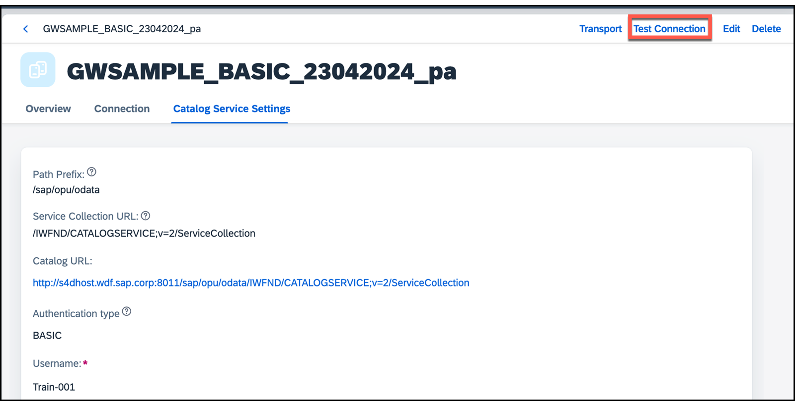
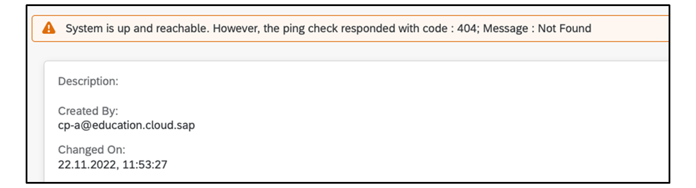

# ♠ 3 - [CREATING AN API PROVIDER](https://learning.sap.com/learning-journeys/developing-with-sap-integration-suite/creating-an-api-provider_b95113e7-369f-4dd3-9773-ec4e0fde2e00)

> Objectifs
>
> - Create an API provider using the SAP Integration Suite

## API PROVIDER CREATION

### THE ROLE OF AN API PROVIDER

Un fournisseur d'API définit les détails de connexion pour les services exécutés sur des hôtes spécifiques dont vous souhaitez accéder aux détails. Utilisez un fournisseur d'API pour définir les éléments suivants :

Détails de l’hôte auquel vous souhaitez qu’une application atteigne.
Définissez tous les détails supplémentaires nécessaires pour établir la connexion, par exemple les paramètres de proxy.

Un fournisseur d'API peut se connecter aux sources suivantes :

- N°1 : Connecteurs ouverts
- N°2 : via Cloud Connector vers tous les backends SAP On-Prem (ECC, SAP S/4HANA On-Prem, PI, PO, etc.)
- N°3 : Intégration Cloud qui fournit une API OData ou SOAP
- N°4 : Les API issues d'Internet
- N°5 : Depuis le SAP Business Accelerator Hub pour le prototypage

### PROCEDURE FOR CREATING AN API PROVIDER

Les étapes suivantes doivent être effectuées dans l'ordre :

1.  Démarrez l'assistant en choisissant le bouton Créer :

    

2.  Entrer un nom et une description dans l'onglet Overview.

    

3.  Entrer les données de connection dans l'onglet Connection.

    

           Note: Utiliser votre propres détails Host pour vous connecter au Backend System

    L'affectation suivante s'applique :

    - Internet : n°4
    - On-premise : n° 2
    - Connecteurs ouverts : n° 1
    - Intégration cloud : n° 3

      Chaque type utilise des données de configuration différentes. Une liste détaillée des paramètres qui doivent être définis est disponible sur : [Créer un fournisseur d'API](https://help.sap.com/docs/SAP_CLOUD_PLATFORM_API_MANAGEMENT/66d066d903c2473f81ec33acfe2ccdb4/6b263e2c1b2d4d9ba20bcd7872eedd9e.html?locale=en-US)

4.  Saisissez les données Paramètres du service de catalogue dans l'onglet Paramètres du service de catalogue.

    

    Les informations de chemin (n°1) sont standardisées dans SAP S/4HANA. Le service de catalogue et le chemin d'accès se trouvent dans la transaction /n/IWFND/MAINT_SERVICE sur le système backend SAP. Une autorisation de base est requise pour accéder au serveur de catalogue.

5.  Testez votre fournisseur d'API. Lorsque vous enregistrez les entrées, le fournisseur d'API créé peut être testé. Pour ce faire, utilisez d'abord le bouton Enregistrer.

    

    

    En fonction du type, un test réussi aura l'un des résultats suivants :

    - Type Internet and On-Prem

      Le code d'état HTTP 200 signifie que la connexion au système backend est correctement configurée :

      

    - Type Open Connectors and Cloud integration

      Le statut code http n'est pas 200 mais reste correct car c'est un ping :

      

### SOURCES

Les sources sont disponible sur le SAP Help Portal : [API Providers](https://help.sap.com/docs/SAP_CLOUD_PLATFORM_API_MANAGEMENT/66d066d903c2473f81ec33acfe2ccdb4/42e13b2749d5484da2d26931a5fb5d35.html?locale=en-US)

### SUMMARY

Un fournisseur d'API encapsule l'accès aux API provenant de diverses sources. Plus de 260 API REST tierces sont connectées via Open Connector. Les systèmes backend SAP tels que SAP S/4HANA On-Prem ou ECC/PI/PO peuvent être connectés via le Cloud Connector. Les API SOAP peuvent également être mises à disposition via l'intégration cloud. Au final, presque toutes les API peuvent être connectées. La procédure de connexion d'une API étrangère est contrôlée par un assistant.

[Exercices](https://learning.sap.com/learning-journeys/developing-with-sap-integration-suite/creating-an-api-provider_b95113e7-369f-4dd3-9773-ec4e0fde2e00)
