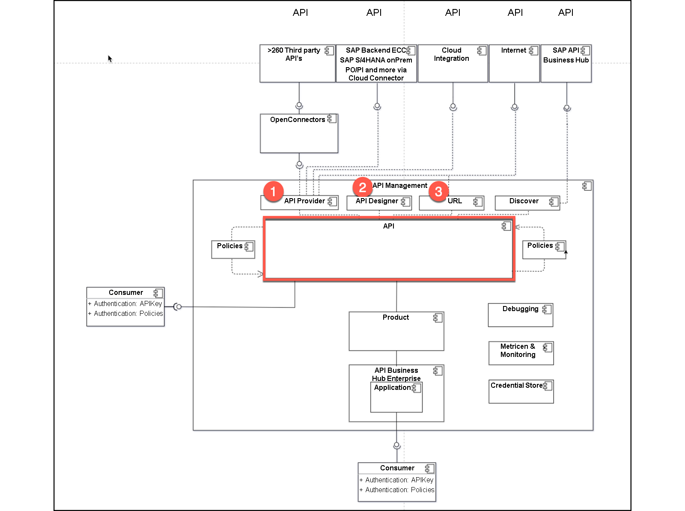
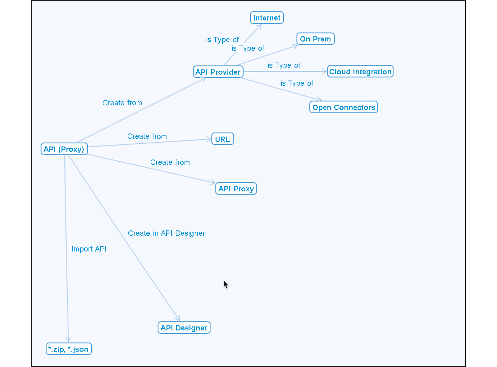
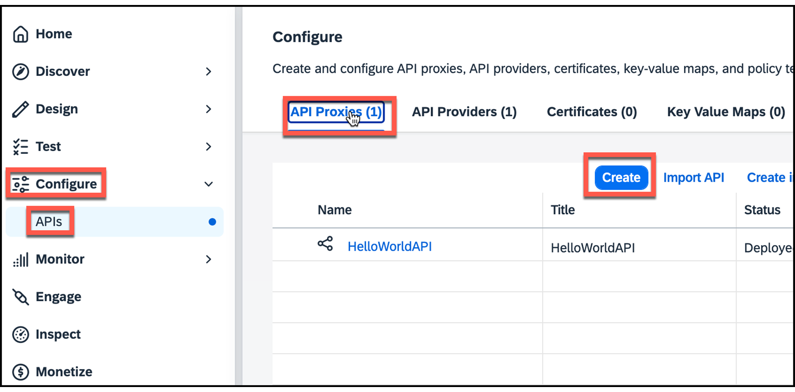
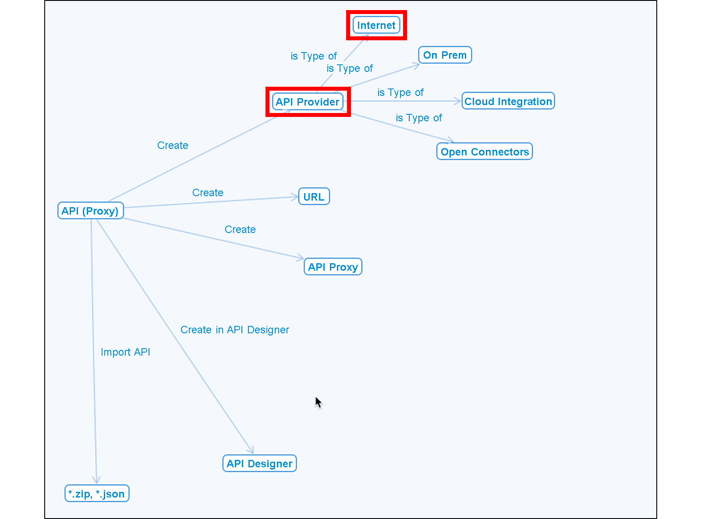
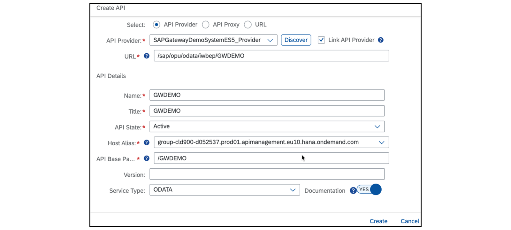
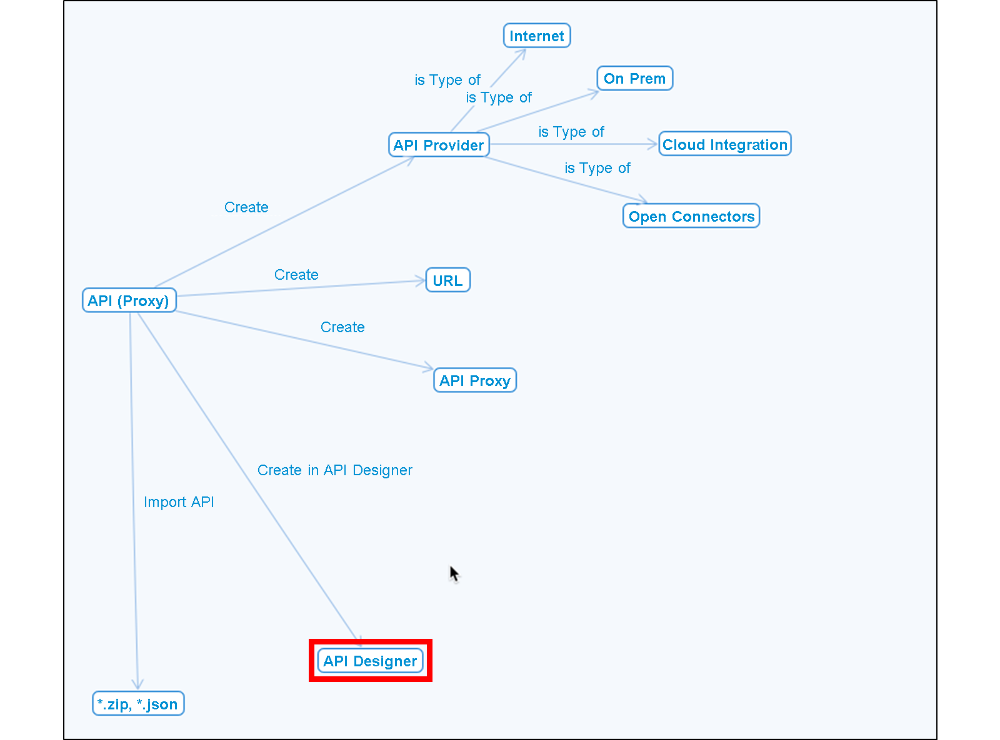
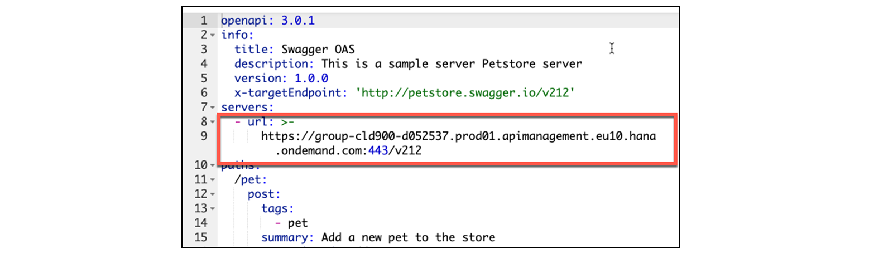
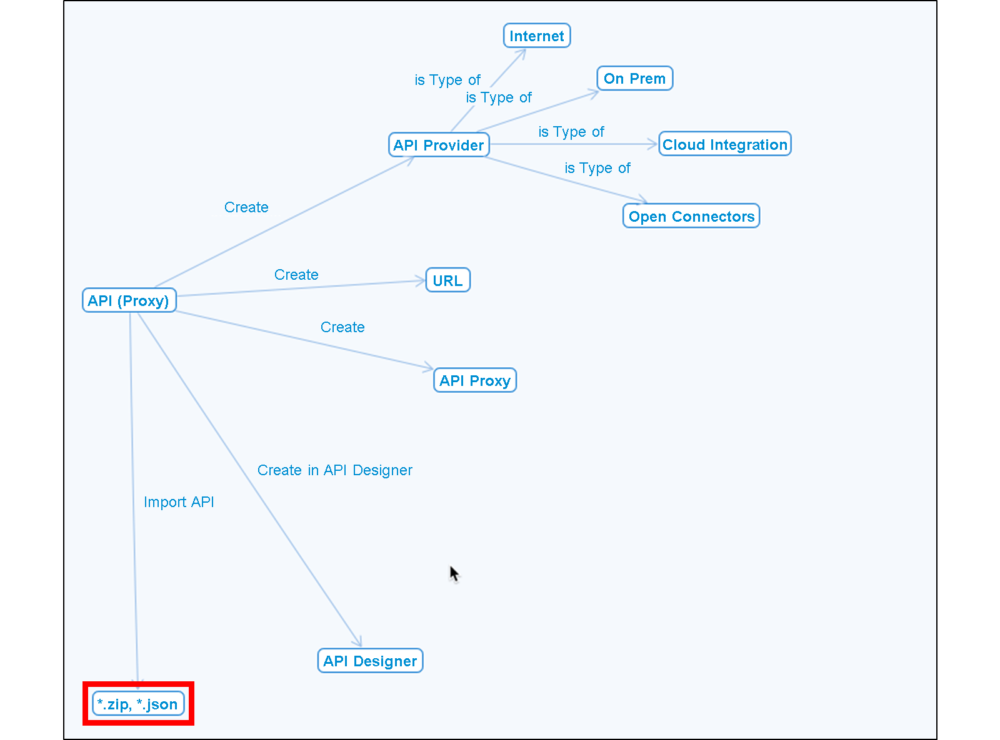

# ♠ 4 - [CREATING AN API PROXY](https://learning.sap.com/learning-journeys/developing-with-sap-integration-suite/creating-an-api_b3973a9a-62ce-4a5e-b59a-c0ddf6924de5)

> Objectifs
>
> - Create an API based on the API provider

## CREATION OF APIS BASED ON THE API PROVIDER

## WHAT ARE THE POSSIBILITIES TO CREATE AN API?

L'API qui sera créée est importante pour les implémentations ultérieures. Il agit comme un proxy de l'API de ressource réelle. Le nom précédent était API Proxy. Ce nom apparaît souvent dans les documents plus anciens.

Les options suivantes sont disponibles :

- Créez une API à l'aide du bouton Créer avec les options suivantes :

  - Fournisseur d'API (n°1 au diagramme conceptuel)
  - URL (n° 2 sur le diagramme conceptuel)
  - Proxy API

- Créez une API à l'aide de liens de menu avec les options suivantes

  - Créer dans API Designer (n° 3 sur le diagramme conceptuel)
  - Importer une API externe

### CREATE AN API USING THE CREATE BUTTON

C'est probablement le cas le plus courant. Avec cette option, vous pouvez créer une API avec un fournisseur d'API, une URL fournie ou une API existante.

### PROCEDURE

- Commencez par Conception → API pour ouvrir l’écran Développer.

- Démarrez l'assistant en choisissant le bouton Créer. Une nouvelle fenêtre s'ouvre.

  

  Utiliser les options de l'API Provider.

  

  Sélectionnez le bouton radio Fournisseur d'API et ouvrez la boîte sélectionnée. Tous les fournisseurs d'API s'affichent. Choisissez-en un, par exemple SAPGatewayDemoSystemES5_Provider.

  

  Lorsque le fournisseur d'API est choisi, une nouvelle zone de liste portant le nom Discover est disponible. Certaines données, comme l'hôte et le type d'API, ont déjà été renseignées.

  Lorsque la zone de liste est sélectionnée, tous les services disponibles répertoriés dans le service de catalogue sont affichés.

  Ce qui est exactement affiché ici dépend du type de fournisseur d'API. Dans le cas d'Open Connectors, par exemple, toutes les instances sont affichées. Pour le type Intégration Cloud, les flux d'intégration disponibles sont affichés.

  La figure suivante montre une liste des services disponibles, utilisables à partir du système backend SAP. Le fournisseur d'API est défini en choisissant un service parmi les services du catalogue fourni.

  

  Vous pouvez choisir exactement l’un des services proposés. Après cela, d'autres données sont ajoutées au masque.

  

  Lorsque vous avez terminé de créer cette API (proxy), elle doit être déployée pour pouvoir être utilisée. Après cela, l'API (proxy) est prête à être testée. Le type de service est automatiquement défini. Dans ce cas, il s'agit d'OData.

### USE THE URL OPTION TO CREATE AN API

Dans le cas où vous n'utilisez pas de fournisseur d'API, vous pouvez directement spécifier l'URL de votre source.

Dans ce cas, vous devez saisir les données manuellement (marquées). Le type de service ne peut être que REST ou SOAP.

Après avoir enregistré et déployé l’API, elle peut également être testée.

### USE THE API PROXY OPTION TO CREATE AN API

Dans ce cas, vous pouvez coper l'API existante.

Dans ce cas, vous devez saisir les données manuellement (marquées). Le type de service ne peut être que REST ou SOAP, même si l'API espionnée est de type OData.

### CREATE AN API USING MENU LINKS

### USE THE CREATE IN API DESIGNER OPTION

Commencez à créer une API en choisissant le lien de menu Créer dans API Designer.

Passez à l'éditeur openAPI. Vous pouvez y créer manuellement votre API via le langage openAPI en YAML. Dans ce cas, toutes les entrées doivent être créées manuellement. L'URL du serveur est automatiquement ajustée après l'enregistrement. Le type de service ne peut être que REST.

### BEFORE SAVING

### AFTER SAVING

     Note: Be aware that the shown URL is a sample and will not work !

### IMPORT AN EXTERNAL API

Démarrez la création d’une API en choisissant le lien de menu Importer l’API.

Le Type de service correspond à l'API importée.

### RESOURCE

Portail d'aide : [Créer un proxy API](./RESSOURCES/https://help.sap.com/docs/SAP_INTEGRATION_SUITE/51ab953548be4459bfe8539ecaeee98d/4ac0431ddc80469ca31dcd938edc9076.html)

### SUMMARY

Il existe plusieurs façons de créer une API. Des API peuvent être créées :

- En utilisant le bouton Créer.
- Basé sur un fournisseur d'API existant.
- Directement via une URL fournie.

Enfin, vous pouvez également le définir avec une spécification openAPI via le bouton Créer dans API Designer.

## CREATE AN API BASED ON A PREDEFINED API PROVIDER

[Exercices](https://learning.sap.com/learning-journeys/developing-with-sap-integration-suite/creating-an-api_b3973a9a-62ce-4a5e-b59a-c0ddf6924de5)
