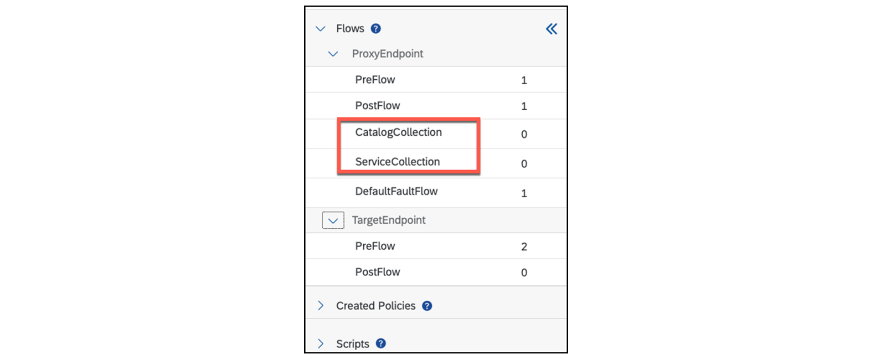
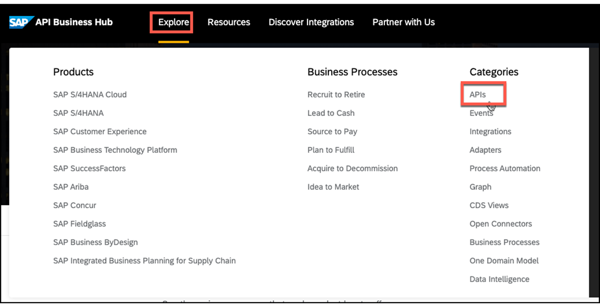
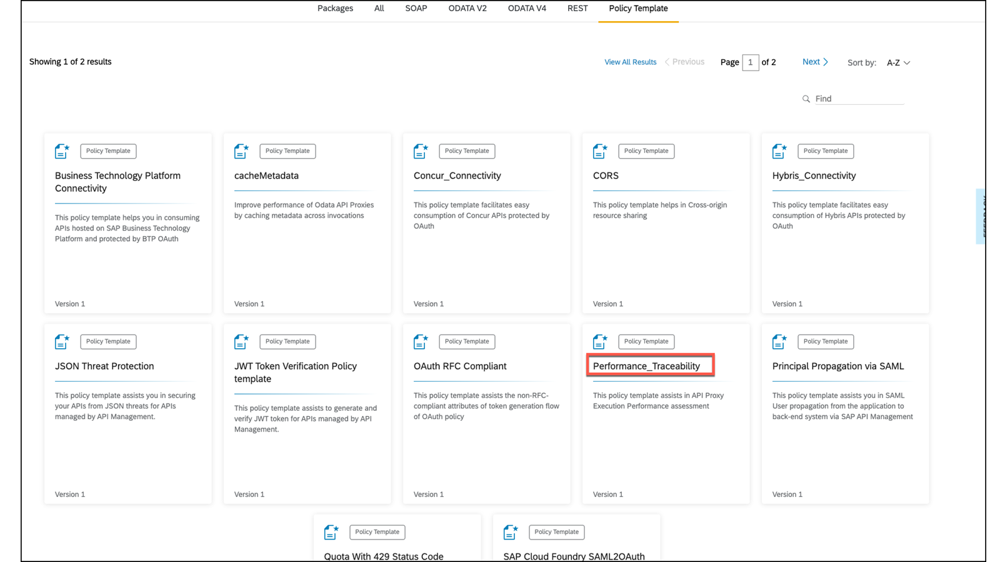
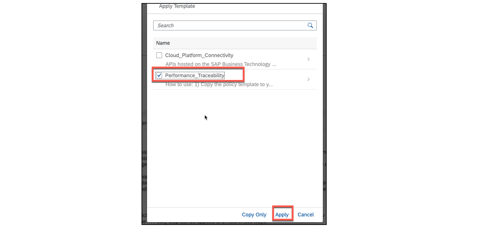
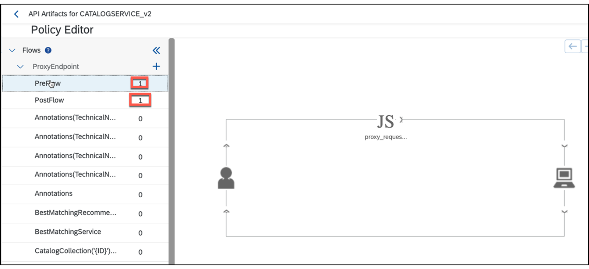

# ♠ 5 - [USING POLICIES](https://learning.sap.com/learning-journeys/developing-with-sap-integration-suite/using-policies_cd5fde51-b3d2-40d3-bd71-3f2870c2b51b)

> Objectifs
>
> - Use policies

## USAGE OF POLICIES

## WHAT ARE POLICICES?

SAP API Management offre des fonctionnalités permettant de définir le comportement d'une API à l'aide de stratégies. Une stratégie est un programme qui exécute une fonction spécifique au moment de l'exécution. Ils offrent la flexibilité d'ajouter des fonctionnalités communes sur une API sans avoir à les coder individuellement à chaque fois.

Les stratégies fournissent des fonctionnalités pour sécuriser les API, contrôler le trafic des API et transformer les formats de message. Vous pouvez également personnaliser le comportement d'une API en ajoutant des scripts et en les attachant aux stratégies.

Vous pouvez appliquer une stratégie sur le flux de demande ou de réponse. Vous pouvez également spécifier si cela est applicable sur le point de terminaison (endpoint) proxy ou sur le point de terminaison (endpoint) cible. Pour plus d’informations sur les types de stratégies prises en charge par API Management, consultez Types de stratégies.

### YOU CAN USE THE FOLLOWING TYPES OF POLICIES:

- Modèles de stratégie prédéfinis sur SAP Business Accelerator Hub.
- Politiques prédéfinies dans l'éditeur de politiques.

### POLICY TYPES

Voici la liste des stratégies prédéfinies prises en charge par API Management :

- Contrôle d'accès
- Entité d'accès
- Attribuer un message
- Authentification de base
- Extraire les variables
- Invalider le cache
- Javascript
- JSON vers XML
- Opérations de carte de valeur clé
- Cache de recherche
- Politique de journalisation des messages
- OAuth v2.0
- OAuth v2.0 OBTENIR
- OAuth v2.0 ENSEMBLE
- Remplir le cache
- Script Python
- Quota
- Augmenter le défaut
- Réinitialiser le quota
- Appel de service
- Arrestation de pointes
- Politique d'assertion SAML
- Politique de validation des messages SOAP
- Vérifier la clé API
- XML vers JSON
- Transformation XSL
- Protection contre les menaces XML
- Protection des expressions régulières
- Protection contre les menaces JSON
- Cache de réponses
- Politique du collecteur de statistiques

En savoir plus ici : T[ypes de politiques](https://help.sap.com/docs/SAP_CLOUD_PLATFORM_API_MANAGEMENT/66d066d903c2473f81ec33acfe2ccdb4/c918e2803dfd4fc487e86d0875e8462c.html?locale=en-US)

### APPLY PRE-BUILT POLICIES USING THE POLICY DESIGNER

Pour utiliser l’une des politiques disponibles, il faut d’abord déterminer où la politique fonctionnera. L'éditeur de stratégie propose les options suivantes dans la demande et la réponse :

Les politiques peuvent également être utilisées pour tous les appels (PostClientFlows, ressources), vous ne sélectionnez alors pas de PostClientFlow. Dans l'exemple suivant, il existe deux PostClientFlows CatalogCollection et ServiceCollection. Les politiques sont utilisées pour tous les PostClientFlows car aucune n'a été spécialement sélectionnée.

### SECURITY - POLICIES

SAP BTP, API Management propose de nombreuses politiques de sécurité API prêtes à l'emploi basées sur l'Open Web Application Security Project (OWASP). Les meilleures pratiques de sécurité des API peuvent être personnalisées en fonction des besoins de votre entreprise.

Il existe une série de blogs qui présente les politiques de sécurité de SAP BTP, API Management pour sécuriser et protéger les API d'entreprise, comme le montre la figure suivante, SAP Cloud Platform API Management.

Vous trouverez la série de blogs ici : SAP Cloud Platform API Management – [​​Série de blogs sur les meilleures pratiques de sécurité des API](https://blogs.sap.com/2017/08/22/sap-cloud-platform-api-management-api-security-best-practices/)

### LOGGING AND MONITORING POLICIES

La stratégie Message Logging vous permet d'envoyer des messages Syslog à des services de gestion de journaux tiers (third-party log management services), tels que Splunk, SumoLogic, Loggly ou des services de gestion de journaux similaires.

Un blog présentant la politique de journalisation des messages et Splunk peut être trouvé ici :
[Splunk – Partie 1 : Journalisation et surveillance SAP APIM | Blogues SAP](https://blogs.sap.com/2020/05/12/splunk-part-1-sap-apim-logging-monitoring/)

Un blog avec la politique de journalisation des messages et Loggly peut être trouvé ici :
[Partie 7 – Meilleures pratiques de sécurité des API – Consigner toutes les interactions API | Blogues SAP](https://blogs.sap.com/2017/08/21/sap-cloud-platform-api-management-log-all-api-interactions/)

### USE PREDEFINED POLICIES

Il existe des ensembles prédéfinis de politiques pour des applications spécifiques. Ils peuvent être trouvés dans le SAP Business Accelerator Hub.

Accédez à https://api.sap.com/ pour explorer → API.

Sous l'onglet Modèle de politique SAP Business Accelerator Hub, vous trouverez 20 modèles de politique pour une utilisation immédiate.

### IMPORT A POLICY TEMPLATE FRON SAP BUSINESS ACCELERATOR HUB

Recherchez et trouvez le modèle de stratégie Performance_Traceability sur [SAP Business Accelerator Hub](https://api.sap.com/content-type/API/apis/policytemplate). Choisissez la vignette Performance_Traceability. Vous trouverez le contenu dans le type de flux.

### THE FOLLOWING IS AN EXAMPLE WITH THESE TWO ITEMS:

- Type de flux : ProxyEndPoint PreFlow
- Contenu : fichier JavaScript

Pour télécharger les politiques complètes, choisissez le bouton Télécharger dans le coin supérieur droit et enregistrez le fichier \*.zip localement sur votre ordinateur.

Basculez vers la vue Développement et choisissez l’onglet Modèles de stratégie.

Ensuite, importez le modèle de stratégie précédent stocké localement via le bouton Importer.

À la fin, le modèle Performance_Traceability est désormais importé dans SAP Business Accelerator Hub.

Pour placer le modèle de stratégie, accédez à l'API dans laquelle vous souhaitez utiliser la stratégie, puis accédez à l'éditeur de stratégie. Choisissez Modifier pour que le bouton Modèle de stratégie devienne actif.

Maintenant, choisissez le bouton Appliquer pour importer le modèle de stratégie. Sélectionnez ensuite le modèle de stratégie précédemment importé et choisissez Appliquer.

Le modèle de politique a été importé et inséré dans le flux correspondant.

Après la mise à jour, l'enregistrement et le redéploiement, le modèle de stratégie est actif.

### SUMMARY

SAP API Management offre des fonctionnalités permettant de définir le comportement d'une API à l'aide de stratégies. Ces capacités peuvent être utilisées à la fois dans la demande et dans la réponse. Il existe des politiques pour la transformation de la charge utile et des appels externes, par exemple pour se connecter à l'aide d'OAuth 2.0 et bien plus encore. En particulier, les politiques de sécurité sont utiles. SAP propose des politiques fédérales et des modèles de politiques pour certains cas d'utilisation. Ils peuvent être facilement importés.

## ADD POLICITES FOR BASIC AUTHENTICATION AGAINST THE ES5 DEMO SYSTEM

[Exercices](https://learning.sap.com/learning-journeys/developing-with-sap-integration-suite/using-policies_cd5fde51-b3d2-40d3-bd71-3f2870c2b51b)
