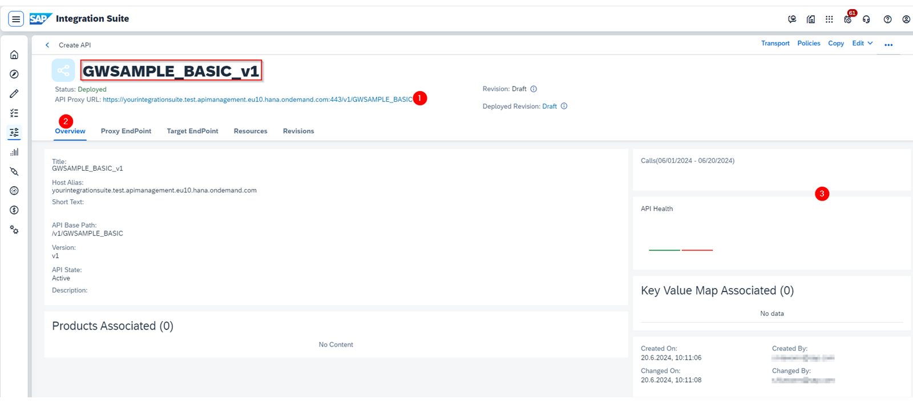
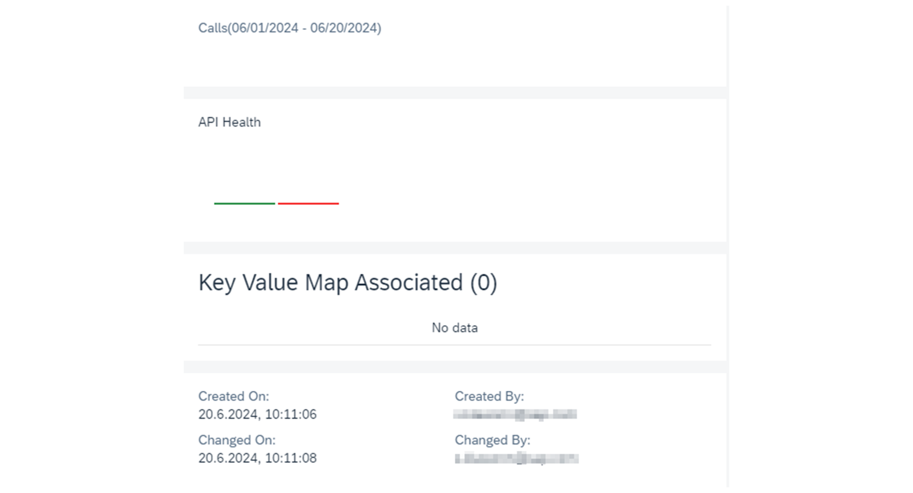
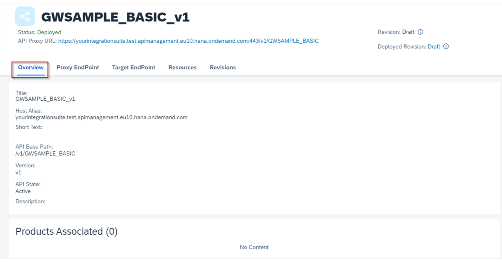

# ♠ 6 - [EDITING APIS](https://learning.sap.com/learning-journeys/developing-with-sap-integration-suite/editing-apis_c1f6b231-83bf-47aa-bf2d-06b633ba1e4b)

> Objectifs
>
> - Edit APIs

## EDIT AN API

### EXPLORE THE API VIEW

Lorsque vous créez et déployez une API, elle s'affiche dans la vue API. Voici l'exemple de l'API GWSAMPLE_BASIC.

Les domaines suivants sont marqués pour être examinés plus en détail dans la liste suivante :

N°1 : URL API – URL proxy.
N°2 : Onglets de navigation
N°3 : Zone de notification.

### EXPLORE THE NOTIFICATION AREA (N°3)

Sur le panneau de droite, vous trouvez l'état de santé de l'API, les appels actifs effectués et les informations d'utilisation associées à l'API.

Comme nous n’avons pas encore utilisé cette API, aucune information d’utilisation n’est disponible.

### API URL - PROXY URL (N°1)

Au n°1, vous pouvez voir la nouvelle URL (URL proxy) avec laquelle vous pouvez désormais appeler l'API source d'origine. L'URL est composée des éléments suivants :

- URL de l'API : https://group-cld900-d052537.prod01.apimanagement.eu10.hana.ondemand.com:443/GWSAMPLE_BASIC
- Protocole d'application : https
- Hôte virtuel : group-cld900-d052537
- Hôte API : prod01.apimanagement.eu10.hana.ondemand.com
- Port API : 443
- Nom de l'API : GWSAMPLE_BASIC

#### VIRTUAL HOST

L'hôte virtuel a été créé lors du provisionnement de la gestion des API et peut être modifié à tout moment en utilisant Paramètres → API. Vérifiez et voyez votre nom d'alias d'hôte.

#### API HOST

Cela dépend de votre sous-compte. Il peut également s'agir de votre propre nom de domaine personnalisé.

### NAVIGATION TAB (N° 2)

Il existe cinq onglets portant les noms suivants :

- Overview
- Proxy Endpoint
- Target EndPoint
- Resources
- Revisions

#### TAB 1: OVERVIEW

Dans cet onglet Présentation, vous trouverez toutes les informations importantes sur votre API.

Ceux-ci sont les suivants :

- Title
- Host Alias, that is the host from your Proxy URL on top of this page
- API Base Path
- API State (Active, Alpha, Beta, Deprecated, Decommissioned)
- Description

Au bas de l'interface, il y a une zone associée au produit. Plus tard, nous créons un produit basé sur notre API. Chaque entrée peut être modifiée.

#### TAB 2 : PROXY ENDPOINT

Ici, vous pouvez ajouter des propriétés de point de terminaison de proxy et des règles de routage. En savoir plus ici : [Structure du proxy API](https://help.sap.com/docs/SAP_CLOUD_PLATFORM_API_MANAGEMENT/66d066d903c2473f81ec33acfe2ccdb4/4dfd54a7546c42cfb8dd157ab1355011.html?locale=en-US)

#### TAB 3 : TARGET ENDPOINT

Ici, vous trouvez le fournisseur d'API configuré ou l'URL. Dans ce cas, nous voyons le SAPGatewayDemoSystemES5_Provider. Il est également possible d’utiliser le Load Balancing.

#### TAB 4 : RESOURCES

C'est le domaine le plus important d'une API. Il montre avec une interface utilisateur Swagger tous les chemins de ressources possibles et les actions REST (GET, PUT, DELETE..) avec tous les paramètres nécessaires.

La figure suivante nous donne l'exemple d'un chemin de ressource, /ProductSet, et de l'action REST GET avec des paramètres de requête prédéfinis.

### WHERE DO THESE ENTRIES IN THIS TAB COME FROM?

Lors de la création d'API pour SOAP et REST, les ressources API ne sont pas générées automatiquement ; vous devez les ajouter manuellement. Lors de la création de l'API pour ODataAPI, la génération automatique de ressources peut être possible dans certains cas. C'est le cas si vous utilisez un fournisseur d'API de type On-Premise avec backend SAP ou de type Open Connectors. La visualisation des ressources est réalisée par l'implémentation de Swagger UI. Il interprète la spécification openAPI de cette API.

#### TAB 4 : REVISIONS

Avec les révisions d'API, vous pouvez apporter des modifications incrémentielles à un proxy d'API sans perturber l'API déployée. Vous pouvez accéder aux modifications précédentes apportées au proxy de l'API et même restaurer l'API à l'un de ses états antérieurs.

Les révisions consistent généralement en de petites modifications incrémentielles et compatibles, telles que l'ajout d'une propriété, d'une nouvelle ressource ou d'une stratégie à un proxy d'API. Des révisions sont créées lorsque les changements ne perturbent pas les flux de consommation existants. Ils sont indépendants de l’URL réelle utilisée pour consommer l’API. Étant donné que la révision déployée est celle qui est consommée, il n'est pas nécessaire d'y accéder séparément. L'URL du proxy d'API reste cohérente dans les différentes révisions.

Une seule révision d'un proxy d'API existe dans l'environnement d'exécution. Lors de la phase de conception, vous pouvez visualiser et comparer le contenu des différentes révisions.

Pour plus d'informations sur la création de révisions d'API, visitez le site Web help.sap.com : [Création de révisions d'API | Portail d'aide SAP](https://help.sap.com/docs/sap-api-management/sap-api-management-for-neo-environment/creating-api-revisions?version=Cloud&q=Resivions%20APi%20proxy)

### CREATE OR EDIT AN API FROM THE API DESIGNER

Puisqu'il n'est pas toujours possible de générer automatiquement les ressources, SAP API Management vous offre également la possibilité de le faire manuellement. Les ressources visualisent la spécification openAPI créée dans API Designer.

### PROCEDURE FOR CREATING AN API

Dans la Configure view de vos API, choisissez le lien Create in API Designer pour ouvrir API Designer. Vous trouverez un modèle de démarrage simple en YAML.

Vous pouvez maintenant commencer à écrire votre propre spécification openAPI. Pour modifier une spécification openAPI, vous utilisez le même éditeur. Vous pouvez également utiliser d'autres éditeurs, tels que des IDE, Visual Code et autres, et y copier le résultat.

### RESOURCES

Vous trouvez toute la documentation openAPI ici :

- [Spécification OpenAPI](https://github.com/OAI/OpenAPI-Specification/blob/main/versions/2.0.md#schemaObject)
- [Créer une API à partir d'API Designer](https://help.sap.com/docs/SAP_CLOUD_PLATFORM_API_MANAGEMENT/66d066d903c2473f81ec33acfe2ccdb4/26e1bbd2f3864b53a288e25786eb94e0.html?locale=en-US)
- https://swagger.io/docs/spécification/about/
- Portail d'aide : [Modifier un proxy d'API](https://help.sap.com/docs/SAP_CLOUD_PLATFORM_API_MANAGEMENT/66d066d903c2473f81ec33acfe2ccdb4/a64b952578f84161829439c3ee6e967b.html?locale=en-US)

### SUMMARY

L'URL du proxy est la nouvelle URL qui consommera finalement l'API de ressources. Le nom d'hôte virtuel est défini par vous. Il est utilisé comme hôte API (URL proxy API) dans le sous-compte.

L'URL du proxy est la nouvelle URL qui consommera finalement l'API de ressources. Le nom d'hôte virtuel est défini par vous. Il est utilisé comme hôte API (URL proxy API) dans le sous-compte. Il peut également y avoir un domaine personnalisé ici. SAP API Management propose différents onglets avec différentes fonctionnalités dans View API. L'onglet Ressources est le plus important. Les ressources décrivent les fonctionnalités REST (GET, POST, etc.) et les chemins d'accès aux données réelles (/ProductSet, /BusinessPartnerSet...). La description est basée sur la spécification openAPI. La visualisation de la spécification openAPI est réalisée avec l'interface utilisateur Swagger. L'interface utilisateur Swagger est un framework JavaScript open source permettant de rendre les API tangibles.

## EXPLORE THE API DESIGNER

[Exercices](https://learning.sap.com/learning-journeys/developing-with-sap-integration-suite/editing-apis_c1f6b231-83bf-47aa-bf2d-06b633ba1e4b)
