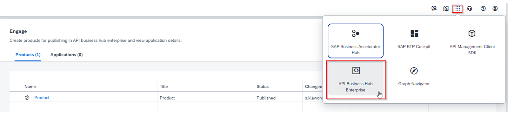
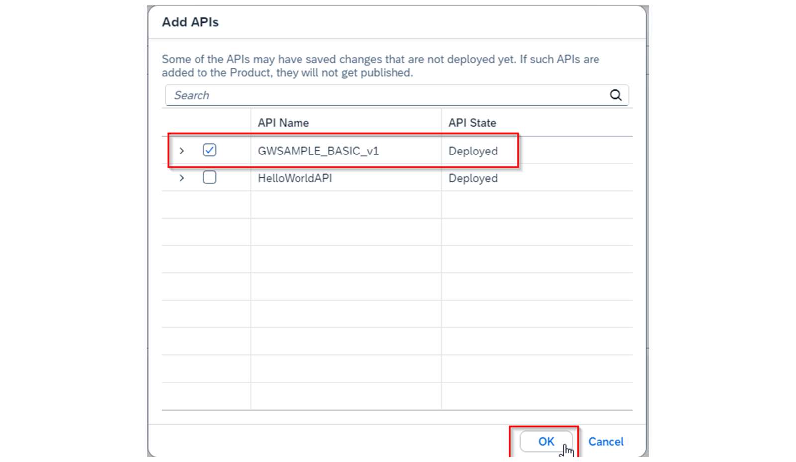

# ♠ 7 - [CREATING A PRODUCT](https://learning.sap.com/learning-journeys/developing-with-sap-integration-suite/creating-a-product_fc942de6-ff7b-4263-bd2b-f33fe481bc3d)

> :exclamation: Objectifs
>
> - [ ] Create a product

## PRODUCT CREATION

### WHAT ARE PRODUCTS IN THE CONTEXT OF SAP API MANAGEMENT?

Les produits sont des artefacts qui apparaissent sur le SAP API Business Hub Enterprise portal. Le SAP API Business Hub Enterprise portal est accessible à l'aide de sa propre URL. Il est accessible dans le SAP Integration Suite cockpit via la navigation dans le coin supérieur droit de l'interface.

Après avoir ouvert le API Business Hub Enterprise portal, les produits sont affichés sous forme de vignettes. L'API utilisée sous un produit correspond à l'URL du proxy API de l'API correspondante.

### NEEDED ROLES (ROLE COLLECTION) TO USE TGE API BUSINESS HUB ENTERPRISE

Pour ouvrir l'API Business Hub Enterprise portal, l'un des groupes de rôles suivants est requis :

- AuthGroup.API.Admin
- AuthGroup.API.ApplicationDeveloper

Nous avons déjà attribué les deux groupes de rôles à l'utilisateur lors du provisionnement des fonctionnalités de SAP Integration Suite.

Si vous venez via learning.sap.com, vous devez alors attribuer votre compte utilisateur aux collections de rôles mentionnées.

### OPEN AN API BUSINESS HUB ENTERPRISE PORTAL WITH PUBLISHED PRODUCTS AS A SAMPLE

Dans cette capture d'écran, vous pouvez voir un `produit` déjà créé nommé Product basé sur l'API GWSAMPLE_BASIC_v1.

Cette page est vide, si vous n'avez pas encore créé de produit.

Les produits peuvent ensuite être recherchés, trouvés et consommés par les développeurs.

### PROCEDURE FOR CREATING A PRODUCT

     Note : You perform in step in the SAP Integration Suite Cockpit

Les étapes suivantes doivent être effectuées dans l'ordre suivant :

- Créez un produit à l'aide du bouton Créer
- Ajoutez les entrées sous l'onglet Présentation
- Ajouter une API sous l'onglet API
- Choisissez le bouton Publier
- Ouvrez le portail API Business Hub Enterprise
- Découvrez votre produit

### CREATE AND PUBLISH A PRODUCT

Une condition préalable à la création d’un produit est une API fonctionnelle. La création est lancée à l'aide d'Engage. Ensuite, accédez à l'onglet Produits.

Choisissez le bouton Créer pour démarrer la procédure.

Au moins les entrées suivantes doivent être effectuées :

#### TAB: OVERVIEW

Le nom et le titre doivent être les mêmes. Le titre est l'en-tête de la vignette. La description est également affichée sur les vignettes et vise à donner à l'utilisateur les informations les plus importantes sur l'API.

Exemple

Nom : P_GWSAMPLE_BASIC_v1
Titre : P_GWSAMPLE_BASIC_v1
Description : Une API basée sur le modèle d'approvisionnement d'entreprise (EPM).

L'authentification se fait à l'aide de policies. Aucune authentification supplémentaire n'est requise.

Un exemple de paramètre est disponible ici : Créer un [Product](https://help.sap.com/docs/SAP_INTEGRATION_SUITE/51ab953548be4459bfe8539ecaeee98d/d7696221f36947a481b154335b89010d.html)

#### TAB: APIS

Ici, vous pouvez choisir votre proxy API précédemment créé, que vous pouvez ajouter à votre produit API. Lorsque vous sélectionnez le bouton Ajouter, toutes les API disponibles sont affichées. Vous pouvez attribuer n'importe quelle combinaison des API affichées. Il est également possible de combiner des ressources individuelles.

Dans le cas suivant, l'intégralité (toutes les ressources) de l'API GWSAMPLE_BASIC_v1 est ajoutée.

Les entrées sous les onglets Autorisations, Plans tarifaires et Attributs personnalisés sont facultatives.

Un exemple de paramètre d'attributs personnalisés est décrit ici : [Attributs personnalisés](https://help.sap.com/docs/SAP_INTEGRATION_SUITE/51ab953548be4459bfe8539ecaeee98d/90a5a6d2a75f4426964ec85c49faef88.html)

### PUBLISH YOUR PRODUCT

Une fois le produit configuré, la mise en œuvre du produit doit être publiée sur le portail API Business Hub Enterprise. Cela s’appelle Publier.

### SHOW PRODUCT AT API BUSINESS HUB ENTERPRISE PORTAL

Le portail API Business Hub Enterprise est sa propre application. Cela a été fourni avec la gestion SAP.

Le portail API Business Hub Enterprise est connecté à API Management via sa propre URL. Ceux-ci peuvent être vérifiés sous Paramètres → API si des problèmes surviennent.

Après avoir ouvert le portail API Business Hub Enterprise, comme décrit précédemment, tous les produits publiés s'affichent sous forme de vignettes.

### NAVIGATE TO YOUR PRODUCT

Pour le moment, vous avez encore la possibilité de choisir entre deux représentations. Nous utilisons le nouveau design. Accédez à la vignette et vous êtes redirigé vers l'onglet Environnement de test.

Explications :

N°1 : Voici votre description du produit
N°2 : Voici les métadonnées du produit
N°3 : La décision de conception
N°4 : L'utilisateur connecté

Pour tester l'API, accédez à l'onglet API. Ici, vous pouvez maintenant voir le titre de l'API attribuée. Dans ce cas, il s'agit de GWSAMPLE_BASIC. Le nom de cette API est GWSAMPLE_BASIC_v1. Le nom du produit est P_GWSAMPLE_BASIC_v1.

### NAVIGATE TO YOUR API

Lorsque vous sélectionnez la vignette avec le titre de l'API associée, vous êtes dans l'API. Sous l'onglet Référence API, vous trouverez l'interface utilisateur Swagger pour appeler les ressources attribuées.

Si vous testez avec succès une ressource sélectionnée, ici GET/ProductSet, vous verrez l'URL proxy bien connue de SAP API Management en tant qu'URL de demande.

### API BUSINESS HUB ENTERPRISE PORTAL AT GLANCE

Le portail API Business Hub Enterprise offre une plateforme pour déployer des produits avec vos API associées, de manière centralisée dans votre entreprise. C'est le seul endroit où les développeurs recherchent, trouvent et testent les API, et utilisent finalement l'URL proxy correspondante dans leurs propres processus. A cet effet, le portail API Business Hub Enterprise propose les éléments suivants :

- Votre propre gestion des utilisateurs
- Un accès aux produits basé sur les rôles
- Une couche d'authentification supplémentaire avec sa propre clé API
- Un développeur inconnu auto-enregistré

### RESOURCES

Des ressources sont disponibles dans l'aide SAP : [SAP Help Portal](https://help.sap.com/docs/SAP_CLOUD_PLATFORM_API_MANAGEMENT/66d066d903c2473f81ec33acfe2ccdb4/7d8514b4ab46455e8416723003b414d7.html?locale=en-US)

Des ressources sont également disponibles sur les blogs : [Protégez votre proxy API en ajoutant la vérification des clés d'application | Tutoriels pour les développeurs SAP](https://developers.sap.com/tutorials/hcp-apim-verify-api.html)

### SUMMARY

Un produit dans le contexte de SAP API Management est son propre artefact qui encapsule les API créées ou des parties d'entre elles (ressources). Le produit est configuré et déployé (publié) sur le portail API Business Hub Enterprise. Le produit peut être testé sur le portail API Business Hub Enterprise. L'accès aux produits est restreint par les rôles.

## CREATE A PRODUCT BASED ON YOUR CREATED API

[Exercices](https://learning.sap.com/learning-journeys/developing-with-sap-integration-suite/creating-a-product_fc942de6-ff7b-4263-bd2b-f33fe481bc3d)
