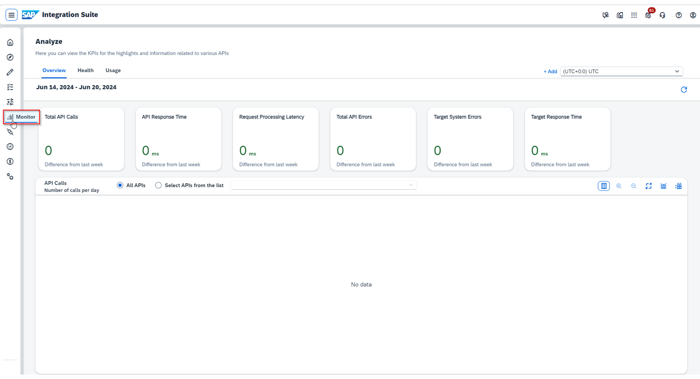

# ♠ 8 - [USING LOGGING AND MONITORING](https://learning.sap.com/learning-journeys/developing-with-sap-integration-suite/using-logging-and-monitoring_e83faa28-1ebd-41e5-87b7-1a053c336b36)

> Objectifs
>
> - Use the different ways to log health data and messages, displayed in a monitor.

## LOGGING AND MONITORING

### HEALTH MONITORING WITH SAP CLOUD ALM

Dans l'application Health Monitoring, vous pouvez vérifier l'état de votre service cloud et de vos systèmes techniques surveillés du point de vue de l'application et du client. Les métriques techniques sont collectées régulièrement et peuvent être utilisées pour calculer l’état de santé global de l’objet surveillé. Les métriques surveillées sont définies par le service lui-même et peuvent différer pour chaque type de service.

Pour le moment, seule la surveillance de l'état avec la solution SAP Cloud ALM est possible.

### ANALYZE API USAGE AND PERFORMANCE WITH THE BUILD-IN ADVANCED API ANALYTICS

Advanced API Analytics vous propose un tout nouveau tableau de bord d'analyse, fournissant des outils puissants et des rapports détaillés pour analyser l'utilisation et les performances de votre API. Les rapports sont classés dans plusieurs pages de rapport, chaque page de rapport fournissant des informations sur les mesures clés de l'API, pertinentes à la fois pour les utilisateurs professionnels et les développeurs d'API.

Accédez à Moniteur → API. Le tableau de bord s'ouvre.

Il existe de nombreuses vues et options de configuration pour visualiser les informations pertinentes.

### LOGGING WITH MESSAGE LOGGING POLICIY

Si vous souhaitez utiliser une solution de journalisation, SAP API Management vous permet d'envoyer des messages syslog au service de gestion des journaux tiers. Si vous souhaitez envoyer syslog à un service tiers, suivez la [documentation du service](https://help.sap.com/docs/sap-api-management/sap-api-management/message-logging-policy?version=Cloud).

Les services tiers de gestion des journaux sont les suivants :

- Splunk
- Logique du sumo
- Logging
- Autres

Un message sylog contient les éléments et attributs suivants de requête et/ou de réponse en fonction de l'endroit où se trouve le flux.

- Message (charge utile)
- Hôte
- Port
- Protocole

En conséquence, la capture d'écran suivante montre l'utilisation de Splunk :

### RESOURCES

Surveillance de l'état de santé avec SAP Cloud ALM

- En savoir plus ici : [Surveillance de la santé](https://support.sap.com/en/alm/sap-cloud-alm/operations/expert-portal/health-monitoring.html).
- En savoir plus ici : [Solutions prises en charge](https://help.sap.com/docs/cloud-alm/setup-administration/supported-solutions).

Analysez l'utilisation et les performances de l'API grâce à Advanced API Analytics intégré.

- En savoir plus ici : [Analyser les API](https://help.sap.com/docs/SAP_CLOUD_PLATFORM_API_MANAGEMENT/66d066d903c2473f81ec33acfe2ccdb4/7712c611015045afb47d7c244fffee63.html?locale=en-US).

Journalisation avec la stratégie de journalisation des messages

- Apprenez-en davantage sur un blog pour utiliser Splunk et la politique de journalisation des messages : [Splunk – Partie 1 : Journalisation et surveillance SAP APIM | Blogues SAP](https://blogs.sap.com/2020/05/12/splunk-part-1-sap-apim-logging-monitoring/).
- En savoir plus sur un blog pour utiliser Loggly et la politique de journalisation des messages : [Partie 7 – Meilleures pratiques de sécurité des API – Consigner toutes les interactions API | Blogues SAP](https://blogs.sap.com/2017/08/21/sap-cloud-platform-api-management-log-all-api-interactions/).
- En savoir plus sur la politique de journalisation des messages : [Politique de journalisation des messages](https://help.sap.com/doc/66d066d903c2473f81ec33acfe2ccdb4/Cloud/en-US/6407ae7701814caa8a5107bdc3f44fe2.html).

Inspection

- En savoir plus dans un blog à utiliser : [Inspecter et comprendre la consommation des ressources... - SAP Community](https://community.sap.com/t5/technology-blogs-by-sap/inspecting-and-understanding-resource-consumption-of-your-integration/ba-p/13567246)
- Pour en savoir plus, consultez help.sap.com : [Inspecter la consommation de ressources pour le flux d'intégration individuel | Portail d'aide SAP](https://help.sap.com/docs/cloud-integration/sap-cloud-integration/inspect-resource-consumption-for-individual-integration-flow?q=Inspect%20Resource%20Consumption)

  

### SUMMARY

Les métriques, l'utilisation et les performances des appels d'API individuels peuvent être examinées d'une part avec l'Advanced API Analytics intégré et d'autre part avec le produit SAP Cloud ALM. La journalisation des paramètres de communication et de la charge utile est effectuée avec la politique de journalisation des messages. Il compile les données correspondantes et utilise une solution externe, comme Loggly ou autres, pour les visualiser.
