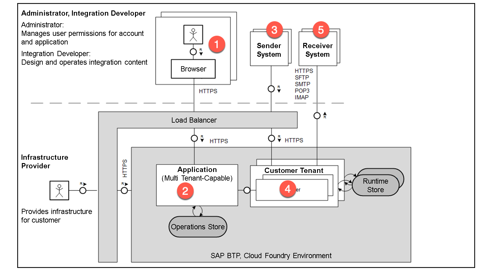
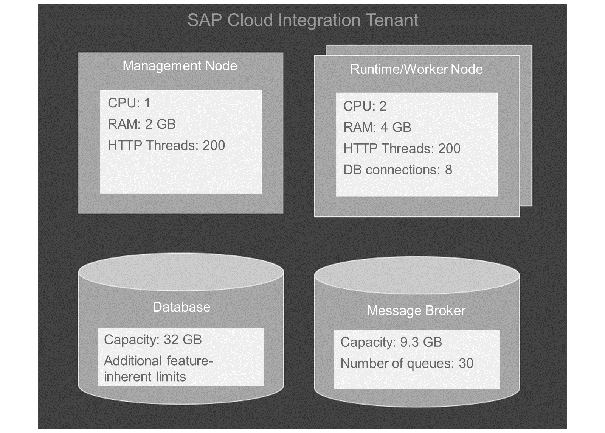
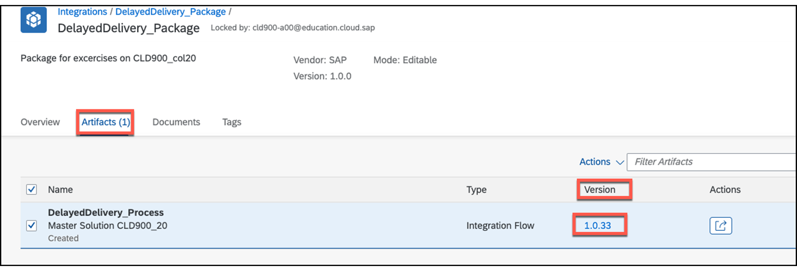
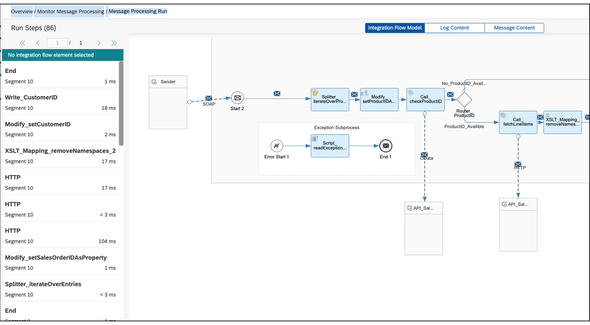
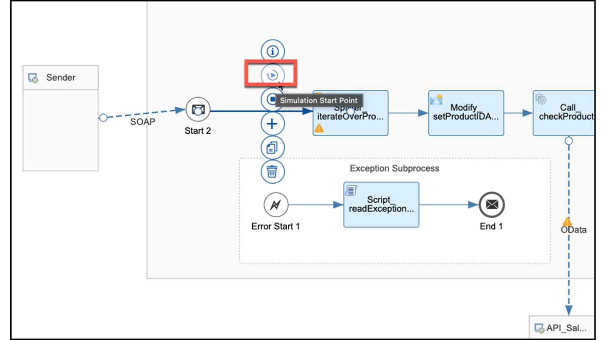
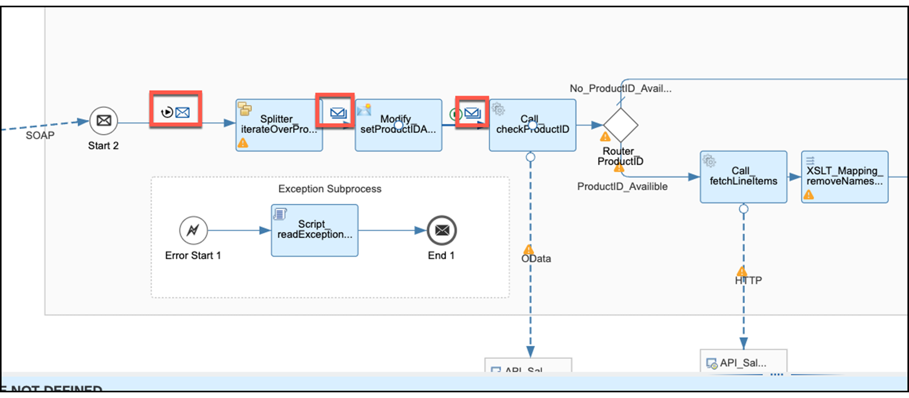
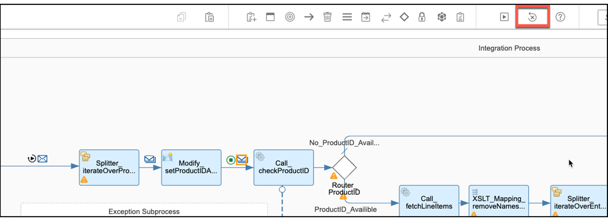

# ♠ 2 [INTRODUCING THE DEVELOPMENT CYCLE](https://learning.sap.com/learning-journeys/developing-with-sap-integration-suite/explaining-the-development-cycle_c8db2014-b9e1-4e16-9df3-cbce5688c1b6)

> :exclamation: Objectifs
>
> - [ ] Explain the development cycle

## THE DEVELOPMENT CYCLE

### DEVELOPMENT WITH CLOUD INTEGRATION

L'intégration cloud est un service d'abonnement, ce qui signifie que la modélisation graphique et le traitement des étapes du processus, entre autres, se produisent sur le sous-compte sur lequel vous vous êtes inscrit au service. Les sous-comptes du consommateur et du fournisseur sont situés dans la même région, par exemple eu10 (Francfort), et la communication s'effectue directement via le navigateur. Par conséquent, tout le contenu affiché dans le navigateur est fourni sous forme de flux de données HTML. Les URL des différents niveaux sont fournies ci-dessous et, dans tous les cas, nous sommes situés dans la région eu10. L'URL d'intégration cloud commence par le sous-domaine de votre sous-compte, suivi du domaine spécifique et du chemin de contexte :

- URL de vos sous-comptes (N°1) : https://emea.cockpit.btp.cloud.sap
- URL de la Suite d'Intégration (N°2) : https://.integrationsuite.cfapps.eu10-003.hana.ondemand.com/shell/home
- URL de l'intégration Cloud (n°2) : https://.integrationsuite.cfapps.eu10-003.hana.ondemand.com/shell/design

Lorsque vous travaillez, cela signifie :

- Toutes les fonctionnalités disponibles sont utilisées via le navigateur.
- Le navigateur décide de la présentation. C'est pourquoi SAP recommande le dernier navigateur Chrome.
- Le navigateur définit des délais d'attente.
- En cas de mauvaise connexion réseau, les délais de réponse peuvent être plus longs.
- Vous pouvez travailler avec n'importe quel appareil à condition que l'écran soit suffisamment grand, qu'un navigateur Chrome mis à jour soit disponible et qu'il existe une connexion Internet suffisante.

Vous avez besoin au moins de la collection de rôles PI_Integration_Developer.

### TECHNICAL IMPLEMENTATION

Comme mentionné au début, le cœur du système est le cadre d'intégration Camel. SAP améliore le framework Camel avec un client graphique et diverses fonctionnalités de sécurité. L'implémentation complète est une application Java et comprend les composants suivants :

Le premier composant (n°1) est votre navigateur, qui accède à l'implémentation via l'URL d'intégration Cloud pour créer et gérer le flux d'intégration. Le deuxième composant (n°2), est l'interface graphique.

Une fois le flux d'intégration créé, s'il est déployé en tant qu'application Java sur le runtime (Cloud Foundry, Kyma), (n°4) les messages peuvent être transmis à l'aide du composant émetteur (n°3), et reçus à l'aide du composant récepteur. (N°5).

Un équilibreur de charge (IP5) est connecté à l'entrée de l'émetteur (n°3) et, fait intéressant, il ne va pas directement au runtime.

### RESOURCES ON A TENANT

Les ressources pour une mise en œuvre d'une intégration cloud sont limitées.

### DEVELOPEMENT CYCLE FOR CREATING INTEGRATION FLOW

Dans les exercices associés, nous suivons le principe de construction de flux d’insertion professionnelle.

### TO CREATE A DEVELOPEMENT CYCLE, THE FOLLOWING STEPS MUST BE CARRIED OUT IN ORDER:

- Comprenez votre cas d’utilisation.
- Configurez le sous-compte SAP BTP et Integration Suite.
- Recherchez la liste des API requises avec toutes ses métadonnées, telles que les informations d'identification, les en-têtes, etc.
- Commencez dans l'intégration Cloud avec un modèle vide.
- Modéliser vos processus.
- Construisez le flux d’intégration petit à petit.
- Répétez les étapes.
- Qu'est-ce qui vient ensuite ?

Voici les explications des étapes :

#### UNDERSTAND YOUR USE CASE

En collaboration avec les artefacts, le cas d'utilisation est analysé en profondeur et la méthodologie SAP Integration Solution Advisory Methodology est appliquée pour répondre à toutes les exigences.

#### CONFIGURE THE SAP BTP SUBACCOUNT AND THE INTEGRATUION SUITE

L'étape suivante consiste à fournir aux développeurs d'intégration les collections de rôles pertinentes, leur permettant de travailler sur la suite d'intégration appropriée. Ceci est coordonné avec les administrateurs.

#### FIND THE LIST OF REQUIRED API WITH ALL ITS METADATA, SUCH AS CREDENTIALS, HEADERS AND MORE

Si toutes les API sont répertoriées dans une API Business Hub Enterprise, vous avez de la chance et le travail d'obtention de l'URL et des paramètres nécessaires est terminé. Cependant, dans le cas contraire, vous pouvez prévoir suffisamment de temps pour obtenir ces données et tester les interfaces.

#### START IN THE CLOUD INTEGRATION WITH AN EMPTY TEMPLATE

Créez un package avec un nom significatif. Voici une proposition de conventions de nom : [Conventions de dénomination](https://help.sap.com/docs/CLOUD_INTEGRATION/368c481cd6954bdfa5d0435479fd4eaf/7c00e9bf1d0e41d99e4ba5d770e9bd4a.html?locale=en-US&q=Naming%20Conventions).

Pour commencer, sélectionnez l'artefact du flux d'intégration et un modèle vide sera créé automatiquement. Si un message entrant est nécessaire, il peut être simulé à l'aide d'un événement Timer pour démarrer et d'un modificateur de contenu pour simuler le message. Cette approche facilite des cycles de développement plus rapides et plus faciles.

#### MODELING YOUR PROCESSES

Il peut être difficile d'établir des critères clairs pour le développement de processus. Parfois, un processus peut paraître simple au départ, mais il peut ensuite être décomposé en plusieurs processus individuels. Il est important de considérer que le processus devra à l’avenir être compris par le personnel spécialisé. Dans les exercices de cette formation, nous nous concentrons sur la mise en œuvre d'un processus. Cependant, il est possible d'externaliser les appels d'API vers des processus distincts avec leur propre gestion des erreurs.

#### BUILD THE INTEGRATUIB FLOW BIT BY PIECE

Il existe différentes manières de développer des flux d'intégration en fonction du cas d'utilisation. Pour l’exercice pratique, il est recommandé de commencer par les appels API. Une fois les connexions établies, il devient plus facile de déterminer l’entrée et la sortie requises. Contrairement à XI ou PI avec son protocole de message XI, il n'existe pas de format interne dans l'intégration cloud. Il est donc important de considérer les formats internes et les transformations nécessaires. La section d'aide de chaque composant du flux d'intégration peut être utilisée pour trouver les configurations appropriées. Ce processus est également démontré dans les exercices. Après avoir configuré un composant, il est essentiel de déboguer et de vérifier que le résultat répond à nos attentes. Généralement, il existe deux façons de tester notre flux d'intégration.

Ce sont :

- Simulation des flux d'intégration.
- Testez avec un déploiement et un débogage réels. Cette approche est utilisée dans les exercices.

Les deux sujets sont ensuite examinés plus en détail.

#### WHAT COME NEXT?

La première étape consiste à tester le processus, et diverses procédures de test sont décrites en détail ultérieurement. Une fois les tests réussis, le flux d'intégration est transporté vers les sous-comptes de production. Une surveillance continue du traitement ou de la mise en œuvre de la gestion des alertes pour répondre aux événements imprévus relève de la responsabilité des administrateurs, et ne sera pas abordée séparément ici.

### VERSIONING OF YOUR INTEGRATION FLOWS

Il est important de versionner périodiquement l’état de développement pour permettre la possibilité de revenir à une version précédente si nécessaire.

### PROCEDURE TO VERSION INTEGRATION FLOW:

- Commencez par votre flux d’intégration modifiable.
- Choisissez le bouton Enregistrer sous version en haut à droite.
- Entrez un commentaire significatif.

Cette approche est utilisée dans les exercices.

### PROCEDURE TO SWITCH TO FORMER VERSION:

- Commencez par votre forfait.
- Marquez votre artefact (flux d'intégration) dans la liste des artefacts disponibles.
- Accédez à la colonne Version.
- Choisissez le numéro de version.
- Choisissez une ancienne version.
- Choisissez le symbole pour revenir à l'ancienne version.

### DEVELOPER TEST WITH REAL DEPLOYMENT AND DEBUGGING OF YOUR INTEGRATION FLOW

Avant d'examiner le flux d'intégration, il doit être déployé dans l'environnement de surveillance. Le modèle graphique est converti en application Java et placé dans le runtime, permettant de démarrer le flux d'intégration. Si le déploiement réussit, le flux d'intégration s'exécutera immédiatement si un événement de minuterie est utilisé ou attendra un message entrant. L'intégration cloud offre un niveau de journal de trace qui fournit un aperçu du traitement de chaque composant du flux d'intégration.

### TO PERFORM A DEVELOPER TEST, THE FOLLOWING STEPS MUST BE CARRIED OUT IN ORDER:

- Commencez par votre flux d’intégration.
- Choisissez le bouton Déployer.
- Choisissez un endroit dans l’espace blanc en dehors du couloir de flux d’intégration.
- Choisissez l'état de déploiement dans la zone de configuration du flux d'intégration.
- Si votre flux d'intégration est déployé avec succès, vous verrez un lien Naviguer vers la gestion du contenu d'intégration.
- Choisissez ce lien pour accéder à Surveiller les artefacts → Présentation → Gérer le contenu d'intégration.
- Modifiez le niveau de journalisation en trace.
- Déployez à nouveau si vous utilisez un événement de démarrage de minuterie. Sinon, envoyez un message au point de terminaison.
- Si vous déployez à nouveau, revenez à Surveiller les artefacts → Présentation → Gérer le contenu d'intégration.
- Ici, choisissez le lien Surveiller le traitement des messages.
- Dans la nouvelle fenêtre, choisissez Surveiller les artefacts → Présentation → Surveiller le traitement des messages. Choisissez le dernier message de la liste des messages et choisissez-le.
- Choisissez le lien Trace pour accéder directement à Surveiller les artefacts → Présentation → Surveiller le traitement des messages → Exécuter le traitement des messages.
- Explorez la trace de votre flux.

Cette approche est utilisée dans les exercices.

### DEVELOPER TEST WITH SIMULATIONS OF YOUR INTEGRATION FLOW AND COMPONENTS

La simulation de parties individuelles ou de l'intégralité du flux d'intégration peut être utile pour vérifier si les valeurs sont correctement définies dans un modificateur de contenu ou si un script ou un mappage est exécuté comme prévu. Cependant, tous les composants du flux d'intégration ne sont pas pris en charge pour la simulation.

Voici la liste des composants de flux d'intégration pris en charge : [Simulation d'un flux d'intégration](https://help.sap.com/docs/CLOUD_INTEGRATION/368c481cd6954bdfa5d0435479fd4eaf/2e2210b6db0c4fdb937b3a57d952f582.html?locale=en-US)

### EXAMPLE

Dans DeDelayedDelivery_Process, nous voulons vérifier via une simulation si le ProductID est correctement défini dans Modify_setProductIDAsProperty.

### TO PERFORM DEVELOPER TESTS WITH SIMULATIONS, THE FOLLOWING STEPS MUST BE CARRIED OUR IN ORDER:

- Choisissez un emplacement sur la ligne devant le composant Splitter_iterateOverProducts.
- Définissez le point de départ via le menu contextuel.
- Ajoutez le message d'entrée en tant que charge utile (contenu).
- Choisissez la ligne après le composant Modify_setProductIDAsProperty.
- Définissez le point final de la simulation.
- La barre de navigation de la simulation est désormais active.
- Démarrez la simulation avec le bouton Démarrer de la barre de navigation.
- Choisissez toutes les enveloppes entre le point de départ et le point final pour explorer les résultats.
- Après le test, choisissez le bouton Effacer de la barre de navigation.

### SUMMARY

Le processus de création d'un flux d'intégration implique l'utilisation d'un éditeur graphique dans l'application d'intégration cloud distante. Des simulations peuvent être effectuées sur des parties individuelles ou sur l'ensemble du flux d'intégration pour vérifier que les valeurs sont correctement définies dans les modificateurs de contenu, les scripts ou les mappages. Une fois le flux d'intégration terminé, il est versionné et déployé, ce qui entraîne la création et le déploiement d'une application Java dans un environnement d'exécution. Le flux d'intégration peut ensuite être exécuté. Le processus de développement peut être abordé sous forme de cycles, dans lesquels le placement et la configuration des composants, le débogage à l'aide des niveaux de journalisation de trace et les tests sont répétés jusqu'à ce que le résultat souhaité soit obtenu.

## CREATE AN INTEGRATION PACKAGE AND INTEGRATION FLOW

[Exercices](https://learning.sap.com/learning-journeys/developing-with-sap-integration-suite/explaining-the-development-cycle_c8db2014-b9e1-4e16-9df3-cbce5688c1b6)
