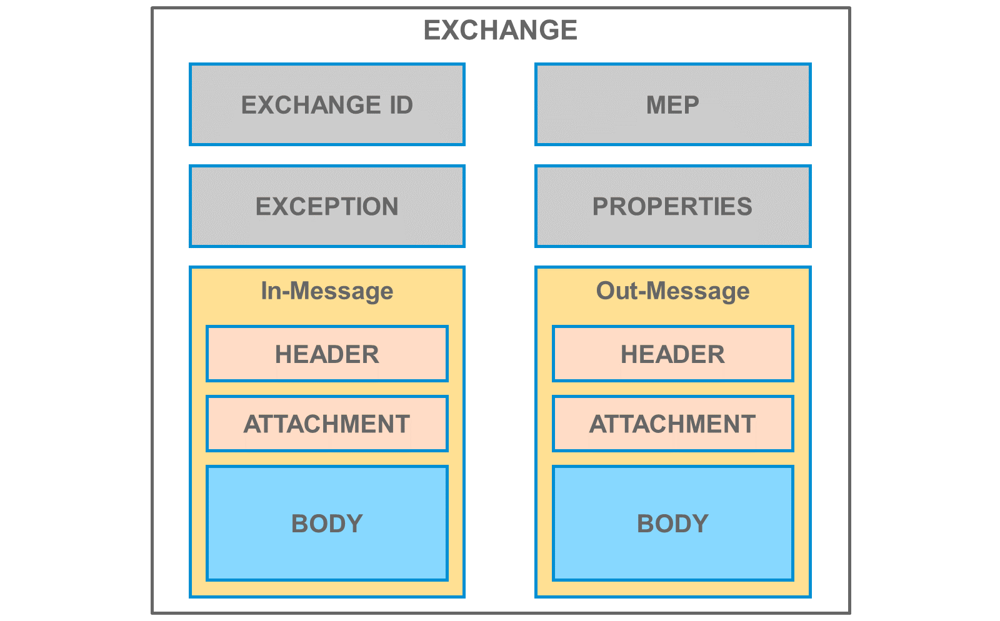

# ♠ 4 [EXPLAINING THE CAMEL DATA MODEL AND SIMPLE EXPRESSION LANGUAGE](https://learning.sap.com/learning-journeys/developing-with-sap-integration-suite/using-message-monitoring-and-logging_cbf56a9f-63f2-4fe2-af39-43cc48b490c8)

> :exclamation: Objectifs
>
> - [ ] Explain the Camel data model and simple expression language

## CAMEL DATA MODEL AND SIMPLE EXPRESSION LANGUAGE

### THE CAMEL DATA MODEL

Il s'agit d'un conteneur pour les éléments suivants :

- En-têtes
- Propriétés
- Pièce jointe
- Corps
- Autres

Voici les explications :

#### HEADERS (En-têtes)

Les données d'en-tête contiennent des informations relatives au message, telles que l'adresse de l'expéditeur du message, et sont automatiquement incluses dans tout appel HTTP ultérieur.

#### PROPERTIES (Propriétés)

Davantage de données peuvent être temporairement stockées pendant le traitement des messages sous la forme d'objets contextuels.

#### ATTACHMENTS (Pièces jointes)

Contient des données facultatives qui doivent être jointes au message.

#### BODY (Corps)

La charge utile à transférer dans un message est contenue dans le corps. Pendant le traitement du message, un conteneur Exchange est également disponible, qui peut stocker des données supplémentaires en plus du message. Ce conteneur est identifié de manière unique par un ID Exchange et peut contenir des données temporaires dans la zone Propriétés pendant le traitement des messages. Les données stockées dans le conteneur Exchange sont disponibles pendant toute la durée de l'échange du message et sont incluses dans le conteneur lors de l'appel de l'étape de traitement suivante.

### MANIPULATION OF THE EXCHANGE PARAMETERS

Les paramètres d'échange, y compris la charge utile, sont automatiquement définis par les messages entrants. Cependant, ces paramètres peuvent également être manipulés manuellement par lecture et écriture. Différentes méthodes sont disponibles pour manipuler les paramètres d'échange :

- Utilisation du composant Content Modifier
- Utilisez le SDK Groovy
- Utiliser le SDK JavaScript
- Utilisation de l'UDF dans le mappage des messages
- Utilisation du mappage XSLT
- Et encore plus

### SET EXCAHNGE PARAMETERS WITH CONTENT MODIFIER COMPONENT

L'élément Content Modifier offre un moyen graphique de manipuler les paramètres Exchange.

Vous pouvez manipuler :

- En-tête
- Propriétés
- Corps

### SET EXCHANGE PARAMETERS WITH GROOVY SDK

La classe com.sap.gateway.ip.core.customdev.util.Message propose des méthodes pour manipuler les paramètres.

La même chose s'applique à JavaScript.

### SIMPLE EXPRESSION LANGUAGE

Le langage d'expression simple est utilisé pour paramétrer les paramètres d'échange. Il propose également plusieurs paramètres intégrés, tels que les horodatages, les messages d'erreur, etc. Cela signifie que vous disposez uniquement d'un accès en lecture, par exemple, aux paramètres Exchange.

Le schéma général est l'espace réservé `${ }` contenant une variable intégrée ou des paramètres Exchange. Dans l'intégration cloud, l'espace réservé `${ }` peut être inséré, par exemple, dans la charge utile d'une étape de modification de contenu, ou appliqué dans l'éditeur de requête, en ajoutant des valeurs dynamiques à un chemin de ressource OData.

L'espace réservé `${ }` peut également être combiné avec des opérateurs pour produire des expressions booléennes, que vous pouvez ensuite utiliser comme conditions dans les routeurs, les filtres et d'autres composants de flux d'intégration.

### SAMPLES:

     ${property.MyNumericProperty} > 0
     ${property.MyStringProperty} contains ‚test‘
     property.ProductCoderegex‚[a−z]5\d3‘
     ${date:now:dd-MM-yyyy HH:mm}

### SPECIALS WITHIN DAILY BUSINESS

- The Message Body

  `${in.body}`

- Properties

  `${property.}`

- Message Headers

  `${header.}`

### THE SIMPLE EXPRESSION LANGUAGE CAN BE USED:

- En Scripting avec Groovy ou JavaScript.
- Dans certains composants du flux d'intégration tels que le routeur, le modificateur de contenu et le mappage de messages en tant que fonctions définies par l'utilisateur.
- Dans les mappages XSLT.
- Dans certains adaptateurs pour les requêtes.

### RESOURCES

Lire la suite ici :

- Lignes directrices pour modifier le contenu

  [Lignes directrices pour la modification du contenu](https://help.sap.com/docs/CLOUD_INTEGRATION/368c481cd6954bdfa5d0435479fd4eaf/6a7c9a10886a4465a10481375837bb15.html?locale=en-US)

- Paramètres d'échange avec le composant Modificateur de contenu

  [Définir un modificateur de contenu](https://help.sap.com/docs/CLOUD_INTEGRATION/368c481cd6954bdfa5d0435479fd4eaf/8f04a707843a40bf9f6e07ed55b93034.html)

  [SAP Integration Suite - Plongée en profondeur dans le modificateur de contenu | Blogues SAP](https://blogs.sap.com/2021/12/03/sap-integration-suite-deep-dive-into-content-modifier/)

- Utilisation de Camels Simple dans les scripts CPI Groovy

  [Utilisation de Camel's Simple dans les scripts CPI Groovy | Blogues SAP](https://blogs.sap.com/2018/04/05/using-camels-simple-in-cpi-groovy-scripts/)

- Langage d'expression simple

  [Langage d'expression simple](https://help.sap.com/docs/link-disclaimer?site=https%3A%2F%2Fcamel.apache.org%2Fcomponents%2Fnext%2Flanguages%2Fsimple-language.html)

  [Utiliser le langage d'expression simple Camel](https://help.sap.com/docs/CLOUD_INTEGRATION/368c481cd6954bdfa5d0435479fd4eaf/4688083fad6546c1ba25a06d4ffb9fae.html?locale=en-US&q=Camel)

  [Découvrez le langage d'expression simple de Camel dans SAP Cloud Integration | Blogues SAP](https://blogs.sap.com/2016/11/25/get-to-know-camels-simple-expression-language-in-hci/)

### SUMMARY

Le modèle de données Camel est utilisé pour gérer les données temporaires pendant le traitement dans les composants individuels du flux d'intégration. Ce modèle de données inclut non seulement la charge utile (corps), mais également les propriétés et les données d'en-tête, qui sont automatiquement incluses dans un appel HTTP.

Le conteneur Exchange est transmis du prédécesseur à l'étape de traitement suivante à chaque étape de traitement. Les paramètres d'échange sont définis automatiquement, par exemple lorsqu'un message est reçu, et manuellement via des composants tels que le Content Modifier ou le Groovy SDK, entre autres. Le modèle de données Camel gère les données temporaires pendant le traitement, qui incluent la charge utile (corps), les propriétés et les données d'en-tête. Les données d'en-tête sont automatiquement incluses dans un appel HTTP.

L'accès aux paramètres Exchange pour la lecture se fait via le langage d'expression simple, qui inclut non seulement des paramètres intégrés, mais permet également de modéliser des expressions regex complexes.

### CREATE A CONTENT MODIFIER WITH SAMPLE DATA AS PAYLOAD (XML)

[Exercices](https://learning.sap.com/learning-journeys/developing-with-sap-integration-suite/explaining-the-camel-data-model-and-simple-expression-language_a5b1158e-da28-4dcf-818c-4273126903e7)
