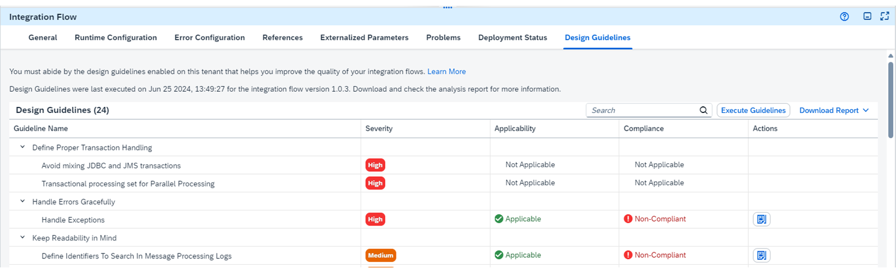

# ♠ 1 - [MODELING INTEGRATION FLOWS IN AN OVERVIEW](https://learning.sap.com/learning-journeys/developing-with-sap-integration-suite/modeling-integration-flows-in-an-overview_d550da39-d693-48bc-b425-dbc135589328)

> :exclamation: Objectifs
>
> - [ ] Model Integration Flows in an overview

## INTEGRATION FLOWS MODELING

### INTEGRATION FLOW DESIGN GUIDELINES OVERVIEW

Les développeurs d'intégration doivent s'assurer que les flux d'intégration sont conçus de manière robuste pour protéger les processus métier critiques de leur entreprise. Comme chaque cas d’utilisation peut être unique, il existe autant de modèles de flux d’intégration que de cas d’utilisation. SAP fournit des solutions pour les exigences récurrentes via les directives de conception de flux d'intégration, qui sont bien documentées et mises en œuvre. Ces exemples de flux d’intégration peuvent être testés directement.

### THIS SECTION PROVIDES GUIDELINES FOR INTEGRATION DEVELOPERS COVERING THE FOLLOWING THRE MAIN ASPECTS:

- Apprenez les bases.

- Lignes directrices pour concevoir des flux d’intégration de niveau entreprise.

- Lignes directrices pour mettre en œuvre des modèles d’intégration spécifiques.

### THE INTEGRATION FLOWS ARE DESIGNED TO MEET THE FOLLOWING REQUIREMENTS:

- Une ligne directrice ou un modèle spécifique est au centre de chaque flux d’intégration, ce qui vous permet de comprendre facilement le sujet.

- Vous pouvez facilement déployer et exécuter chaque flux d'intégration avec un minimum d'effort, ce qui vous permet de tester chaque ligne directrice ou modèle par vous-même.

- Chaque flux d'intégration de référence peut servir de base au développement de scénarios plus complexes.

### IMPLEMENT THE SAMPLE PACKAGES

Les trois derniers exercices vous ont appris à implémenter et à utiliser un exemple de flux d'intégration du package « Apprendre les bases ».

### LEARN THE BASICS

Ici, les sujets suivants sont abordés sur la base d'exemples d'implémentation :

- Commencez votre parcours de conception de flux d’intégration en vous familiarisant avec un ensemble de trois flux d’intégration simples qui démontrent les fonctionnalités de base du traitement des messages. Ces flux gagnent progressivement en complexité.

- Découvrez comment accéder (et définir) les en-têtes et les propriétés.
  Apprenez à concevoir des scénarios d'intégration avec un flux d'intégration pour une communication de flux d'intégration.

- Découvrez comment configurer les adaptateurs.

- Découvrez comment transporter le contenu d’intégration d’une source vers un locataire cible.

- Découvrez comment implémenter différents scénarios pour découpler le traitement de l'expéditeur et du flux d'intégration.

- Découvrez comment récupérer uniquement les données delta du système source en utilisant la date actuelle ou la dernière date de la charge utile.

- Découvrez comment gérer les exceptions avec un sous-processus d'exception.

- Découvrez comment utiliser l'application de surveillance pour analyser le comportement d'un flux d'intégration au moment de l'exécution.

- Découvrez comment modifier le contenu pour utiliser différentes étapes du flux d'intégration (par exemple, le modificateur de contenu ou l'enrichisseur de contenu) pour modifier le contenu du message :

  - Découvrez comment convertir des données d'une source vers un format cible.

  - Apprenez à encoder et décoder du contenu.

  - Découvrez comment gérer les mappages de messages.

- Découvrez comment utiliser les étapes qui stockent le message dans la base de données des locataires.

- Apprenez à transférer des fichiers.

### GUIDELINES TO DESIGN ENTERPRISE-GRADE INTEGRATION FLOWS

Ici, les sujets suivants sont abordés sur la base d'exemples d'implémentation :

- Apprenez à concevoir avec une haute disponibilité.

- Apprenez à concevoir avec résilience.

- Apprenez à gérer des ressources limitées.

- Apprenez à concevoir un accouplement lâche.

- Apprenez à gérer les échecs avec élégance.

- Apprenez à concevoir la lisibilité des flux.

- Apprenez à utiliser le contenu d'intégration préemballé.

### GUIDELINES TO IMPLEMENT SPECIFIC INTEGRATION PATTERNS

Sur la base d'exemples d'implémentation, les sujets suivants sont abordés ici :

- Apprenez à implémenter et à utiliser un modèle d'agrégateur.

- Apprenez à implémenter et à utiliser un modèle de processeur de message composé.

- Apprenez à implémenter et à utiliser un modèle de routage basé sur le contenu.

- Apprenez à implémenter et à utiliser un modèle Content Enricher.

- Apprenez à implémenter et à utiliser un modèle de filtre de contenu.

- Apprenez à implémenter et à utiliser un modèle de filtre de messages.

- Apprenez à implémenter et à utiliser un modèle de liste de destinataires.

- Apprenez à implémenter et à utiliser un modèle Resequencer.

- Apprenez à mettre en œuvre et à utiliser un modèle Scatter-Gather.

- Apprenez à implémenter et à utiliser un modèle Splitter.

- Apprenez à mettre en œuvre et à utiliser un modèle de qualité de service.

### INTEGRATION DESIGN GUIDELINES CHECK

Dans le flux d'intégration, vous pouvez désormais exécuter des vérifications des directives dans votre flux d'intégration avec une vue d'analyse ou un rapport des composants violés.

### RESOURCES

Lire la suite ici :

- À propos de la conception de flux d'intégration de niveau entreprise :

  Description des flux d'intégration sur : Lignes directrices pour concevoir des flux d'intégration de niveau entreprise

- Documentation de base

  Description des flux d'intégration sur : Apprendre les bases

- Documentation sur les directives de conception de flux d'intégration de niveau entreprise

  Description des flux d'intégration sur : Lignes directrices pour concevoir des flux d'intégration de niveau entreprise

- Documentation sur les directives pour implémenter des modèles d'intégration spécifiques

  Description du package, y compris des informations supplémentaires sur les liens vers les modèles uniques : Lignes directrices pour la mise en œuvre de modèles d'intégration spécifiques

### SUMMARY

SAP propose diverses solutions pour les exigences techniques courantes via de la documentation et des exemples de mise en œuvre. Ces domaines comprennent l'apprentissage des bases, les directives pour la conception de flux d'intégration de niveau entreprise et les directives pour la mise en œuvre de modèles d'intégration spécifiques. Vous pouvez rechercher et utiliser ces exemples dans vos propres projets.

## CREATE AND CONFIGURE A GENERAL SPLITTER

[Exercices](https://learning.sap.com/learning-journeys/developing-with-sap-integration-suite/modeling-integration-flows-in-an-overview_d550da39-d693-48bc-b425-dbc135589328)
