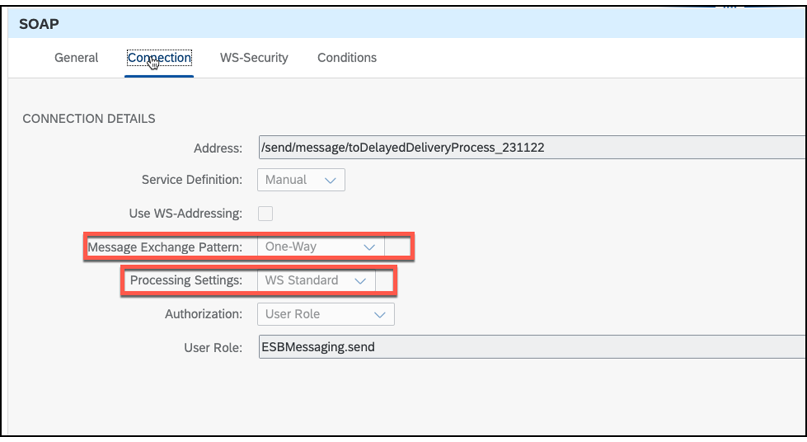

# ♠ 2 [LEARNING THE BASICS](https://learning.sap.com/learning-journeys/developing-with-sap-integration-suite/learning-the-basics_ccfb5535-54c2-40d2-8249-6e3102987d30)

> :exclamation: Objectifs
>
> - [ ] Create and configure a content modifier

## HANDLE ATTACHMENTS

Dans cette leçon, vous n'utiliserez pas de pièces jointes, mais vous apprendrez à les gérer efficacement dans les flux d'intégration, où un fichier est spécifié dans un format tel que des fichiers texte et joint en tant que paramètre d'échange.

### READ MORE HERE:

- [Créer des pièces jointes](https://help.sap.com/docs/CLOUD_INTEGRATION/368c481cd6954bdfa5d0435479fd4eaf/d1f16dbf415a449690bdc2452df7c3f4.html?locale=en-US)

- [Remplacer le corps par le contenu de la pièce jointe](https://help.sap.com/docs/CLOUD_INTEGRATION/368c481cd6954bdfa5d0435479fd4eaf/14e68101f5984d8a8f3ac565ba320509.html?locale=en-US)

- [Lire plusieurs pièces jointes](https://help.sap.com/docs/CLOUD_INTEGRATION/368c481cd6954bdfa5d0435479fd4eaf/4b2f07f59590414eb597f29959c06248.html?locale=en-US)

- [Lire la pièce jointe en fonction des critères de filtre](https://help.sap.com/docs/CLOUD_INTEGRATION/368c481cd6954bdfa5d0435479fd4eaf/f7f513f915044435a269157ffa325c2c.html?locale=en-US)

- [Lire plusieurs pièces jointes en fonction des critères de filtre](https://help.sap.com/docs/CLOUD_INTEGRATION/368c481cd6954bdfa5d0435479fd4eaf/b9c2354da3bd4b029af109a0413c9be9.html?locale=en-US)

### FILE TRANSFERT

Cette leçon couvre le transfert de fichiers depuis un serveur, bien qu'elle n'implique pas l'utilisation de pièces jointes.

### READ MORE HERE:

- [Fichier d'interrogation par fichier terminé](https://help.sap.com/docs/CLOUD_INTEGRATION/368c481cd6954bdfa5d0435479fd4eaf/800de6e5bbf7422abd071e9b80016296.html?locale=en-US)

- [Dossier d'interrogation par fichier terminé corrigé](https://help.sap.com/docs/CLOUD_INTEGRATION/368c481cd6954bdfa5d0435479fd4eaf/0041751c99dc45269597d0d1ef1e2182.html?locale=en-US)

- [Concaténation de fichiers via Poll Enrich](https://help.sap.com/docs/CLOUD_INTEGRATION/368c481cd6954bdfa5d0435479fd4eaf/694a60b0252d4285ad36dfcc0fabed82.html?locale=en-US)

- [Combiner des fichiers XML via Poll Enrich](https://help.sap.com/docs/CLOUD_INTEGRATION/368c481cd6954bdfa5d0435479fd4eaf/7b971052e46e4a1084eb5bf434a4df1e.html?locale=en-US)

- [Sonder et fusionner le dossier](https://help.sap.com/docs/CLOUD_INTEGRATION/368c481cd6954bdfa5d0435479fd4eaf/497bf08e0bdb43018e8e861256f4e803.html?locale=en-US)

### DECOUPLE INTEGRATION FLOWS

Dans cette leçon, vous découvrirez le traitement de découplage, qui implique le découplage asynchrone du traitement des scénarios d'intégration entre l'expéditeur et le flux d'intégration.

### READ MORE HERE:

- [Découpler l'expéditeur et les flux sans persistance](https://help.sap.com/docs/CLOUD_INTEGRATION/368c481cd6954bdfa5d0435479fd4eaf/31d4dec814724e2b8b9fb7161c2c5adb.html?locale=en-US)
- [Découpler l'expéditeur et les flux à l'aide de la persistance](https://help.sap.com/docs/CLOUD_INTEGRATION/368c481cd6954bdfa5d0435479fd4eaf/c5591df1388b4cf08aa3ff9527806b70.html?locale=en-US) (en utilisant le magasin de données ou les files d'attente de messages JMS)

### DECOUPLE WITH SOAP ADAPTER

Cette leçon utilise une configuration spécifique pour l'adaptateur SOAP, qui appelle le flux d'intégration de manière asynchrone. La configuration est la suivante :

- Modèle d'échange de messages : unidirectionnel.

- Paramètres de processus : norme WS.

### USE CONVERTERS

Cette leçon fournit des conseils sur la façon d'effectuer une conversion de format de fichier, mais il est important de noter que des convertisseurs sont nécessaires car il n'existe pas de format de message interne comme dans l'intégration de processus avec le protocole de message XI. XML est le format le plus couramment utilisé car il est requis pour les opérations de mappage de messages et XPATH, ainsi que pour le format JSON.

### READ MORE HERE:

- Utilisez le convertisseur CSV en XML

- Utilisez le convertisseur XML en CSV

- Utilisez le convertisseur JSON vers XML et XML vers JSON

### SUMMARY

Les pièces jointes peuvent être créées, modifiées et combinées, tandis que les fichiers peuvent être récupérés à l'aide de l'adaptateur SFTP de différentes manières. Le découplage asynchrone des flux d'intégration sépare le temps d'appel du temps de traitement. Il est également important de noter que les formats XML ou JSON sont nécessaires pour le mappage des messages et les opérations XPATH.

## CREATE AND CONFIGURE A CONTENT MODIFIER

[Exercices](https://learning.sap.com/learning-journeys/developing-with-sap-integration-suite/learning-the-basics_ccfb5535-54c2-40d2-8249-6e3102987d30)
