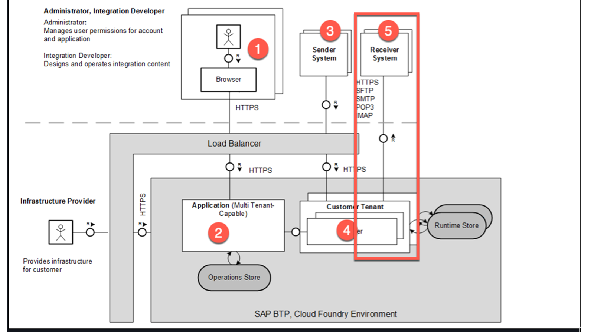
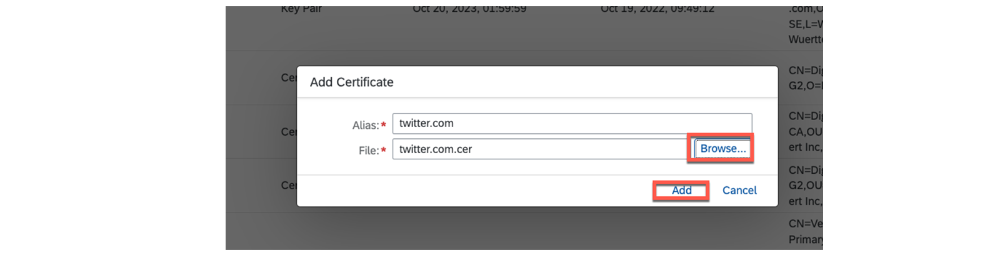
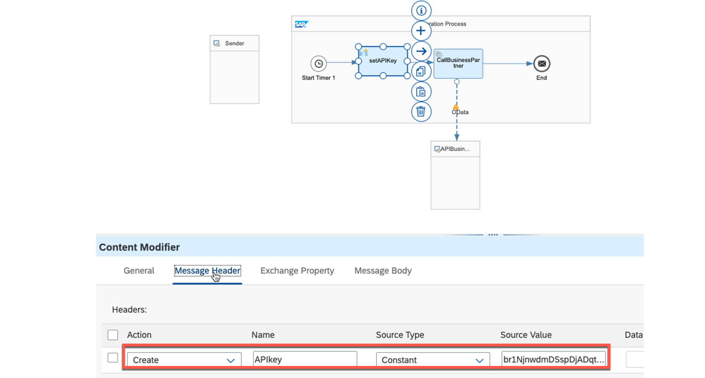
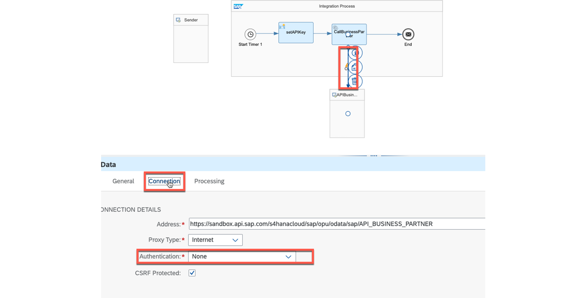
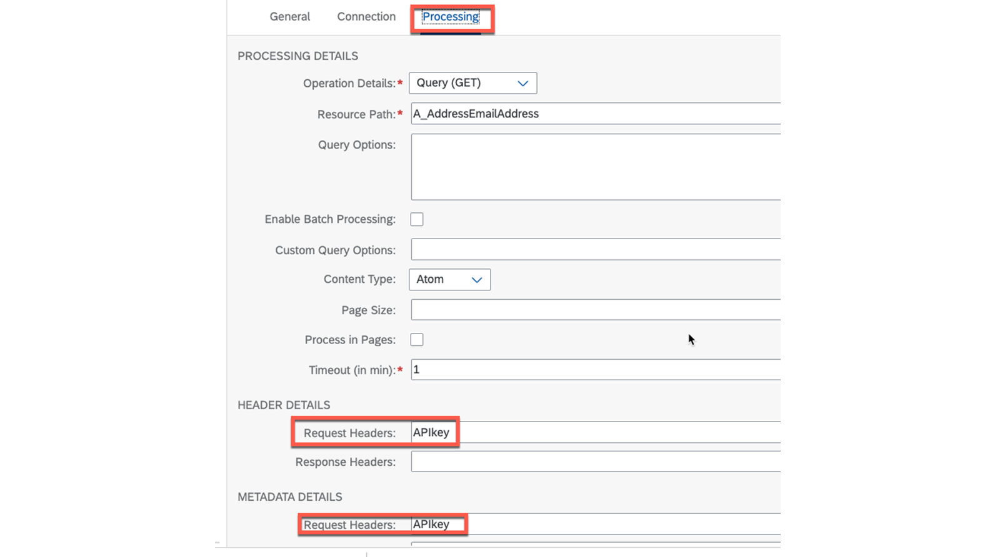
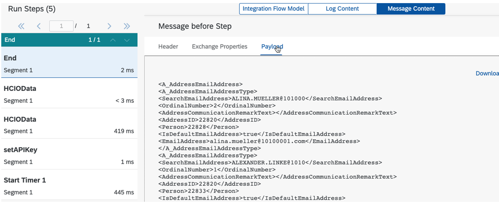

# ♠ 5 [USING MAPPINGS](https://learning.sap.com/learning-journeys/developing-with-sap-integration-suite/using-adapters_f42fdb69-df78-4faf-bfd3-0a7b8c8beebd)

> :exclamation: Objectifs
>
> - [ ] Use outbound security for adapters

## ADAPTER OUTBOUND SECURITY

### OUTBOUND SECURITY FOR ADAPTER

Les procédures de mise en œuvre de l'authentification et de l'autorisation auprès du récepteur varient en fonction du type d'adaptateur utilisé et peuvent parfois être différentes. Cependant, il existe des similitudes lors de l'utilisation d'adaptateurs basés sur TCP. Le processus consiste à créer une connexion HTTPS via des certificats et à effectuer une véritable authentification. En pratique, cela signifie que le certificat du destinataire doit être importé dans le locataire Cloud Integration.

L'établissement d'une connexion TCP sécurisée nécessite l'utilisation de TLS avec des certificats. SAP fournit un outil dédié pour vérifier et importer les certificats nécessaires spécifiques au destinataire.

Le processus d'authentification et d'autorisation est spécifique à l'adaptateur et est décrit ci-dessous pour l'adaptateur OData.

### ESTABLISHING A SECURE CONNECTION TO THE RECEIVER INVOLVES USING CERTIFICATES

Comment pouvons-nous garantir que le message est correctement transmis au destinataire ? Dans ce scénario, la connexion est établie directement entre l'adaptateur récepteur et le récepteur.

Pour établir une connexion sécurisée avec le récepteur, il est nécessaire d'effectuer une authentification et une autorisation. Ce processus implique également la mise en place d'une connexion HTTPS via des certificats, qui peuvent être utilisés pour davantage d'authentification et d'autorisation. En fin de compte, le type d'authentification et d'autorisation utilisé est décidé par le destinataire.

Nous le démontrons à nouveau avec l'exemple de l'adaptateur OData. Dans les exercices de cette formation, nous avons mis en place des politiques de gestion des API afin d'éviter le besoin d'authentification.

### LOCATE AND IMPORT THE CERTIFICATES FOR THE RECEIVER AND THE CERTIFICATE CHAIN FOR THE SERVER

Nous pouvons utiliser un outil utile dans l'intégration cloud appelé Test Connectivity pour rechercher et importer les certificats de récepteur requis et leur chaîne de certificats de serveur.

### PROCEDURE

- Navigate to Monitor → Integrations → Manage Security → Test Connectivity.

- Choose your protocol.

- Fill in the necessary data.

- Choose the Send button.

- Download the certificates.

- Import the certificates at Monitor → Integrations → Manage Security → Manage Keystore → Add → Certificate.

> :pushpin: Note:
>
> The following screenshots address twitter.com as receiver.

Explications complémentaires :

- Choisissez le protocole et entrez toutes les données nécessaires

  Choisissez le protocole et saisissez toutes les données nécessaires :

  

  Choisir le bouton Envoyer fournit les certificats. Choisissez le bouton Télécharger :

  

  Décompressez le fichier téléchargé :

  

  Accédez à Monitor → Integrations → Manage Security → Manage Keystore → Add → Certificate. Ajoutez tous les certificats séparément de votre fichier décompressé.

  La server certificates chain :

  

  Le Certificat Twitter :

  

  Les Certificats importé :

  

  Une connexion HTTPS sécurisée à twitter.com peut désormais être établie à partir de votre flux d'intégration.

### IMPLEMENT THE NECESSARY AUTHENTICATION AND AUTHORIZATION AGAINST THE RECEIVER FOR ODATA ADAPTERS

Comme mentionné précédemment, les certificats sont principalement utilisés pour établir la connexion HTTPS. Ainsi, davantage de procédures sont souvent nécessaires pour l’authentification et l’autorisation.

L'onglet Connexion de l'adaptateur OData propose diverses options d'authentification et d'autorisation.

Ce sont :

- Basique
- Certificat client
- Aucun
- OAuth2 Client Credentials (Informations d'identification du client OAuth2)
- OAuth2 SAML Bearer Assertion (Assertion du porteur OAuth2 SAML)

Toutes ces options doivent d'abord être configurées sous Monitor → Integrations → Manage Security → Manage Security Material. À l'exception du certificat client, toutes les options d'authentification s'y trouvent.

### IMPLEMENT AN API KEY BASED AUTHENTICATION AND AUTHORIZATION

Il est courant d'utiliser une clé API pour l'authentification et l'autorisation, même s'il n'existe aucune option de configuration dans les options de configuration de l'adaptateur OData. C'est démontré ici :

#### PROCEDURE

- Copiez la API key de votre API.
- Placez et configurez un Content Modifier devant le composant call avec l'OData adapter.
- Saisissez un Message Header avec la valeur de la API key.
- Configurez l'OData adapter dans l'onglet Connexion sous Authentication with None.
- Dans l'onglet Processing, saisissez l'API key dans les champs Request headers.

### SUMMARY

Il faut distinguer le processus d'établissement de connexions sécurisées et d'authentification. Initialement, une connexion TSL est établie, similaire au cas entrant. Cependant, dans ce scénario, la communication et l'échange de certificats se produisent directement entre le locataire Cloud Integration (sous-compte) et le destinataire. Pour identifier et importer ces certificats, SAP fournit un outil Test Connection. L'authentification proprement dite est effectuée par l'adaptateur et diverses options sont disponibles, telles que celles fournies par l'adaptateur OData.

- Basic
- Client Certificate
- None
- OAuth2 Client Credentials
- OAuth2 SAML Bearer Assertion

## CREATE A REQUEST AND REPLY TO AN EXTERNAL CALL (3.ODATA ADAPTER)

[Exercices](https://learning.sap.com/learning-journeys/developing-with-sap-integration-suite/using-adapter-outbound-security_be3c7874-f31a-4413-9c9f-29382d4a4494)
