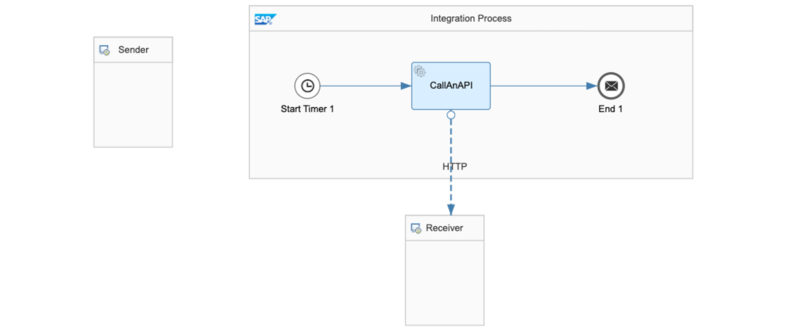
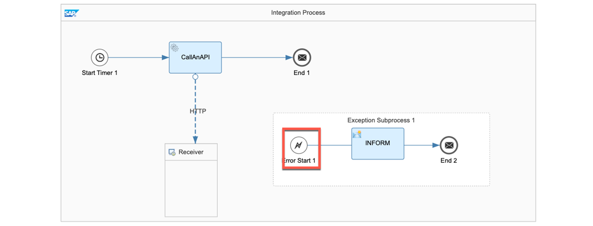
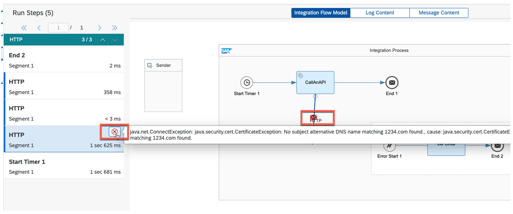
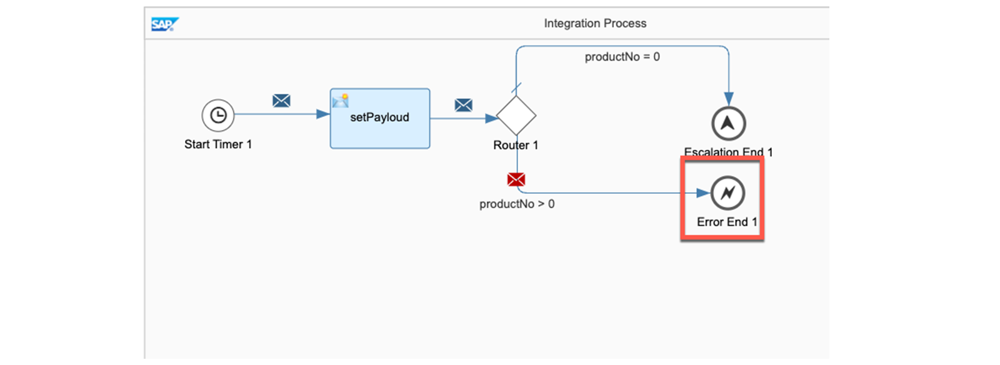
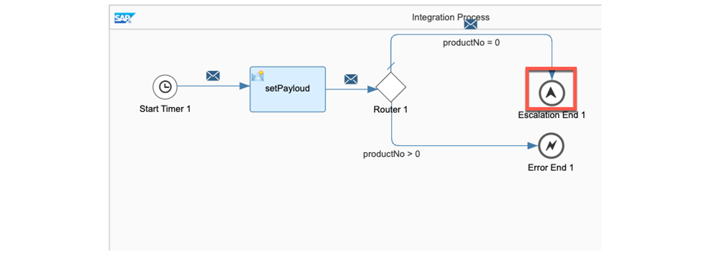

# ♠ 6 [PERFORMING EXCEPTION HANDLING](https://learning.sap.com/learning-journeys/developing-with-sap-integration-suite/using-adapters_f42fdb69-df78-4faf-bfd3-0a7b8c8beebd)

> :exclamation: Objectifs
>
> - [ ] Use outbound security for adapters

## EXCEPTION HANDLING

### WHAT IS AN EXCEPTION?

Il existe généralement deux types d’exceptions : attendues et inattendues. Les exceptions attendues peuvent inclure différentes valeurs dans un champ de message ou des valeurs vides, et peuvent être gérées via la conception du flux d'intégration. Les exceptions inattendues, en revanche, sont de nature technique, comme des échecs de connexion ou des erreurs dans les scripts, et peuvent conduire à l'arrêt du programme. Pour éviter cela, les erreurs inattendues doivent être interceptées et traitées de manière appropriée pour permettre au programme de continuer à s'exécuter.

L'accent est désormais mis sur les exceptions inattendues et leur traitement, et pour le reste de cette discussion, les termes « exceptions inattendues », « exceptions » et « erreurs » seront utilisés de manière interchangeable.

### DEFINE ERROR CONFIGURATION FOR ONE INTEGRATION FLOW TO INFORM THE SENDER

Vous pouvez spécifier le mécanisme de gestion des erreurs pour gérer les échecs d'exécution lors du traitement des messages. L'objectif principal de cette approche est de communiquer les détails de l'erreur à l'expéditeur pour une meilleure prise de conscience. Pour y parvenir, vous pouvez activer l'indicateur Return Exception to Sender dans les paramètres du flux d'intégration.

### READ MORE HERE:

[Définir la configuration des erreurs](https://help.sap.com/docs/CLOUD_INTEGRATION/368c481cd6954bdfa5d0435479fd4eaf/77d004175cf846479edd4f88a42a0a6e.html)

### DEFINE AN EXCEPTION SUBPROCESS

Un sous-processus supplémentaire peut être défini dans un flux d'intégration, qui sera invoqué chaque fois qu'une erreur inattendue se produit.

### PROCEDURE

- Dans un flow modifiable, vous souhaiterez peut-être récupérer une exception pour garantir que le processus d'origine se termine sans aucune erreur.
- Placez un Exception Subprocess (sous-processus d'exception).
- Définissez votre error handler (gestionnaire d'erreurs).
- Enregistrez, déployez et exécutez votre flow d'intégration.

### SAMPLE

Votre flux d'intégration a rencontré une erreur car les paramètres de connexion ne sont pas fonctionnels.

L'erreur dans le moniteur de messages après le déploiement :

### USAGE OF AN EXCEPTION SUBPROCESS:

L'événement de départ est un événement de démarrage d'erreur. Ce composant récupère l'exception.

Le moniteur avec le sous-processus d'exception :

Vous pouvez afficher les informations détaillées sur l'erreur dans l'exécution du traitement des messages.

### ERROR HANDLER

Si l'erreur est détectée par un événement Error Start, tout traitement ultérieur peut être implémenté comme dans un processus normal. Les scripts, comme celui illustré dans Handle Exceptions, sont particulièrement courants.

### ERROR AND ESCALATION EVENTS

L'événement Error Start déclenche toujours le sous-processus d'exception, qui intercepte l'erreur et démarre son exécution. Si vous souhaitez terminer le sous-processus d'exception sans le statut Échec, vous devez définir un message de fin, comme indiqué dans l'exemple précédent.

### MANUAL GENERATION OF ERROR AND ESCALATION END EVENTS

La définition d'un événement de fin d'erreur à la fin d'un flux d'intégration le fera toujours passer à l'état d'échec, qui peut être utilisé comme élément de conception. L'événement Error End sert de point final au processus principal et, en cas d'erreur, le sous-processus d'exception l'intercepte toujours.

Exécuter vers un événement de fin d'erreur :

Si vous obtenez le statut `Failed`, le processus a fonctionné correctement.

L'événement Escalation End génère une erreur sans interrompre le processus principal.

Exécuter vers un événement de fin d'escalade :

Si vous obtenez le statut `Escalated`, le processus a fonctionné correctement.

### SUMMARY

Un sous-processus d'erreur spécial peut intercepter une erreur inattendue à l'aide d'un événement de démarrage d'exception. Après interception, différentes étapes de traitement peuvent être mises en œuvre. Par exemple, il convient de stocker des valeurs de processus ou le contenu d'un message suite à une erreur. En outre, il est également possible de configurer l'information de l'expéditeur de l'erreur.

## CREATE AN EXCEPTION PROCESS

[Exercices](https://learning.sap.com/learning-journeys/developing-with-sap-integration-suite/performing-exception-handling_c545ebe7-bcf0-4865-8750-df2c51775a4d)
