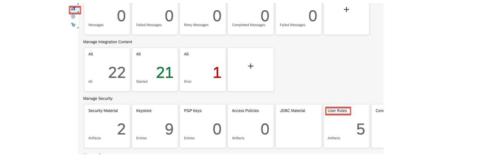
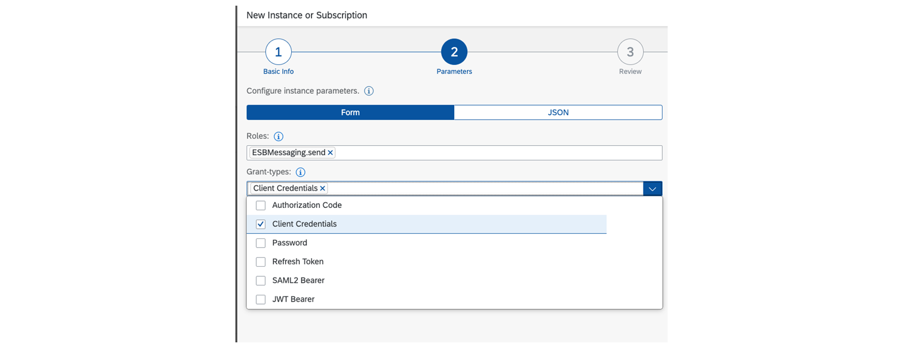
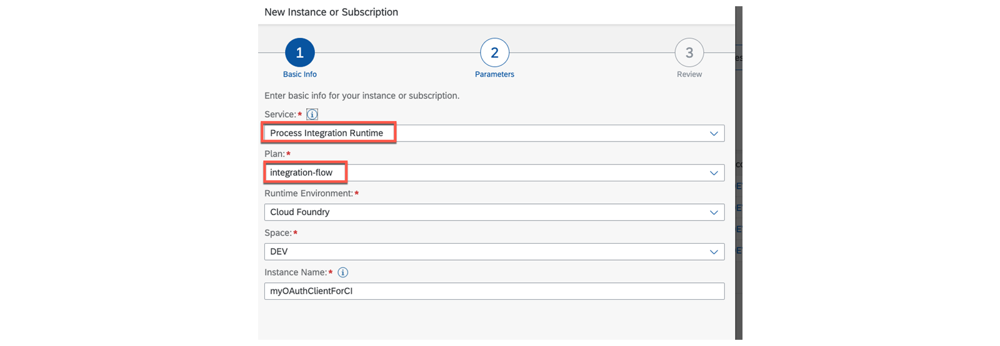
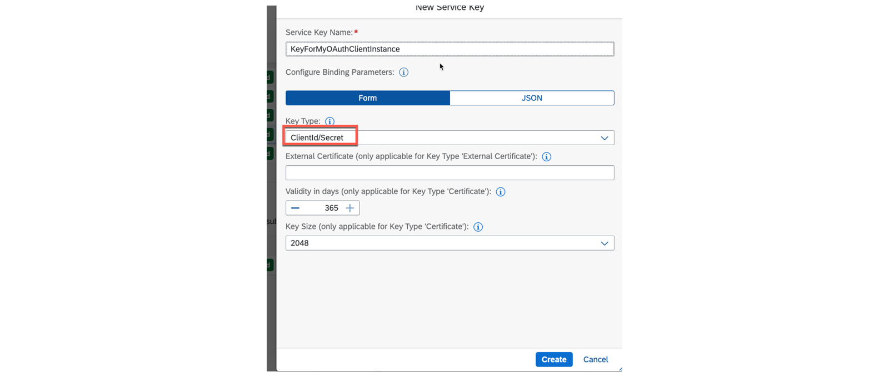
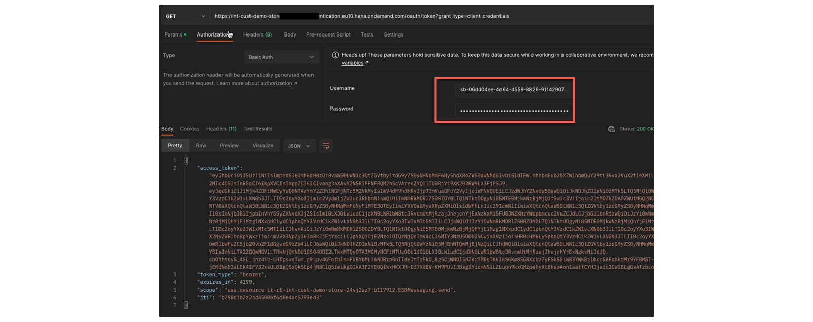
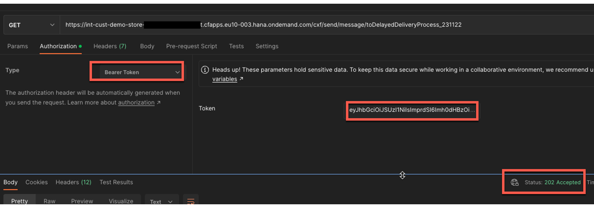

# ♠ 8 [USING ADAPTER INBOUND SECURITY](https://learning.sap.com/learning-journeys/developing-with-sap-integration-suite/using-adapter-inbound-security_cae0d690-8bda-4fc5-a45f-7b24b2134d26)

> :exclamation: Objectifs
>
> - [ ] Use and set up an inbound security adapter

## INBOUND SECURITY ADAPTER

### INBOUND SECURITY FOR ADAPTERS

Deux cas doivent être distingués : l'établissement d'une connexion sécurisée au répartiteur de charge et l'authentification auprès du locataire Cloud Integration où le flux d'intégration est implémenté. Pour établir une connexion sécurisée, une procédure Transport Layer Security (TLS) est utilisée sur les connexions basées sur TCP (Transport Control Protocol) et des certificats sont utilisés. Cette procédure est utilisée dans HTTPS, IMAPS, POP3S, SMTPS, FTPS et d'autres protocoles. Dans les exercices de cette formation, nous utilisons l'adaptateur SOAP.

Nous souhaitons explorer les options disponibles pour garantir que seuls les expéditeurs autorisés peuvent envoyer des messages à notre flux d'intégration. Cette rubrique est appelée sécurité entrante.

Les certificats requis pour établir une connexion HTTPS entre l'expéditeur et l'équilibreur de charge sont nécessaires.

L'autorisation de l'expéditeur est validée par rapport au point de terminaison du flux d'intégration.

### ESTABLISHING OF THE HTTPS CONNECTION

Rappelez-vous la présentation technique abordée dans une leçon précédente, qui montre un équilibreur de charge entre l'expéditeur et l'URL du point de terminaison de notre flux d'intégration déployé. De ce fait, il est nécessaire d’établir la connexion SSL entre l’expéditeur et l’équilibreur de charge.

La responsabilité de l'importation de tous les certificats requis incombe à SAP, car nous n'avons pas accès à l'équilibreur de charge dans Cloud Integration.

### AUTHORIZATION OF THE SENDER AGAINST THE ENDPOINT OF THE INTEGRATION FLOW

Deux options sont également disponibles ici :

- L'authentification peut être effectuée directement auprès du locataire distant où les flux d'intégration sont déployés.

- Utilisation d'un client d'authentification (OAuth) sur votre propre locataire.

### AUTHENTICATION CAN BE PERFORMED DIRECTLY AGAINST THE REMOTE TENANT WHERE THE INTEGRATION FLOWS ARE DEPLOYED

Il s’agit du scénario le plus courant lors du développement, mais il n’est pas recommandé pour une utilisation en production. Cette option est marquée en rouge comme n°1 dans l’image précédente.

### PROCEDURE

- Créez votre adaptateur d’expéditeur de flux d’intégration et choisissez Rôle d’utilisateur comme autorisation.
- Dans Rôle utilisateur, choisissez les rôles d'utilisateur disponibles.
- Le rôle utilisateur par défaut est ESBMessaging.send.
- Attribuez le rôle utilisateur ESBMessaging.send à une collection de rôles.
- Attribuez votre collection de rôles à un utilisateur de votre sous-compte.
- Appelez le point de terminaison avec un utilisateur affecté à votre collection de rôles avec le rôle ESBMessaging.send inclus.

> :pushpin: Note:
>
> It is not recommended to use client certificates for authorization. This approach requires importing a client certificate directly into the configuration.

Collection de rôles, `A_sendMessagesToCI` avec le rôle MessagingSend attribué à deux utilisateurs.

> :pushpin: Note:
>
> The role MessagingSend in the context of this situation is equivalent to the role ESBMessaging.send in the Cloud Integration.

Vous recevez un appel réussi vers le point de terminaison en utilisant l'un des utilisateurs attribués.

### SET YOUR OWN USER ROLE AT CLOUD INTEGRATION

Vous pouvez utiliser vos propres rôles d'utilisateur. Pour définir votre propre rôle d'utilisateur, accédez à Surveiller les artefacts → Intégrations → Gérer la sécurité → Rôles d'utilisateur et définissez votre propre rôle.

Définissez votre propre rôle d'utilisateur, par exemple Peter1 :

Ensuite, comme décrit précédemment, vous pouvez configurer votre propre rôle d'utilisateur :

- Créez une collection de rôles.

- Attribuez votre propre rôle d'utilisateur à votre propre collection de rôles.

- Attribuez la collection de rôles à un utilisateur.

### USAGE OF AN AUTHENTICATION (OAUTH) CLIENT ON YOUR OWN TENANT

La méthode d'appel direct d'un flux d'intégration via l'approche basée sur les rôles présentée utilise des utilisateurs personnalisés et une authentification de base, qui ne sont pas adaptées à des fins productives. Pour de meilleures méthodes d'authentification, nous devons utiliser un client OAuth2.0 auto-configuré qui peut être créé sur notre propre sous-compte.

Pour ce faire, nous devons configurer une instance Process Integration Runtime sur notre sous-compte et l'associer au plan de flux d'intégration. Cette instance peut ensuite être personnalisée avec diverses informations d'identification client. Ceux-ci correspondent aux n°1 et n°2, marqués en bleu sur la photo précédente.

Vous pouvez choisir les grands types suivants :

- Authorization Code

- Client Credentials

- Password

- Refresh Token

- SAML2 Bearer

- JWT Bearer

Sélection de types généraux lors de la configuration de l’instance locale du Runtime d’intégration de processus.

### PROCEDURE

- Create a local Process integration Runtime instance.

- Configure the appropriate grand-type.

- Create a key.

- Use the key parameters for authorization.

The new Process Integration Runtime instance of plan integration-flow.

### SAMPLE - LOG ON WITH CLIENTID AND CLIENTSECRET

Utiliser le clientId du user et le clientSecret en tant que mot de passe.

### SAMPLE - LOG ON WITH BEARER TOKEN

Utiliser le tokenUrl avec le clientIS en tant que username, et le clientsecret en tant que mot de passe au niveau du Bearer token.

Utiliser le Bearer token pour l'authentication.

### SAMPLE - LOG WITH OAUTH 2.0 AUTHENTICATION

Vous pouvez utiliser OAuth 2.0 pour l'authentification, ce qui implique deux étapes : premièrement, générer un jeton, et deuxièmement, utiliser ce jeton pour l'autorisation.

### RESOURCES

- [Client Credentials](https://help.sap.com/docs/CLOUD_INTEGRATION/368c481cd6954bdfa5d0435479fd4eaf/19af5e205fe14af6a4f8a9fd80d4dc92.html?locale=en-US&q=Instance%20parameter)

- [Configuration Checklist for Inbound Authentication](https://help.sap.com/docs/CLOUD_INTEGRATION/368c481cd6954bdfa5d0435479fd4eaf/4a428fdc9498429b84e8000b9d240d47.html?locale=en-US)

### SUMMARY

La communication sécurisée implique deux étapes : l'établissement d'une connexion sécurisée à l'équilibreur de charge et l'authentification auprès du locataire Cloud Integration où le flux d'intégration est implémenté. Ceci est réalisé en utilisant des certificats dans les connexions basées sur TCP (Transport Control Protocol) via la procédure TSL (Transport Layer Security). Ces protocoles incluent HTTPS, IMAPS, POP3S, SMTPS, FTPS et autres. De nombreux protocoles tels que SOAP, OData, HTTP, utilisent également ces protocoles de communication sécurisés.

L'authentification au point final du flux d'intégration peut être réalisée de deux manières : attribution directe d'un rôle d'utilisateur à un utilisateur ou utilisation d'un client OAuth 2.0 local offrant des options d'authentification supplémentaires, telles que ClientId/Clientsecret, Bearer token ou OAuth. 2.0. Ces méthodes ne sont pas personnalisées et sont plus sécurisées que la première option.

## CREATE AN INBOUND SOAP ADAPTER

[Exercices](https://learning.sap.com/learning-journeys/developing-with-sap-integration-suite/using-adapter-inbound-security_cae0d690-8bda-4fc5-a45f-7b24b2134d26)
