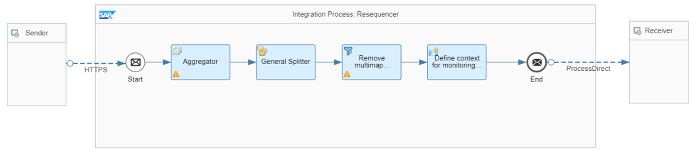
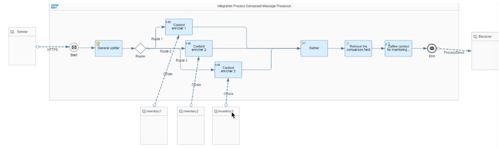
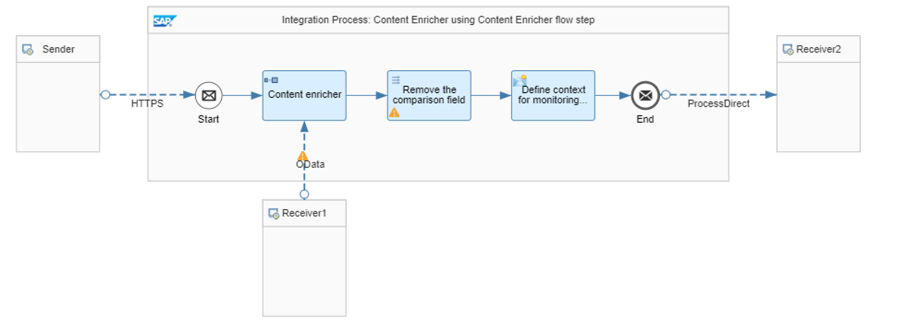
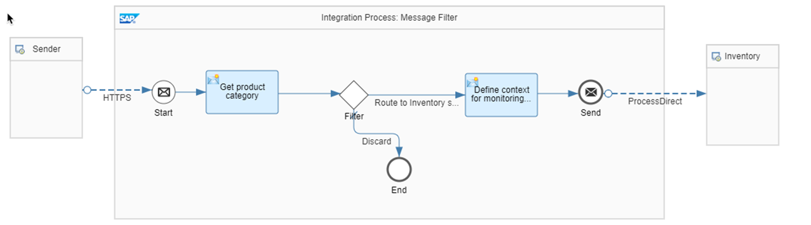
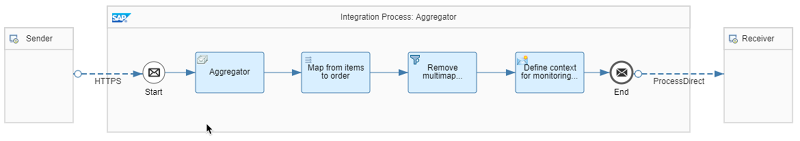

# ♠ 9 - [USING INTEGRATION PATTERNS](https://learning.sap.com/learning-journeys/developing-with-sap-integration-suite/using-adapter-inbound-security_cae0d690-8bda-4fc5-a45f-7b24b2134d26)

> Objectifs
>
> - Use integration patterns

## INTEGRATION PATTERNS

### SHOW INTEGRATION PATTERNS

- [Aggregator](https://help.sap.com/docs/CLOUD_INTEGRATION/368c481cd6954bdfa5d0435479fd4eaf/5f5e01bfa534465eab55c8751f72a5bc.html?locale=en-US)

- [Composed Message Processor](https://help.sap.com/docs/CLOUD_INTEGRATION/368c481cd6954bdfa5d0435479fd4eaf/353a11956dbc43d8a6146330e16680e4.html?locale=en-US)

- [Content-Based Routing](https://help.sap.com/docs/CLOUD_INTEGRATION/368c481cd6954bdfa5d0435479fd4eaf/90f35f3d4fa740a28c49ab2b85940609.html?locale=en-US)

- [Content Enricher](https://help.sap.com/docs/CLOUD_INTEGRATION/368c481cd6954bdfa5d0435479fd4eaf/0e7ba7fc4d4b4f47ab84ad6ce0d1a8ec.html?locale=en-US)

- [Content Filter](https://help.sap.com/docs/CLOUD_INTEGRATION/368c481cd6954bdfa5d0435479fd4eaf/6fd4a865c9f3456ea452e6b3da4715f6.html?locale=en-US)

- [Message Filter](https://help.sap.com/docs/CLOUD_INTEGRATION/368c481cd6954bdfa5d0435479fd4eaf/bd523460894744a8be6b7bbe3351f795.html?locale=en-US)

- [Recipient List](https://help.sap.com/docs/CLOUD_INTEGRATION/368c481cd6954bdfa5d0435479fd4eaf/06594b982e86462ab371993fb66c3a37.html?locale=en-US)

- [Resequencer](https://help.sap.com/docs/CLOUD_INTEGRATION/368c481cd6954bdfa5d0435479fd4eaf/068cfc7cdaf54d71a51726dff203da5b.html?locale=en-US)

- [Scatter-Gather](https://help.sap.com/docs/CLOUD_INTEGRATION/368c481cd6954bdfa5d0435479fd4eaf/987eef23b2544f79b500b4e6e3bb4616.html?locale=en-US)

- [Splitter](https://help.sap.com/docs/CLOUD_INTEGRATION/368c481cd6954bdfa5d0435479fd4eaf/4b475eaac3de4ef1a9f434fd13cbb709.html?locale=en-US)

- [Quality of Service Exactly Once](https://help.sap.com/docs/CLOUD_INTEGRATION/368c481cd6954bdfa5d0435479fd4eaf/f96cf276c37d424f9a5b3e63778cf0ae.html?locale=en-US)

### THE INTEGRATION PATTERNS IN DETAIL:

- AGGREGATOR

  Pour traiter les messages individuels associés en masse, vous pouvez utiliser un modèle d'agrégateur. Ce modèle implique la collecte et le stockage de messages individuels jusqu'à ce qu'un ensemble complet de messages associés soit reçu. Le message agrégé est ensuite envoyé au destinataire prévu.

  

- COMPOSED MESSAGE PROCESSOR

  Le modèle Composed Message Processor est utile lorsque vous devez traiter un message contenant plusieurs éléments, chacun nécessitant un traitement différent. Le modèle implique de diviser le message en sous-messages, d'acheminer chaque sous-message vers une destination différente, puis de réagréger les réponses en un seul message.

  

- CONTENT-BASED ROUTING

  En supposant que vous disposez d'un processus de commande dans lequel le système d'inventaire qui traite la commande dépend de l'adresse de livraison, vous pouvez utiliser le routage basé sur le contenu pour diriger le message vers le destinataire approprié en fonction de son contenu. Dans cet exercice, nous utilisons un routeur basé sur le contenu.

  Lire la suite ici :

  - [Variant: Send to Default Receiver](https://help.sap.com/docs/CLOUD_INTEGRATION/368c481cd6954bdfa5d0435479fd4eaf/7ba1864526814e72adef9c96f79d319f.html?locale=en-US)

  - [Variant: Ignore](https://help.sap.com/docs/CLOUD_INTEGRATION/368c481cd6954bdfa5d0435479fd4eaf/4998bd8aaed349c188a170e8d4eb7b63.html?locale=en-US)

  - [Variant: Raise an Error](https://help.sap.com/docs/CLOUD_INTEGRATION/368c481cd6954bdfa5d0435479fd4eaf/b1148e9eeb724c9aafa6ca25bc3c03f4.html?locale=en-US)

- CONTENT ENRICHER

  Supposons que vous deviez envoyer une commande à un fournisseur, mais que vous ne disposiez pas de toutes les informations requises pour que le système récepteur puisse la traiter. Par exemple, les articles du produit n'ont qu'un code de catégorie et le nom de la catégorie principale est manquant. Dans ce cas, vous pouvez utiliser un modèle Content Enricher qui lit les données de manière synchrone à partir d'un système externe et ajoute les informations manquantes au message d'origine avant de le transmettre au destinataire.

  

- CONTENT FILTER

  Supposons que vous receviez une commande d'un partenaire dans un format standardisé avec de nombreux champs, mais que votre système backend n'en a besoin que d'une petite fraction. Vous disposez de deux options pour mettre en œuvre ce scénario :

  - Utilisation d’une étape Filtre.
  - Utilisation du mappage de messages.

  Lire la suite ici :

  - [Variant: Content Filter Step](https://help.sap.com/docs/CLOUD_INTEGRATION/368c481cd6954bdfa5d0435479fd4eaf/239d8f86f2e64a3c998b4c2d8ede52ce.html?locale=en-US)

  - [Variant: Message Mapping](https://help.sap.com/docs/CLOUD_INTEGRATION/368c481cd6954bdfa5d0435479fd4eaf/85571e200d514723a9e4b552db2ccf7a.html?locale=en-US)

- MESSAGE FILTER

  Vous pouvez implémenter le modèle de filtre de messages pour supprimer les données indésirables d'un canal. Par exemple, si vous devez envoyer des informations sur les produits à un système d'inventaire, mais que le système d'inventaire ne gère qu'une gamme spécifique de produits en fonction de la catégorie de produits, vous pouvez appliquer un filtre de messages pour supprimer toutes les données non pertinentes. Le filtre de messages est un sous-type du modèle Message Router, avec un seul canal de réception. Il évalue les messages entrants et les achemine vers le canal récepteur uniquement s'ils répondent aux critères spécifiés ; sinon, ils sont rejetés.

  

- RECIPIENT LIST

  Supposons que vous souhaitiez trouver le meilleur devis pour une commande en l’envoyant à plusieurs fournisseurs, mais que tous les fournisseurs ne soient pas pertinents pour chaque produit de la commande. Dans ce cas, les fournisseurs qui doivent recevoir la commande sont déterminés dynamiquement en fonction des produits spécifiques commandés. Pour y parvenir, vous pouvez utiliser le modèle Dynamic Router, qui envoie une copie du message à plusieurs destinataires en fonction de critères déterminés dynamiquement. Contrairement au routeur basé sur le contenu, qui transmet le message original à un seul récepteur, le routeur dynamique envoie une copie du message à plusieurs récepteurs.

  Lire la suite ici :

  - [Variant: Static Routing](https://help.sap.com/docs/CLOUD_INTEGRATION/368c481cd6954bdfa5d0435479fd4eaf/b71529f0cf714cc4abda84bf607277b5.html?locale=en-US)

  - [Variant: Dynamic Routing](https://help.sap.com/docs/CLOUD_INTEGRATION/368c481cd6954bdfa5d0435479fd4eaf/d241c776e0e84368b4e37546377c5ec6.html?locale=en-US)

  - [Variant: Dynamic Routing Using JMS Message Queues](https://help.sap.com/docs/CLOUD_INTEGRATION/368c481cd6954bdfa5d0435479fd4eaf/27c247e016184cee97581fbaa53359f7.html?locale=en-US)

- RESEQUENCER

  Si vous devez réorganiser les messages reçus par Cloud Integration dans un ordre incorrect, vous pouvez utiliser le modèle Agrégateur. Ce modèle vous permet de rassembler des messages individuels en lots triés par numéro de séquence. Pour transformer les lots de messages en messages séparés, vous pouvez utiliser le modèle Splitter et envoyer les messages individuels au destinataire prévu.

  

- SCATTER-GATHER

  Le modèle Scatter-Gather vous permet d'envoyer un message à plusieurs destinataires et de collecter leurs réponses. En diffusant un message à plusieurs destinataires, le modèle permet un traitement parallèle du message par tous les destinataires. Après avoir reçu les réponses, le modèle les réagrège en un seul message.

  

- SPLITTER

  Le modèle Splitter peut être utilisé lorsqu'un message contient plusieurs éléments nécessitant un traitement différent. Le modèle peut diviser le message en messages individuels en fonction du nombre d'éléments. Cependant, dans l’exercice donné, le modèle Splitter n’est pas utilisé.

  Une distinction est faite entre les cas d'utilisation suivants :

  - Diviser un message de commande groupée en plusieurs commandes.
  - Fractionner une seule commande avec plusieurs articles.

  Lire la suite ici :

  - [Variant with Iterating Splitter](https://help.sap.com/docs/CLOUD_INTEGRATION/368c481cd6954bdfa5d0435479fd4eaf/24f9f29ad45849af978c17de4789842a.html?locale=en-US)

  - [Variant with General Splitter](https://help.sap.com/docs/CLOUD_INTEGRATION/368c481cd6954bdfa5d0435479fd4eaf/cba1ecb0f88a4a3c862c3cadd0403f6e.html?locale=en-US)

  - [Variant with Message Mapping](https://help.sap.com/docs/CLOUD_INTEGRATION/368c481cd6954bdfa5d0435479fd4eaf/f6bb2b7d6860418bbe4c0c40e5cacecd.html?locale=en-US)

### QUALITY OF SERVICE EXACTLY ONCE

Vous voulez garantir qu'un message est remis et traité par le destinataire une seule fois. Cette exigence peut être satisfaite en combinant les deux modèles d'intégration d'entreprise suivants :

- Guaranteed Delivery

Le modèle de livraison garantie garantit qu'un message sera finalement remis à un destinataire, même en cas de pannes temporaires dans le système de messagerie. Cependant, en raison de la possibilité de redistributions, ce modèle peut entraîner la transmission d'un message plusieurs fois.

- Idempotent Receiver

Le modèle de suppression des messages en double résout le problème de la gestion des messages en double et garantit que si un composant reçoit le même message plusieurs fois, il ne le traite qu'une seule fois.

En savoir plus ici : [Qualité de service exactement une fois](https://help.sap.com/docs/CLOUD_INTEGRATION/368c481cd6954bdfa5d0435479fd4eaf/f96cf276c37d424f9a5b3e63778cf0ae.html?locale=en-US)

### SUMMARY

Cette leçon décrit divers modèles d'intégration, notamment l'agrégateur, le processeur de messages composés, le routage basé sur le contenu, l'enrichisseur de contenu, le filtre de contenu, le filtre de messages, la liste de destinataires, le reséquenceur, le regroupement dispersé, le séparateur et la qualité de service exactement une fois.

## INSTALL EXAMPLE INTEGRATION FLOWS

[Exercices](https://learning.sap.com/learning-journeys/developing-with-sap-integration-suite/using-integration-patterns_fdd8f683-da3d-4abe-a29d-a6f6fd06cc14)
