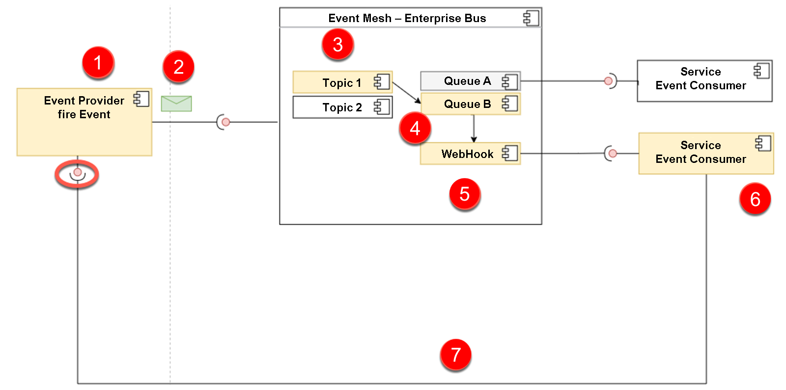

# ♠ 5 [DESCRIBING OPERATING MODES OF API ARCHITECTURES](https://learning.sap.com/learning-journeys/developing-with-sap-integration-suite/describing-operating-modes-of-api-architectures_b47895bf-cd5c-45f0-8bef-11384e978629)

> :exclamation: Objectifs
>
> - [ ] Describe operating modes of API architectures

## :closed_book: OPERATING MODES OF API ARCHITECTURES

### WHAT IS A REQUEST-DRIVEN ARCHITECTURE ?

> #### :bookmark: [Request-Driven Architecture](../☼%20UNIT%200%20-%20Lexicon/♠%20Request-Driven%20Architecture.md)
>
> Un [Request-Driven Architecture](../☼%20UNIT%200%20-%20Lexicon/♠%20Request-Driven%20Architecture.md) est basée sur une communication directe entre un `service provider` et un `service consumer`. Cette communication est `synchrone`.

#### :small_red_triangle_down: Sample Request :

Un exemple de requête `SOAP` peut ressembler à ceci :

#### :small_red_triangle_down: Sample Response :

Un exemple de réponse `SOAP` peut ressembler à ce qui suit :

### EVENT-DRIVEN ARCHITECTURE

#### :small_red_triangle_down: What are Events ?

D'un point de vue technique, un `Event` est un petit message qui fournit des informations sur un `Event` commercial. Un `Event` peut être, par exemple, la création d'une commande dans un système SAP S/4HANA. L'`Event` est déclenché via `push` (de manière asynchrone) vers un `broker`[^1].

Un `Event` peut ressembler à ceci :

### EVENT PRODUCER AT SAP

SAP propose le module complémentaire `Event Enablement` dans ECC et SAP S/4HANA (Cloud et On-Premise) pour vous aider.

#### :small_red_triangle_down: What is an Event-Driven Architecture ?

> #### :bookmark: [Event-Driven architecture (EDA)](../☼%20UNIT%200%20-%20Lexicon/♠%20``Event``-Driven%20Architecture.md)
>
> Event-driven architecture (EDA) ou architecture basée sur les `Events` est un `software design pattern` (modèle de conception logicielle) dans lequel des `decoupled applications` peuvent `publish` et `subscribe` de manière `asynchrone` à des `events` via un `event broker`[^1].

> #### :bookmark: [Event Broker]()
>
> Un `event broker`[^1] est un middleware moderne orienté message, par exemple Service Mesh chez SAP.

Pour en savoir plus, cliquez ici : [Qu'est-ce que l'EDA (Event-Driven Architecture)](https://aws.amazon.com/what-is/eda/) ?

### PULL VARIANT

L'`event provider` (fournisseur d'`Events`) (n° 1) déclenche un `Event` (n° 2) avec une désignation appelée `Topic` (n° 3). Un `Topic` peut être, par exemple, BusinessPartner_Changed. Il s'agit d'une communication `asynchrone`.

Le `Topic` est abonné via une file d'attente (subscribe to `topic`). Dans ce cas, depuis la file d'attente A (n°4). Le message peut désormais être activement récupéré par l'`event consumer` (n° 5). À cet effet, `Event Mesh` fournit une [API](../☼%20UNIT%200%20-%20Lexicon/♠%20API.md). La communication provient de l'`event consumer`, déclenchée par un `pull on the queue`. Il s'agit d'une communication `synchrone`.

### PUSH VARIANT

L'`event provider` (n° 1) déclenche un `Event` (n° 2) avec une désignation appelée `Topic` (n° 3). Un `Topic` peut être, par exemple, BusinessPartner_Changed. Il s'agit d'une communication `asynchrone`. Le `Topic` est abonné via une file d'attente (subscribe to `topic`). Dans ce cas, depuis la file d'attente B (n°4). Un `webhook` est désormais attribué à cette file d'attente. (N°5). Si un `Event` avec un `Topic` arrive dans la file d'attente correspondante, le `webhook` est appelé et l'`Event` est envoyé directement a l'`event consumer` (n°6) via `push`. La communication provient de l'`Event Mesh`, déclenchée par un `Event entrant`. Il s'agit également d'une communication `asynchrone`.

### `WEBHOOK`S

> #### :bookmark: [Webhook]()
>
> Un `webhook` est un rappel HTTP : un HTTP POST qui se produit lorsqu'un `changement d'état` est effectué, c'est-à-dire une notification d'`Event` via HTTP POST. Les `webhooks` sont utilisés pour les notifications en temps réel, afin que votre système puisse être mis à jour directement au moment de l'`Event`. En principe, un `webhook` est une simple `URL` que vous pouvez également appeler régulièrement dans le navigateur. Dans le cadre de SAP Service Mesh, l'`URL` du `webhook` est utilisée lors du `subscribing` (de l'abonnement). Cela permet au service de savoir où envoyer le message avec le `topic to a queue`.

En combinaison avec l'`Event Mesh`, une `URL` de `webhook` est incluse dans l'abonnement d'un `Topic` à une file d'attente.

### COMBINATION OF REQUEST-DRIVEN AND `EVENT`-BASED ARCHITECTURE

En réalité, les demandes et `Events` classiques se combinent.

Les numéros 1 à 6 fonctionnent comme décrit dans une section précédente, mais ce qui est nouveau, c'est que l'`event consumer` (n° 7) soumet une demande à l'`event provider` (n° 1). Par exemple, pour lire les données du produit qui ont été modifiées. L'`event consumer` peut ensuite traiter l'ensemble de données.

### SUMMARY

> Il existe deux types d’exploitation de l’[approche API First](../☼%20UNIT%200%20-%20Lexicon/♠%20API%20First%20Approach.md).
>
> Le `request-driven` est basé sur une `communication synchrone` des partenaires impliqués.
>
> L'`event-driven`, fonctionne de manière `asynchrone` et `découple` l'émetteur (`transmitter`) du récepteur (`receiver`) en termes de temps et de contenu. Cet `loose coupling` (accouplement libre) offre de nombreux avantages. Les deux types sont souvent utilisés l’un après l’autre.

---

[^1]: un broker est une composante clé qui joue le rôle d'intermédiaire dans le traitement, le routage et la distribution des événements entre les différents provider et consumer. Il s'agit généralement d'une infrastructure de messagerie qui facilite la communication asynchrone et découple les parties d'un système pour améliorer sa modularité, sa résilience et sa scalabilité.
