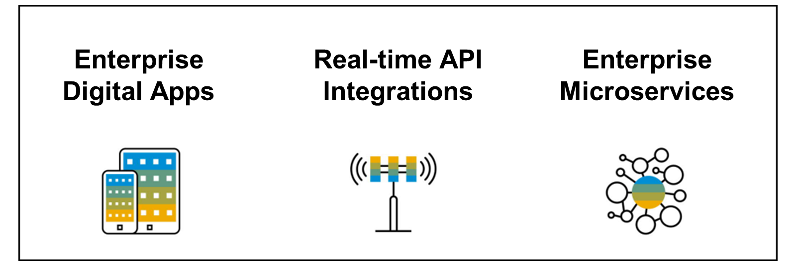

# ♠ 1 [INTRODUCTION SAP API MANAGEMENT](https://learning.sap.com/learning-journeys/developing-with-sap-integration-suite/introducing-sap-api-management_dd668e10-08ab-4763-9342-3e6cc7e74c18)

> :exclamation: Objectifs
>
> - [ ] Describe the key features of `SAP API Management`

## WHAT IS `SAP API MANAGEMENT`?

`SAP API Management` est une solution qui cartographie l'ensemble du cycle de vie d'une [API](../☼%20UNIT%200%20-%20Lexicon/♠%20API.md).

Il offre notamment les fonctionnalités suivantes :

#### :small_red_triangle_down: Building APIs :

L'`API portal` est une application qui fournit une plate-forme commune permettant aux `API designers` de définir et de publier des [API](../☼%20UNIT%200%20-%20Lexicon/♠%20API.md). Chaque `API Management customer` dispose de sa propre application de `API portal` dans le `cloud`. L'`API portal` offre des fonctionnalités pour configurer des systèmes, créer et publier des [API](../☼%20UNIT%200%20-%20Lexicon/♠%20API.md), analyser et tester des [API](../☼%20UNIT%200%20-%20Lexicon/♠%20API.md).

#### :small_red_triangle_down: Publishing APIs :

Un `Product` est un ensemble d'[API](../☼%20UNIT%200%20-%20Lexicon/♠%20API.md). Il contient des `metadata` spécifiques à votre entreprise à des fins de monitoring ou d'analyse.

Par exemple, toutes les [API](../☼%20UNIT%200%20-%20Lexicon/♠%20API.md) liées au [CRM]() peuvent être regroupées en un seul produit [CRM](). Au lieu de publier les [API](../☼%20UNIT%200%20-%20Lexicon/♠%20API.md) individuellement, il est plus facile de regrouper les [API](../☼%20UNIT%200%20-%20Lexicon/♠%20API.md) associées en tant que `Product` et de les publier. Après avoir inclus les [API](../☼%20UNIT%200%20-%20Lexicon/♠%20API.md) requises dans un `Product`, le `Product` est publié dans le `Catalog`, où le `Product` est disponible pour les développeurs d'applications.

#### :small_red_triangle_down: Analyzing APIs :

`API Management` fournit des fonctionnalités d’analyse complètes pour comprendre les différents modèles de consommation des [API](../☼%20UNIT%200%20-%20Lexicon/♠%20API.md). Le serveur `API Analytics` utilise les données d'exécution des `API` pour analyser les informations. Les données d'exécution sont collectées, analysées et affichées sous forme de graphiques, d'en-têtes et `key performance indicators` (KPI).

#### :small_red_triangle_down: Consuming APIs :

`API Business Hub Enterprise` est une application qui fournit une `plate-forme commune` permettant aux développeurs d'applications d'utiliser des [API](../☼%20UNIT%200%20-%20Lexicon/♠%20API.md). Chaque `API Management customer` dispose de sa propre application `API Business Hub Enterprise` dans le `cloud`. L'`API Business Hub Enterprise` offre des fonctionnalités permettant d'intégrer des développeurs d'applications, d'explorer et de tester des [API](../☼%20UNIT%200%20-%20Lexicon/♠%20API.md), de créer et de s'abonner à des applications.

#### :small_red_triangle_down: Monetizing APIs :

`SAP API Management` fournit une fonctionnalité de monétisation à tous les `API providers` (fournisseurs d'API) pour générer des revenus sur l'utilisation des [API](../☼%20UNIT%200%20-%20Lexicon/♠%20API.md). En tant qu'`API admin`, vous pouvez créer un `rate plan` (plan tarifaire), attacher un `rate plan` (plan tarifaire) à un produit dans l'`API Portal` et publier le `Product` dans l'`API Business Hub Enterprise`.

Vous pouvez également afficher les détails de la bill (facture) de chaque développeur dans l'`API Portal`. En tant que développeur d'applications, dans l'`API Business Hub Enterprise`, vous pouvez créer une application et ajouter des `Product` à l'application. En fonction de l'utilisation du `Product`, vous pouvez afficher les détails de la bill correspondante.

#### :small_red_triangle_down: Discover API Packages :

Dans `Gestion des API`, vous pouvez découvrir les `API Management platform supported API packages` (packages API pris en charge par la plateforme de gestion des API) disponibles dans `SAP Business Accelerator Hub` sur l'`API Portal`.

#### :small_red_triangle_down: API Designer :

Modélisez les [API](../☼%20UNIT%200%20-%20Lexicon/♠%20API.md) à l’aide ds l'`API designer` (concepteur d’API). L'`API designer` est basé sur la `norme OpenAPI Spécification` (OAS), qui est un `projet collaboratif open source`. L'`API designer` vous permet de créer et de modifier des [API](../☼%20UNIT%200%20-%20Lexicon/♠%20API.md) de manière transparente, et d'afficher la documentation correspondante dans un seul cadre de fenêtre. Il possède de riches fonctionnalités intégrées, qui ne peuvent se limiter à la `conversion d'API` d'un format à un autre (par exemple, de `RAML` en `YAML`, `JSON` en `YAML` et vice versa), à générer des `stubs` de serveur et de client, à télécharger des spécifications d'[API](../☼%20UNIT%200%20-%20Lexicon/♠%20API.md), etc. . L'O`penAPI Specification` (OAS) , créée par le concepteur d'[API](../☼%20UNIT%200%20-%20Lexicon/♠%20API.md), peut être publiée en tant qu'[API](../☼%20UNIT%200%20-%20Lexicon/♠%20API.md) sur `SAP Business Accelerator Hub`.

## TYPICAL USE CASES

#### :small_red_triangle_down: Enterprise Digital Apps :

Créez des applications numériques d'entreprise pour les employés (Field Sales/Services/Support), les customers et les partners.

#### :small_red_triangle_down: Real-time API Integrations :

Partagez les données d'entreprise depuis les data lakes (lacs de données) et des business systems avec les suppliers, les partners et les customers. Exposez les transactions et les processus de l'entreprise sous forme d'[API](../☼%20UNIT%200%20-%20Lexicon/♠%20API.md) pour les fournisseurs et les clients.

#### :small_red_triangle_down: Enterprise Microservices :

Créez et gérez des `API-first microservices` axés sur l'[API](../☼%20UNIT%200%20-%20Lexicon/♠%20API.md). Activez le `DevOps` des `microservices`.

### USER ROLES

Pour tous les travaux ultérieurs dans `SAP API Management`, vous avez besoin de la collection de rôles `APIPortal.Administrator`. Un aperçu du total des rôles disponibles peut être trouvé dans le deuxième lien sous Ressources.

### RESOURCES

Les ressources suivantes sont disponibles sur le portail d'aide SAP :

- [Page de présentation Gestion des API SAP](https://help.sap.com/docs/SAP_``CLOUD``_PLATFORM_API_MANAGEMENT?version=``Cloud``&locale=en-US)

- [Attribution des rôles d'utilisateur](https://help.sap.com/docs/SAP_``CLOUD``_PLATFORM_API_MANAGEMENT/66d066d903c2473f81ec33acfe2ccdb4/911ca5a620e94ab581fa159d76b3b108.html?locale=en-US)

### SUMMARY

> Avec la gestion des [API](../☼%20UNIT%200%20-%20Lexicon/♠%20API.md), l’intégralité du cycle de vie d’une [API](../☼%20UNIT%200%20-%20Lexicon/♠%20API.md) peut être mapped. Cela commence par la création, la publication et la maintenance sur toute la durée. Dans une `architecture API first`, la gestion des API est l’élément central et est utilisée dans chaque cas d’utilisation spécifique d’un client.
