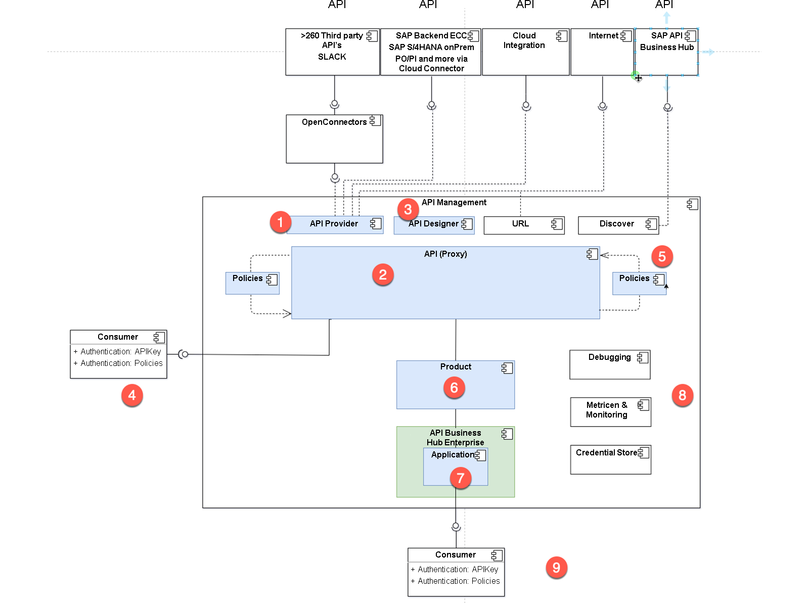

# ♠ 2 [DESCRIBING THE TECHNOLOGIE IN AN OVERVIEW](https://learning.sap.com/learning-journeys/developing-with-sap-integration-suite/describing-the-technology-in-an-overview_b9547c58-091c-48d6-bb97-27835c35731d)

> :exclamation: Objectifs
>
> - [ ] Gain an overview of the SAP API Management components

## COMPONENTS OF SAP API MANAGEMENT

### COMPONENTS OF SAP API MANAGEMENT

**SAP API Management** comprend les **composants** suivants. Dans la figure suivante, vous trouverez le _diagramme des composants_ (que nous utiliserons également dans les exercices ultérieurs).

Les composants importants sont numérotés. Dans la liste suivante, vous trouverez un premier aperçu :

- N°1 : **API Provider** – Résume de nombreuses sources différentes

- N°2 : **API** - La nouvelle API avec URL (N°4)

- N°3 : **API Designer** – Une définition openAPI

- N°4 : **The new API URL** – Fait office de proxy

- N°5 : **Policies** - Modifier le message de demande et de réponse

- N°6 : **Product** – Mise en place d'une API

- N°7 : **Application** basée sur un produit

- N°8 : **Services supplémentaires** tels que le _monitoring_, les _tests_, etc.

- N°9 : **Entrée** dans **API Business HUB Enterprise**

Nous examinerons de plus près les différents composants dans les leçons suivantes.

### RESOURCES

Les ressources suivantes sont disponibles sur le portail d'aide SAP :

- [Composants de la gestion des API](https://help.sap.com/docs/SAP_CLOUD_PLATFORM_API_MANAGEMENT/66d066d903c2473f81ec33acfe2ccdb4/24f1af0b2f6041d49d0d65b5defb4eb8.html?locale=en-US)

- [Portail d'aide SAP](https://help.sap.com/docs/SAP_CLOUD_PLATFORM_API_MANAGEMENT/66d066d903c2473f81ec33acfe2ccdb4/0aef7634df25497896abf18faac8a1ce.html?locale=en-US)

### SUMMARY

> **SAP API Management** se compose de divers **composants** qui offrent différentes fonctionnalités. Les plus importants sont le **fournisseur d'API**, l'**API**, le **product** et l'**API Business Hub Enterprise**.
