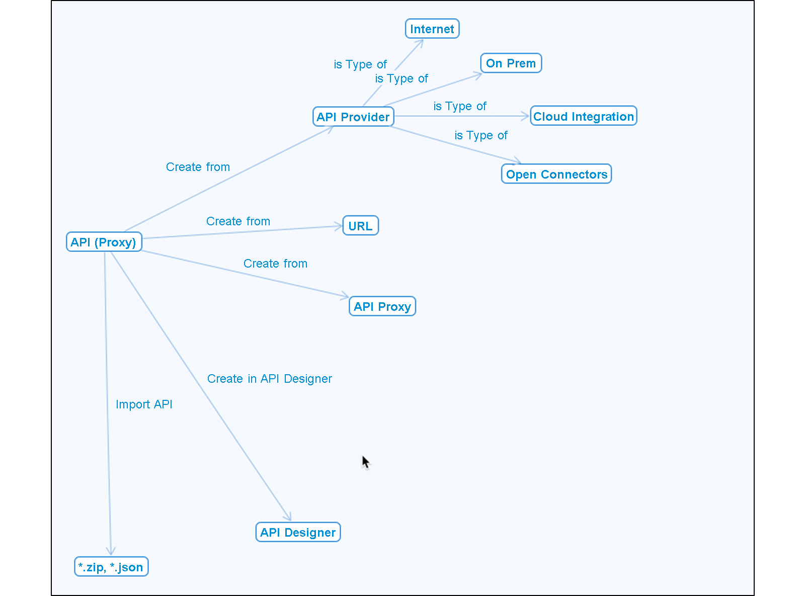
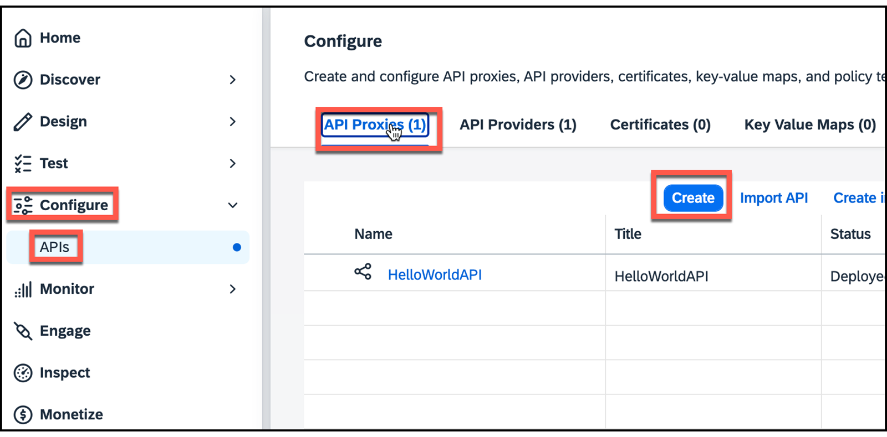
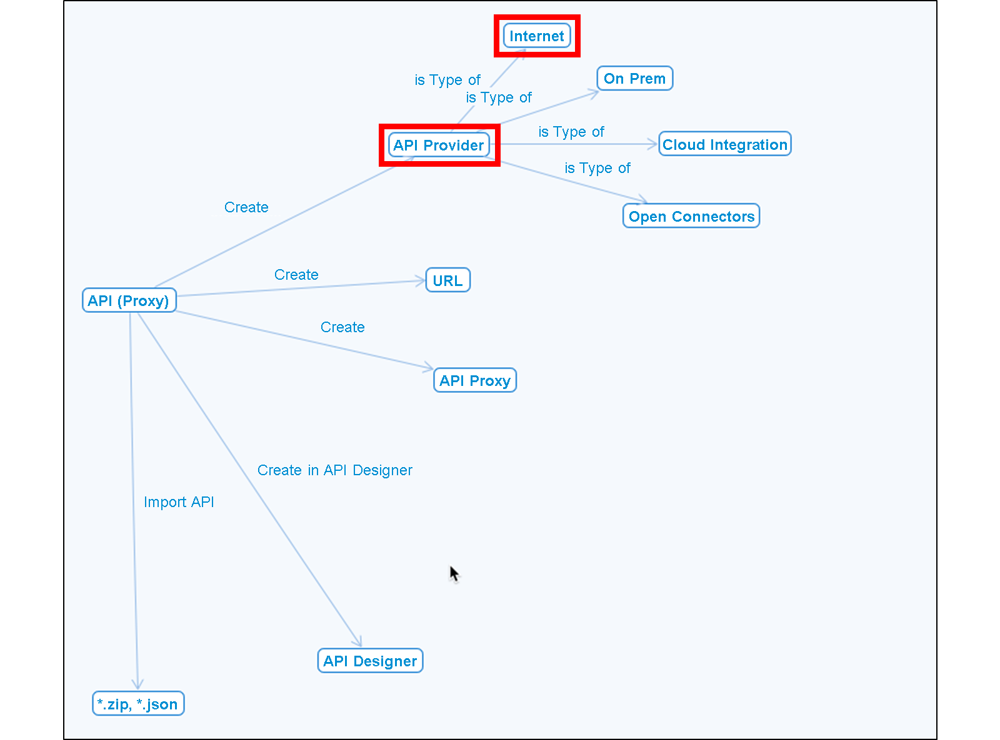
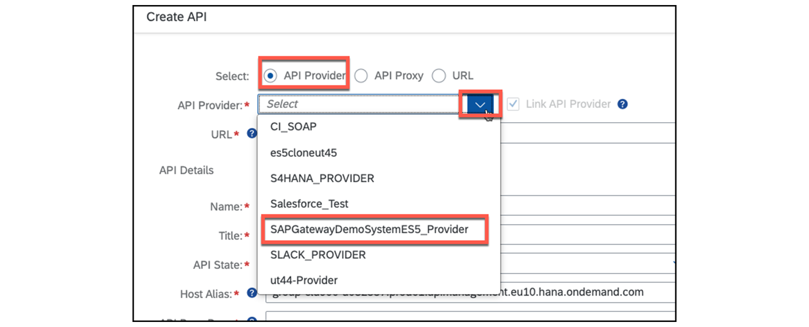
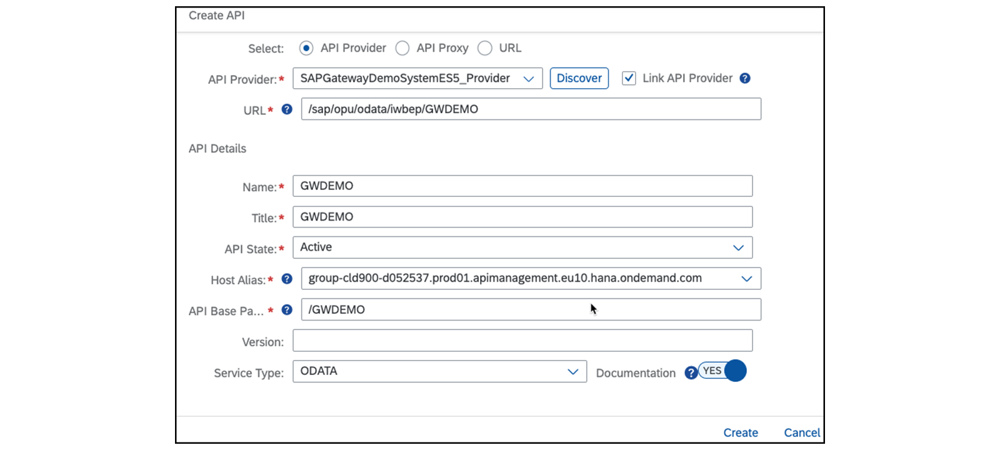
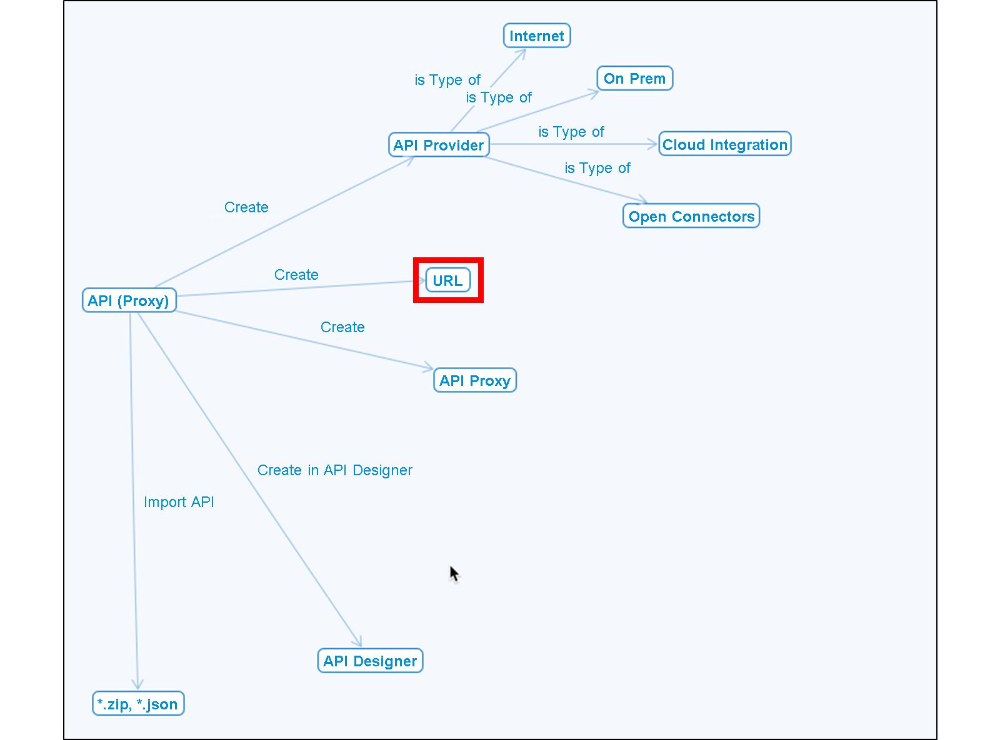
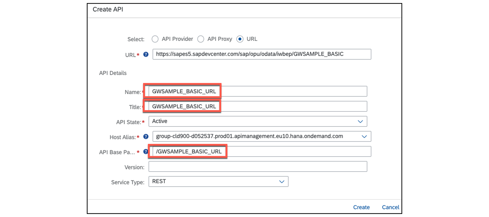
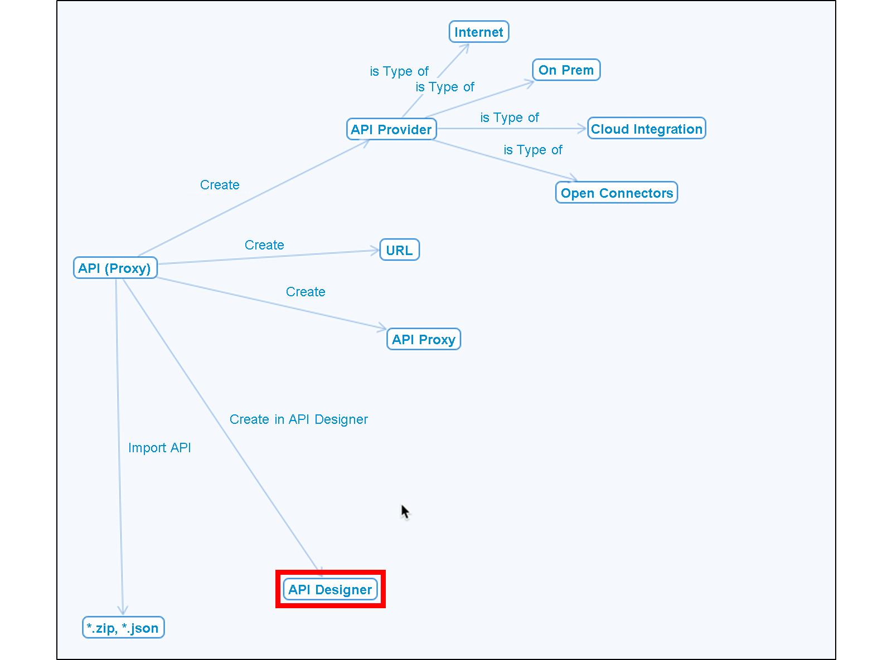
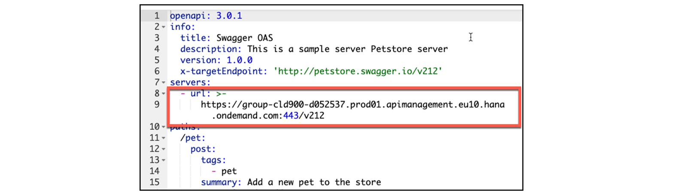
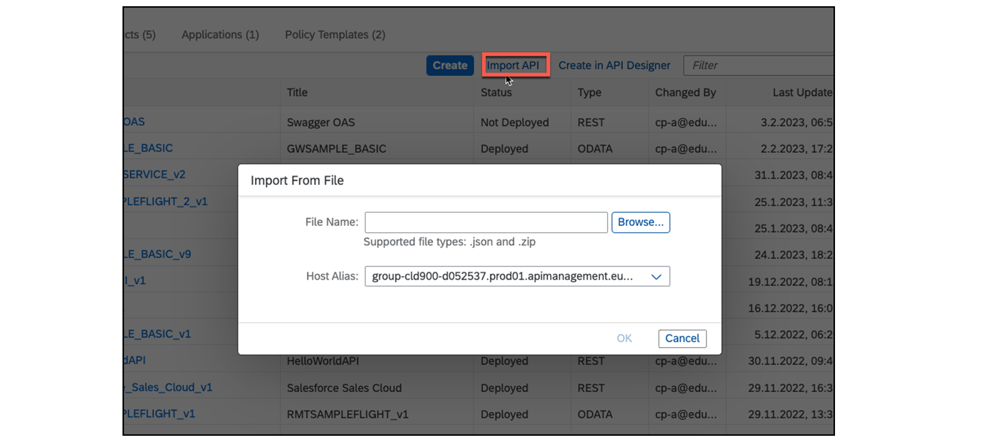

# ♠ 4 [CREATING AN [API](../☼%20UNIT%200%20-%20Lexicon/♠%20API.md) PROXY](<https://learning.sap.com/learning-journeys/developing-with-sap-integration-suite/creating-an-[api](../☼%20UNIT%200%20-%20Lexicon/♠%20API.md)_b3973a9a-62ce-4a5e-b59a-c0ddf6924de5>)

> :exclamation: Objectifs
>
> - [ ] Create an [API](../☼%20UNIT%200%20-%20Lexicon/♠%20API.md) based on the [API provider](../☼%20UNIT%200%20-%20Lexicon/♠%20API%20Provider.md)

## WHAT ARE THE POSSIBILITIES TO CREATE AN [API](../☼%20UNIT%200%20-%20Lexicon/♠%20API.md)?

L'[API](../☼%20UNIT%200%20-%20Lexicon/♠%20API.md) qui sera créée est importante pour les implémentations ultérieures. Il agit comme un proxy[^1] de l'[API](../☼%20UNIT%200%20-%20Lexicon/♠%20API.md) de ressource réelle. Le nom précédent était API Proxy. Ce nom apparaît souvent dans les documents plus anciens.

Les options suivantes sont disponibles :

#### :small_red_triangle_down: **Create an API using the [Create] button with the following options** :

- [API provider](../☼%20UNIT%200%20-%20Lexicon/♠%20API%20Provider.md) (n°1 au diagramme conceptuel)

- **URL** (n° 2 sur le diagramme conceptuel)

- [API Proxy](../☼%20UNIT%200%20-%20Lexicon/♠%20API%20Proxy.md)

#### :small_red_triangle_down: **Create an API using menu links with the following options** :

- _Créer_ dans [API Designer](../☼%20UNIT%200%20-%20Lexicon/♠%20API%20Designer.md) (n° 3 sur le diagramme conceptuel)

- Importer une _external API_

  

  

### CREATE AN [API](../☼%20UNIT%200%20-%20Lexicon/♠%20API.md) USING THE CREATE BUTTON

C'est probablement le cas le plus courant. Avec cette option, vous pouvez créer une [API](../☼%20UNIT%200%20-%20Lexicon/♠%20API.md) avec un [API provider](../☼%20UNIT%200%20-%20Lexicon/♠%20API%20Provider.md), une **URL** fournie ou une [API](../☼%20UNIT%200%20-%20Lexicon/♠%20API.md) existante.

### PROCEDURE

- Commencez par [Design] → [APIs] pour ouvrir le _Develop screen_.

- Démarrez le _wizard_ en choisissant le bouton [Create] . Une nouvelle fenêtre s'ouvre.

  

  Utiliser les **API Provider option**.

  

  Sélectionnez le **API Provider radio button** et ouvrez la **selected box**. Tous les [API provider](../☼%20UNIT%200%20-%20Lexicon/♠%20API%20Provider.md) s'affichent. Choisissez-en un, par exemple **SAPGatewayDemoSystemES5_Provider**.

  

  Lorsque le [API provider](../☼%20UNIT%200%20-%20Lexicon/♠%20API%20Provider.md) est choisi, une nouvelle **list box** portant le nom [Discover] est disponible. Certaines données, comme l'[hôte] et le [type of API], ont déjà été renseignées.

  Lorsque la **list box** est sélectionnée, tous les services disponibles répertoriés dans le **catalog service** sont affichés.

  Ce qui est exactement affiché ici dépend du type d'[API provider](../☼%20UNIT%200%20-%20Lexicon/♠%20API%20Provider.md). Dans le cas d'**Open Connectors**, par exemple, toutes les **instances** sont affichées. Pour le type **Intégration Cloud**, les **Intégration flows disponibles** sont affichés.

  La figure suivante montre une liste des services disponibles, utilisables à partir du système backend SAP. L'[API provider](../☼%20UNIT%200%20-%20Lexicon/♠%20API%20Provider.md) est défini en choisissant un service parmi les services du **catalogue** fourni.

  

  Vous pouvez choisir exactement l’un des services proposés. Après cela, d'autres données sont ajoutées au **masque**.

  

  Lorsque vous avez terminé de créer cette [API Proxy](../☼%20UNIT%200%20-%20Lexicon/♠%20API%20Proxy.md), elle doit être **déployée** pour pouvoir être utilisée. Après cela, l'[API Proxy](../☼%20UNIT%200%20-%20Lexicon/♠%20API%20Proxy.md) est prête à être **testée**. Le **service type** est automatiquement défini. Dans ce cas, il s'agit d'**OData**.

### USE THE URL OPTION TO CREATE AN [API](../☼%20UNIT%200%20-%20Lexicon/♠%20API.md)

Dans le cas où vous n'utilisez pas d'[API provider](../☼%20UNIT%200%20-%20Lexicon/♠%20API%20Provider.md), vous pouvez directement spécifier l'**URL** de votre source.

Dans ce cas, vous devez saisir les données manuellement (**marked**). Le **service type** ne peut être que **REST** ou **SOAP**.

Après **saving** et **deploying** l’[API](../☼%20UNIT%200%20-%20Lexicon/♠%20API.md), elle peut également être **testée**.

### USE THE [API](../☼%20UNIT%200%20-%20Lexicon/♠%20API.md) PROXY OPTION TO CREATE AN [API](../☼%20UNIT%200%20-%20Lexicon/♠%20API.md)

Dans ce cas, vous pouvez copier l'[API](../☼%20UNIT%200%20-%20Lexicon/♠%20API.md) existante.

Dans ce cas, vous devez saisir les données manuellement (**marked**). Le **service type** ne peut être que **REST** ou **SOAP**, même si la **spied API**[^2] est de type **OData**.

### CREATE AN [API](../☼%20UNIT%200%20-%20Lexicon/♠%20API.md) USING MENU LINKS

### USE THE CREATE IN [API](../☼%20UNIT%200%20-%20Lexicon/♠%20API.md) DESIGNER OPTION

Commencez à créer une [API](../☼%20UNIT%200%20-%20Lexicon/♠%20API.md) en choisissant le menu link [Create in API Designer].

Passez à l'**openAPI editor**. Vous pouvez y créer manuellement votre [API](../☼%20UNIT%200%20-%20Lexicon/♠%20API.md) via le **langage openAPI en YAML**. Dans ce cas, toutes les **entrées** doivent être créées **manuellement**. L'**URL** du serveur est **automatiquement ajustée** après l'enregistrement. Le **service type** ne peut être que **REST**.

### BEFORE SAVING

### AFTER SAVING

> :pushpin: Note:
>
> Be aware that the shown URL is a sample and will not work !

### IMPORT AN EXTERNAL [API](../☼%20UNIT%200%20-%20Lexicon/♠%20API.md)

Démarrez la création d’une [API](../☼%20UNIT%200%20-%20Lexicon/♠%20API.md) en choisissant le menu link [Import API]

Le **Service Type** correspond à celui de l'**Import API**.

### RESOURCE

Portail d'aide : [Créer un proxy [API](../☼%20UNIT%200%20-%20Lexicon/♠%20API.md)](./RESSOURCES/https://help.sap.com/docs/SAP_INTEGRATION_SUITE/51ab953548be4459bfe8539ecaeee98d/4ac0431ddc80469ca31dcd938edc9076.html)

### SUMMARY

> Il existe plusieurs façons de créer une [API](../☼%20UNIT%200%20-%20Lexicon/♠%20API.md). Des [API](../☼%20UNIT%200%20-%20Lexicon/♠%20API.md) peuvent être créées :
>
> - En utilisant le bouton [Create].
>
> - Basé sur un [API provider](../☼%20UNIT%200%20-%20Lexicon/♠%20API%20Provider.md) existant.
>
> - Directement via une **URL** fournie.
>
> Enfin, vous pouvez également le définir avec une spécification **openAPI** via le bouton [Create] dans **API Designer**.

## CREATE AN [API](../☼%20UNIT%200%20-%20Lexicon/♠%20API.md) BASED ON A PREDEFINED [API](../☼%20UNIT%200%20-%20Lexicon/♠%20API.md) PROVIDER

[Exercices](<https://learning.sap.com/learning-journeys/developing-with-sap-integration-suite/creating-an-[api](../☼%20UNIT%200%20-%20Lexicon/♠%20API.md)_b3973a9a-62ce-4a5e-b59a-c0ddf6924de5>)

---

[^1]: Un proxy est un intermédiaire qui agit comme un relais entre un client (comme un navigateur web) et un serveur, dans le but de gérer, contrôler ou modifier les requêtes et les réponses échangées entre ces deux parties. Le proxy peut être utilisé pour diverses raisons, telles que la sécurité, la performance, ou la gestion du trafic.
[^2]: API observée ou API capturée dans le cadre d'une intégration ou d'un processus de découverte d'API. Cela signifie qu'une API, qui pourrait être d'un type comme OData, a été capturée ou "espionnée" pour être intégrée dans un système, comme SAP CPI.
