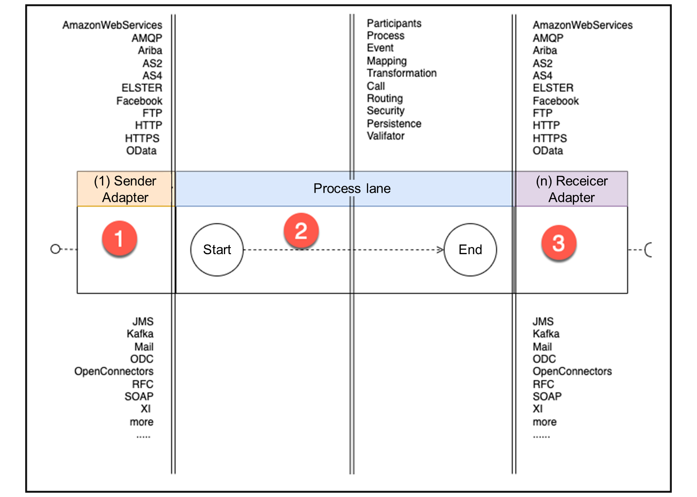
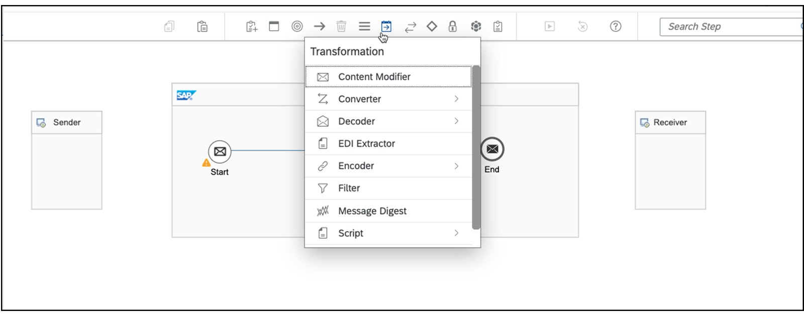

# ♠ 1 [INTRODUCTION CLOUD CONNECTOR](https://learning.sap.com/learning-journeys/developing-with-sap-integration-suite/introducing-cloud-integration_b3692797-cbf6-44ac-9b05-20b77411fa96)

> :exclamation: Objectifs
>
> - [ ] Describe the complete Integration Flow process which we will implement in the next exercises

## INTRODUCTION TO CLOUD CONNECTOR

### WHAT IS SAP CLOUD INTEGRATION?

Les affirmations suivantes tentent de répondre à la question :

- Il s'agit de l'une des fonctionnalités `core` de `SAP Integration Suite`.

- Il est basé sur le `framework open source Camel` de l'`Apache Software Foundation`.

- `SAP Cloud Integration` prend en charge l'intégration des processus de bout en bout via l'échange de messages

- Le `développement`, le `déploiement` et le `monitoring` s'effectuent dans le navigateur avec des outils graphiques

- C'est l'un des outils `Low Code/No Code`

### KEY FEATURES

Un `integration flow` possède un `0-1 sender adapter` (adaptateur d’expéditeur 0-1). Le message est transmis via un `endpoint` (point de terminaison) si un `adaptateur` est configuré. Différents `sender adapters` (adaptateurs d'expéditeur) sont disponibles du côté `sender side` (de l'expéditeur). (N°1) Après réception du message, le processus est lancé via un événement de démarrage Start. Viennent ensuite des `predefined processing steps` (étapes de traitement prédéfinies). (N° 2) Il existe un large éventail de `capacités d'intégration` qui définissent différentes manières de traiter les `messages` sur la `plate-forme d'intégration`. En fin de compte, les `receiver adapters` (adaptateurs récepteurs) peuvent être configurés pour compléter le `processus métier`. Le traitement des messages peut être effectué de manière `synchrone` ou `asynchrone`. Grâce à ce concept, de nombreux modèles d'intégration d'entreprise bien connus peuvent être `mapped`.

#### :small_red_triangle_down: Connectivity :

Les `sender and receiver adapters` (adaptateurs émetteur et récepteur) sont différents. Vous pouvez créer votre propre adaptateur. Pour ce faire, vous pouvez utiliser le `Software Development Kit` fourni.

Pour déterminer quels `adaptateurs` sont disponibles en fonction de votre licence, vous pouvez afficher les `adaptateurs` après avoir créé un modèle de projet vide, comme décrit dans l'exercice suivant. Effectuez les étapes suivantes :

1. Commencez avec un modèle de projet vide modifiable :

   

2. Tracez une ligne entre le `channel` et l'événement `Start`. Les `adaptateurs` disponibles sont affichés :

   

3. Procédez de la même manière du côté `recipient's side` (du destinataire) :

   

#### :small_red_triangle_down: Integration Capabilities :

Toutes les capacités d'intégration sont `catégorisées`. Parmi eux figurent les étapes de traitement prédéfinies. Un `integration flow` combine désormais les capacités individuelles pour, par exemple,` map a technical process`. Il n'y a presque aucune limite aux possibilités de combinaison. Pour examiner toutes les fonctionnalités d'intégration disponibles avec les étapes individuelles affectées, vous pouvez à nouveau démarrer avec le modèle de processus vide. Vous trouverez la `tool palette` en haut de votre écran. Chaque icône décrit une fonctionnalité dans le `cloud integration user interface`.

Dans le cas suivant, cela devient visible au niveau de la capacité de transformation.

#### :small_red_triangle_down: Predefined Integration Content :

Comme indiqué précédemment, l’art de combiner les capacités d’intégration de telle manière que cela devienne un processus professionnel. Les `integration flows` peuvent être complexes. SAP propose plus de 400 `integration flows` prédéfinis qui peuvent être consommés.

Il existe deux manières d'étudier le contenu d'intégration prédéfini. Un parcours directement via `Integration Suite` est présenté à la fin du cours. L'autre variante est décrite dans le paragraphe suivant.

### EXPLORE PREDEFINED INTEGRATION CONTENT IN SAP BUSINESS ACCELERATOR HUB

Tous les contenus d'intégration prédéfinis disponibles sont répertoriés dans `SAP Business Accelerator Hub`, en fonction des produits à intégrer.

#### :small_red_triangle_down: Procedure :

Les étapes suivantes doivent être effectuées dans l'ordre :

- Ouvrez le `SAP Business Accelerator Hub` sur : API.SAP.com

- Accédez à l'onglet `Discover Integrations`

- Choisissez le premier `product`

- Choisissez le deuxième `product` qui sera intégré au premier

- Trouvez tous les `predefined integration content` disponibles sous forme d'`integration package`, en fonction de votre sélection

- Naviguez plus profondément dans un `integration package` et trouvez tous les `integration flows` disponibles

- Naviguez plus profondément dans un `integration flow` pour découvrir la configuration complète

Plus de détails sur les étapes :

1. Découvrez l'onglet `Integrations` :

   

2. Choisissez le premier `product`, par exemple, SAP S/4HANA :

   

3. Choisissez le deuxième `product`, par exemple SAP SuccessFactors :

   

4. Accédez à un `integration package`, par exemple, SAP SuccessFactors Employee Central Integration with SAP ERP ou SAP S/4HANA, Employee Data :

   

5. Il n’existe qu’un seul `integration flow` disponible. Accédez à ce `integration flow` :

   

Vous trouverez ici toutes les informations pour comprendre ce `integration flow` :

- Les configurations de toutes les étapes

- Les documentations commerciales

- Et plus

Pour utiliser ce `integration package` ou `integration flow`, vous devez utiliser le menu `Discover` dans `Integration Suite`. Ceci est démontré par l’exemple des Exemples à la fin des exercices.

### SOURCES

En savoir plus:

#### :small_red_triangle_down: À propos des fonctionnalités clés :

- Un aperçu complet des modèles d'intégration d'entreprise peut être trouvé ici : https://www.enterpriseintegrationpatterns.com/

- [Accueil - Apache Camel](https://camel.apache.org/)

#### :small_red_triangle_down: À propos de la connectivité :

- Un aperçu complet des adaptateurs actuellement disponibles peut être trouvé ici : [Connectivité (adaptateurs)](https://help.sap.com/docs/CLOUD_INTEGRATION/368c481cd6954bdfa5d0435479fd4eaf/55325f2a722c4f67bb7752b369b09ff8.html?locale=en-US)

- Plus d'informations peuvent être trouvées ici : [Développement d'adaptateurs personnalisés](https://help.sap.com/docs/CLOUD_INTEGRATION/368c481cd6954bdfa5d0435479fd4eaf/7392cc44de7c4450a65b8cd8f1042420.html?locale=en-US)

#### :small_red_triangle_down: À propos des capacités d'intégration : l'aperçu complet peut être trouvé ici : [Capacités d'intégration](https://help.sap.com/docs/CLOUD_INTEGRATION/368c481cd6954bdfa5d0435479fd4eaf/e32cedef6e8c4af5816c446541c7f527.html?locale=en-US)

### SUMMARY

> Les `individual integration flows` sont compilés via des étapes fonctionnelles prédéfinies. Ils sont divisés en catégories telles que le `mappage`, le `routage` et autres, et fournis sous forme de `palette`. Le processus est démarré via exactement un message entrant. Le contenu de ce message peut ensuite être manipulé de diverses manières au cours du processus lui-même. La `connectivité` et la `flexibilité` proviennent de nombreux adaptateurs `émetteurs` et `récepteurs`. En plus de créer le `flux d'intégration individuel`, SAP propose plus de `400 flux d'intégration prédéfinis`, car ils sont souvent nécessaires dans l'environnement SAP.

## DESCRIBE THE IFLOW PROCESS CREATED IN THE NEXT EXERCICES

[Exercices](https://learning.sap.com/learning-journeys/developing-with-sap-integration-suite/introducing-cloud-integration_b3692797-cbf6-44ac-9b05-20b77411fa96)
