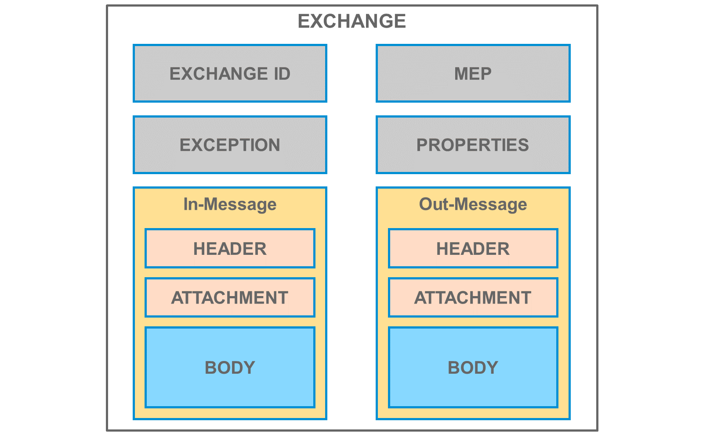
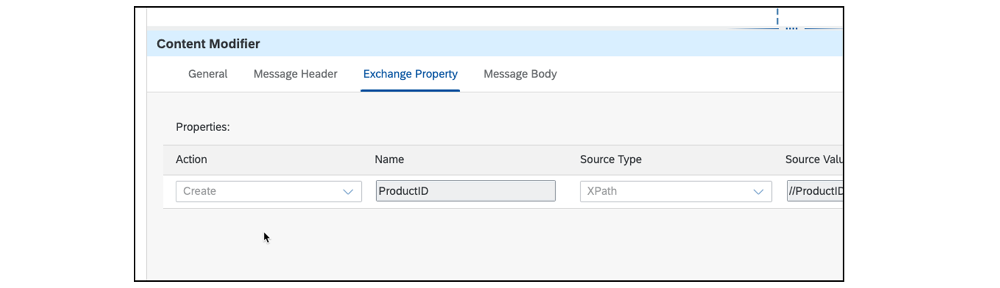

# ♠ 4 [EXPLAINING THE CAMEL DATA MODEL AND SIMPLE EXPRESSION LANGUAGE](https://learning.sap.com/learning-journeys/developing-with-sap-integration-suite/using-message-monitoring-and-logging_cbf56a9f-63f2-4fe2-af39-43cc48b490c8)

> :exclamation: Objectifs
>
> - [ ] Explain the Camel data model and simple expression language

## CAMEL DATA MODEL AND SIMPLE EXPRESSION LANGUAGE

### THE CAMEL DATA MODEL

Il s'agit d'un conteneur pour les éléments suivants :

- _Headers_

- _Properties_

- _Attachments_

- _Body_

- _Others_

#### :small_red_triangle_down: **Headers** :

Les **Header data** contiennent des **informations relatives au message**, telles que l'_adresse_ de l'_expéditeur_ du **message**, et sont **automatiquement incluses** dans tout **subsequent HTTP call** (HTTP call ultérieur).

#### :small_red_triangle_down: **Properties** :

Davantage de données peuvent être temporairement **stockées** pendant le message processing sous la forme de **context objects** (objets contextuels).

#### :small_red_triangle_down: **Attachment** :

Contient des **optional data** qui doivent être **jointes au message**.

#### :small_red_triangle_down: **Body** :

Le **payload** à transférer dans un message est contenue dans le **body**.

Pendant le _traitement du message_, un **Exchange container** est également disponible, qui peut **stocker** des **données supplémentaires** en plus du message. Ce conteneur est identifié de manière unique par un **ID Exchange** et peut contenir des **données temporaires** dans la **Properties areas** pendant le traitement des messages. Les données stockées dans l'**Exchange container** sont disponibles pendant toute la durée de l'échange du message et sont incluses dans le conteneur lors de l'appel de l'étape de traitement suivante.

### MANIPULATION OF THE EXCHANGE PARAMETERS

Les **Exchange parameters**, y compris le **payload**, sont automatiquement définis par les **incoming messages** (messages entrants). Cependant, ces **paramètres** peuvent également être **manipulés manuellement** par **lecture** et **écriture**. Différentes méthodes sont disponibles pour manipuler les **Exchange parameters** :

- _Use of the Content Modifier component_

- _Use the Groovy SDK_

- _Use the JavaScript SDK_

- _Use of UDF in Message Mapping_

- _Use of XSLT Mapping_

- _And even more_

### SET EXCAHNGE PARAMETERS WITH CONTENT MODIFIER COMPONENT

Le **Content Modifier element** (élément Content Modifier) offre un **moyen graphique** de manipuler les **paramètres Exchange**.

Vous pouvez manipuler :

- _Header_

- _Properties_

- _Body_

### SET EXCHANGE PARAMETERS WITH GROOVY SDK

La classe _com.sap.gateway.ip.core.customdev.util.Message_ propose des **méthodes** pour **manipuler les paramètres**.

La même chose s'applique à **JavaScript**.

### SIMPLE EXPRESSION LANGUAGE

Le **Simple Expression Language** est utilisé pour paramétrer les **Exchange Parameters**. Il propose également plusieurs **Build-In parameters** (paramètres intégrés), tels que les **timestamps**, les **error messages**, etc. Cela signifie que vous disposez uniquement d'un accès en **lecture**, par exemple, aux **Exchange Parameters**.

Le **schéma général** est l'**espace réservé** ${ } contenant une **variable intégrée** ou des **Exchange Parameters**. Dans l'**intégration cloud**, l'**espace réservé** ${ } peut être **inséré**, par exemple, dans le **payload** d'une étape de **Content Modifier**, ou appliqué dans le **Query Editor**, en ajoutant des **valeurs dynamiques** à un **OData resource path**.

L'**espace réservé** ${ } peut également être combiné avec des **opérateurs** pour produire des **expressions booléennes**, que vous pouvez ensuite utiliser comme **conditions** dans les **Routers**, les **Filters** et d'autres **integration flow components**.

### SAMPLES:

     ${property.MyNumericProperty} > 0
     ${property.MyStringProperty} contains ‚test‘
     property.ProductCoderegex‚[a−z]5\d3‘
     ${date:now:dd-MM-yyyy HH:mm}

### SPECIALS WITHIN DAILY BUSINESS

#### :small_red_triangle_down: **The Message Body** :

     ${in.body}

#### :small_red_triangle_down: **Properties** :

     ${property.}

#### :small_red_triangle_down: **Message Headers** :

     ${header.}

### THE SIMPLE EXPRESSION LANGUAGE CAN BE USED:

- In _Scripting_ with _Groovy_ or _JavaScript_.

- _Within_ some _integration flow components_ like _Router_, _Content Modifier_, and _Message Mapping_ as \_user defined function_s.

- In _XSLT Mappings_.

- In _some adapters_ for _querying_.

### RESOURCES

Lire la suite ici :

#### :small_red_triangle_down: **Lignes directrices pour modifier le contenu** :

[Lignes directrices pour la modification du contenu](https://help.sap.com/docs/CLOUD_INTEGRATION/368c481cd6954bdfa5d0435479fd4eaf/6a7c9a10886a4465a10481375837bb15.html?locale=en-US)

#### :small_red_triangle_down: **Paramètres d'échange avec le composant Modificateur de contenu** :

[Définir un modificateur de contenu](https://help.sap.com/docs/CLOUD_INTEGRATION/368c481cd6954bdfa5d0435479fd4eaf/8f04a707843a40bf9f6e07ed55b93034.html)

[SAP Integration Suite - Plongée en profondeur dans le modificateur de contenu | Blogues SAP](https://blogs.sap.com/2021/12/03/sap-integration-suite-deep-dive-into-content-modifier/)

#### :small_red_triangle_down: **Utilisation de Camels Simple dans les scripts CPI Groovy** :

[Utilisation de Camel's Simple dans les scripts CPI Groovy | Blogues SAP](https://blogs.sap.com/2018/04/05/using-camels-simple-in-cpi-groovy-scripts/)

#### :small_red_triangle_down: **Langage d'expression simple** :

[Langage d'expression simple](https://help.sap.com/docs/link-disclaimer?site=https%3A%2F%2Fcamel.apache.org%2Fcomponents%2Fnext%2Flanguages%2Fsimple-language.html)

[Utiliser le langage d'expression simple Camel](https://help.sap.com/docs/CLOUD_INTEGRATION/368c481cd6954bdfa5d0435479fd4eaf/4688083fad6546c1ba25a06d4ffb9fae.html?locale=en-US&q=Camel)

[Découvrez le langage d'expression simple de Camel dans SAP Cloud Integration | Blogues SAP](https://blogs.sap.com/2016/11/25/get-to-know-camels-simple-expression-language-in-hci/)

### SUMMARY

> Le **Camel Data Model** (modèle de données Camel) est utilisé pour **gérer** les **temporary data** pendant le **traitement** dans les **individual integration flow components**. Ce modèle de données **inclut** non seulement le **payload** (**body**), mais également les **propriétés** et les **header data**, qui sont **automatiquement incluses** dans un **HTTP call**.
>
> Le **Exchange container** est **transmis** du **prédécesseur** à l'étape de **traitement suivant** **à chaque étape de traitement**.
>
> Les **Exchange Parameters** sont **définis automatiquement**, par exemple lorsqu'un message est reçu, et manuellement via des composants tels que le **Content Modifier** ou le **Groovy SDK**, entre autres. Le **Camel Data Model** gère les données temporaires pendant le traitement, qui incluent le **payload** (**body**), les **propriétés** et les **header data**. Les **header data** sont **automatiquement incluses** dans un **HTTP call**.
>
> L'accès aux **Exchange Parameters** pour la **lecture** se fait via le **Simple Expression Language**, qui inclut non seulement des **built-in parameters** (paramètres intégrés), mais permet également de **modéliser** des expressions **regex** complexes.

### CREATE A CONTENT MODIFIER WITH SAMPLE DATA AS PAYLOAD (XML)

[Exercices](https://learning.sap.com/learning-journeys/developing-with-sap-integration-suite/explaining-the-camel-data-model-and-simple-expression-language_a5b1158e-da28-4dcf-818c-4273126903e7)
