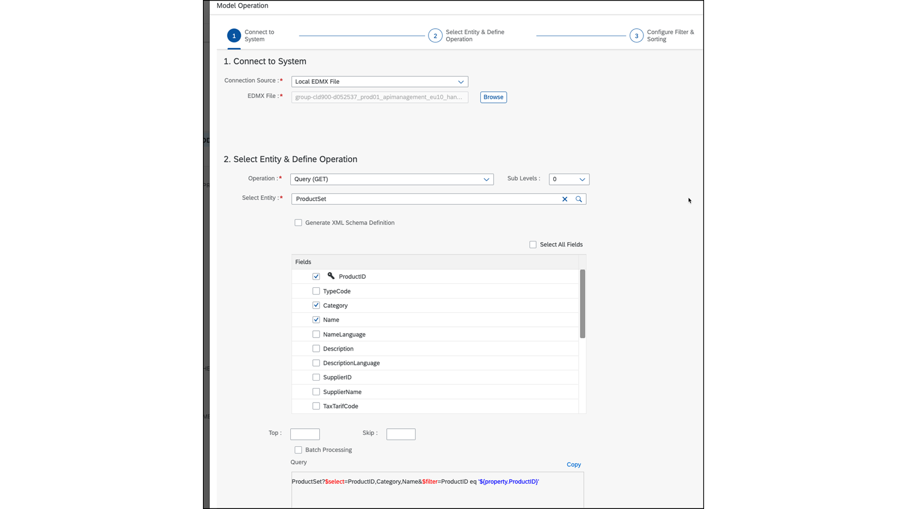
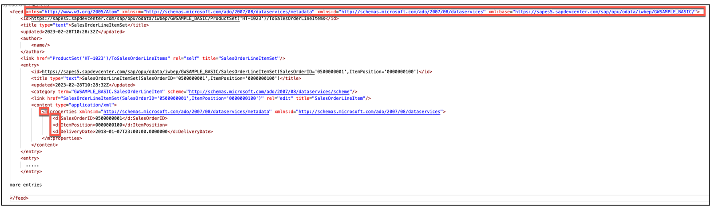
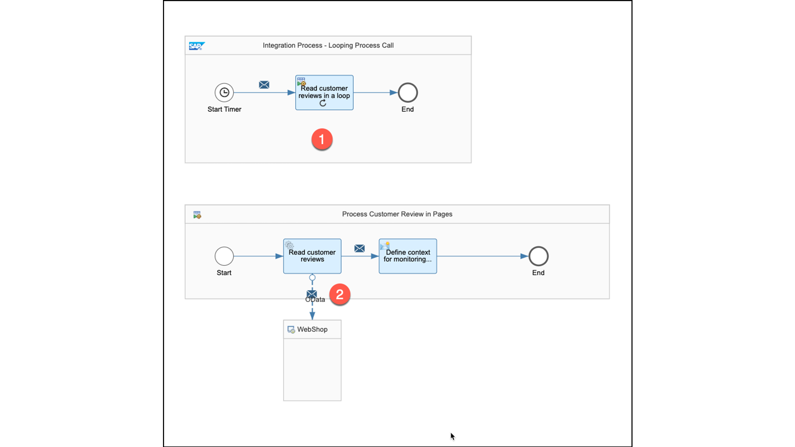
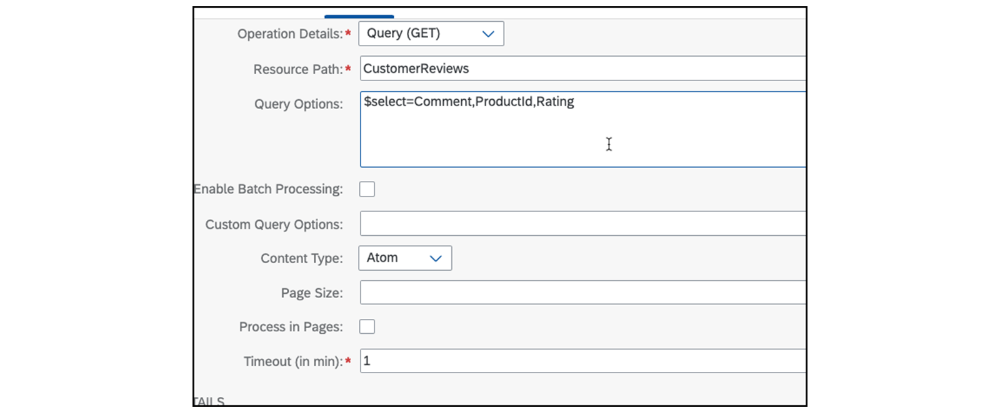
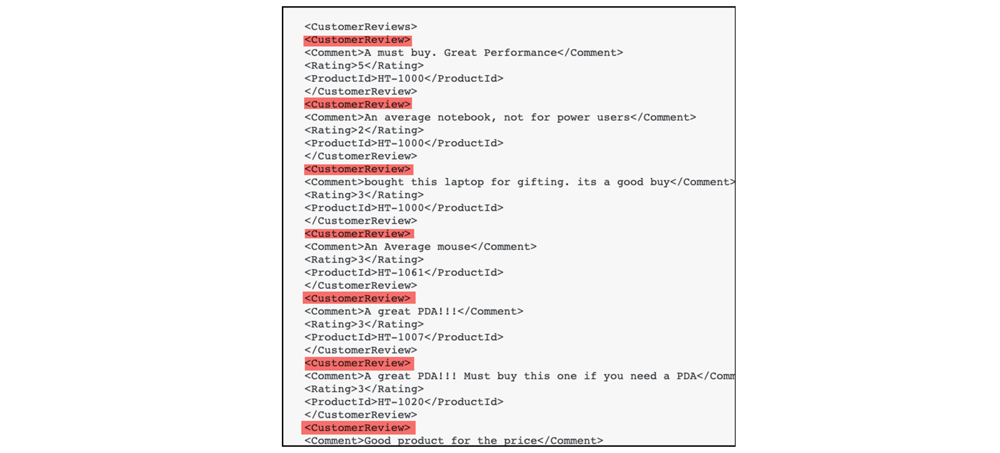
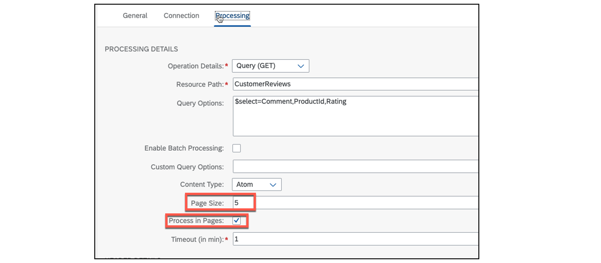
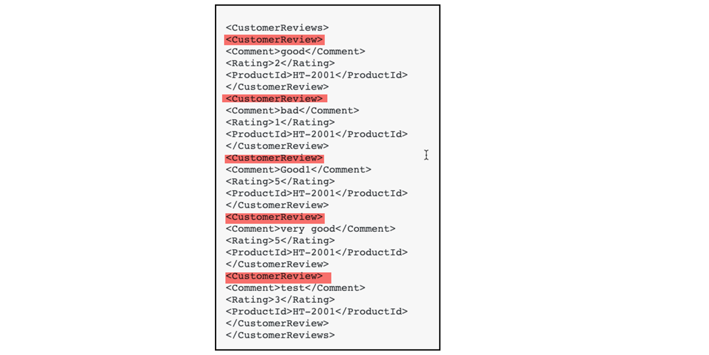

# ♠ 3 [USING ADAPTERS](https://learning.sap.com/learning-journeys/developing-with-sap-integration-suite/using-adapters_f42fdb69-df78-4faf-bfd3-0a7b8c8beebd)

> :exclamation: Objectifs
>
> - [ ] Use adapters

## ADAPTERS

### ADAPTERS IN AN OVERVIEW

Une grande variété de `prebuilt adapters` (adaptateurs prédéfinis) sont disponibles, avec une différenciation entre les adaptateurs d'`entrée/input` (`transmitter`) et de `sortie/output` (`receiver`). Ces adaptateurs prennent en charge `divers protocoles d'application et de transport`, ainsi que des `protocoles de message`, et sont configurés en fonction de leur `fonction prévue`. Les adaptateurs peuvent être globalement classés en deux groupes :

- TCP-based.

- Non TCP-based.

Souvent, ces adaptateurs sont simplement appelés : basés sur HTTP et non basés sur HTTP (HTTP-based and non HTTP-based).

### EXAMPLE: ODATA ADAPTER

Détails d'un `adapter OData`

| DETAIL               | OUTCOME                                |
| -------------------- | -------------------------------------- |
| Category             | HTTP-based                             |
| Transport protocol   | TCP/IP                                 |
| Application protocol | HTTP/HTTPS                             |
| Message protocol     | Atom Pub as XML or JSON representation |

### OVERVIEW OF AVAILABLE ADAPTERS

Vous avez la possibilité de visiter la page d'aide ou d'afficher les adaptateurs disponibles sur un `integration flow`, en fonction de votre licence, comme démontré précédemment avec la connectivité.

En lire plus : [Configure Adapter in Communication Channels](https://help.sap.com/docs/CLOUD_INTEGRATION/368c481cd6954bdfa5d0435479fd4eaf/1f066330e8314324bf3ebe3b6adc21b2.html)

### CUSTOM ADAPTER

Si les adaptateurs actuels ne répondent pas à vos besoins, il est possible d'importer des adaptateurs à partir de `third-party sources` (sources tierces).

Pour en savoir plus, cliquez ici : [Importation d'un adaptateur d'intégration personnalisé dans l'environnement Cloud Foundry](https://help.sap.com/docs/CLOUD_INTEGRATION/368c481cd6954bdfa5d0435479fd4eaf/482286e544014098874fde0da4bcca2c.html)

### DEVELOP YOUR OWN ADAPTER

Si aucune des sources mentionnées précédemment ne vous aide à trouver l'adaptateur souhaité, vous pouvez également créer votre propre adaptateur.

En savoir plus ici : [Développement d'adaptateurs personnalisés](https://help.sap.com/docs/CLOUD_INTEGRATION/368c481cd6954bdfa5d0435479fd4eaf/7392cc44de7c4450a65b8cd8f1042420.html)

### DIFFERENCE TO THE ADAPTERS IN PROCESS INTEGRATION

Au sein de `PI`, chaque `incoming message format` (format de message entrant) est automatiquement transformé en `internal XI message protocol` (protocole de message interne XI). Contrairement à l’`intégration cloud`, `aucun format natif n’est disponible`. Essentiellement, cela implique que si un `format binaire` est utilisé pour envoyer un message, il sera transmis tel quel au prochain composant de l'`integration flow` sans aucune modification. C'est là que les convertisseurs entrent en jeu. L'utilisation du `XML Message format` (format de message XML) permet de fournir une excellente prise en charge (`XPATH`) dans les composants de `integration flow` individuels.

### SAMPLE ODATA RECEIVER ADAPTER

L'`OData adapter` est appliqué dans les exercices. Qu'est-ce qui distingue l'`OData adapter` et pourquoi est-il sélectionné pour être utilisé dans l'exercice ? Ceci est discuté dans les paragraphes suivants.

### THE QUERY WIZARD

L'`OData adapter Sender` comprend un `wizard` (assistant) qui permet aux utilisateurs de naviguer vers l'interface accessible à l'aide d'un `metadata document` (document de métadonnées). Cette approche permet de configurer l'adaptateur même si les détails de l'interface ne sont pas entièrement connus. Toutefois, cette procédure est limitée à `OData V2.0` et ne convient que pour une petite structure hiérarchique.

### THE PAGE PROCESSING MODE

Les `OData interfaces` transmettent des données sous la forme d'un flux à l'aide du `Atom Pub protocol`, avec des `namespaces` et leurs `préfixes respectifs` utilisés pour plus de clarté.

Parfois, le nombre d'entrées dans le flux peut être important, ce qui peut entraîner des problèmes techniques dus aux limites de taille des messages. Pour surmonter ce défi, un traitement de pagination est utilisé. Il permet de lire la quantité totale d'entrées dans des `packages` ou des `pages`, qui sont ensuite traitées séquentiellement. Néanmoins, cette procédure nécessite une `additional design decision` (décision de conception supplémentaire).

### SAMPLE WITH PAGE PROCESSING MODE

#### :small_red_triangle_down: No Page Processing :

Au n°1, le scénario comporte un `looping Process Call` (appel de processus en boucle). Au n° 2, l’`OData adapter` appelle une `API OData`.

Avec comme résultat :

#### :small_red_triangle_down: With Page Processing :

Semblable au scénario précédent, la `configuration OData` se situe en dessous. Dans ce cas, chaque appel ne devrait livrer que 5 articles.

Avec comme résultat :

### AUTOMATICALLY REMOVING OF THE NAME SPACES OF THE RESPONSE

Outre la possibilité de rassembler des données dans des `packages`, les `namespaces` et leurs préfixes sont également automatiquement éliminés. Il permet de traiter les données directement avec XPATH. Pendant la session d'exercices pratiques, l'adaptateur HTTP est utilisé pour les autres appels. Cependant, il ne supprime pas automatiquement les `namespaces`, ce qui nécessite un `mapping` supplémentaire.

En savoir plus ici : [Configurer l'adaptateur d'expéditeur OData](https://help.sap.com/docs/CLOUD_INTEGRATION/368c481cd6954bdfa5d0435479fd4eaf/de7aee5160134b74a949ac2b84cb7412.html)

### SUMMARY

> SAP propose une `range of adapters` pour l'`intégration cloud`, qui varient en fonction de leur direction (`inbound or outbound`) et des `protocoles de transport`, d'`application` et de `message` utilisés. D'une manière générale, ces adaptateurs peuvent être classés comme étant `HTTP-based`, `TCP/IP-based` ou `non HTTP/non TCP/IP-based`. Par exemple, le `OData receiver adapter` (adaptateur récepteur OData) offre plusieurs fonctionnalités uniques, telles qu'un `wizard` qui facilite la configuration facile de l'`API OData` à appeler et la capacité de traitement de page pour gérer de gros volumes de données. En outre, l'adaptateur supprime les `namespaces` et leurs `préfixes` respectifs de la réponse, ce qui constitue un autre avantage important.

### CREATE A REQUEST AND REPLY TO AN EXTERNAL CALL (ODATA ADAPTER)

[Exercices](https://learning.sap.com/learning-journeys/developing-with-sap-integration-suite/using-adapters_f42fdb69-df78-4faf-bfd3-0a7b8c8beebd)
