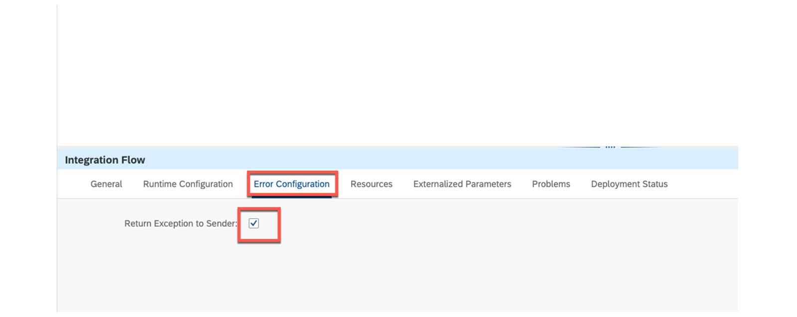
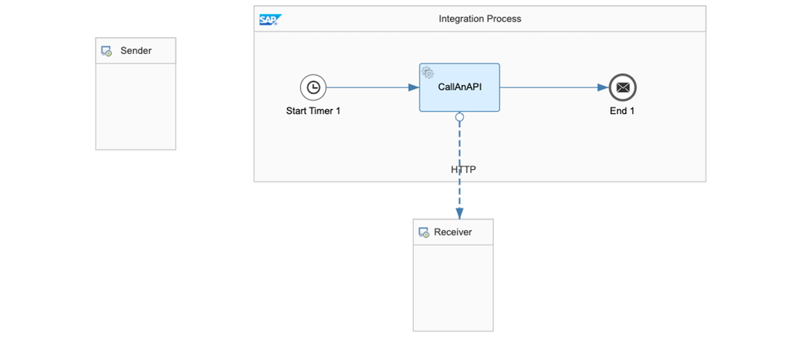
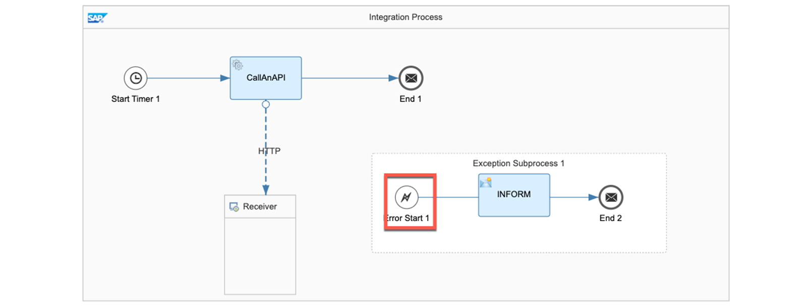
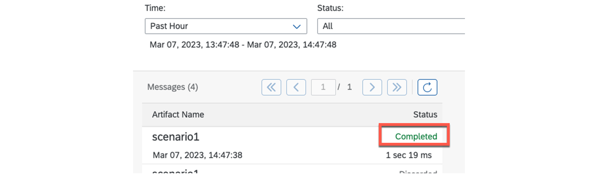
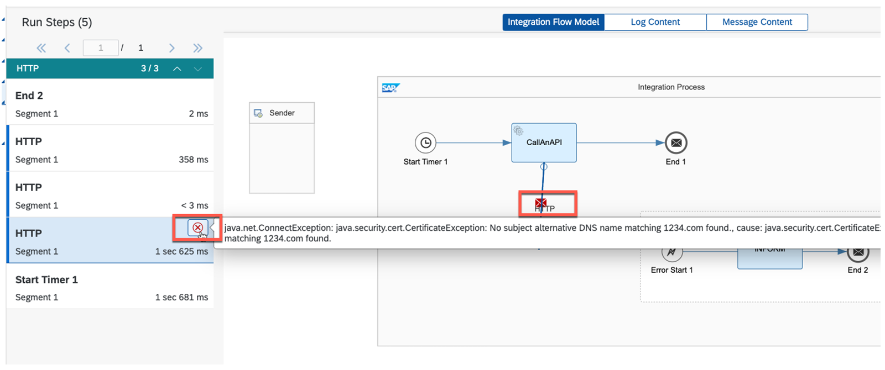
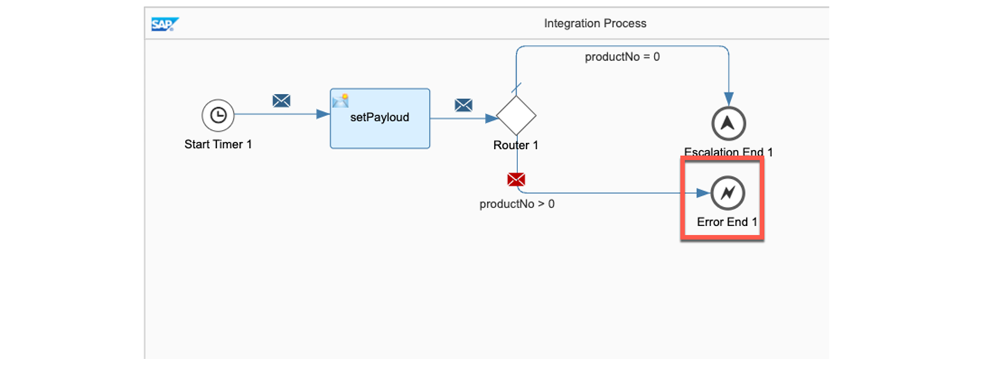
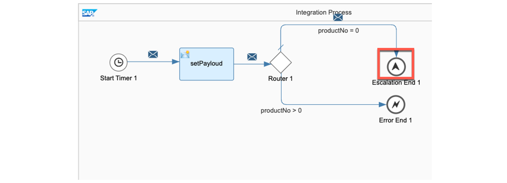

# ♠ 6 [PERFORMING EXCEPTION HANDLING](https://learning.sap.com/learning-journeys/developing-with-sap-integration-suite/using-adapters_f42fdb69-df78-4faf-bfd3-0a7b8c8beebd)

> :exclamation: Objectifs
>
> - [ ] Use outbound security for adapters

## EXCEPTION HANDLING

### WHAT IS AN EXCEPTION?

Il existe généralement deux types d’**exceptions** : **expected** et **unexpected**. Les exceptions **expected** peuvent inclure différentes valeurs dans un **field** de message ou des **empty values**, et peuvent être gérées via la **integration flow design**. Les exceptions **unexpected**, en revanche, sont de nature technique, comme des **connection failures** ou des **errors in scripts**, et peuvent conduire à l'arrêt du programme. Pour éviter cela, les erreurs **unexpected** doivent être **intercepted** et traitées de manière appropriée pour permettre au programme de continuer à s'exécuter.

L'accent est désormais mis sur les exceptions **unexpected** et leur **handling**, et pour le reste de cette discussion, les termes « **unexpected exceptions** », « **exceptions** » et « **erreurs** » seront utilisés de manière interchangeable.

### DEFINE ERROR CONFIGURATION FOR ONE INTEGRATION FLOW TO INFORM THE SENDER

Vous pouvez spécifier le **error handling mechanism** (mécanisme de gestion des erreurs) pour gérer les **runtime failures** (échecs d'exécution) lors du **message processing**. L'objectif principal de cette approche est de communiquer les détails de les **error details** à l'expéditeur pour une meilleure **awareness** (prise de conscience). Pour y parvenir, vous pouvez activer le **Return Exception to Sender flag** (l'indicateur Return Exception to Sender) dans les **integration flow settings**.

### READ MORE HERE:

[Définir la configuration des erreurs](https://help.sap.com/docs/CLOUD_INTEGRATION/368c481cd6954bdfa5d0435479fd4eaf/77d004175cf846479edd4f88a42a0a6e.html)

### DEFINE AN EXCEPTION SUBPROCESS

Un **subprocess** supplémentaire peut être défini dans un flux d'intégration, qui sera invoqué chaque fois qu'une erreur inattendue se produit.

### PROCEDURE

- In an **editable flow**, you may want to **retrieve an exception** to ensure that the original process is **completed** without any errors.

- Place an **Exception Subprocess**.

- Define your **error handler**.

- **Save**, **deploy**, and **run** your integration flow.

### SAMPLE

Votre flux d'intégration a rencontré une erreur car les paramètres de connexion ne sont pas fonctionnels.

L'erreur dans le **message monitor** après le déploiement :

### USAGE OF AN EXCEPTION SUBPROCESS:

Le **starting event** est un **Error Start event** (événement de démarrage d'erreur). Ce composant récupère l'**exception**.

Le moniteur avec le **exception subprocess** (sous-processus d'exception) :

Vous pouvez afficher les informations détaillées sur l'erreur dans le **Message Processing Run** (l'exécution du handling des messages).

### ERROR HANDLER

Si l'erreur est détectée par un **Error Start event**, tout **handling** ultérieur peut être implémenté comme dans un processus normal. Les **scripts**, comme celui illustré dans **Handle Exceptions**, sont particulièrement courants.

### ERROR AND ESCALATION EVENTS

L'**Error Start event triggers** toujours le **Exception Subprocess** (sous-processus d'exception), qui intercepte l'erreur et démarre son exécution. Si vous souhaitez terminer le **Exception Subprocess** (sous-processus d'exception) sans le statut **Failed**, vous devez définir un **End Message**, comme indiqué dans l'exemple précédent.

### MANUAL GENERATION OF ERROR AND ESCALATION END EVENTS

La définition d'un événement d'**Error End** (fin d'erreur) à la fin d'un flux d'intégration le fera toujours passer à l'état **Failed**, qui peut être utilisé comme **design element** (élément de conception). L'événement **Error End** sert de **endpoint** au processus principal et, en cas d'erreur, l'**Exception Subprocess** (sous-processus d'exception) l'intercepte toujours.

Exécuter vers un **Error End Event** (fin d'erreur) :

Si vous obtenez le statut **Failed**, le processus a fonctionné correctement.

L'**Escalation End** génère une erreur sans interrompre le processus principal.

Exécuter vers un **Escalation End Event** (événement de fin d'escalade) :

Si vous obtenez le statut **Escalated**, le processus a fonctionné correctement.

### SUMMARY

> Un **special error subprocess** peut intercepter une erreur inattendue à l'aide d'un **événement de démarrage d'exception**. Après interception, différentes étapes de **handling** peuvent être mises en œuvre. Par exemple, il convient de **store** des **process values** (valeurs de processus) ou le **message content** (contenu d'un message) suite à une erreur. En outre, il est également possible d'informer (via configuration) l'information de l'erreur à l'expéditeur .

## CREATE AN EXCEPTION PROCESS

[Exercices](https://learning.sap.com/learning-journeys/developing-with-sap-integration-suite/performing-exception-handling_c545ebe7-bcf0-4865-8750-df2c51775a4d)
