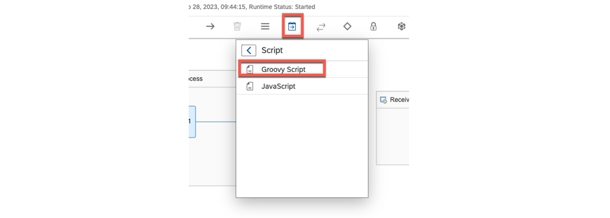
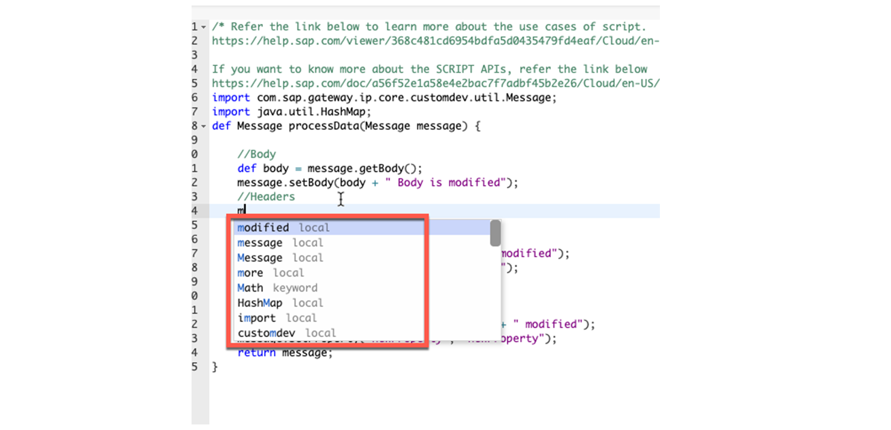
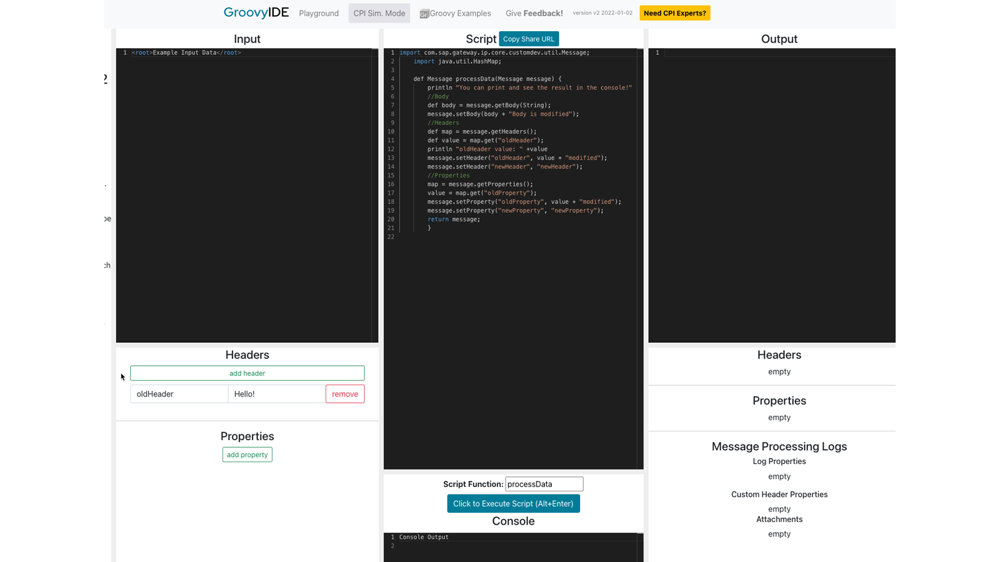

# ♠ 7 [USING SCRIPTING](https://learning.sap.com/learning-journeys/developing-with-sap-integration-suite/using-adapters_f42fdb69-df78-4faf-bfd3-0a7b8c8beebd)

> :exclamation: Objectifs
>
> - [ ] Use scripting

## SCRIPTING

### SCRIPTING OVERVIEW

Vous pouvez utiliser des `Java or Groovy scripts` pour le` message processing`, ce qui peut être utile dans les scénarios suivants :

- [Ajouter des informations au journal de traitement des messages](https://help.sap.com/docs/CLOUD_INTEGRATION/368c481cd6954bdfa5d0435479fd4eaf/e8e928373b66488b8d78fb5a314b8a9e.html?locale=en-US)

  Vous pouvez utiliser l'action Script pour ajouter des informations au journal de traitement des messages (MPL).

- [Lire et modifier l'en-tête du message, le corps du message et les propriétés Exchange](https://help.sap.com/docs/CLOUD_INTEGRATION/368c481cd6954bdfa5d0435479fd4eaf/5822f320823040af915c54a379463547.html?locale=en-US)

  Vous pouvez utiliser l'action Script pour traiter (obtenir, ajouter, modifier ou supprimer) l'en-tête du message, le corps du message et les propriétés d'échange, à l'aide de l'objet Message de l'interface.

- [Lire et modifier les en-têtes SOAP](https://help.sap.com/docs/CLOUD_INTEGRATION/368c481cd6954bdfa5d0435479fd4eaf/8a2827d030b345f998199774266b9810.html?locale=en-US)

  Vous pouvez utiliser l'action Script pour traiter les en-têtes SOAP.

- [Lire et modifier le contenu de l'annuaire des partenaires](https://help.sap.com/docs/CLOUD_INTEGRATION/368c481cd6954bdfa5d0435479fd4eaf/ab10d02667fe48309bd2d5cd5e06e4f3.html?locale=en-US)

  Vous pouvez utiliser l'étape de script pour traiter le contenu de l'annuaire des partenaires.

- [Gérer les exceptions](https://help.sap.com/docs/CLOUD_INTEGRATION/368c481cd6954bdfa5d0435479fd4eaf/e29a49d229ce40aa8d2f035da80088a9.html?locale=en-US)

  Vous pouvez utiliser l'action Script pour identifier les exceptions qui surviennent lors de l'envoi de messages à l'aide de l'adaptateur récepteur HTTP ou OData V2.

- [Lire les artefacts liés à la sécurité](https://help.sap.com/docs/CLOUD_INTEGRATION/368c481cd6954bdfa5d0435479fd4eaf/8dd981e4f1f44d22bee22c174e5c52d0.html?locale=en-US)

  Vous pouvez utiliser l'action Script pour traiter les artefacts liés à la sécurité (par exemple, les entrées du magasin de clés).

- [Cas d'utilisation supplémentaires](https://help.sap.com/docs/CLOUD_INTEGRATION/368c481cd6954bdfa5d0435479fd4eaf/bc92c7a4c5a641cbb282895b2c6d6225.html?locale=en-US)

### JAVA DOCS FOR COM.SAP.GATEWAY.IP.CORE.CUSTOMDEV.UTIL PACKAGES

La documentation Java peut être trouvée ici : com.sap.it.script.custom-development 2.7.1 API

### DEVELOPPING GROOVY SCRIPTS WITH THE INLINE EDITOR

Vous pouvez utiliser l'`inLine editor` (éditeur en ligne) directement de la manière suivante.

### PROCEDURE

- Position a `Groovy Script component` on the `expiration path`.

- Choose the `Create` button from the context menu.

- After that, you are in the `inline editor` of the `Groovy script`. There is already a `basic script` created, on which you can build.

- You will have code compilation and more.

Ensuite, procédez au `standard simulation and/or testing process` en `déployant` et en `traçant` le flux.

### CREATE GRROVY SCRIPTS WITH AN EXTERNAL EDITOR

Vous pouvez créer un `local development environment` avec `Eclipse`, `IntelliJ` ou `Visual Code`. Vous pouvez obtenir le `SDK` correspondant ici : [Outils de développement SAP](https://tools.hana.ondemand.com/#cloudintegration) dans [Using Script API] → [Script API].

Il existe également un `inLine editor` (éditeur en ligne) avec lequel vous pouvez écrire et tester directement. Utilisez [Groovy IDE](https://groovyide.com/cpi) pour développer et tester facilement vos `scripts`. Tous les `SDK` nécessaires sont déjà implémentés.

Après avoir copier le code, coller le dans le `scripting component`, et procéder normalement.

### RESOURCES

- Blogs:

  - Understanding Groovy Scripting for SAP Integration Suite – Part 1: https://blogs.sap.com/2021/04/08/understanding-groovy-scripting-for-sap-integration-suite-part-1/

  - SAP Cloud Platform Integration (CPI) || Part 7 || Maintaining logs by using "Groovy Scripts", even if the integration flow is not on trace mode: https://blogs.sap.com/2020/01/09/sap-cloud-platform-integration-cpi-part-7-maintaining-logs-using-groovy-scripts-even-if-the-iflow-is-not-on-trace-mode./

  - [SAP Cloud Integration (CPI/HCI) || Writing Groovy Scripts \_ With Basic Examples | SAP Blogs](https://blogs.sap.com/2021/09/16/sap-cloud-integration-cpi-hci-writing-groovy-scripts-_-with-basic-examples/)

- Samples:

  - [Get an environment to Edit SAP CPI scripts in Groovy in 20 minutes.](https://www.youtube.com/watch?v=QnxFlNkjio8)

  - [SAP CPI development in Git and debug your Groovy scripts.](https://www.youtube.com/watch?v=B9yubILChMY)

  - [Groovy Scripting in SAP CPI | First Program | Groovy IDE | Contact@eduoceans.com.](https://www.youtube.com/watch?v=kAENYB8DtPY)

- Script Collections: Using Script Collection across various Integration Flows in a Package in SAP CPI: https://blogs.sap.com/2021/06/07/using-script-collection-across-various-packages-in-sap-cpi/.

- Script API: https://tools.hana.ondemand.com/#cloudintegration. Using Script API.

### SUMMARY

> Des `Scripts in Java or Groovy` peuvent être créés à l'aide d'un `Script SDK`, qui permet de traiter les messages et leurs métadonnées de différentes manières. Le `SDK` permet de définir et de lire les paramètres d'échange, d'écrire des `logs`, d'intercepter des `exceptions`, etc. Ces scripts peuvent être créés à l'aide de l'`inLine editor` (éditeur en ligne) et d'un `IDE en ligne` qui inclut tous les `SDK` nécessaires, permettant de tester directement le script.

## CREATE A GROOVY SCRIPT FOR ERROR HANDLING

[Exercices](https://learning.sap.com/learning-journeys/developing-with-sap-integration-suite/using-scripting_c0b19b3a-4a8c-48d1-871e-1d66990f102a)
