# ♠ 8 [USING ADAPTER INBOUND SECURITY](https://learning.sap.com/learning-journeys/developing-with-sap-integration-suite/using-adapter-inbound-security_cae0d690-8bda-4fc5-a45f-7b24b2134d26)

> :exclamation: Objectifs
>
> - [ ] Use and set up an inbound security adapter

## INBOUND SECURITY ADAPTER

### INBOUND SECURITY FOR ADAPTERS

Deux cas doivent être distingués : l'établissement d'une `secure connection` au `load balancer` (répartiteur de charge) et l'`authenticating` auprès du `Cloud Integration tenant` où le flux d'intégration est implémenté. Pour établir une `secure connection`, une `Transport Layer Security (TLS) procedure` est utilisée sur les connexions basées sur `TCP` (`Transport Control Protocol`) et des `certificates` sont utilisés. Cette procédure est utilisée dans `HTTPS`, `IMAPS`, `POP3S`, `SMTPS`, `FTPS` et d'autres protocoles. Dans les exercices de cette formation, nous utilisons le `SOAP adapter`.

Nous souhaitons explorer les options disponibles pour garantir que seuls les `sender` autorisés peuvent envoyer des messages à notre flux d'intégration. Cette rubrique est appelée `Inbound Security`.

Les `certificates` requis pour établir une `HTTPS connection` entre le `sender` et le `load balancer` (répartiteur de charge) sont nécessaires.

L'autorisation du `sender` est validée par rapport à l'`integration flow endpoint` du flux d'intégration.

### ESTABLISHING OF THE HTTPS CONNECTION

Rappelez-vous la présentation technique abordée dans une leçon précédente, qui montre un `load balancer` (répartiteur de charge) entre le `sender` et l'`endpoint UR`L de notre flux d'intégration déployé. De ce fait, il est nécessaire d’établir la `SSL connection` entre le `sender` et le `load balancer` (répartiteur de charge).

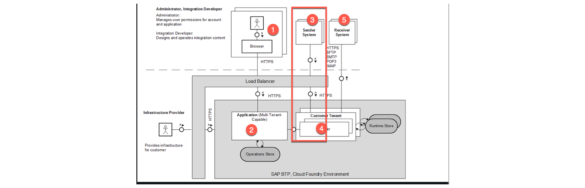

La responsabilité de l'importation de tous les `certificates` requis incombe à SAP, car nous n'avons pas accès à le `load balancer` (répartiteur de charge) dans `Cloud Integration`.

### AUTHORIZATION OF THE SENDER AGAINST THE ENDPOINT OF THE INTEGRATION FLOW

Deux options sont également disponibles ici :

- L'`authenticating` peut être effectuée directement auprès du `remote tenant` (locataire distant) où les flux d'intégration sont déployés.

- Utilisation d'un `authentication client (OAuth)` sur votre propre `tenant`.

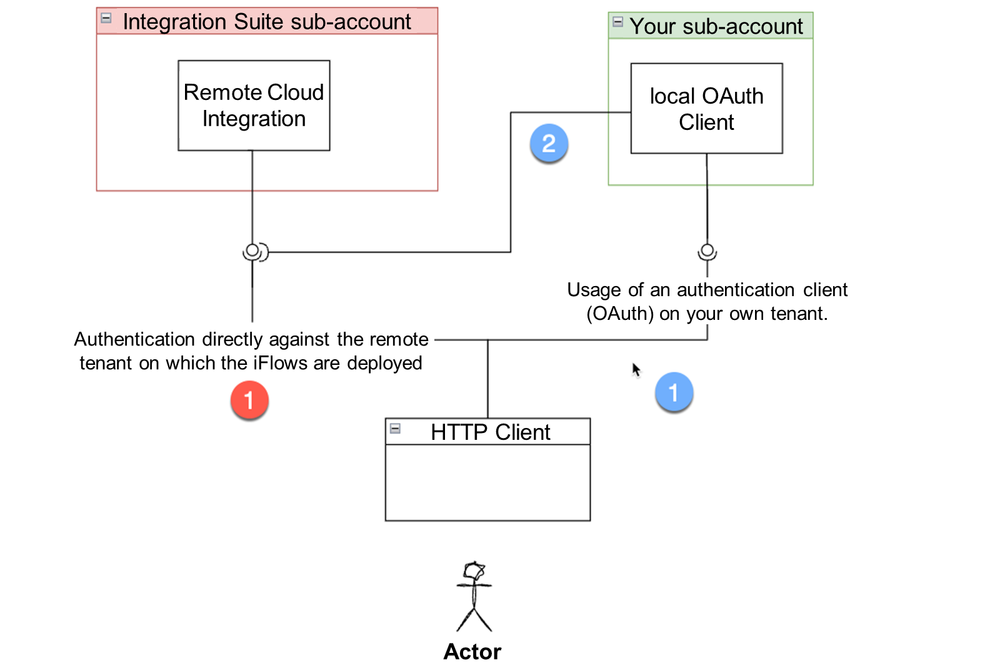

### AUTHENTICATION CAN BE PERFORMED DIRECTLY AGAINST THE REMOTE TENANT WHERE THE INTEGRATION FLOWS ARE DEPLOYED

Il s’agit du scénario le plus courant lors du développement, mais il n’est pas recommandé pour une utilisation en `production`. Cette option est marquée en rouge comme n°1 dans l’image précédente.

### PROCEDURE

- Create your `integration flow sender adapter` and choose `User Role` as `Authorization`.

- At `User Role`, choose the available `user roles`.

- The default user role is `ESBMessaging.send`.

- Assign the user role `ESBMessaging.send` to a `Role Collection`.

- Assign your `Role Collection` to a user at your `subaccount`.

- `Call the endpoint` with a user who is assigned to your `Role Collection` with the `ESBMessaging.send role` included.

> :pushpin: Note:
>
> It is not recommended to use client certificates for authorization. This approach requires importing a client certificate directly into the configuration.

`Role Collection` (Collection de rôles), `A_sendMessagesToCI` avec le rôle `MessagingSend` attribué à deux utilisateurs.

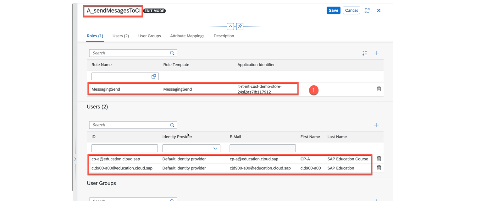

> :pushpin: Note:
>
> The role MessagingSend in the context of this situation is equivalent to the role ESBMessaging.send in the Cloud Integration.

Vous recevez un appel réussi vers le endpoint en utilisant l'un des utilisateurs attribués.

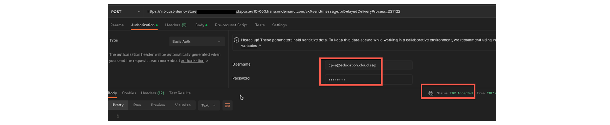

### SET YOUR OWN USER ROLE AT CLOUD INTEGRATION

Vous pouvez utiliser vos propres `user roles`. Pour définir votre propre `user role`, accédez à [Monitor Artifacts] → [Intégrations] → [Manage Security] → [User Roles] et définissez votre propre rôle.

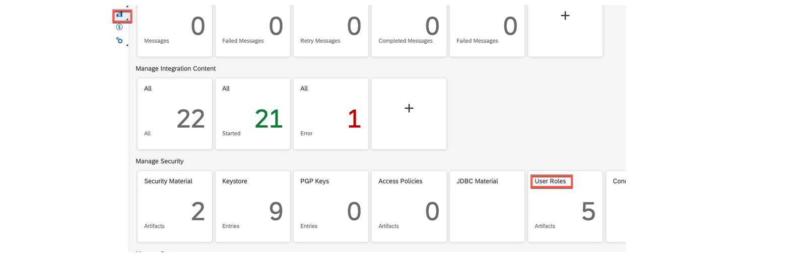

Définissez votre propre `user role`, par exemple Peter1 :

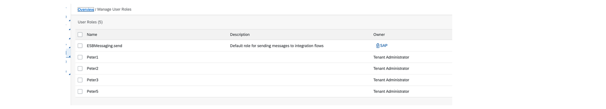

Ensuite, comme décrit précédemment, vous pouvez configurer votre propre `user roles` :

- Créez une `Role Collection` (collection de rôles).

- Attribuez votre propre `user role` à votre propre `Role Collection` (collection de rôles).

- Attribuez la `Role Collection` (collection de rôles) à un utilisateur.

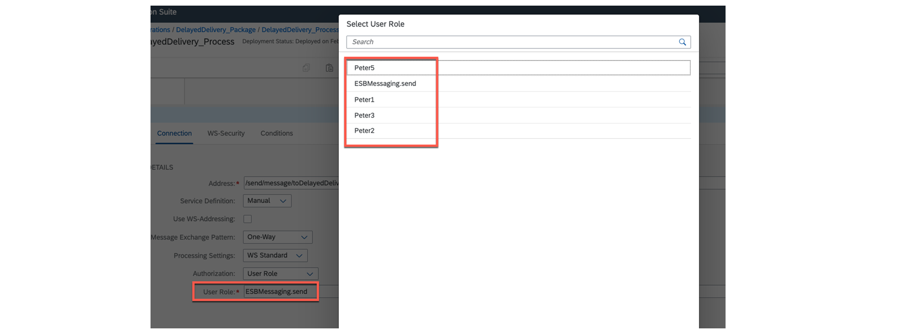

### USAGE OF AN AUTHENTICATION (OAUTH) CLIENT ON YOUR OWN TENANT

La méthode d'appel direct d'un flux d'intégration via le `role-based approach` présentée utilise des utilisateurs personnalisés et une `basic authenticating`, qui ne sont pas adaptées à des fins productives. Pour de meilleures méthodes d'`authenticating`, nous devons utiliser un `self-configured OAuth2.0 client` (client OAuth2.0 auto-configuré) qui peut être créé sur notre propre `subaccount`.

Pour ce faire, nous devons configurer une `instance Process Integration Runtime` sur notre `subaccount` et l'associer au `integration flow plan` (plan de flux d'intégration). Cette instance peut ensuite être personnalisée avec diverses informations d'identification client. Ceux-ci correspondent aux n°1 et n°2, marqués en bleu sur la photo précédente.

Vous pouvez choisir les grands types suivants :

- `Authorization Code`

- `Client Credentials`

- `Password`

- `Refresh Token`

- `SAML2 Bearer`

- `JWT Bearer`

Sélection de types généraux lors de la configuration de le `local Process integration Runtime instance` (instance locale du Runtime d’intégration de processus).

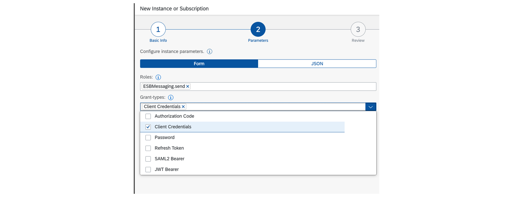

### PROCEDURE

- Create a local `Process integration Runtime` instance.

- Configure the appropriate grand-type.

- Create a key.

- Use the key parameters for `authorization`.

The new Process Integration Runtime instance of plan integration-flow.

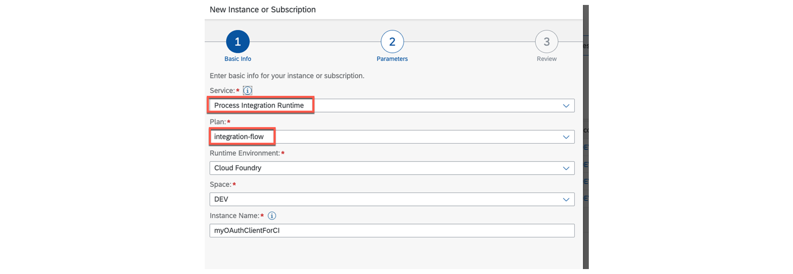

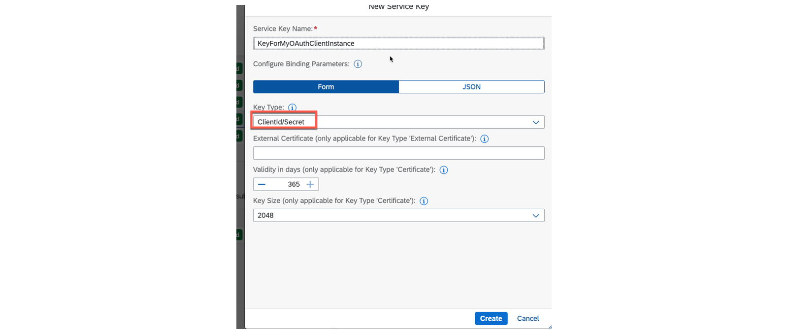

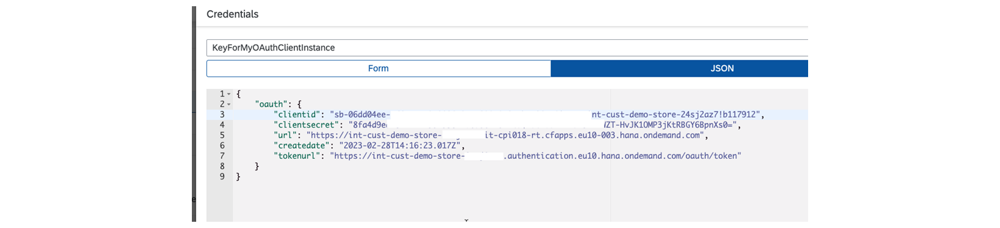

### SAMPLE - LOG ON WITH CLIENTID AND CLIENTSECRET

Utiliser le `clientId` du user et le `clientSecret` en tant que `password`.

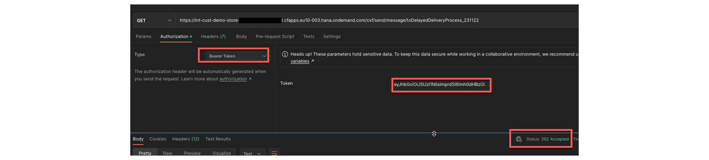

### SAMPLE - LOG ON WITH BEARER TOKEN

Utiliser le `tokenUrl` avec le `clientIS` en tant que `username`, et le `clientsecret` en tant que `password` au niveau du `Bearer token`.

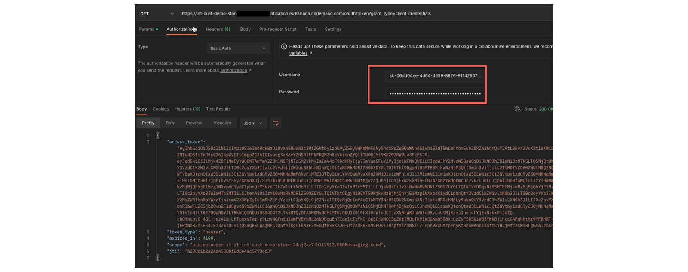

Utiliser le `Bearer token` pour l'`authentication`.

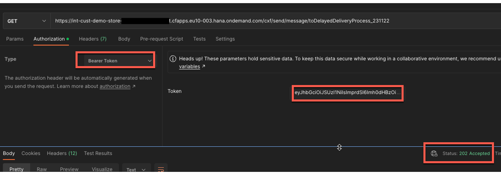

### SAMPLE - LOG WITH OAUTH 2.0 AUTHENTICATION

Vous pouvez utiliser `OAuth 2.0` pour l'`authenticating`, ce qui implique deux étapes : premièrement, générer un `token`, et deuxièmement, utiliser ce `token` pour l'`authentication`.

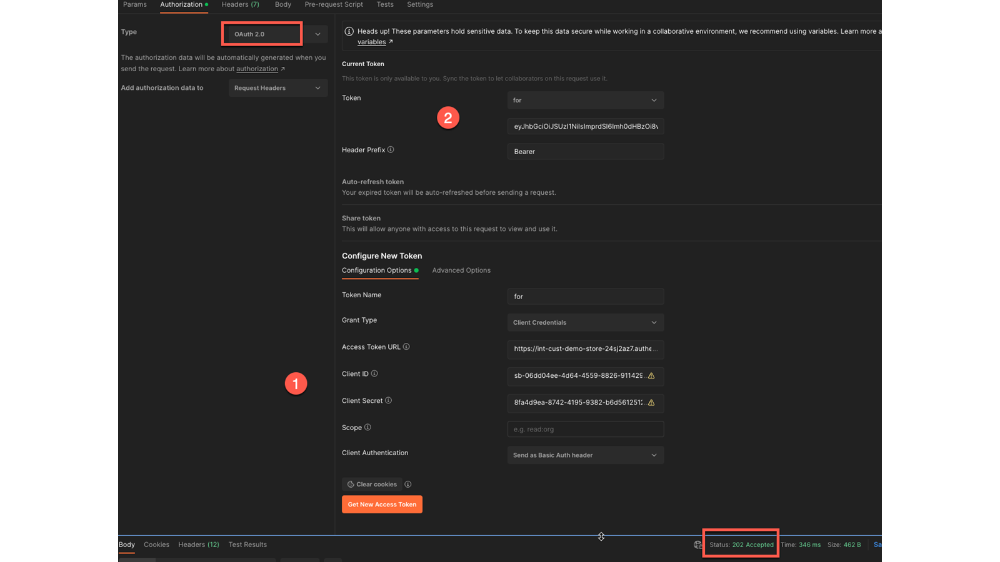

### RESOURCES

- [Client Credentials](https://help.sap.com/docs/CLOUD_INTEGRATION/368c481cd6954bdfa5d0435479fd4eaf/19af5e205fe14af6a4f8a9fd80d4dc92.html?locale=en-US&q=Instance%20parameter)

- [Configuration Checklist for Inbound Authentication](https://help.sap.com/docs/CLOUD_INTEGRATION/368c481cd6954bdfa5d0435479fd4eaf/4a428fdc9498429b84e8000b9d240d47.html?locale=en-US)

### SUMMARY

> La communication sécurisée implique deux étapes : l'établissement d'une `secure connection` à le `load balancer` (répartiteur de charge) et l'`authenticating` auprès du `Cloud Integration tenant` où le flux d'intégration est implémenté. Ceci est réalisé en utilisant des `certificates` dans les `TCP (Transport Control Protocol) based connections` (connexions basées sur TCP (Transport Control Protocol)) via la `TSL (Transport Layer Security) procedure` (procédure TSL (Transport Layer Security)). Ces protocoles incluent `HTTPS`, `IMAPS`, `POP3S`, `SMTPS`, `FTPS` et autres. De nombreux protocoles tels que `SOAP`, `OData`, `HTTP`, utilisent également ces `secure communication protocols` (protocoles de communication sécurisés).
>
> L'`authenticating` au niveau de l'`endpoint` du flux d'intégration peut être réalisée de deux manières : `direct assignment of a user role` à un utilisateur ou l'utilisation d'un `local OAuth 2.0 client` offrant des `extra authentication options`, telles que `ClientId/Clientsecret`, `Bearer token` ou `OAuth. 2.0`. Ces méthodes ne sont pas personnalisées et sont plus sécurisées que la première option.

## CREATE AN INBOUND SOAP ADAPTER

[Exercices](https://learning.sap.com/learning-journeys/developing-with-sap-integration-suite/using-adapter-inbound-security_cae0d690-8bda-4fc5-a45f-7b24b2134d26)
