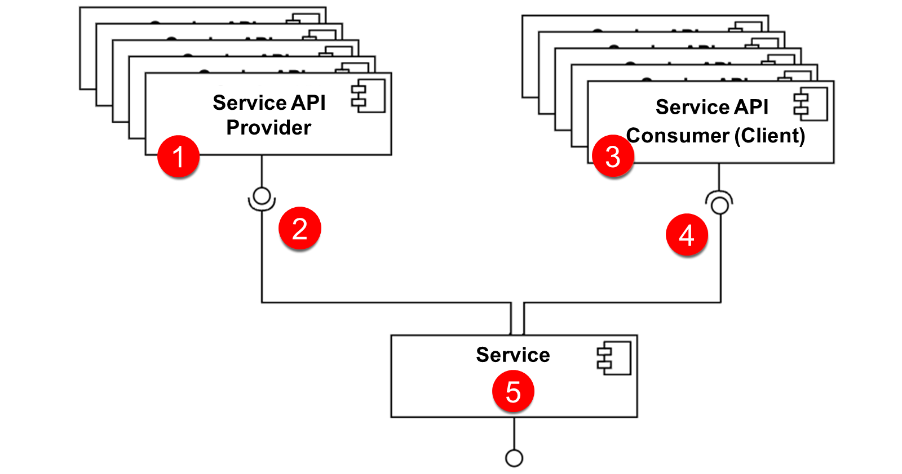
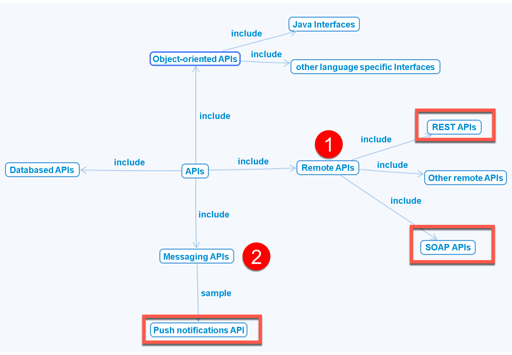

# ♠ 2 [INTRODUCING FIRST APPROACH TO AN API FIRST ARCHITECTURE](https://learning.sap.com/learning-journeys/developing-with-sap-integration-suite/undergoing-a-first-approach-with-an-api_ccfd23d7-c298-4606-9af8-3c4f2ac91824)

> :exclamation: Objectifs
>
> - [ ] What is an [API first approach](../☼%20UNIT%200%20-%20Lexicon/♠%20API%20First%20Approach.md)?
>
> - [ ] What are [API](../☼%20UNIT%200%20-%20Lexicon/♠%20API.md)?
>
> - [ ] Types of [APIs](../☼%20UNIT%200%20-%20Lexicon/♠%20API.md).
>
> - [ ] Interface types mainly used in SAP.
>
> - [ ] How to design [API](../☼%20UNIT%200%20-%20Lexicon/♠%20API.md) with description languages.
>
> - [ ] Fulfill the contract between [API Provider](../☼%20UNIT%200%20-%20Lexicon/♠%20API%20Provider.md) and [API Consumer](../☼%20UNIT%200%20-%20Lexicon/♠%20API%20Consumer.md).

## :closed_book: WHAT IS AN API FIRST APPROACH

> #### :bookmark: [API first approach](../☼%20UNIT%200%20-%20Lexicon/♠%20API%20First%20Approach.md)
>
> Une [API first approach](../☼%20UNIT%200%20-%20Lexicon/♠%20API%20First%20Approach.md) est une approche software design (conception de logiciels) qui se concentre sur l'[API](../☼%20UNIT%200%20-%20Lexicon/♠%20API.md) pour créer des applications pouvant être facilement connectées les unes aux autres. API First crée des écosystèmes d'applications modulaires, réutilisables et extensibles, à l'image des **briques Lego**.
>
> Une [API first approach](../☼%20UNIT%200%20-%20Lexicon/♠%20API%20First%20Approach.md) signifie que vos [API](../☼%20UNIT%200%20-%20Lexicon/♠%20API.md) sont traitées comme des **first class citizens**. Tout tourne autour du end product (produit final) utilisé par les appareils mobiles et les applications client. Une [API first approach](../☼%20UNIT%200%20-%20Lexicon/♠%20API%20First%20Approach.md) implique de développer des [APIs](../☼%20UNIT%200%20-%20Lexicon/♠%20API.md) consistent (cohérentes) et reusable. Ceci est réalisé en utilisant un API description language.

Explication:

#### :small_red_triangle_down: **API Provider** :

> #### :bookmark: [API Provider](../☼%20UNIT%200%20-%20Lexicon/♠%20API%20Provider.md)
>
> Un [API Provider](../☼%20UNIT%200%20-%20Lexicon/♠%20API%20Provider.md) fournit une interface avec des technical features (fonctionnalités techniques) (n°1). Symboliquement, cela est montré sur cette image avec la notation boule ou sucette. Cette interface peut être consumed par un service (n°5). La représentation correspond à la socket notation (n°2). Le service joue le rôle de l'[API Consumer](../☼%20UNIT%200%20-%20Lexicon/♠%20API%20Consumer.md).

#### :small_red_triangle_down: **API Consumer** :

> #### :bookmark: [API Consumer](../☼%20UNIT%200%20-%20Lexicon/♠%20API%20Consumer.md)
>
> Un [API Consumer](../☼%20UNIT%200%20-%20Lexicon/♠%20API%20Consumer.md) nécessite une interface (n°3). La représentation correspond à la socket notation (n°4). Dans ce cas, l'[API Provider](../☼%20UNIT%200%20-%20Lexicon/♠%20API%20Provider.md)I est le service (n°5). La présentation est à nouveau faite avec la notation boule ou sucette.

### FIND MORE INFORMATION AT:

- [Understanding the API-First Approach to Building Products.](https://swagger.io/resources/articles/adopting-an-api-first-approach)

- [It is not Cloud first or API first but Strategy first. API Management Strategy in Multicloud Environments | SAP Blogs.](https://blogs.sap.com/2019/02/08/it-is-not-cloud-first-or-api-first-but-strategy-first-api-management-strategy-in-multicloud-environments/)

## :closed_book: WHAT ARE APIS?

> #### :bookmark: [API](../☼%20UNIT%200%20-%20Lexicon/♠%20API.md)
>
> Une [API](../☼%20UNIT%200%20-%20Lexicon/♠%20API.md) signifie Application Programming Interface. Une [API](../☼%20UNIT%200%20-%20Lexicon/♠%20API.md) spécifie les operationsainsi que les inputs et outputs (entrées/sorties) d'uncomponent logiciel. Il définit des fonctionnalités indépendantes de leurs implémentations respectives, afin que ces implémentations puissent varier sans affecter l'utilisateur de l'[API](../☼%20UNIT%200%20-%20Lexicon/♠%20API.md).

### TYPES OF APIS

Dans la littérature, il existe de nombreuses présentations de différents types d’[API](../☼%20UNIT%200%20-%20Lexicon/♠%20API.md). Vous trouverez ci-dessous un simple aperçu des [API](../☼%20UNIT%200%20-%20Lexicon/♠%20API.md) que nous devons comprendre pour ce cours.

### 4 DIFFERENT APIS:

Ici, quatre [API](../☼%20UNIT%200%20-%20Lexicon/♠%20API.md) différentes sont définies sous le sur-ensemble d'[API](../☼%20UNIT%200%20-%20Lexicon/♠%20API.md), en fonction de leur utilisation.

#### :small_red_triangle_down: **Databased APIs** :

Ceux-ci sont destinés à l’échange de fichiers entre systèmes. Les fichiers peuvent être, par exemple, des fichiers de configuration.

#### :small_red_triangle_down: **Object-orientated APIs** :

Ceux-ci sont utilisés dans les langages object-oriented programming (programmation orientés objet) pour définir la communication des classes entre elles.

#### :small_red_triangle_down: **Remote APIs (No. 1)** :

Cela inclut les [API](../☼%20UNIT%200%20-%20Lexicon/♠%20API.md) Web importantes d'aujourd'hui, telles que les API **REST** et **SOAP**. REST lui-même n'est pas un protocole mais un software architectural style (style architectural logiciel).

#### :small_red_triangle_down: **Messaging APIs (No. 2)** :

Ce sont des [API](../☼%20UNIT%200%20-%20Lexicon/♠%20API.md) asynchrones qui envoient des events en fonction d'events . Ceux-ci sont utilisés dans les [Event-Driven architectures](../☼%20UNIT%200%20-%20Lexicon/♠%20Event-Driven%20Architecture.md).

## :closed_book: INTERFACE TYPES MAINLY USED IN SAP

Techniquement, quelques protocoles ont été convenus. La figure suivante montre les [API](../☼%20UNIT%200%20-%20Lexicon/♠%20API.md) et leurs relations les unes avec les autres.

Ceux-ci sont chez SAP :

#### :small_red_triangle_down: **REST APIs** :

comme les RESTful HTTP APIs :

- OData 2.0.

- OData 4.0, tous deux comme SAP Graph.

#### :small_red_triangle_down: **Remote APIs** :

comme les SOAP APIs .

#### :small_red_triangle_down: **Messaging APIs** :

comme les Event APIs.

    Les formats de présentation sont soit JSON, soit XML.

### HOW TO DESIGN APIS WITH DESCRIPTION LANGUAGES

#### :small_red_triangle_down: **SOAP-based APIs** :

Les SOAP-based APIs sont décrites avec le Web Services Description Language (WSDL). Il s'agit d'un XML-based interface description language (langage de description d'interface basé sur XML) utilisé pour décrire les fonctionnalités offertes par un web service.

Vous trouverez plus d'informations sur WSDL ici : [Web Services Description Language](https://en.wikipedia.org/wiki/Web_Services_Description_Language)

#### :small_red_triangle_down: **REST-based APIs** :

Les REST-based APIs peuvent être créées avec les principaux langages de description suivants :

- **RAML**

  langage basé sur YAML pour décrire les [API](../☼%20UNIT%200%20-%20Lexicon/♠%20API.md) RESTful.

  Vous trouverez plus d’informations sur **RAML** ici : https://**raml**.org/

- **OpenAPI**

  Une spécification **OpenAPI**, anciennement connue sous le nom de Swagger specification, est une spécification pour un machine-readable interface definition language (langage de définition d'interface lisible par machine) permettant de décrire, de produire, de consommer et de visualiser des RESTful web services.

  Vous trouverez plus d’informations sur **OpenAPI** ici : [**openapi**s.org](https://www.**openapi**s.org/).

  La spécification **OpenAPI** est utilisée dans la gestion des [APIs](../☼%20UNIT%200%20-%20Lexicon/♠%20API.md).

### FULFILL THE CONTRACT BETWEEN API PROVIDER AND API CONSUMER

La description dans **RAML** ou **OpenAPI** est le contrat entre l'[API Provider](../☼%20UNIT%200%20-%20Lexicon/♠%20API%20Provider.md) et l'[API Consumer](../☼%20UNIT%200%20-%20Lexicon/♠%20API%20Consumer.md). L'[API](../☼%20UNIT%200%20-%20Lexicon/♠%20API.md) doit être implémentée dans le cadre de ce contrat.

Deux cas sont possibles :

#### :small_red_triangle_down: **Implementation – First Approach** :

L'implémentation est d'abord créée par le [API Provider](../☼%20UNIT%200%20-%20Lexicon/♠%20API%20Provider.md). Le descriptif (contrat) est alors généré automatiquement. Ceci est utilisé par l’[API Consumer](../☼%20UNIT%200%20-%20Lexicon/♠%20API%20Consumer.md).

#### :small_red_triangle_down: **Contrat - First Approach** :

La description de l'[API](../☼%20UNIT%200%20-%20Lexicon/♠%20API.md) est d'abord créée avec **RAML** ou **OpenAPI**. Les générateurs créent automatiquement l'implémentation rudimentaire pour le [API Provider](../☼%20UNIT%200%20-%20Lexicon/♠%20API%20Provider.md) et le [API Consumer](../☼%20UNIT%200%20-%20Lexicon/♠%20API%20Consumer.md). Ces implémentations rudimentaires dans différents langages et concepts de programmation doivent ensuite être pleinement mises en œuvre.

### SUMMARY

> Dans une [API first approach](../☼%20UNIT%200%20-%20Lexicon/♠%20API%20First%20Approach.md), seules les [API](../☼%20UNIT%200%20-%20Lexicon/♠%20API.md) fournies sont intéressantes. En utilisant des standardized communication protocols and concepts, tels que REST et OData, presque tous les cas d'utilisation peuvent être cartographiés au-delà des frontières. La communication a lieu entre un [API Provider](../☼%20UNIT%200%20-%20Lexicon/♠%20API%20Provider.md) qui dispose de l'interface et le [API Consumer](../☼%20UNIT%200%20-%20Lexicon/♠%20API%20Consumer.md) qui consomme cette interface.
>
> Les [API](../☼%20UNIT%200%20-%20Lexicon/♠%20API.md) sont décrites avec des standardized description languages (langages de description standardisés), tels que **RAML** ou **OpenAPI**. L'implémentation peut être créée d'abord au niveau de l'[API Provider](../☼%20UNIT%200%20-%20Lexicon/♠%20API%20Provider.md) puis au niveau de la description (implémentation - First Approach basée sur celle-ci) ou inversement en créant d'abord la description puis en créant automatiquement des client _stubs_[^1] (stubs de serveur) et de client à partir de celle-ci (contrat - First Approach). Nous constatons que les [APIs](../☼%20UNIT%200%20-%20Lexicon/♠%20API.md) SOAP, OData 2.0 et 4.0, ainsi que SAP Graph jouent le rôle de premier plan dans l'univers SAP.

---

[^1]: un client stub fait généralement référence à une implémentation simulée ou simplifiée d'un client, utilisée pour imiter le comportement d'un système ou d'un service externe avec lequel une intégration est censée interagir. Les stubs permettent de tester les flux d'intégration sans avoir besoin de connecter réellement le système cible ou de dépendre de sa disponibilité. Dans SAP CPI, un client stub peut être implémenté de plusieurs manières : Scripts Groovy : Un script peut être utilisé pour créer des réponses statiques ou dynamiques simulant le comportement du système cible. Endpoint mock : Vous pouvez créer un endpoint fictif ou un service dans CPI pour renvoyer des données prédéfinies (souvent via des configurations dans l'artefact de flux d'intégration). Systèmes de test tiers : Parfois, des outils externes comme Postman ou Mock Server sont utilisés en conjonction avec CPI pour jouer le rôle du stub
