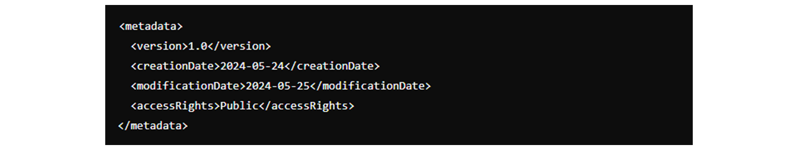
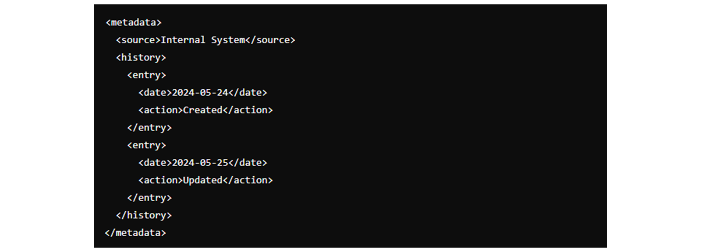
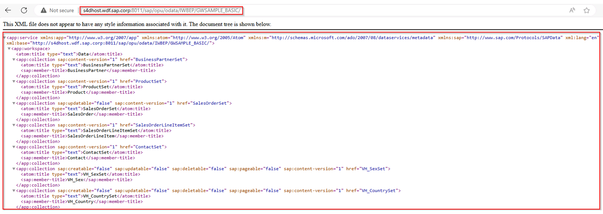
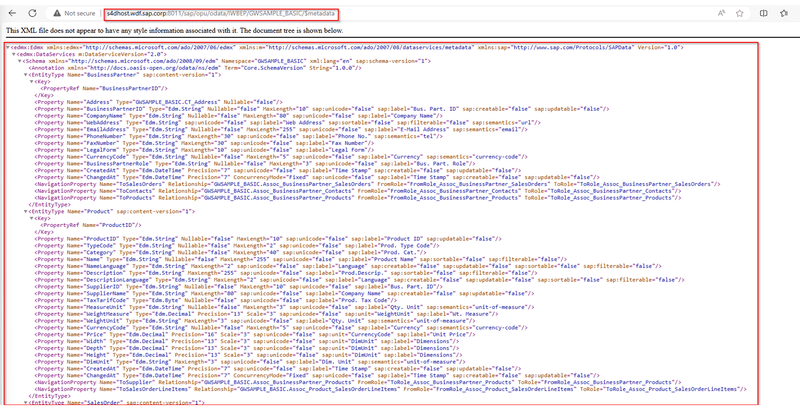

# ♠ 4 [DESCRIBING COMMON USES OF METADATA IN XML](https://learning.sap.com/learning-journeys/developing-with-sap-integration-suite/describing-common-uses-of-metadata-in-xml)

> :exclamation: Objectifs
>
> - [ ] Describe common uses of Metadata in XML

## :closed_book: COMMON USES OF METADATA IN XML

### METADATA IN XML

La fonctionnalité de **metadata** remplit plusieurs fonctions importantes, en particulier dans les contextes où les données doivent être comprises, traitées ou partagées par **différents systèmes** et **utilisateurs**. Voici les utilisations courantes des **metadata** en **XML**.

### DESCRIPTIVE INFORMATION

#### :small_red_triangle_down: **Purpose: To provide a high-level description of the XML document** :

- _Author_: Identifie le créateur du document.

- _Title_: Fournit un titre ou un nom bref pour le document.

- _Description_: Offre un résumé du contenu et de l'objectif du document.

- _Keywords_: répertorie les mots-clés pertinents pour le document, facilitant ainsi la recherche et la catégorisation.

### STRUCTURAL INFORMATION

#### :small_red_triangle_down: **Purpose: To describe the structure and format of the XML document** :

- _Schema Location_: pointe vers le fichier de schéma (XSD) qui définit la structure du document.

- _Namespaces_: déclare les espaces de noms XML utilisés dans le document, garantissant que les noms d'éléments et d'attributs sont uniques et évitant les conflits.

### ADMINISTRATIVE INFORMATION

#### :small_red_triangle_down: **Purpose: To manage and control the usage and versioning of the document** :

- _Version_: Spécifie la version du document.

- _Creation Date_: Indique quand le document a été créé.

- _Modification Date_: Enregistre la dernière fois que le document a été modifié.

- _Access Rights_: définit qui peut accéder ou modifier le document.

### TECHNICAL INFORMATION

#### :small_red_triangle_down: **Purpose: To provide technical details that assist in the processing of the document** :

- _File Size_: indique la taille du document.

- _Format_: Spécifie le format ou l'encodage utilisé dans le document.

- _Checksum_: fournit une valeur de checksum (somme de contrôle) pour vérifier l'intégrité du document.

### PROVENANCE INFORMATION

#### :small_red_triangle_down: **Purpose: To track the origin and history of the document** :

- _Source_: Indique la source d'où provient le document.

- _History_: enregistre les modifications et les mises à jour apportées au document au fil du temps.

### RIGHTS MANAGEMENT

#### :small_red_triangle_down: Purpose: **To manage intellectual property rights and usage terms** :

- _Licence_: Spécifie les conditions de licence sous lesquelles le document peut être utilisé.

- _Copyright_: indique le détenteur du droit d’auteur et les informations associées.

- _Usage Restrictions_: répertorie toutes les restrictions sur l'utilisation ou la distribution du document.

### ENHANCING METADATA IN ODATA SERVICES

Pour relever les défis que nous avons rencontrés, une solution proposée consiste à étendre le `$metadata` **endpoint**[^1] pour fonctionner lui-même comme un **service OData**.

Pour utiliser la fonctionnalité **$metadata**, utilisez l'URL GET suivante, où vous devez insérer vos paramètres individuels comme suit :

xml
http://<yourAPI>:<PORT>/$metadata

### SUMMARY

> Les **metadata XML** sont essentielles pour fournir le **contexte**, la **structure** et le **contrôle** des **documents XML**. Il améliore la **convivialité** du document en offrant des **informations descriptives**, **structurelles**, **administratives**, **techniques**, de **provenance** et de **gestion des droits**. En intégrant des metadata dans XML, les utilisateurs et les systèmes peuvent mieux comprendre, gérer et utiliser les données efficacement.

---

[^1]: Un endpoint (ou point de terminaison en français) est une URL spécifique d'une API (Application Programming Interface) qui permet à un client (comme une application ou un navigateur) de communiquer avec un serveur pour effectuer des actions ou récupérer des données. Par exemple : GET https://api.example.com/users (Endpoint pour récupérer la liste des utilisateurs), POST https://api.example.com/users (Endpoint pour créer un nouvel utilisateur).
