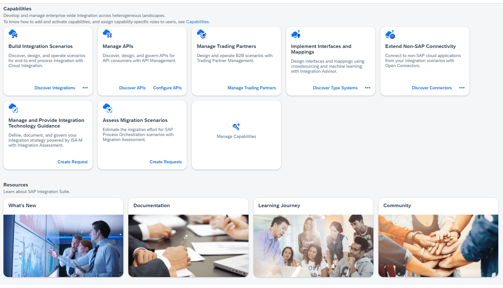

# ♠ 2 [POSITIONING OF THE INTEGRATION SUITE FROM A MORE TECHNICAL PERSPECTIVE](https://learning.sap.com/learning-journeys/developing-with-sap-integration-suite/positioning-of-the-integration-suite-from-a-more-technical-perspective_e5874277-92fd-43d8-b59e-70a49a9fb3aa)

> :exclamation: Objectifs
>
> - [ ] Explore API management

## POSITIONING OF THE INTEGRATION SUITE FROM A MORE TECHNICAL PERSPECTIVE

**SAP Integration Suite** est le **toolkit** recommandée par SAP pour **simplifier** et **accélérer** l'intégration des **SAP, partner, and third-party integration scenarios**. Le terme [iPaaS](../☼%20UNIT%200%20-%20Lexicon/♠%20iPaaS.md) (Integration as a Service) a également été inventé à cet effet.

Ce qui suit montre la **SAP Integration Suite** avec ses principales capacités.

### THE CAPABILITIES ARE AS FOLLOWS

#### :small_red_triangle_down: **Integration Assessment** :

Adoptez une méthode **structurée** et bien **dirigée** pour **designing** et **implementing** votre **stratégie d’intégration d’entreprise**.

1. Améliorez l'intégration grâce aux *best practices optimales* : rationalisez l'intégration à l'aide d'une _approche structurée_ fondée sur la **SAP Integration Solution Advisory Methodology** (méthodologie de conseil en solution d'intégration SAP) (ISA-M).

2. Accédez aux *recommandations pour l'intégration* : utilisez les _dernières recommandations technologiques d'intégration SAP_ pour **streamline processes** (rationaliser les processus) et les **automate tasks**.

3. Produire de la _documentation_ : améliorez la communication entre les _project teams_ et les _system integrators_ en _documentant_ minutieusement votre _stratégie_ et votre _infrastructure d'intégration_.

4. Engagez-vous en _collaboration_ avec l'entreprise : répondez plus rapidement grâce à une **built-in request feature** (fonctionnalité de demande intégrée) de l'entreprise et gérez les changements plus efficacement.

#### :small_red_triangle_down: **Cloud Integration** :

Développez et exécutez des **integration flows** dans des **environnements cloud**, **on-premise** et **hybrides** pour des **scénarios d'application-to-application** (A2A), **business-to-business** (B2B) et de **business-to-government** (B2G).

1. Utilisez plus de *3 200 prebuilt integrations* : **Streamline integration** (rationalisez l’intégration) entre SAP et les applications et sources de données tierces.

2. Accélérez votre _rythme_ (pace) avec une *interface Web assistée par l'IA* : concevez et supervisez efficacement des **flux d'intégration intuitifs** (Efficiently design and oversee intuitive integration flows) avec rapidité et simplicité.

3. _Accélérez la mise en œuvre_ de l'interface : utilisez les **message-mapping recommendations sourced** (recommandations de mappage de messages) provenant d'une **crowd**.

4. _Revamp_ (Réorganisez) l'intégration dans le *cloud* : abandonnez les anciens outils d'intégration sur site tels que SAP Process Orchestration.

#### :small_red_triangle_down: **API Management** :

Garantissez la **sécurité**, la **gouvernance** et la **transformation** de vos API grâce à des **processus de gestion et de livraison**, comprenant un **intuitive catalog**, une **documentation** complète ainsi que des **policies** and **protocols** qui favorisent l'innovation tout en vous protégeant contre les menaces.

1. *Standardisez vos API* : établissez des _URL_ et des _API_ cohérentes en utilisant votre _propre domaine_ et développez le _modèle de données SAP prédéfini_ avec **Graph** pour faciliter les _connexions_ entre _SAP_ et les _systèmes tiers_.

2. *Protégez vos API* : défendez-vous contre les menaces de sécurité, gérez le trafic et mettez les données en cache en périphérie à l'aide de plus de _40 preconfigured policies_.

3. *Libérez et supervisez vos API* : stimulez l'innovation à un rythme rapide grâce à des _user-friendly APIs_ qui peuvent être _rapidement publiées_ et _gérées_ sous votre _propre domaine_ et votre _propre marque_.

#### :small_red_triangle_down: **Integration Advisor** :

Tirez parti d'une **crowdsourced machine learning method** (méthode d'apprentissage automatique participative) pour relever les **défis majeurs** rencontrés dans les **scénarios d'intégration business-to-business** (B2B), d'**application-to-application** (A2A) et de **business-to-government** (B2G).

1. Collaborez avec des *standardized message formats* : permettez la prise en charge de divers _partenaires commerciaux_ en utilisant _divers formats de messages standard du secteur_.

2. Obtenez une _plus grande vitesse_ grâce aux _message type definitions_ (définitions de types de messages) : réduisez le temps de mise en œuvre en utilisant une **prebuilt industry-standard message type definitions** (bibliothèque de définitions de types de messages prédéfinies et conformes aux normes de l'industrie).

3. _Streamline message implementation_ (Rationalisez la mise en œuvre des messages) : établissez et documentez des **message implementation guidelines** (directives de mise en œuvre des messages) adaptées au contenu industriel et géographique.

4. *Accélérez le mappage des messages* : facilitez la création **message-mapping artifacts** (d'artefacts de mappage de messages) grâce aux propositions de **AI-generated mapping proposals** (mappage générées par l'IA).

#### :small_red_triangle_down: **Trading Partner Management** :

**Develop** et **upkeep** (maintenir) des **trading partner profiles** (profils de partenaires commerciaux) pour capturer les **exigences business-to-business** (B2B) distinctives de chaque partenaire.

1. _Streamline partner management_ (Rationalisez la gestion des partenaires) : simplifiez la gestion des scénarios d’intégration B2B impliquant plusieurs trading partners.

2. _Accélérez le partner onboarding_ (l’intégration des partenaires) : initiez rapidement une collaboration avec de nouveaux partenaires grâce à un processus d’intégration intuitif.

3. _Créez des partner agreements_ (accords de partenariat) : établissez des accords de trading partner partenaires commerciaux qui délimitent les relations et structurent les transactions commerciales pertinentes.

4. _Monitor integration_ (Surveillez l'intégration) avec les partenaires : surveillez vos intégrations avec les trading partner (partenaires commerciaux) pour garantir des transactions transparentes (seamless).

5. *Échangez des données avec des partenaires* : exploitez de solides capacités d'intégration cloud pour partager des données commerciales avec des partenaires commerciaux.

#### :small_red_triangle_down: Open Connectors :

**Streamline connectivity** (Rationalisez la connectivité) à plus de **170 third-party applications and solutions** destinées à la **collaboration**, à la **messagerie**, au **CRM**[^1], au **help desk** et à divers autres scénarios.

1. *Réalisez des progrès rapides avec des preconfigured connectors* : **Streamline** (rationalisez), **standardisez** et **accélérez** la **connectivité** avec des **applications cloud tierces** (third-party cloud applications).

2. _Utilisez les API RESTful et JSON_ pour votre travail : bénéficiez des **open data formats**, quelle que soit l'**underlying architecture** (architecture sous-jacente) des **services tiers**.

3. *Convertir les champs de données* : appliquez les **shared resource definitions** (définitions de ressources partagées) d'une ou de plusieurs applications tierces à un **format standardisé**.

4. Prise en charge des _bulk data operations_ (opérations de données en masse) : normalisez le processus de chargement et de téléchargement de données, quelle que soit l'**underlying service architecture** (architecture de service sous-jacente).

#### :small_red_triangle_down: **Asssess Migration Scenarios** :

Faites passer votre environnement de **SAP Process Orchestration** à **SAP Integration Suite**, en garantissant la préparation future en migrant vers une plateforme d'intégration en tant que service ([iPaaS](../☼%20UNIT%200%20-%20Lexicon/♠%20iPaaS.md)). Construisez un **enterprise landscape heterogeneous et hybrid**, catalysant la transformation de l’organisation en une entreprise intelligente.

1. *Optimizing solutions* : évaluez votre paysage d'intégration existant et examinez les aspects clés. Estimez l’effort de migration potentiel.

2. *Enhance project planning* : configurez la fonctionnalité [PI Migration Assessment](../☼%20UNIT%200%20-%20Lexicon/♠%20PI%20Migration%20Assessment.md) et facilitez les _connexions sécurisées_ via des **internal or external access points**. Identifiez les **access points** (obstacles techniques) et proposez des solutions potentielles.

3. *Expertise in implementation* : utilisez le **migration assessment tool** (l'outil de d'évaluation de la migration) et le **migration tool** (l'outil de migration) pour offrir aux utilisateurs SAP une expérience moderne et conviviale, accélérant ainsi le processus de migration.

### THE ADD-ON CAPABILITIES ARE AS FOLLOWS

#### :small_red_triangle_down: **[Event Mesh](../☼%20UNIT%200%20-%20Lexicon/♠%20Event%20Mesh.md)** (Mmaillage d'événement) :

Permettez aux **applications** de **communiquer de manière asynchrone** en **temps réel** dans des paysages distribués à l’aide d’un service cloud entièrement géré qui adopte des [event-driven architectures](../☼%20UNIT%200%20-%20Lexicon/♠%20Event-Driven%20Architecture.md). Mettez en œuvre des **event-driven process integration patterns** (modèles d’intégration de processus évolutifs basés sur les événements) et **handle peak loads** (gérez les charges de pointe) dans les environnements.

1. *Natively respond to application events* : réagissez plus rapidement aux événements provenant de **core SAP solutions** (solutions SAP de base) telles que les solutions **SAP S/4HANA** et **SAP SuccessFactors**, ainsi que de **sources tierces**.

2. *Establish connections across different landscapes and geographical locations* : distribuez et abonnez-vous à des **business events** (événements commerciaux) provenant de **sources SAP** et **tierces** dans des **environnements hybrides**, **multi-cloud** et **Edge**.

3. *Effectively handle events with confidence* : _administrez_, _supervisez_ et _visualisez_ le **decentralized event streaming** (streaming d'événements décentralisés) dans des **paysages distribués**.

#### :small_red_triangle_down: **SAP Graph** :

Utilisez une **API unifiée** pour accéder aux **SAP-managed data** (données gérées par SAP) qui peuvent être utilisées pour créer de nouvelles extensions et applications à l'aide de données SAP.

#### :small_red_triangle_down: **Cloud Transport Management** :

Gestion des produits logiciels entre comptes dans différents environnements en les transportant sur différentes durées.

### ON-TOP CAPACITIES ARE AS FOLLOW

#### :small_red_triangle_down: **SAP Business Accelerator Hub** :

**Jumpstart** pour les projets d'intégration avec des [API](../☼%20UNIT%200%20-%20Lexicon/♠%20API.md), du **packaged integration content** (contenu d'intégration packagé) et des **adaptateurs**[^2].

### RESOURCES

- Éditions Basic et Standard : [SAP-Integration-Suite](https://www.sapstore.com/solutions/55519/SAP-Integration-Suite)

- SAP Discovery Center : [Suite d'intégration SAP dans Discovery Center](https://discovery-center.cloud.sap/serviceCatalog/integration-suite?region=all)

- Communauté SAP : [plateforme technologique d'entreprise SAP](https://community.sap.com/topics/extension-suite)

- Page produit SAP - Premiers pas avec SAP BTP : [intégration](https://www.sap.com/germany/products/technology-platform/integration.html)

- Point de vue technique : [paysage technique, environnement Cloud Foundry](https://help.sap.com/viewer/368c481cd6954bdfa5d0435479fd4eaf/Cloud/en-US/cc22301edf174cc9bf7337c6c66fb704.html)

### SUMMARY

> Nous faisons la distinction entre les capacités principales (**core capabilities**), les capacités complémentaires (**add-on capabilities**) et les capacités complémentaires (**add-on capabilities**). Les fonctionnalités de base sont implémentées dans **Integration Suite**. Les fonctionnalités les plus importantes sont l'**API Management** et le **Cloud Integration**.

---

[^1]: Un CRM (Customer Relationship Management, ou gestion de la relation client en français) est un système ou une stratégie utilisée par les entreprises pour gérer et optimiser leurs interactions avec leurs clients et prospects.
[^2]: Un adaptateur (ou adapter) est un composant, un outil ou une couche intermédiaire qui permet à deux systèmes, applications ou protocoles, qui ne sont pas directement compatibles, de fonctionner ensemble.
