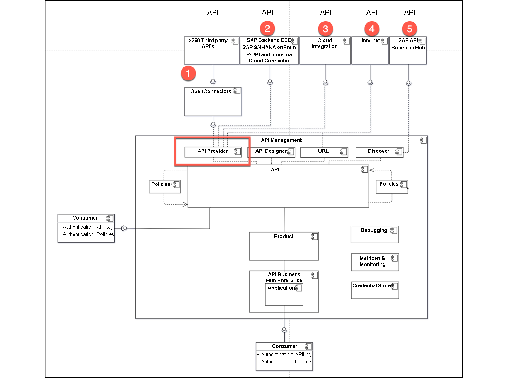
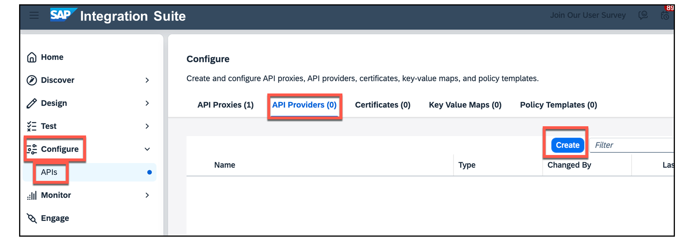
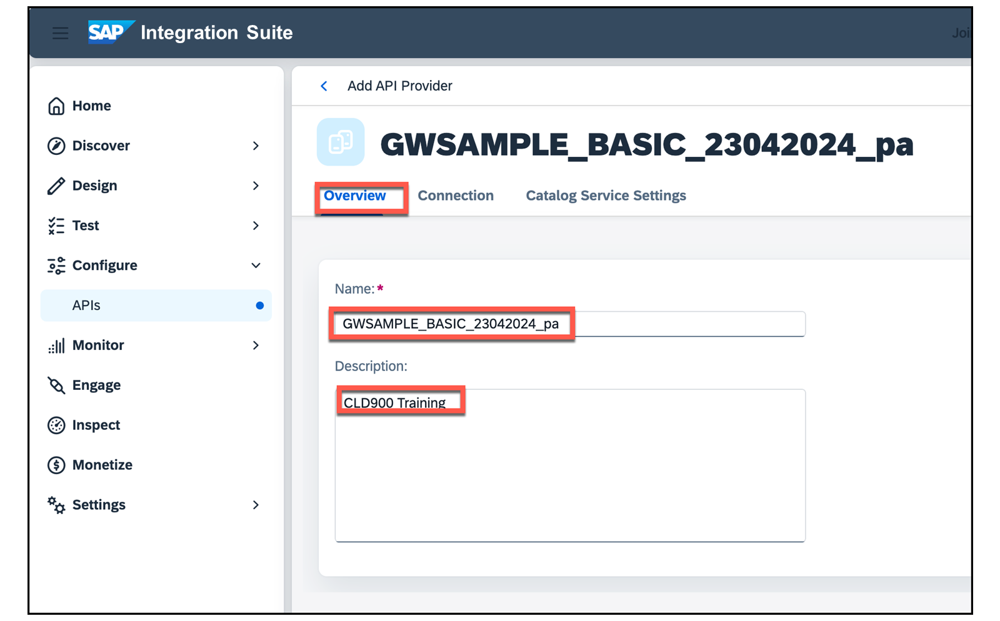
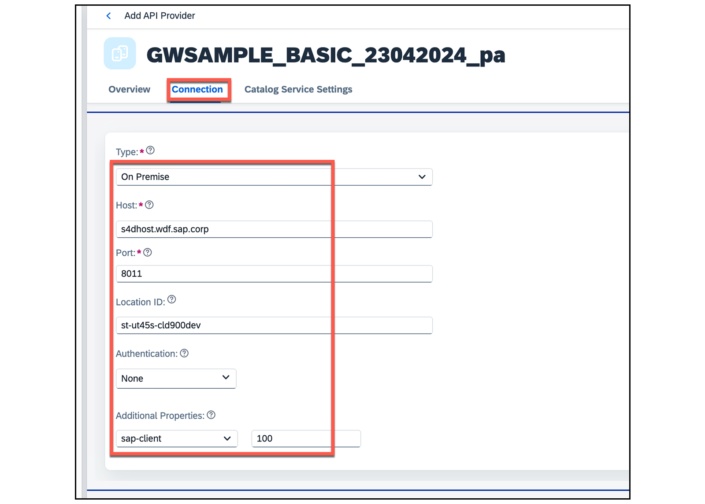
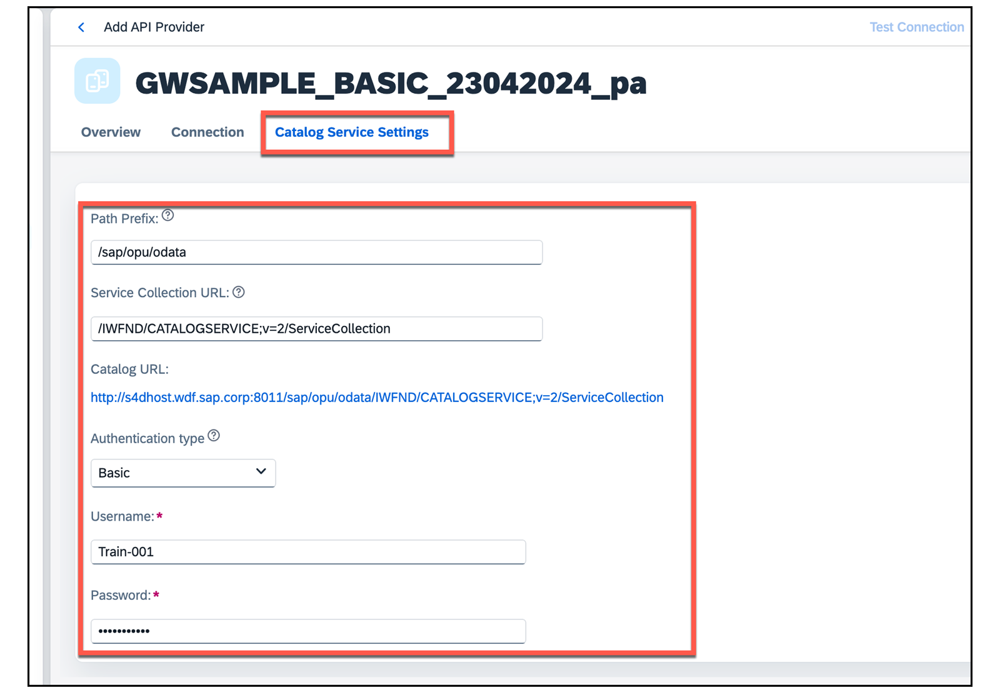
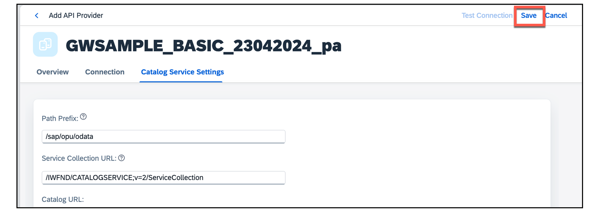
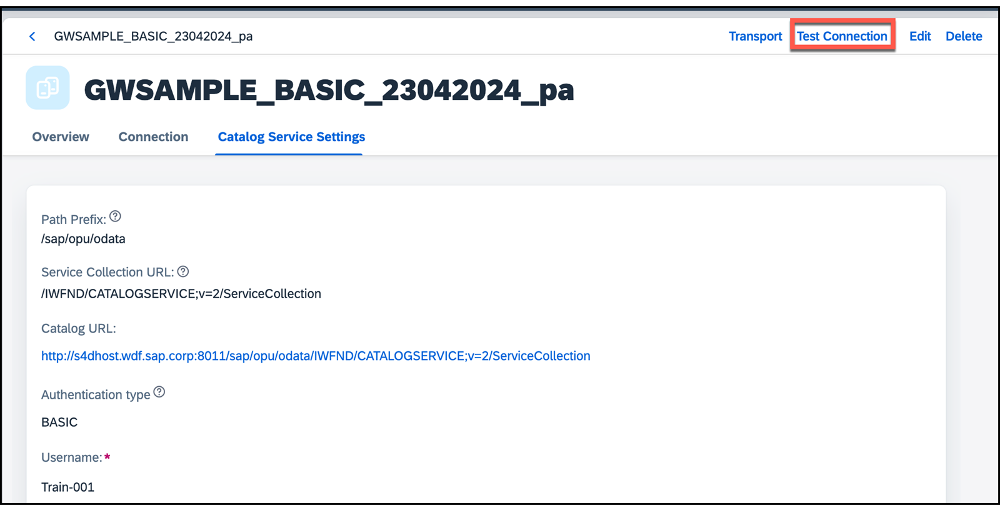
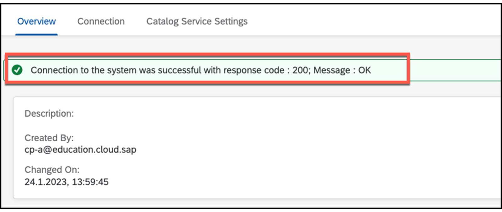
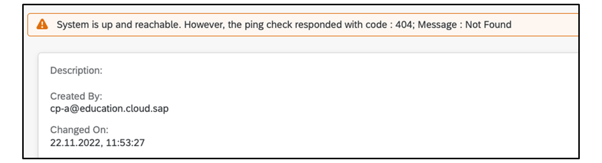

# ♠ 3 [CREATING AN API PROVIDER](https://learning.sap.com/learning-journeys/developing-with-sap-integration-suite/creating-an-api-provider_b95113e7-369f-4dd3-9773-ec4e0fde2e00)

> :exclamation: Objectifs
>
> - [ ] Create an API provider using the SAP Integration Suite

## API PROVIDER CREATION

### THE ROLE OF AN API PROVIDER

> #### :bookmark: [API Provider](../☼%20UNIT%200%20-%20Lexicon/♠%20API%20Provider.md)
>
> Un [API Provider](../☼%20UNIT%200%20-%20Lexicon/♠%20API%20Provider.md) définit les détails de connexion pour les services exécutés sur des hosts spécifiques dont vous souhaitez accéder aux détails. Vous pouvez utiliser un [API Provider](../☼%20UNIT%200%20-%20Lexicon/♠%20API%20Provider.md) pour définir les éléments suivants :
>
> - **Détails de l’hosts** auquel vous souhaitez qu’une application atteigne.
>
> - Définissez tous les **détails supplémentaires** nécessaires pour **établir la connexion**, par exemple les paramètres de proxy[^1].
>
> 
>
> Un [API Provider](../☼%20UNIT%200%20-%20Lexicon/♠%20API%20Provider.md) peut se connecter aux sources suivantes :
>
> - N°1 : [Open Connectors](../☼%20UNIT%200%20-%20Lexicon/♠%20Open%20Connector.md)
>
> - N°2 : via [Cloud Connector](../☼%20UNIT%200%20-%20Lexicon/♠%20Cloud%20Connector.md) vers tous les backends SAP On-Prem (ECC, SAP S/4HANA On-Prem, PI, PO, etc.)
>
> - N°3 : **Intégration Cloud** qui fournit une **API OData** ou une **API SOAP**
>
> - N°4 : Les [API](../☼%20UNIT%200%20-%20Lexicon/♠%20API.md) issues d'Internet
>
> - N°5 : Depuis le **SAP Business Accelerator Hub** pour le prototypage

### PROCEDURE FOR CREATING AN API PROVIDER

Les étapes suivantes doivent être effectuées dans l'ordre :

1.  Démarrez le **wizard** (l'assistant) en allant dans [Configure] → [APIs] → [API Provides] → [Create] :

    

2.  Dans l'onglet [Overview], entrer un [Name] et une [Description].

    

3.  Dans l'onglet [Connection], Entrer les **données de connection**.

    

    > :pushpin: Note:
    >
    > Utiliser votre propres détails Host pour vous connecter au Backend System

    L'affectation suivante s'applique :

    - Internet : n°4

    - On-premise : n° 2

    - [Open Connectors]() : n° 1

    - [Cloud Integration]() : n° 3

      Chaque type utilise des _configuration data différentes_. Une liste détaillée des paramètres qui doivent être définis est disponible sur : [Create an API Provider](https://help.sap.com/docs/SAP_CLOUD_PLATFORM_API_MANAGEMENT/66d066d903c2473f81ec33acfe2ccdb4/6b263e2c1b2d4d9ba20bcd7872eedd9e.html?locale=en-US)

4.  Dans l'onglet [Catalog Service Settings], saisissez les **Catalog Service Settings data** (données Paramètres du service de catalogue).

    

    Les informations de **Path** (n°1) sont **standardisées** dans **SAP S/4HANA**. Le **catalog service** et le **Path** (chemin d'accès) se trouvent dans la _transaction_ **[/n/IWFND/MAINT_SERVICE]** sur le système backend SAP. Une autorisation de base est requise pour accéder au **catalog server**.

5.  Testez votre [API Provider](../☼%20UNIT%200%20-%20Lexicon/♠%20API%20Provider.md).

    Lorsque vous [save] les entrées, l'[API Provider](../☼%20UNIT%200%20-%20Lexicon/♠%20API%20Provider.md) créé peut être **testé**. Pour ce faire, utilisez d'abord le bouton [save] → [Test Connection].

    

    

    En fonction du **type**, un test réussi aura l'un des résultats suivants :

    - #### :small_red_triangle_down: **Type Internet and On-Prem** :

      Le code d'état **HTTP 200** signifie que la connexion au système backend est correctement configurée :

      

    - #### :small_red_triangle_down: **Type Open Connectors and Cloud integration** :

      Le statut code http n'est pas 200 mais reste correct car c'est un ping :

      

### SOURCES

Les sources sont disponible sur le SAP Help Portal : [API Providers](https://help.sap.com/docs/SAP_CLOUD_PLATFORM_API_MANAGEMENT/66d066d903c2473f81ec33acfe2ccdb4/42e13b2749d5484da2d26931a5fb5d35.html?locale=en-US)

### SUMMARY

> Un [API Provider](../☼%20UNIT%200%20-%20Lexicon/♠%20API%20Provider.md) encapsule l'**accès aux API** provenant de **diverses sources**. Plus de **260 third-party REST-based APIs** sont connectées via **Open Connector**. Les systèmes backend SAP tels que **SAP S/4HANA On-Prem** ou **ECC/PI/PO** peuvent être connectés via le **Cloud Connector**. Les **API SOAP** peuvent également être mises à disposition via l'**intégration cloud**. Au final, presque toutes les [API](../☼%20UNIT%200%20-%20Lexicon/♠%20API.md) peuvent être connectées. La procédure de connexion d'une **foreign API** est contrôlée par un **wizard**.

[Exercices](https://learning.sap.com/learning-journeys/developing-with-sap-integration-suite/creating-an-api-provider_b95113e7-369f-4dd3-9773-ec4e0fde2e00)

---

[^1]: Un proxy est un intermédiaire qui agit comme un relais entre un client (comme un navigateur web) et un serveur, dans le but de gérer, contrôler ou modifier les requêtes et les réponses échangées entre ces deux parties. Le proxy peut être utilisé pour diverses raisons, telles que la sécurité, la performance, ou la gestion du trafic.
