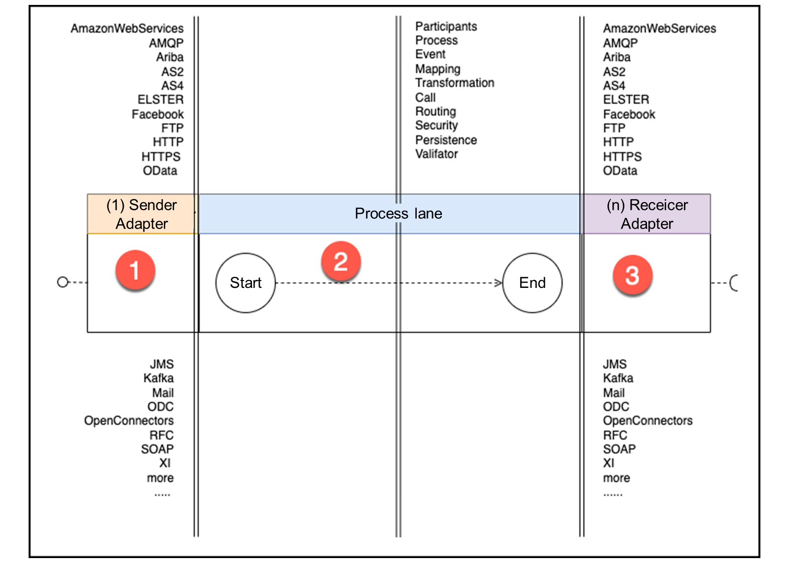
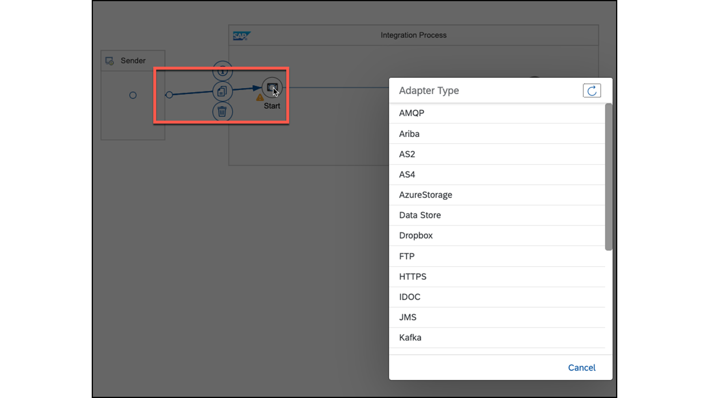
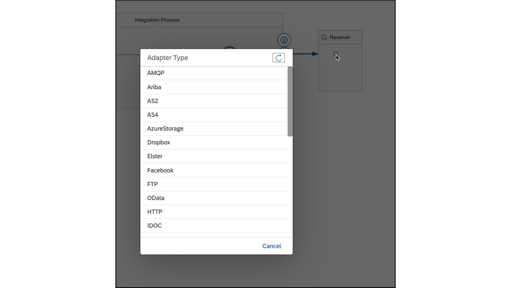
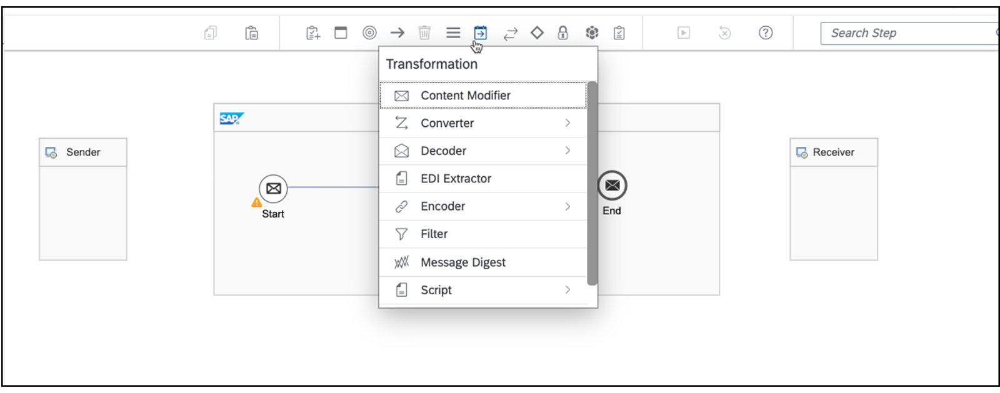
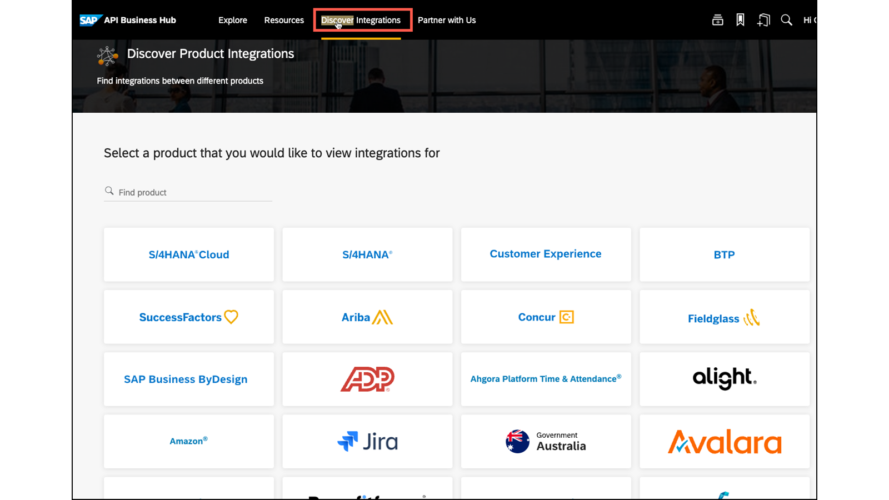
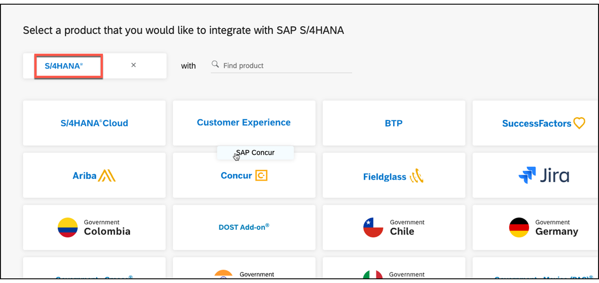
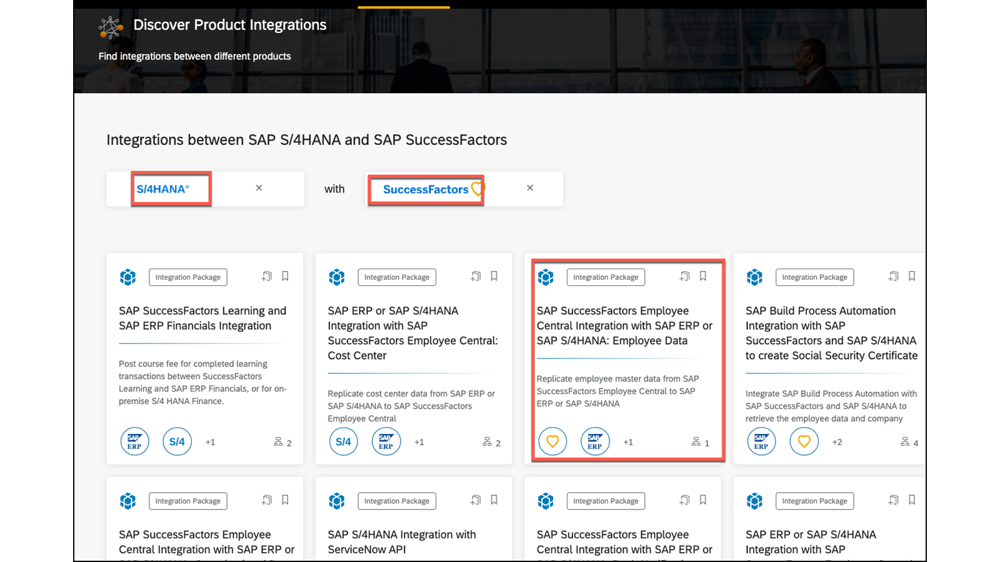
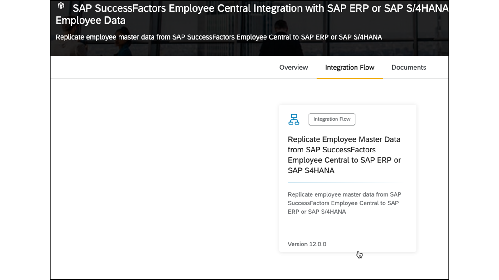
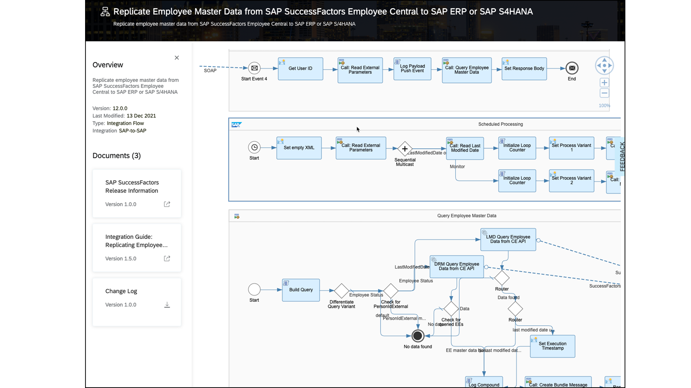

# ♠ 1 [INTRODUCTION CLOUD INTEGRATION](https://learning.sap.com/learning-journeys/developing-with-sap-integration-suite/introducing-cloud-integration_b3692797-cbf6-44ac-9b05-20b77411fa96)

> :exclamation: Objectifs
>
> - [ ] Describe the complete Integration Flow process which we will implement in the next exercises

## INTRODUCTION TO CLOUD INTEGRATION

### WHAT IS SAP CLOUD INTEGRATION?

Les affirmations suivantes tentent de répondre à la question :

- Il s'agit de l'une des fonctionnalités **core** de **SAP Integration Suite**.

- Il est basé sur le **framework open source Camel** de l'**Apache Software Foundation**.

- **SAP Cloud Integration** prend en charge l'**intégration des processus** de bout en bout via l'**échange de messages**

- Le **développement**, le **déploiement** et le **monitoring** s'effectuent dans le **navigateur** avec des **outils graphiques**

- C'est l'un des outils **Low Code/No Code**

### KEY FEATURES

Un integration flow possède un **0-1 sender adapter** (adaptateur d’expéditeur 0-1). Le message est transmis via un **endpoint** si un **adaptateur** est configuré. Différents **sender adapters** (adaptateurs d'expéditeur) sont disponibles du côté **sender side**.

- (N°1) Après réception du message, le processus est lancé via un **startup event Start**. Viennent ensuite des **predefined processing steps** (étapes de traitement prédéfinies).

- (N°2) Il existe un large éventail de capacités d'intégration qui définissent différentes manières de traiter les **messages** sur l'**integration platform**.

- (N°3) En fin de compte, les **receiver adapters** peuvent être **configurés** pour **compléter** le **processus métier**.

Le **traitement des messages** peut être effectué de **manière synchrone** ou **asynchrone**. Grâce à ce concept, de **nombreux modèles d'intégration d'entreprise** bien connus peuvent être **mapped**.

#### :small_red_triangle_down: **Connectivity** :

Les **sender and receiver adapters** sont **différents**. Vous pouvez créer votre propre adaptateur. Pour ce faire, vous pouvez utiliser le **Software Development Kit** fourni.

Pour déterminer quels **adaptateurs** sont disponibles en fonction de votre licence, vous pouvez afficher les adaptateurs après avoir **créé un modèle de projet vide**, comme décrit dans l'exercice suivant. Effectuez les étapes suivantes :

1. Commencez avec un modèle de projet vide modifiable :

   

2. Tracez une ligne entre le **channel** et le **Start event**. Les adaptateurs disponibles sont affichés :

   

3. Procédez de la même manière du côté **recipient's side** :

   

#### :small_red_triangle_down: **Integration Capabilities** :

Toutes les **capacités d'intégration** sont **catégorisées**. Parmi eux figurent les **étapes de traitement prédéfinies**. Un **integration flow** combine désormais les **capacités individuelles** pour, par exemple, **map a technical process**. Il n'y a presque aucune limite aux possibilités de combinaison. Pour examiner toutes les fonctionnalités d'intégration disponibles avec les étapes individuelles affectées, vous pouvez à nouveau démarrer avec le modèle de processus vide. Vous trouverez la **tool palette** en haut de votre écran. Chaque icône décrit une fonctionnalité dans le **cloud integration user interface**.

Dans le cas suivant, cela devient visible au niveau de la capacité de transformation.

#### :small_red_triangle_down: **Predefined Integration Content** :

Comme indiqué précédemment, l’art de combiner les capacités d’intégration de cette manière est qu'il devient un processus professionnel. Les **integration flows** peuvent être **complexes**. SAP propose plus de **400 integration flows** prédéfinis qui peuvent être consommés.

Il existe **deux manières d'étudier le contenu d'intégration prédéfini**. Un parcours directement via Integration Suite est présenté à la fin du cours. L'autre variante est décrite dans le paragraphe suivant.

### EXPLORE PREDEFINED INTEGRATION CONTENT IN SAP BUSINESS ACCELERATOR HUB

Tous les **contenus d'intégration prédéfinis disponibles** sont répertoriés dans **SAP Business Accelerator Hub**, en fonction des produits à intégrer.

#### :small_red_triangle_down: **Procedure** :

Les étapes suivantes doivent être effectuées dans l'ordre :

- Ouvrez le **SAP Business Accelerator Hub** sur : [API.SAP.com](https://api.sap.com/)

- Accédez à l'onglet [Discover Integrations]

- **Choisissez** le premier [product]

- **Choisissez** le deuxième [product] qui sera intégré au premier

- **Trouvez** tous les **predefined integration content** disponibles sous forme d'**integration package**, en fonction de votre sélection

- **Naviguez** plus profondément dans un **integration package** et trouvez tous les **integration flows** disponibles

- **Naviguez** plus profondément dans un **integration flow** pour découvrir la **configuration complète**

Plus de détails sur les étapes :

1. Découvrez l'onglet [Integrations] :

   

2. Choisissez le premier [product], par exemple, [SAP S/4HANA] :

   

3. Choisissez le deuxième [product], par exemple [SAP SuccessFactors] :

   

4. Accédez à un [integration package], par exemple, [SAP SuccessFactors Employee Central Integration with SAP ERP ou SAP S/4HANA, Employee Data] :

   

5. Il n’existe qu’un seul [integration flow] disponible. Accédez à cet [integration flow] :

   

Vous trouverez ici toutes les informations pour comprendre cet [integration flow] :

- _Les configurations de toutes les étapes_

- _Les documentations commerciales_

- _Et plus_

Pour utiliser ce integration package ou integration flow, vous devez utiliser le menu Discover dans Integration Suite. Ceci est démontré par l’exemple des Exemples à la fin des exercices.

### SOURCES

En savoir plus:

#### :small_red_triangle_down: **À propos des fonctionnalités clés** :

- Un aperçu complet des modèles d'intégration d'entreprise peut être trouvé ici : https://www.enterpriseintegrationpatterns.com/

- [Accueil - Apache Camel](https://camel.apache.org/)

#### :small_red_triangle_down: **À propos de la connectivité** :

- Un aperçu complet des adaptateurs actuellement disponibles peut être trouvé ici : [Connectivité (adaptateurs)](https://help.sap.com/docs/CLOUD_INTEGRATION/368c481cd6954bdfa5d0435479fd4eaf/55325f2a722c4f67bb7752b369b09ff8.html?locale=en-US)

- Plus d'informations peuvent être trouvées ici : [Développement d'adaptateurs personnalisés](https://help.sap.com/docs/CLOUD_INTEGRATION/368c481cd6954bdfa5d0435479fd4eaf/7392cc44de7c4450a65b8cd8f1042420.html?locale=en-US)

#### :small_red_triangle_down: **À propos des capacités d'intégration : l'aperçu complet peut être trouvé ici** : [Capacités d'intégration](https://help.sap.com/docs/CLOUD_INTEGRATION/368c481cd6954bdfa5d0435479fd4eaf/e32cedef6e8c4af5816c446541c7f527.html?locale=en-US)

### SUMMARY

> Les individual integration flows sont compilés via des étapes fonctionnelles prédéfinies. Ils sont divisés en catégories telles que le mappage, le routage et autres, et fournis sous forme de palette. Le processus est démarré via exactement un message entrant. Le contenu de ce message peut ensuite être manipulé de diverses manières au cours du processus lui-même. La connectivité et la flexibilité proviennent de nombreux adaptateurs émetteurs et récepteurs. En plus de créer le flux d'intégration individuel, SAP propose plus de 400 flux d'intégration prédéfinis, car ils sont souvent nécessaires dans l'environnement SAP.

## DESCRIBE THE IFLOW PROCESS CREATED IN THE NEXT EXERCICES

[Exercices](https://learning.sap.com/learning-journeys/developing-with-sap-integration-suite/introducing-cloud-integration_b3692797-cbf6-44ac-9b05-20b77411fa96)
