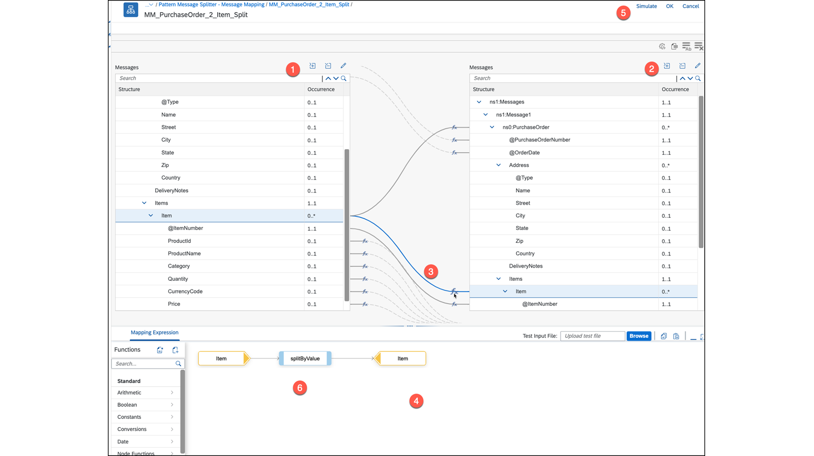
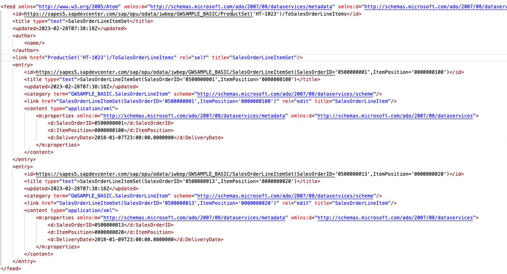
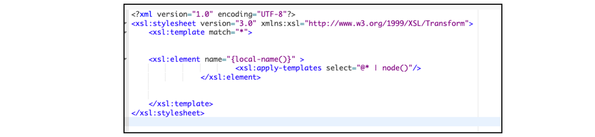
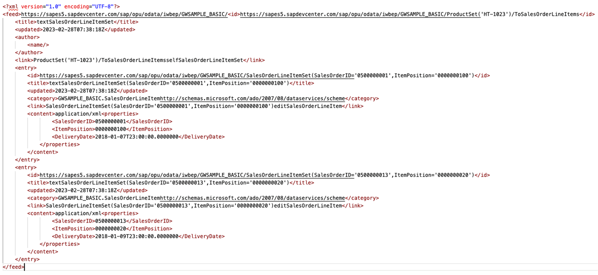
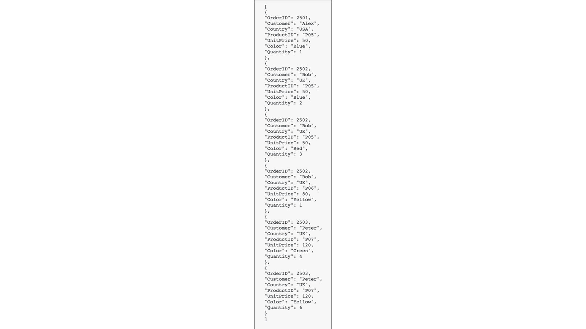
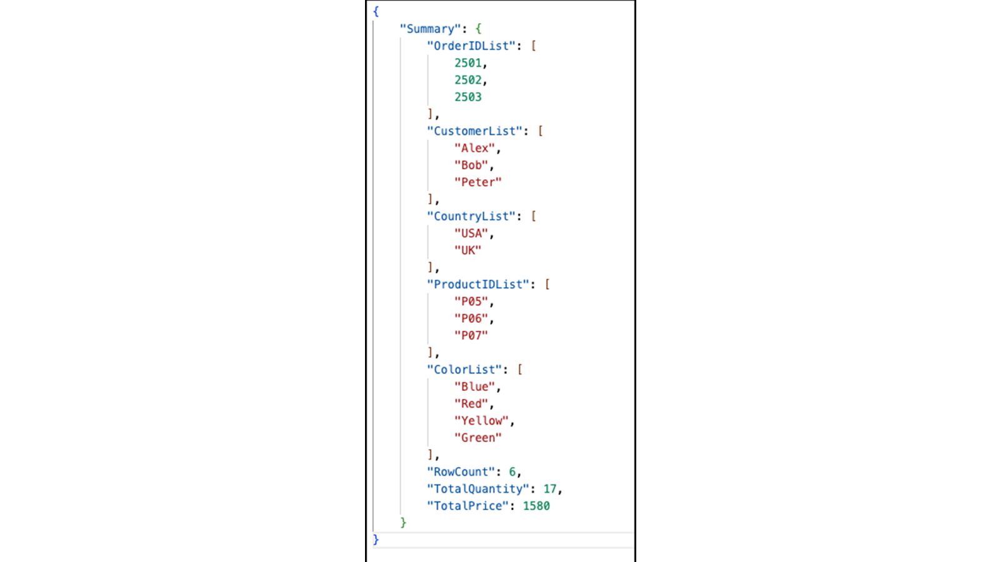

# ♠ 4 [USING MAPPINGS](https://learning.sap.com/learning-journeys/developing-with-sap-integration-suite/using-adapters_f42fdb69-df78-4faf-bfd3-0a7b8c8beebd)

> :exclamation: Objectifs
>
> - [ ] Use adapters

## MAPPINGS

### MAPPINGS IN AN OVERVIEW

Les types de mappage suivants sont disponibles :

- **Message Mapping**.

- **XSLT Mapping**.

- **Mapping with Scripting**.

- **Operation Mapping from Enterprise Service Repository** (On-Premise).

#### :small_red_triangle_down: Message Mapping :

Le **Java SDK** pour le** message mapping** et les **user-defined functions (UDFs)** (fonctions définies par l'utilisateur) est le même que pour les **intégrations de processus**. Pour les utiliser, vous avez besoin du **body** au **format XML ou JSON**. Le **source and destination mapping** (mappage source et destination) peut être défini à l'aide de l'un des types de fichiers suivants :

- **XML Schema Definitions** (XSD)

- **OData V2/V4 metadata files with .edmx or .xml extensions**

- **WSDL**

- **Swagger/OpenAPI Spec JSON file**

##### MAPPING EDITOR

Cette leçon n'implique pas l'utilisation d'un **message mapping**. Le **mapping editor** fournit cependant tous les outils nécessaires pour **mapper les messages XML ou JSON**.

- No. 1: Adding the source structure.

- No. 2: Adding the target structure.

- No. 3: The actual assignment of the values depending on the context.

- No. 4: Other representation of the mapping.

- No. 5: Simulation of the mapping with a source file.

- No. 6: Define a user defined function (UDF).

##### TESTING

Nous pouvons tester/simuler le **mapping** à l’aide du **moniteur**.

##### IMPLEMENTED SAMPLES VIA GUIDELINES

- Guidelines to Implement Specific Integration Patterns Content Filter → Variant: Message Mapping: [Guidelines to Implement Specific Integration Patterns](https://help.sap.com/docs/CLOUD_INTEGRATION/368c481cd6954bdfa5d0435479fd4eaf/eaf929e1e9ac4185b18b545df104f50f.html?locale=en-US)

- Guidelines to Implement Specific Integration Patterns Splitter → Variant with Message Mapping: [Variant with Message Mapping](https://help.sap.com/docs/CLOUD_INTEGRATION/368c481cd6954bdfa5d0435479fd4eaf/f6bb2b7d6860418bbe4c0c40e5cacecd.html?locale=en-US)

- Learn the Basics → Access Header and Properties → Access Header and Properties in Message Mapping: [Access Header and Properties in Message Mapping](https://help.sap.com/docs/CLOUD_INTEGRATION/368c481cd6954bdfa5d0435479fd4eaf/4f2a8c9c588947d7bde463b5959c17aa.html?locale=en-US&q=Camel)

##### IMPLEMENTED SAMPLES VIA TUTORIALS, MISSIONS AND BLOGS

[SAP Cloud Platform Integration (CPI): Use cases of node functions in message mapping | SAP Blogs](https://blogs.sap.com/2019/11/15/sap-cloud-platform-integration-cpi-use-cases-of-node-functions-in-message-mapping/)

##### VIDEOS

[Message Mapping in SAP CPI || Step by Step guide](https://www.youtube.com/watch?v=_gIMlUCwhP8)

##### READ MORE HERE:

- [Message Mapping](https://help.sap.com/docs/CLOUD_INTEGRATION/368c481cd6954bdfa5d0435479fd4eaf/459ccdf98a7542d897c1e802d0be800a.html?locale=en-US)

- [SAP Cloud Integration – Swagger/OpenAPI Spec JSON in Message Mapping | SAP Blogs](https://blogs.sap.com/2020/09/16/sap-cloud-integration-swagger-openapi-spec-json-in-message-mapping/)

#### :small_red_triangle_down: XSLT Mapping :

**XSLT (Extensible Stylesheet Language Transformations)** est un langage initialement conçu pour **transformer des documents XML** en d'autres **documents XML**, ou en d'autres formats tels que **HTML** pour les pages Web, **plain text** (texte brut) ou **XSL Formatting Objects** (objets de formatage XSL), qui peuvent ensuite être convertis en d'autres formats, tels que **PDF**. Une **style sheet** (**style sheet**) est traitée par un **XSLT processor** (processeur XSLT) tel que **Xalan** ou **Saxon**. Les deux sont inclus dans chaque **SDK Java**. Nous utilisons le **mappage XSLT** dans les exercices. Il existe un éditeur en ligne utile, [Groovy IDE](https://groovyide.com/cpi), pour faciliter le développement et le test de vos scripts.

##### SAMPLE

Cet exemple copie le contenu du fichier source sans aucun **namespaces** ni leurs **préfixes** correspondants, et génère un **target file**.

Les **namespaces** sont :

- xmlns:m="http://schemas.microsoft.com/ado/2007/08/dataservices/metadata"

- xmlns:d="http://schemas.microsoft.com/ado/2007/08/dataservices"

- xml:base=„https://sapes5.sapdevcenter.com/sap/opu/odata/iwbep/GWSAMPLE_BASIC/"

Ceci est nécessaire pour pouvoir accéder au contenu de la réponse via **XPATH**.

La **style sheet XSL** crée le document résultat via un **template** qui inclut uniquement les noms et attributs des **éléments d'origine**.

Résultat après transformation :

##### TESTING AND LIMITATIONS

Le test du **XSLT mapping** nécessite le déploiement du **integration flow** ou l'utilisation d'outils externes. Sans déploiement, les tests ne sont pas possibles. Pour accélérer les tâches liées au transport de l'**integration flow**, aux tests et à la gestion des erreurs, vous pouvez utiliser des outils tels que les **DOST Add-on**.

##### IMPLEMENTED SAMPLES VIA GUIDELINES

Learn the Basics → Access Header and Properties → Access Header and Properties in XSLT Mapping: [Access Header and Properties in XSLT Mapping](https://help.sap.com/docs/CLOUD_INTEGRATION/368c481cd6954bdfa5d0435479fd4eaf/f917c39942284e0e971faed3521c4313.html?locale=en-US&q=Camel)

##### BLOGS

- [I heart XSLT mappings | SAP Blogs](https://blogs.sap.com/2019/06/14/i-heart-xslt-mappings/)

- [XSLT mapping for Batch requests in SAP Cloud Platform Integration ( CPI ) | SAP Blogs](https://blogs.sap.com/2019/06/07/xslt-mapping-for-batch-requests-in-sap-cloud-platform-integration-cpi/)

##### READ MORE HERE:

- [XSL Transformations (XSLT) Version 3.0](https://www.w3.org/TR/xslt-30/#whats-new-in-xslt3)

- [Create XSLT Mapping](https://help.sap.com/docs/CLOUD_INTEGRATION/368c481cd6954bdfa5d0435479fd4eaf/5ce1f15f54244d4aa557e9c79d93a684.html?locale=en-US)

#### :small_red_triangle_down: Mapping with Scripting :

Le mapping peut également être implémenté en utilisant **Groovy** ou **JavaScript**

##### SAMPLE

Dans cet exemple, la liste des Articles d'un ordre sont restructurer d'une autre manière.

**Source JSON Payload** :

##### TESTING

Les tests du **Groovy script mapping** (mappage de script Groovy) peuvent être effectués en déployant l'**integration flow** ou en utilisant des outils externes. Il n'est pas possible de tester sans le déployer.

##### READ MORE HERE:

- [SAP HCI/CPI - Cloud Platform Integration : script groovy de mappage de messages SAP CPI pour différents scénarios avec gestion du contexte](https://sapcpidesign.blogspot.com/2021/08/sap-cpi-message-mapping-groovy-script.html)

- [Mappage XSLT ou scripts dans SAP CPI - TechTalkZone](https://www.techtalkzone.com/sap/xslt-mapping-or-scripts-in-sap-cpi/)

#### :small_red_triangle_down: Operation Mapping from Enterprise Service Repository (On-Premise) :

Pour gagner du temps et des efforts lors de la création de ** integration content**, vous pouvez importer le contenu existant de votre **ES repository** directement dans **Cloud Integration**. Pour ce faire, vous devez configurer les paramètres de connexion pour vous connecter au **On-Premise ES system** via **Cloud Connector**. Cela vous permet de réutiliser l'**integration content** créé précédemment et d'éviter le travail redondant dans l'application **Web Cloud Integration**.

##### IMPORT CONTENT FROM ESR

Une fois que vous avez configuré la connexion au **ES repository**, vous pouvez procéder à l'importation du contenu de celui-ci via l'onglet "[Ressources]" de l'éditeur de l'**integration flow**. Maintenant, vous pouvez importer :

- **Message mapping**

- **Value mapping**

- **Operation mapping**

- **WSDL**

##### READ MORE HERE:

- [Importing Content from ES Repository](https://help.sap.com/docs/CLOUD_INTEGRATION/368c481cd6954bdfa5d0435479fd4eaf/53db5fb382b54bba86abb413bd3711a7.html?locale=en-US)

- [Configuring Connectivity to ES Repository](https://help.sap.com/docs/CLOUD_INTEGRATION/368c481cd6954bdfa5d0435479fd4eaf/8c36fd29df9a4e7bae8ce2699f6abbfd.html?locale=en-US)

- [Importing Mapping Content from ES Repository](https://help.sap.com/docs/CLOUD_INTEGRATION/368c481cd6954bdfa5d0435479fd4eaf/e18fc05c3ae04c4bb40f12923aaa908c.html?locale=en-US)

- [Importing Message Mapping from ES Repository in SAP Cloud Integration | SAP Blogs](https://blogs.sap.com/2018/02/09/importing-message-mapping-from-es-repository-in-sap-cloud-platform-integration/)

- [Cloud Connector Configuration to Import Message Mapping from ES Repository into SAP Cloud Platform Integration | SAP Blogs](https://blogs.sap.com/2018/03/07/cloud-connector-configuration-to-import-message-mapping-from-es-repository-into-sap-cloud-platform-integration/)

### SUMMARY

> Le **Mapping** est le **processus de conversion d'un format source** en un **format cible** différent à l'aide de diverses techniques dans **SAP Cloud Integration**. Les **source and target structures** doivent d'abord être définies, ce qui peut être fait via des **XSD**, **WSDL** et d'autres définitions dans le **message mapping**. Le **Message Mapping Editor**, qui offre un **context handling** (gestion du contexte), des **user-defined functions** et des **testing options**, est utilisé pour la **build-in variant** (variante intégrée) du mappage aux formats **XML** et **JSON**. La **XSLT procedure**, qui nécessite **XML** comme format d'entrée et propose un éditeur simple, peut créer davantage de formats cibles et est utile pour créer des **attachments** (pièces jointes). Les tests sont effectués via le déploiement de l'**integration flow** ou des outils externes tels que **XML Spy**. Le **Mapping** via des **scripts** offre le plus grand degré de liberté en termes de **formats source et cible** et nécessite un langage écrit prenant en charge les formats, tel que **XMLSlurper** pour le langage de script **Groovy**. Les tests ici sont également effectués via le déploiement de l'**integration flow** ou des outils externes comme **IntelliJ IDEA**. Si toutes les structures de données telles que **XSD** et **WSDL** sont déjà créées dans l'**Enterprise Service Repository**, le **mappage des messages** peut être connecté et utilisé.

## CREATE AND CONFIGURE A CONTENT MODIFIER FOR SALESORDERID AND ITEMPOSITION

[Exercices](https://learning.sap.com/learning-journeys/developing-with-sap-integration-suite/using-mappings_aaf2c8b4-f0ba-4e1f-bdbb-a8445dd0f3a3)
