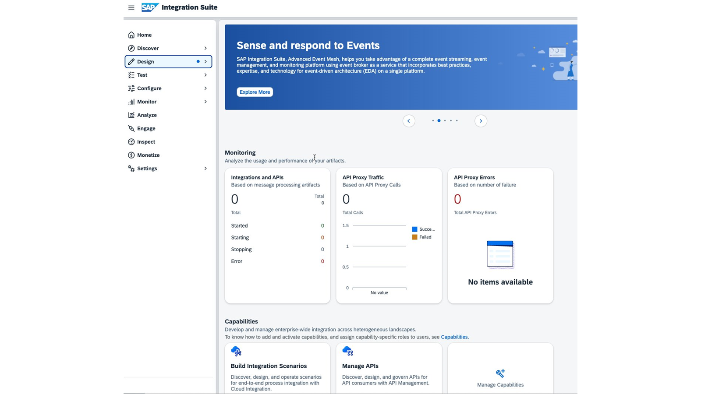
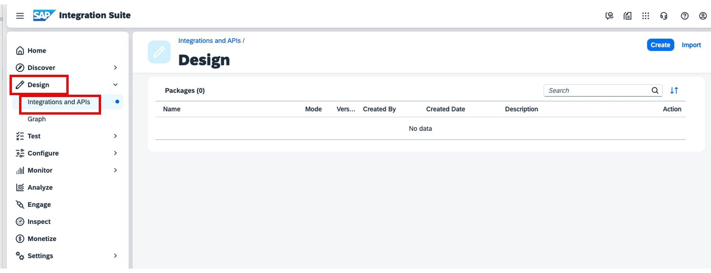

# ♠ 1 [EXPLAINING DISTRIBUTED ARCHITECTURE AND ITS CHALLENGES](https://learning.sap.com/learning-journeys/developing-with-sap-integration-suite/explaining-distributed-architecture-and-their-challenges_ebcaa544-f5ca-4351-b6b6-5eb471ec1464)

> :exclamation: Objectifs
>
> - [ ] Describe the distributed architecture
>
> - [ ] Describe the whole scenario

## :closed_book: DISTRIBUTED ARCHITECTURE AND ITS CHALLENGES

### WHAT IS A DISTRIBUTED ARCHIECTURE?

> #### :bookmark: [Distributed IT System](../☼%20UNIT%200%20-%20Lexicon/♠%20Distributed%20Architecture.md)
>
> Un [Distributed IT System](../☼%20UNIT%200%20-%20Lexicon/♠%20Distributed%20Architecture.md) est un paradigme architectural et, selon l'_Encyclopedia of Business Informatics Online Dictionary_, il est défini comme suit :
>
> "Un [Distributed IT System](../☼%20UNIT%200%20-%20Lexicon/♠%20Distributed%20Architecture.md) comprend des **SubSystems** (des components au sens le plus large) qui sont couplés entre eux dans le cadre d'une architecture spécifique et gèrent les tâches de manière **coopérative**."
>
> En revanche, dans un **monolithic IT system**, les fonctions d’un système sont **bundled** (centralisées). La répartition logique des fonctions du système entre les components peut s'accompagner d'une **coordinated physical decentralization** (décentralisation physique coordonnée) dans un **computer network**.
>
> Nous considérons toutes les IT installations et services comme des components. Par exemple, les **ERP On-Premise applications**, **SAP S/4HANA On-Premise** et/ou **SaaS**.

### EXAMPLE OF A DISTRIBUTED ARCHITECTURE

Vous trouverez ci-dessous un exemple de **customer landscape** (paysage client). Vous voyez que de nombreux systèmes techniques différents communiquent entre eux avec toutes leurs particularités techniques.

### QUELS DEFIS DOIVENT ETRE RESOLUS ?

En raison de l’hétérogénéité, des solutions coûteuses et complexes doivent être recherchées, trouvées et mises en œuvre pour relever les défis suivants :

- _Many different transport and message protocols_

- _Release management_

- _Monitoring_

- _Error identification and correction_

- _Latency_

- _Quality of service_

- _Security_

- _Availability of implementations_

- _Observability_

- _Documentation_

Une façon de surmonter ces défis consiste à utiliser une [API first approach](../☼%20UNIT%200%20-%20Lexicon/♠%20API%20First%20Approach.md).

> #### :bookmark: [API first approach](../☼%20UNIT%200%20-%20Lexicon/♠%20API%20First%20Approach.md)
>
> Une approche API first est une design methodology (méthodologie de conception) dans laquelle l'accent principal du processus de développement est mis sur la conception de l'interface de programmation d'application ([API](../☼%20UNIT%200%20-%20Lexicon/♠%20API.md)) avant tout autre aspect de la solution logicielle. Cette approche met l'accent sur la création d'une [API](../☼%20UNIT%200%20-%20Lexicon/♠%20API.md) well-defined et robust qui répond aux besoins des développeurs et des intégrateurs qui l'utilisent pour créer des applications, des services ou des intégrations.

### KEY ASPECTS OF AN API-FIRST APPROACH INCLUDE :

#### :small_red_triangle_down: **Design-Centric** (Design centré sur la conception) :

La conception d'[API](../☼%20UNIT%200%20-%20Lexicon/♠%20API.md) devient un élément central du software development life cycle (cycle de vie du développement logiciel). Les décisions de conception donnent la priorité à la :

- _Clarity_

- _Consistency_ (cohérence)

- _Usability_

pour garantir que les développeurs peuvent facilement comprendre et utiliser l'[API](../☼%20UNIT%200%20-%20Lexicon/♠%20API.md).

#### :small_red_triangle_down: **Iterative Development** (Développement itératif) :

Les développeurs itèrent sur le **design** (conception) de l'[API](../☼%20UNIT%200%20-%20Lexicon/♠%20API.md) en fonction des **feedback** et de l'**evolving requirements** (évolution des exigences) avant de passer à l'implémentation backend ou à d'autres aspects de l'application.

#### :small_red_triangle_down: **Facilitates Collaboration** (Facilite la collaboration) :

En définissant l'[API](../☼%20UNIT%200%20-%20Lexicon/♠%20API.md) dès le début, différentes équipes (développeurs front-end, backend, mobiles, tiers) peuvent travailler simultanément et de manière **synchronisée**. Cela **réduit les dépendances** et **accélère le développement**.

#### :small_red_triangle_down: **Ensures Scalability and Flexibility** (Garantit l'évolutivité et la flexibilité) :

Une approche axée sur l'[API](../☼%20UNIT%200%20-%20Lexicon/♠%20API.md) favorise la **scalability** (l'évolutivité) car elle encourage la réutilisation de **modular components**. Il offre également la flexibilité nécessaire pour s’adapter aux exigences commerciales changeantes et aux avancées technologiques.

#### :small_red_triangle_down: **Focus on Developer Experience (DX)** (Focus sur l'expérience du développeur) :

Le **DX** devient crucial, dans le but de fournir aux développeurs une **documentation** claire, des **SDKs** (Software Development Kits), des **code samples** et des **outils de test** pour faciliter l'intégration et l'utilisation de l'[API](../☼%20UNIT%200%20-%20Lexicon/♠%20API.md).

#### :small_red_triangle_down: **Supports Ecosystems Growth** (Prend en charge la croissance des écosystèmes) :

Les [API](../☼%20UNIT%200%20-%20Lexicon/♠%20API.md) conçues avec une [API first approach](../☼%20UNIT%200%20-%20Lexicon/♠%20API%20First%20Approach.md) peuvent favoriser un ecosystem autour de la plate-forme ou du service, permettant des **third-party integrations** (intégrations tierces), des **partnership** et l'**innovation**.

### SUMMARY

> Pour les automated technical processes (processus techniques automatisés), la disponibilité de nombreux components logiciels, components installations, components technologies et components spatial sont souvent couplés via des networks avec des protocoles différents.
>
> Les fonctionnalités de ces implémentations sont appelées services.
>
> - L'interface est fournie via des [API](../☼%20UNIT%200%20-%20Lexicon/♠%20API.md) (Application Programming Interfaces).
>
> - Le type, l’emplacement et la mise en œuvre des [API](../☼%20UNIT%200%20-%20Lexicon/♠%20API.md) sont irrelevant (non pertinent) pour l’instant.
>
> Ces [APIs](../☼%20UNIT%200%20-%20Lexicon/♠%20API.md) sont indépendantes du langage (language agnostic). C’est pourquoi on parle également d’une architecture ou d’une [API first approach](../☼%20UNIT%200%20-%20Lexicon/♠%20API%20First%20Approach.md). Les Cloud native architectures sont basées sur des [APIs](../☼%20UNIT%200%20-%20Lexicon/♠%20API.md). Cela s’accompagne de nouveaux défis.

## :closed_book: LOG IN TO THE SAP INTEGRATION SUITE

> If you have only just created your SAP BTP Trail Account, no API proxies and integration packages are visible when you call up the corresponding capability.

#### :small_red_triangle_down: **Log in to your SAP Integration Suite application** :

1. In your _SAP BTP subaccount_, navigate to [Services] → [Instances and Subscriptions] and click on the link [Integration Suite].

   

#### :small_red_triangle_down: **Open the Cloud Integration capability** :

1. Open [Design] → [Integrations and APIs] at the navigation bar.

   

#### :small_red_triangle_down: **Open API Management** :

1. Open [Configure] → [APIs] at the navigation bar.

   
