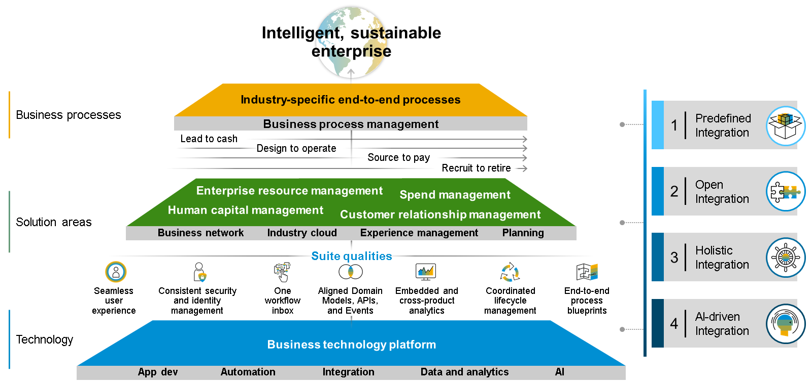
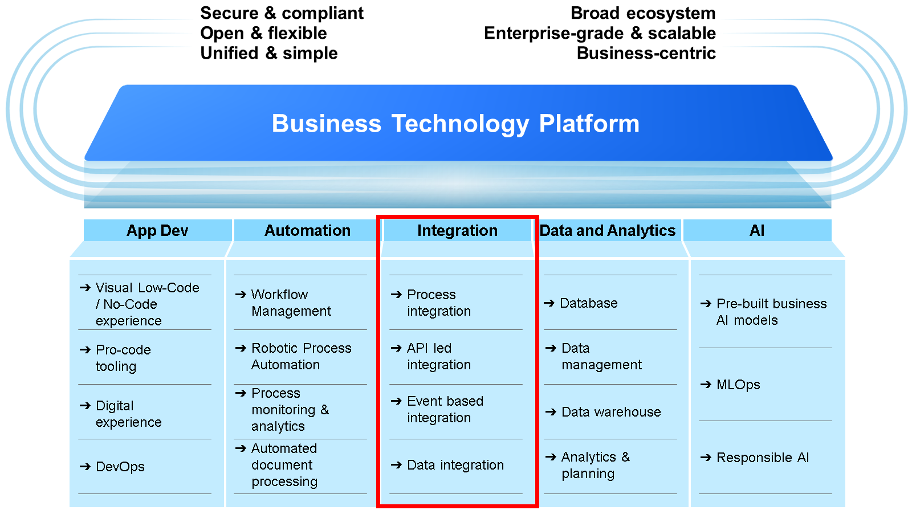

# ♠ 1 [DESCRIBING THE INTEGRATION STRATEGY OF SAP](https://learning.sap.com/learning-journeys/developing-with-sap-integration-suite/describing-the-integration-strategy-of-sap_b4888fe7-2084-40f1-a89b-ca0f93933c78)

> :exclamation: Objectifs
>
> - [ ] Explain the significance of integration within the realm of SAP BTP

## THE INTEGRATION STRATEGY OF SAP

### SAP'S INTEGRATION STRATEGY FOR INTELLIGENT ENTERPRISES

La **integration strategy** repose sur **quatre principes** :

#### :small_red_triangle_down: **N°1** : **Predefined integration** :

SAP a exposé sa **stratégie** et sa **road map** pour l'intégration des **end-to-end processes** de sa suite intelligente (**SAP software to SAP software**) via des well-defined suite qualities. À titre d'exemple, l'alignement des **domain models** permet de garantir que les **master data** peuvent être échangées de manière efficace et pratique entre les applications SAP, y compris les **prebuilt integrations** dans **SAP Business Accelerator Hub**[^1].

#### :small_red_triangle_down: **N°2** : **Open integration** :

Outre les intégrations de **SAP software to SAP software** et de **SAP software to partner software**, SAP est ouvert à toute **third-party integration** ainsi qu'aux **custom extensions** qui exploitent les **public APIs**. Grâce à la fonctionnalité [Open Connectors](../☼%20UNIT%200%20-%20Lexicon/♠%20Open%20Connector.md)[^3] de **SAP Integration Suite**, SAP fournit des **feature-rich prebuilt connectors**[^3] riches en fonctionnalités pour plus de **170 third-party applications**.

#### :small_red_triangle_down: **N°3** : **Holistic integration**[^2] :

SAP propose un **holistic integration[^2] technology portfolio** (portefeuille technologique d'intégration holistique) qui couvre la plupart des **types d'intégration requis** dans les **cloud and hybrid landscapes**. Basé sur **SAP Integration Suite**, SAP prend en charge divers **integration use cases**, allant des **processus**, **data**, **user** et **« objets »** à l'**analytics-centric integration** (intégration centrée sur l'analyse).

#### :small_red_triangle_down: **N°4** : **AI-driven integration** :

En plus d'apporter de l'intelligence aux **core business processes** (processus métier fondamentaux), SAP utilise des **techniques d'IA** pour simplifier le **développement de scénarios d'intégration**. Un exemple est la **integration advisor capability** (capacité de conseiller en intégration) de **SAP Integration Suite**.

### HOW DOES IT FULFILL THESE PROMIESES?

Si l'on regarde le positionnement de SAP BTP, nous pouvons voir que l'un des pilliers les plus important est l'**intégration**.

Intégrez des **applications On-Premise**, dans le **cloud** ou dans un modèle **hybride**, tout en connectant en toute sécurité les **applications**, les **processus** et les **personnes**.

- Intégration de SAP et au-delà pour inclure des _third parties_, y compris l'_API management_, le _support B2B/B2G_, l'_intégration de data_ , le _support IoT_ basé sur les _événements_ et le _process integration_.

- _Ready built content_ comprenant des _packs d'intégration_, des [API](../☼%20UNIT%200%20-%20Lexicon/♠%20API.md), des _business events_ et des _connectors_[^3].

- Accès continu aux _best-practices_ grâce au _contenu pre-packaged SAP business_.

- _AI-powered content advisor_ pour accélérer le développement de l'intégration et réduire les coûts de support continus.

### SUMMARY

> SAP souhaite offrir à ses clients une solution d'intégration complète, sécurisée et complète. Ceci repose sur quatre principes. Ces principes sont les suivants :
>
> - Predefined integration
>
> - Open integration
>
> - Holistic integration
>
> - AI-driven integration
>
> Cette réclamation est satisfaite par les services sur SAP BTP.

---

[^1]: Le SAP Business Accelerator Hub (anciennement appelé SAP API Business Hub) est une plateforme en ligne proposée par SAP. Elle centralise une vaste collection d’API, d’intégrations, de services, et de modèles prédéfinis pour faciliter le développement d’applications, les intégrations entre systèmes et l’utilisation des solutions SAP.
[^2]: Holistic integration (intégration holistique) est une approche globale de l’intégration des systèmes, des processus ou des données dans une organisation. Elle vise à considérer tous les aspects interconnectés pour assurer que les différentes parties fonctionnent harmonieusement ensemble. Plutôt que de résoudre des problèmes isolés ou d'intégrer uniquement certains éléments, cette méthode prend en compte l'ensemble de l'écosystème.
[^3]: Un connector (connecteur) est un composant ou un outil permettant d'établir une communication entre SAP CPI et des systèmes externes ou internes. Les connecteurs servent à échanger des données entre différentes applications en s'appuyant sur des protocoles standard ou des interfaces spécifiques.
