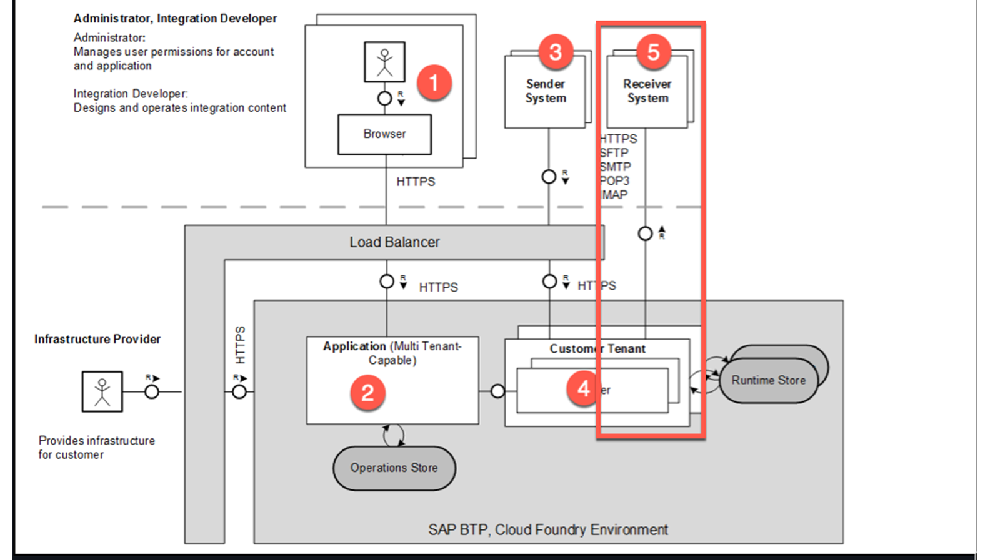
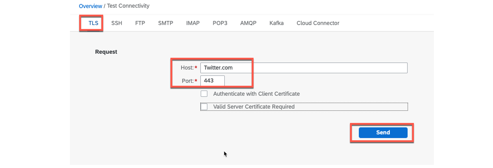
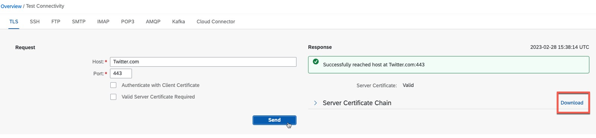
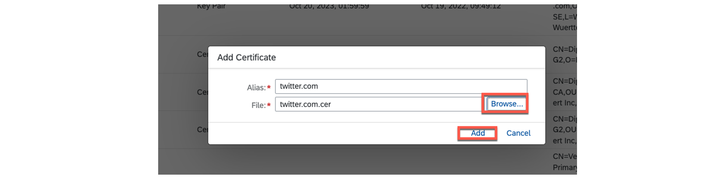
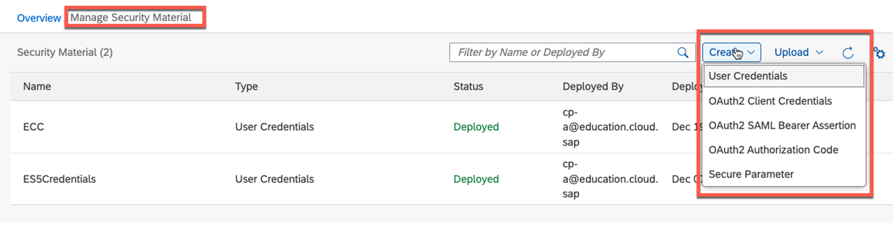
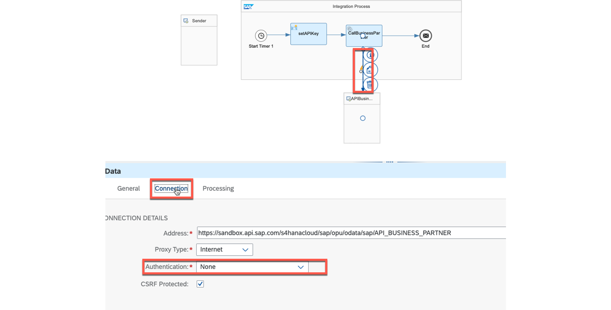
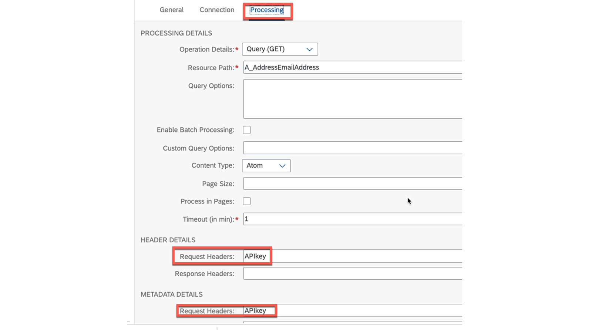
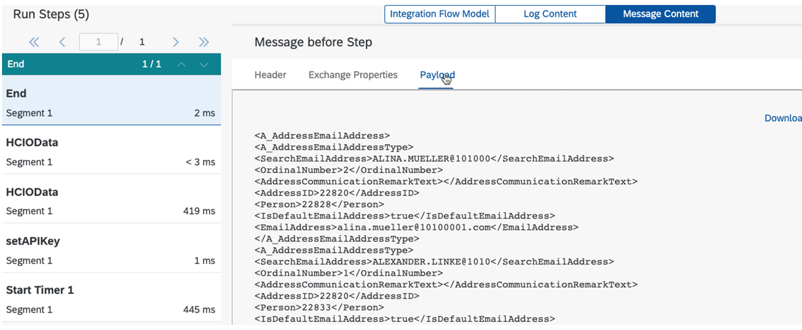

# ♠ 5 [USING MAPPINGS](https://learning.sap.com/learning-journeys/developing-with-sap-integration-suite/using-adapters_f42fdb69-df78-4faf-bfd3-0a7b8c8beebd)

> :exclamation: Objectifs
>
> - [ ] Use outbound security for adapters

## ADAPTER OUTBOUND SECURITY

### OUTBOUND SECURITY FOR ADAPTER

Les procédures de l'**implementing authentication and authorization** auprès du **receiver** varient en fonction du type d'**adapter** utilisé et peuvent parfois être différentes. Cependant, il existe des similitudes lors de l'utilisation de **TCP-based adapters**. Le processus consiste à créer une **HTTPS connection** via des **certificates** et à effectuer une véritable **authentication**. En pratique, cela signifie que le **recipient's certificate** doit être importé dans le **Cloud Integration tenant** (locataire Cloud Integration).

L'établissement d'une **secure TCP connection** (connexion TCP sécurisée) nécessite l'utilisation de **TLS** avec des **certificates**. SAP fournit un outil dédié pour vérifier et importer les **certificates** nécessaires spécifiques au **receiver**.

Le processus d'**authentication** et d'**authorization ** est spécifique à l'**adapter** et est décrit ci-dessous pour l'**adapter OData** .

### ESTABLISHING A SECURE CONNECTION TO THE RECEIVER INVOLVES USING CERTIFICATES

Comment pouvons-nous garantir que le message est correctement transmis au **receiver** ? Dans ce scénario, la connexion est établie directement entre l'**adapter receiver** et le **receiver**.

Pour établir une connexion sécurisée avec le **receiver**, il est nécessaire d'effectuer une **authentication** et une **authorization**. Ce processus implique également la mise en place d'une **HTTPS connection** via des **certificates**, qui peuvent être utilisés pour davantage d'**authentication** et d'**authorization**. En fin de compte, le type d'**authentication** et d'**authorization** utilisé est décidé par le **receiver**.

Nous le démontrons à nouveau avec l'exemple de l'**OData adapter**. Dans les exercices de cette formation, nous avons mis en place des politiques de l'**API Management** afin d'éviter le besoin d'**authentication**.

### LOCATE AND IMPORT THE CERTIFICATES FOR THE RECEIVER AND THE CERTIFICATE CHAIN FOR THE SERVER

Nous pouvons utiliser un outil utile dans l'**intégration cloud** appelé **Test Connectivity** pour rechercher et importer les **certificates** du **receiver** requis et leur **server certificate chain**.

### PROCEDURE

- Navigate to Monitor → Integrations → Manage Security → **Test Connectivity**.

- Choose your protocol.

- Fill in the necessary data.

- Choose the Send button.

- Download the certificates.

- Import the certificates at Monitor → Integrations → Manage Security → Manage Keystore → Add → Certificate.

> :pushpin: Note:
>
> The following screenshots address twitter.com as receiver.

Explications complémentaires :

#### :small_red_triangle_down: Choose the Protocol and Enter all Necessary Data :

Choisissez le protocole et saisissez toutes les données nécessaires :

Choisir le bouton **Send** fournit les **certificates**. Choisissez le bouton **Download** :

Décompressez le fichier téléchargé :

Accédez à [Monitor] → [Integrations] → [Manage Security] → [Manage Keystore] → [Add] → [Certificate]. Ajoutez tous les **certificates** séparément de votre fichier décompressé.

La **server certificates chain** :

Le **Twitter Certificat** :

Les **imported certificates** :

Une **secure HTTPS connection** à twitter.com peut désormais être établie à partir de votre **integration flow**.

### IMPLEMENT THE NECESSARY AUTHENTICATION AND AUTHORIZATION AGAINST THE RECEIVER FOR ODATA ADAPTERS

Comme mentionné précédemment, les **certificates** sont principalement utilisés pour établir la **HTTPS connection**. Ainsi, davantage de procédures sont souvent nécessaires pour l’**authentication** et l’**authorization **.

L'onglet [Connection] de l'**OData adapter** propose diverses options d'**authentication** et d'**authorization **.

Ce sont :

- Basic

- Client Certificate

- None

- OAuth2 Client Credentials

- OAuth2 SAML Bearer Assertion

Toutes ces options doivent d'abord être configurées sous [Monitor] → [Integrations] → [Manage Security] → [Manage Security Material]. À l'exception du **client certificate**, toutes les options d'**authentication** s'y trouvent.

### IMPLEMENT AN API KEY BASED AUTHENTICATION AND AUTHORIZATION

Il est courant d'utiliser une **clé API** pour l'**authentication** et l'**authorization **, même s'il n'existe aucune option de configuration dans les options de configuration de l'**OData adapter** . C'est démontré ici :

#### :small_red_triangle_down: Procedure :

- Copy the API key from your API.

- Place and configure an Content Modifier in front of the call component with the OData adapter.

- Enter an Message Header with the API key value.

- Configure the OData adapter at the Connection tab at Authentication with None.

- At the Processing tab, enter the APIkey in the Request headers fields.

### SUMMARY

> Il faut distinguer le **process of establishing secure connections processus** (établissement de connexions sécurisées) et d'**authentication**. Initialement, la **TSL connection** est établie, similaire à l'**inbound case**( au cas entrant). Cependant, dans ce scénario, la communication et l'échange de **certificates** se produisent directement entre le **Cloud Integration tenant** (locataire Cloud Integration) (**subaccount**) et le **receiver**. Pour identifier et importer ces **certificates**, SAP fournit un **Test Connection tool**. L'**authentication** proprement dite est effectuée par l'**adapter** et diverses options sont disponibles, telles que celles fournies par l'**OData adapter**.
>
> - Basic
>
> - Client Certificate
>
> - None
>
> - OAuth2 Client Credentials
>
> - OAuth2 SAML Bearer Assertion

## CREATE A REQUEST AND REPLY TO AN EXTERNAL CALL (3.ODATA ADAPTER)

[Exercices](https://learning.sap.com/learning-journeys/developing-with-sap-integration-suite/using-adapter-outbound-security_be3c7874-f31a-4413-9c9f-29382d4a4494)
