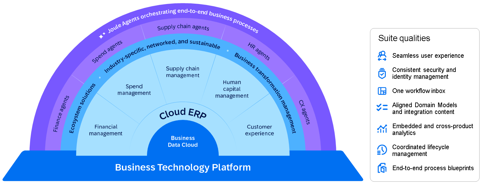
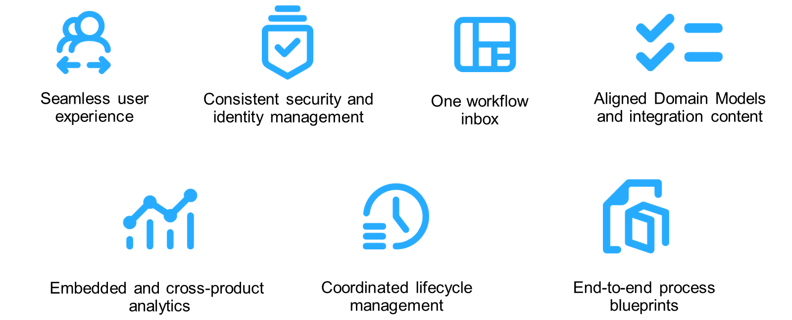

# ♠ 1 [DESCRIBING THE SUITE QUALITIES AND USE CASES OF SAP BTP](https://learning.sap.com/learning-journeys/discover-sap-business-technology-platform/describing-technology-of-the-intelligent-sustainable-enterprise_b0fbf80e-2b65-4de1-8455-885c3298fa46)

> :exclamation: Objectifs
>
> - [ ] Describing the Suite Qualities of the SAP BTP.
>
> - [ ] Paraphrase the main use-cases for SAP BTP.

## :closed_book: SAP BUSINESS TECHNOLOGY PLATFORM

Avec l'expansion continue des solutions métiers basées sur le cloud, avec des plateformes telles que SAP SuccessFactors et SAP Ariba, la complexité des processus peut augmenter. SAP vise toutefois à la réduire et à garantir des intégrations rationalisées qui soutiennent les opérations métier globales. Avec SAP S/4HANA Cloud comme cœur et SAP Business Technology Platform comme socle technique, SAP propose des outils pour aider ses clients, ses partenaires et elle-même à devenir des entreprises intelligentes grâce à des technologies avancées et des bonnes pratiques au sein de processus métier agiles, intégrés et optimisés par l'IA.

Les outils fournis par SAP BTP permettent aux entreprises de :

- Créer une couche technologique cohérente grâce à SAP Business Technology Platform ;

- Intégrer l'IA et le machine learning aux processus métier ;

- Obtenir une meilleure compréhension des opérations métier et de leurs impacts ;

- Créer des chaînes de valeur adaptables et appliquer des pratiques sectorielles avancées pour comprendre et gérer l'impact environnemental ;

- Mettre en œuvre des processus sectoriels spécifiques dans le cloud pour gérer les chaînes de valeur de bout en bout.

La stratégie de SAP va au-delà des intégrations techniques de base pour une intégration métier complète. Cette approche garantit le bon fonctionnement des processus métier clés, tels que le lead to cash, la conception-exploitation et l'approvisionnement-paiement. Au cœur de cette simplicité se trouvent les qualités de la suite SAP Business Technology Platform.

#### :small_red_triangle_down: Creating a Seamless User Experience :

Pour une interface utilisateur fluide et cohérente sur l'ensemble des applications cloud de SAP, les directives de conception Fiori apportent une harmonie visuelle à la suite. Imaginez utiliser différentes applications, mais tout semble familier et facile à naviguer, comme lorsque vous vous déplacez d'une pièce à l'autre de votre maison : chaque élément est à sa place.

#### :small_red_triangle_down: Consistent Security and Identity Management :

Gérer la sécurité et le provisionnement des identités sur plusieurs applications peut s'avérer complexe. SAP propose des mécanismes standardisés pour garantir une authentification, un provisionnement des identités et une gestion des rôles uniformes dans toute la suite, ce qui contribue à la sécurité des données et à la gestion cohérente des identités.

#### :small_red_triangle_down: Consistent Security and Identity Management :

Gérer la sécurité et le provisionnement des identités sur plusieurs applications peut s'avérer complexe. SAP propose des mécanismes standardisés pour garantir une authentification, un provisionnement des identités et une gestion des rôles uniformes dans toute la suite, ce qui contribue à la sécurité des données et à la gestion cohérente des identités.

#### :small_red_triangle_down: Harmonizing Data with Aligned Domain Models :

Le partage et la gestion des données de référence au sein du portefeuille SAP sont facilités par l'utilisation d'une sémantique commune pour les modèles de données. Ce service centralisé de données de référence réduit les besoins de réplication et de synchronisation des données. Imaginez un carnet d'adresses centralisé, toujours à jour sur tous vos appareils.

#### :small_red_triangle_down: Leveraging Embedded And Cross-Product Analytics :

SAP accompagne la prise de décision en intégrant l'apprentissage automatique et les insights à toutes les applications. Les outils de SAP Analytics Cloud permettent aux utilisateurs d'obtenir des informations et de prendre des décisions éclairées. C'est comme un assistant personnel qui vous aide à analyser les données et vous suggère la meilleure stratégie.

#### :small_red_triangle_down: Simplifying IT Operations with Coordinated Lifecycle Management :

Les opérations informatiques sont simplifiées grâce à la rationalisation des processus de provisionnement, de configuration et de surveillance. Des outils comme SAP Landscape Management automatisent ces tâches, permettant aux équipes informatiques de se concentrer sur des activités plus stratégiques plutôt que sur la maintenance de routine. C'est comme si un système automatisé gérait les tâches routinières, libérant ainsi un temps et des ressources précieux.

#### :small_red_triangle_down: Guiding Innovation with End-to-End Process Blueprints :

SAP provides a reference architecture to assist businesses on their journey to becoming intelligent enterprises. This architecture outlines the steps needed to transition from the current solution landscape to the target state. Think of it as having a road map that guides you through a city you've never been to, showing you the best routes and stops.

## :closed_book: MAIN USE-CASES FOR SAP BUSINESS TECHNOLOGY PLATFORM

Basée sur des normes ouvertes, SAP Business Technology Platform offre une flexibilité et un contrôle complets sur votre choix d'hyperscalers, de frameworks et d'applications.

SAP Business Technology Platform prend en charge divers cas d'usage essentiels à l'entreprise intelligente. Tirez parti des capacités de SAP BTP tout au long de votre transition vers le cloud et au-delà, dans des domaines tels que la migration de données, l'extension d'applications, l'intégration et la consolidation de systèmes.

#### :small_red_triangle_down: Accelerate the Move to the Cloud :

SAP BTP facilite une transition efficace vers une infrastructure cloud. Il permet aux entreprises de migrer leurs données depuis leurs systèmes sur site vers le cloud tout en minimisant les perturbations opérationnelles. Il accompagne également la modernisation des applications en permettant d'améliorer ou d'étendre les applications existantes grâce à des technologies cloud natives. Ses outils d'intégration performants garantissent une communication fluide entre différents systèmes et sources de données, réduisant ainsi la complexité et améliorant l'efficacité globale du système. Qu'il s'agisse de consolider plusieurs systèmes au sein d'une plateforme unifiée ou d'étendre les capacités grâce à de nouvelles fonctionnalités, SAP BTP fournit les outils et les infrastructures nécessaires pour faciliter la migration vers le cloud.

#### :small_red_triangle_down: Optimize & automate business processes :

Les tâches manuelles et les workflows inter-applications peuvent être automatisés grâce à un large éventail de contenus prédéfinis. SAP BTP propose SAP Build Process Automation, un outil low-code conçu pour permettre aux experts métier et processus, ainsi qu'aux développeurs traditionnels et citoyens, de créer des processus ou des extensions automatisés. Il permet également l'automatisation des tâches manuelles grâce à des technologies d'automatisation robotisée. Ces fonctionnalités s'inscrivent dans les principes fondamentaux de SAP BTP, qui privilégient l'agilité, l'efficacité et la responsabilisation des utilisateurs métier. Associée au portefeuille SAP Business Process Intelligence (BPI), qui comprend des outils tels que SAP Signavio Process Insights et Qualtrics Customer Insights, la plateforme permet une action directe basée sur les analyses de processus ou d'expérience. Cette approche favorise l'amélioration continue et garantit l'alignement des processus métier sur les objectifs organisationnels.

#### :small_red_triangle_down: Drive decisions based on data :

Fournir aux utilisateurs métier des informations actualisées et des recommandations basées sur l'IA peut améliorer l'efficacité et la qualité de la prise de décision. Il est crucial pour les organisations de disposer d'une vue unifiée de l'ensemble de leurs données afin d'en tirer des enseignements et de prendre des décisions en temps réel. Cependant, les données sont souvent réparties sur plusieurs systèmes, ce qui complique leur gestion efficace. SAP BDC et SAP BTP proposent des outils et des services pour intégrer, consolider et gérer des données provenant de sources diverses, garantissant ainsi des données cohérentes, de haute qualité et accessibles. Grâce à ces outils, les organisations peuvent suivre les principes de SAP BTP pour prendre des décisions éclairées. L'analyse et l'interprétation précises des données contribuent à maintenir une qualité élevée et soutiennent des stratégies de gestion des données robustes. Cette approche s'inscrit dans les objectifs de SAP BTP : elle facilite la prise de décision stratégique et favorise l'agilité et l'évolutivité de l'entreprise.

#### :small_red_triangle_down: Keep the core clean :

Pour maintenir la stabilité du système et faciliter les mises à niveau, il est conseillé de maintenir un noyau propre en adhérant aux principes « Clean Core », qui impliquent de maintenir un système à jour et compatible avec le cloud. Pour les solutions sur site, le retour à l'implémentation par défaut peut contribuer à atteindre cet objectif. Créez et exploitez des extensions de solution côte à côte hautement intégrées pour personnaliser vos processus métier sans compromettre la stabilité du noyau applicatif. L'extensibilité permet aux entreprises de développer et d'améliorer tous leurs investissements applicatifs afin de répondre à leurs besoins dynamiques et de générer une valeur continue. Avec SAP BTP comme plateforme sous-jacente, vous pouvez déployer de nouvelles fonctionnalités de manière agile et rapide.

> Note
>
> Le terme « Core » dans Clean Core désigne les composants essentiels de SAP S/4HANA Cloud, notamment les processus, les données, l'intégration, les opérations et l'extensibilité. Ces composants constituent la base du système. « Clean » signifie que ces composants clés sont maintenus à jour, compatibles avec le cloud, optimisés et bien gérés. En combinant ces principes, l'approche Clean Core garantit un système robuste et maintenable, favorisant la stabilité et la facilité de mise à niveau sans perturber les fonctionnalités clés.

Pour une compréhension plus approfondie des principes Clean Core et de leur mise en œuvre, pensez à explorer le cours dédié aux concepts Clean Core.

## :closed_book: KEY TAKEWAYS OF THIS LESSON

La plateforme SAP Business Technology Platform (SAP BTP) s'appuie sur la couche technologique d'une entreprise intelligente et durable. En utilisant SAP BTP, vous pouvez non seulement intégrer les processus métier, mais aussi permettre aux employés d'obtenir une meilleure visibilité sur leur entreprise grâce à la qualité des données, facilitant ainsi la prise de décision.
