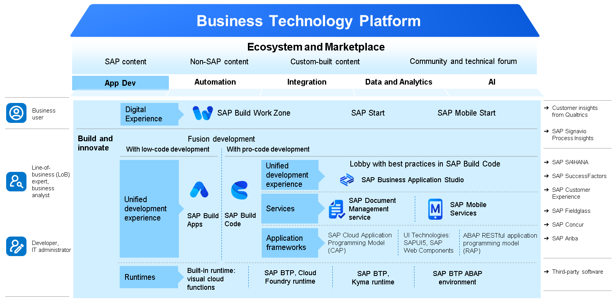
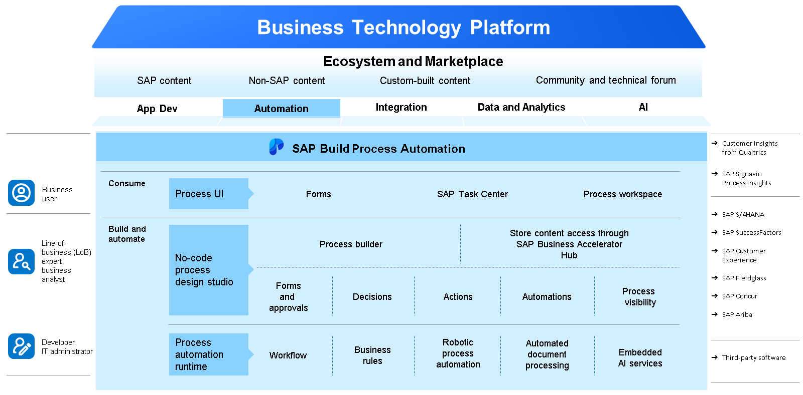
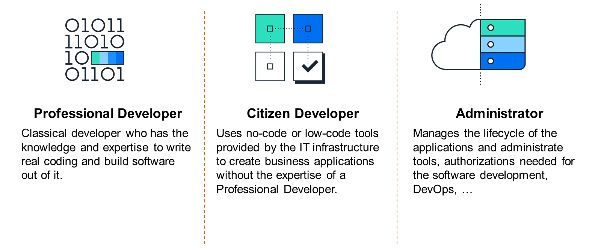

# ♠ 1 [DISCOVERING APPLICATION DEVELOPMENT AND AUTOMATION](https://learning.sap.com/learning-journeys/discover-sap-business-technology-platform/discovering-application-development-and-automation_cca5c842-a632-4dc0-9524-d8a71252aee0)

> :exclamation: Objectifs
>
> - [ ] Discover application development.
>
> - [ ] Discover automation.
>
> - [ ] Analyze the roles regarding application development and automation.

## :closed_book: BUSINESS INTRODUCTION TO APPLICATION DEVELOPMENT

[Link Video](https://learning.sap.com/learning-journeys/discover-sap-business-technology-platform/discovering-application-development-and-automation_cca5c842-a632-4dc0-9524-d8a71252aee0)

Votre entreprise utilise divers logiciels SAP, principalement basés sur le cloud, au sein de votre entreprise intelligente et durable. Vous souhaitez adapter les écrans d'interface utilisateur, enrichir les applications SAPUI5 existantes avec des API et exécuter une application de développement personnalisée sur SAP BTP. Vous souhaitez également optimiser l'expérience numérique de vos employés.

De plus, votre entreprise englobe de nombreux processus, procédures et tâches métier, avec différents niveaux d'automatisation. Pour optimiser l'automatisation des processus et réduire les tâches manuelles, vous envisagez SAP Build Process Automation. Les experts en processus métier, transformés en développeurs citoyens grâce à des expériences utilisateur sans code, peuvent réaliser cette automatisation.

## :closed_book: APPLICATION DEVELOPMENT

Avec l'évolution du marché vers les solutions SaaS, il est impossible de modifier les logiciels comme avec les anciens systèmes sur site. SAP conseille même de maintenir le logiciel de base propre sur les systèmes sur site, en privilégiant les extensions plutôt que les modifications. Cela nécessite l'adoption de nouvelles méthodes de développement personnalisé et d'extensions de portefeuille logiciel au sein de votre entreprise.

Les capacités de développement d'applications de SAP BTP offrent un portefeuille de solutions qui simplifient le développement d'extensions d'applications ou d'applications personnalisées. Optimisée pour les applications SAP afin d'en optimiser la valeur, la plateforme est également compatible avec les extensions d'applications tierces.

SAP propose également une boîte à outils complète pour les développeurs front-end et back-end, comprenant des outils de développement professionnels et des mécanismes pour des expériences de développement low-code ou no-code. Cet ensemble d'outils diversifié vous permet de créer une expérience utilisateur unifiée pour vos utilisateurs finaux.

Pour en savoir plus, choisissez : Développement d'applications et ses fonctionnalités.

## :closed_book: AUTOMATION OVERVIEW

Si vous souhaitez automatiser vos processus métier pour gagner en agilité ou réduire les tâches manuelles, les fonctionnalités d'automatisation de SAP BTP peuvent s'avérer utiles. Elles facilitent la création, accélèrent l'automatisation et améliorent l'agilité grâce à des outils visuels et du contenu prédéfini, adaptés à différents secteurs.

Mais quel est le lien avec l'hyperautomatisation ?

Lancée fin 2019, l'hyperautomatisation est une stratégie mise en œuvre par les entreprises pour identifier et automatiser rapidement un maximum de processus, grâce à divers outils et plateformes technologiques, tels que l'IA, le machine learning, la RPA et les logiciels de gestion des processus métier. Plus précisément, l'hyperautomatisation repose sur l'application de ces technologies de pointe pour accélérer l'identification et l'automatisation de nombreux processus métier et informatiques.

## :closed_book: ROLES REGARDING APPLICATION DEVELOPMENT AND AUTOMATION

Avec la croissance de la numérisation, le marché des besoins technologiques est devenu volatile. Nos besoins métiers évoluent constamment, ce qui contraint de nombreuses entreprises à s'adapter rapidement. Il existe également un déficit de ressources en matière de développeurs et de talents techniques nécessaires à la mise en œuvre de ces changements.

Compte tenu de cette situation de marché et de la demande de talents dans le secteur technologique, le secteur informatique doit répondre à ces besoins en proposant des outils d'automatisation métier et des outils de développement no-code/low-code. Cela permet aux employés ne possédant pas de compétences techniques avancées de développer rapidement des applications et des outils utiles. Ces employés assument le rôle de développeurs citoyens.

Voici un résumé des différences entre ces rôles :

#### :small_red_triangle_down: Professional Developers :

Les développeurs professionnels peuvent collaborer avec les développeurs citoyens et offrir leur expertise en dehors du cadre des outils low-code/no-code. Les développeurs professionnels sont requis pour les projets de développement plus complexes nécessitant des compétences avancées en programmation.

#### :small_red_triangle_down: Citizen Developers :

Les développeurs citoyens peuvent travailler avec des outils d'automatisation des processus et créer des applications sans code, et évoluer vers des outils low-code, qui utilisent des bases de code très simples. Tout le code complexe est généré par l'outil lui-même.

#### :small_red_triangle_down: Administrators :

Les administrateurs gèrent les tâches opérationnelles et administratives, telles que les abonnements et les instances de service dans SAP BTP. Ils gèrent les autorisations pour les outils utilisés par les développeurs professionnels et les développeurs citoyens, et leur accordent l'accès aux fonctionnalités et outils nécessaires. Ils gèrent également des tâches liées à des sujets tels que les connecteurs cloud ou les destinations. Dans les environnements hybrides avec systèmes sur site et cloud, l'administrateur est également responsable de toutes les tâches administratives sur site.

## :closed_book: KEY TAKEWAYS OF THIS LESSON

SAP propose de nombreux concepts et outils, dont le développement et l'automatisation d'applications, piliers de la plateforme SAP Business Technology Platform. Il convient de distinguer trois rôles : le développeur professionnel, expérimenté dans la création de logiciels et l'écriture de code ; le développeur citoyen, souvent peu ou pas expérimenté en programmation, mais qui bénéficie de ses connaissances métier et peut créer des applications et des processus métier à l'aide d'outils no-code/low-code ; et enfin, l'administrateur, dont l'importance est, par exemple, de gérer le cycle de vie des applications ou d'administrer des outils et des services via le cockpit SAP BTP.
