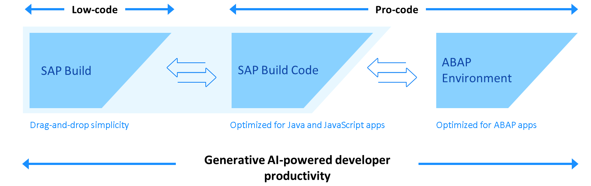
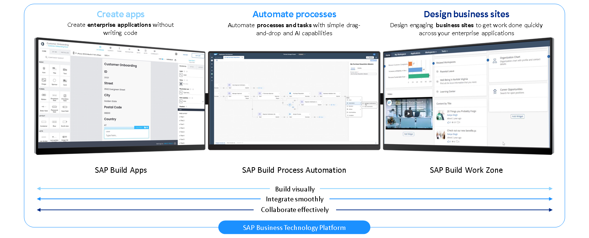

# ♠ 1 [ANALYSING LOW-CODE WITH SAP BUILD](https://learning.sap.com/learning-journeys/discover-sap-business-technology-platform/analyzing-low-code-no-code-with-sap-build_d37ecd7f-f50e-4926-8a45-a1de9b17b89c)

> :exclamation: Objectifs
>
> - [ ] Analyze low-code/no-code.
>
> - [ ] Identify the components of SAP Build.

## :closed_book: LOW-CODE AND PRO-CODE

Le développement low-code (développement citoyen) est une solution disruptive pour combler le déficit d'expertise technique, notamment chez les développeurs professionnels, qui existe aujourd'hui. Il favorise une culture de l'innovation et, combiné aux technologies low-code d'entreprise, il permet à ceux qui ne codent pas mais qui comprennent parfaitement les besoins et les défis des entreprises de se développer. Ces personnes peuvent désormais créer des automatisations et des extensions pour mieux répondre à leurs besoins quotidiens, réduire les risques d'erreurs humaines et améliorer l'expérience client.

Le développement low-code s'adresse principalement à ceux qui ne sont pas à l'aise avec le codage de leurs propres logiciels, même ceux qui n'ont aucune connaissance en programmation et en développement d'applications. Il aide les experts en processus à automatiser des tâches, à créer des applications ou à optimiser leurs activités.

Les développeurs professionnels peuvent utiliser des outils low-code pour accélérer leur développement de base et se concentrer sur des concepts plus complexes. De plus, les outils optimisés par l'IA générative, comme Joule, peuvent accroître la productivité des développeurs, notamment dans les environnements de développement pro-code.

Le développement low-code permet aux employés possédant des connaissances en logiciels, tels que les experts en développement de processus et les développeurs professionnels, de créer et d'intégrer des processus et des applications pour les utilisateurs finaux à l'aide de blocs de construction WYSIWYG (What You See Is What You Get). Des outils pro-code comme SAP Build Code, avec l'aide de Joule, permettent une transition fluide entre le développement pro-code traditionnel et le développement low-code, facilitant ainsi les applications collaboratives ou le « développement fusionné ». Cette polyvalence aide les entreprises à optimiser leurs ressources de développement et à promouvoir l'innovation, notamment dans un contexte de pénurie persistante de compétences technologiques.

Il est important de noter que le choix entre low-code et pro-code dépend du cas d'utilisation. Le développement low-code est généralement adapté aux cas d'utilisation simples et au développement rapide d'applications, tandis que le développement pro-code est plus adapté aux applications complexes et critiques.

Le point essentiel aujourd'hui est simple : le développement low-code peut aider les développeurs citoyens, les développeurs professionnels et les administrateurs informatiques à automatiser les tâches dans pratiquement tous les services et secteurs d'activité. Cela signifie économiser du temps et de l’argent, augmenter la satisfaction des clients et permettre aux employés de se concentrer davantage sur des tâches à valeur ajoutée, augmentant ainsi leur satisfaction au travail.

## :closed_book: SAP BUILD COMPONENTS

SAP Build se compose de trois composants pour créer des projets sans code :

#### :small_red_triangle_down: SAP Build Apps :

SAP Build Apps offre une expérience de développement unique et une innovation rapide grâce à une méthode simple pour créer des applications personnalisées, que vous pouvez ajouter à vos solutions SAP. Grâce à la fonctionnalité glisser-déposer, il est possible de créer des interfaces utilisateur avec une bibliothèque de composants constamment mise à jour, sans aucune expérience de développement. De plus, il est possible de créer n'importe quelle logique grâce aux fonctions de flux visuel, et d'utiliser des propriétés de style individuelles et une prise en charge avancée des thèmes. Ainsi, vos applications créées fonctionnent sur le web, iOS, Android et avec un environnement d'exécution natif optimisé pour chaque plateforme.

L'accès à vos données et autres données à l'interface utilisateur est simplifié grâce aux API OData et REST. De plus, le traitement efficace des données est assuré par des formules et plus de 500 fonctions prédéfinies, prises en charge par une fonction de recherche et des exemples de cas d'utilisation. Cela vous permet, par exemple, d'effectuer des calculs, de mettre en forme du texte, d'affecter des objets et des listes, ou de créer des styles dynamiques.

Apprenez-en plus sur SAP Build Apps dans notre parcours d'apprentissage et créez une application d'équipe sans code pour apprendre toutes les méthodes que vous pouvez adapter à votre propre scénario d'application : [développez des applications avec SAP Build Apps en utilisant la simplicité du glisser-déposer](https://learning.sap.com/learning-journey/develop-apps-with-sap-build-apps-using-drag-and-drop-simplicity).

#### :small_red_triangle_down: SAP Build Process Automation :

SAP Build Process Automation permet aux organisations et aux entreprises de gérer l'automatisation des workflows et des processus grâce à des fonctionnalités visuelles. D'un côté, les développeurs citoyens peuvent créer, adapter, améliorer et innover des processus métier avec une assistance minimale de ressources informatiques limitées, en exploitant la puissance du no-code. De l'autre, une nouvelle expérience utilisateur d'automatisation citoyenne, grâce à des fonctionnalités telles que le générateur de processus ou le générateur de formulaires, accessible par simple glisser-déposer, enrichit le travail des utilisateurs.

De plus, toutes les fonctionnalités avancées de gestion des workflows, telles que les règles métier, la visibilité et la flexibilité des processus, ainsi que l'IA, sont également disponibles. Vous pouvez étendre vos automatisations grâce à des fonctionnalités robotisées d'automatisation des processus intégrées. Des artefacts réutilisables, tels que des robots et des composants de workflow, sont prêts à l'emploi. Avec SAP Build Process Automation, vous bénéficierez à la fois des fonctionnalités de workflow et d'automatisation des processus combinées dans une seule solution, avec une interface utilisateur identique.

Pour en savoir plus sur SAP Build Process Automation, consultez notre parcours d'apprentissage : [Créer des processus et des automatisations avec SAP Build Process Automation](https://learning.sap.com/learning-journey/create-processes-and-automations-with-sap-build-process-automation)

#### :small_red_triangle_down: SAP Build Work Zone :

SAP Build Work Zone centralise l'accès aux applications, processus, informations et communications métier pertinents au sein d'un point d'entrée unifié, accessible depuis n'importe quel appareil. Vous pouvez l'utiliser pour créer facilement et rapidement des solutions d'espace de travail numérique par glisser-déposer afin d'améliorer la productivité et l'engagement des utilisateurs, tout en offrant l'expérience de travail unifiée, intelligente et personnalisée souhaitée.

Vous pouvez intégrer des applications et services SAP sur site et dans le cloud, des applications tierces telles que SharePoint Online pour Microsoft 365 et Microsoft Teams, et bien sûr vos propres applications et processus personnalisés créés avec SAP Build Apps ou SAP Build Process Automation. Administrateurs et utilisateurs bénéficient d'un large éventail d'options pour partager et trouver rapidement toutes les informations et collaborer, par exemple via des blogs, des contenus multimédias, des enquêtes, des sondages, des pages wiki, des événements, des articles de la base de connaissances, des tâches et des flux.

Pour en savoir plus sur SAP Build Work Zone, consultez notre parcours de formation : [Implémentation et administration de SAP Build Work Zone](https://learning.sap.com/learning-journey/implement-and-administer-sap-build-work-zone)

> SAP Build permet l'intégration avec les applications et systèmes SAP et non SAP. Idéalement, utilisés conjointement, SAP Build Apps, SAP Build Process Automation et SAP Build Work Zone offrent des fonctionnalités complètes. SAP Build est fourni avec du contenu pré-intégré qui simplifie le processus d'intégration et favorise la collaboration, tout en préservant la gouvernance grâce à une gestion centralisée du cycle de vie des projets.

Pour en savoir plus sur SAP Build en général et ses concepts généraux, consultez notre parcours d'apprentissage SAP Build. Il vous offre un aperçu des trois produits SAP Build et vous permet de vous familiariser avec les sujets suivants : [Compose-and-automate-with-sap-build-the-no-code-method](https://learning.sap.com/learning-journey/compose-and-automate-with-sap-build-the-no-code-way).

Vous pouvez également consulter la page [produit SAP Build](https://www.sap.com/products/technology-platform/low-code.html) pour plus d'informations.

Vous trouverez plus d'informations sur SAP Build Code dans ce [parcours d'apprentissage](https://learning.sap.com/learning-journeys/creating-applications-and-extensions-using-sap-build-code).

## :closed_book: KEY TAKEWAYS OF THIS LESSON

Le développement low-code/no-code permet aux développeurs, aux développeurs professionnels et aux administrateurs informatiques d'automatiser certaines tâches et d'accélérer leurs projets. Pour ce faire, les outils SAP Build permettent de créer des applications, des processus et des sites métier grâce à la fonctionnalité glisser-déposer. SAP Business Application Studio propose également des outils no-code et low-code. Enfin, les utilisateurs bénéficient de nombreuses possibilités d'intégration et de collaboration pour stimuler l'innovation.
