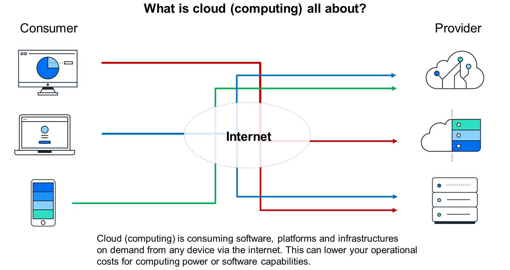
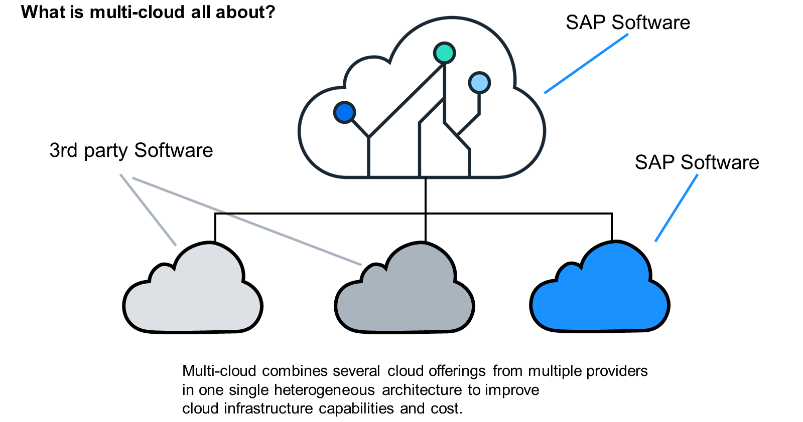
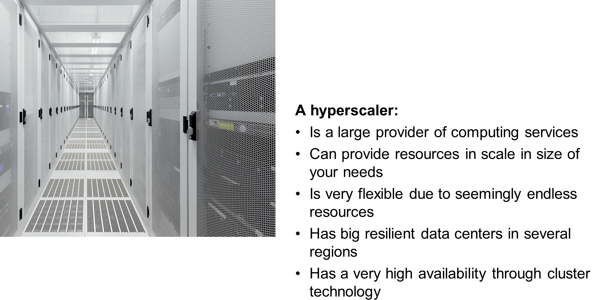
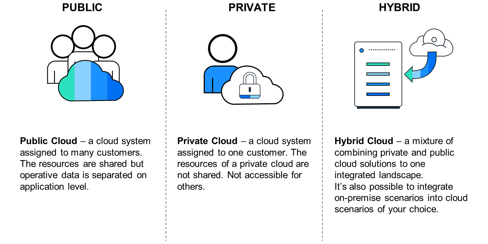
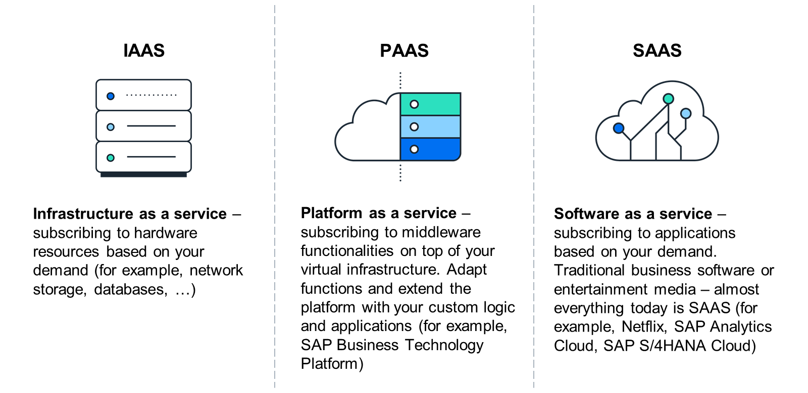

# ♠ 1 [DISCOVERING CLOUD TERMINOLOGY](https://learning.sap.com/learning-journeys/discover-sap-business-technology-platform/discovering-cloud-terminology_caf029db-06d3-445a-aedb-20684defabe5)

> :exclamation: Objectifs
>
> - [ ] Discover the basics of cloud computing.
>
> - [ ] Discover hyperscalers.
>
> - [ ] Discover the service and deployment models.

## :closed_book: CLOUD COMPUTING

> Note
>
> Si vous connaissez les termes suivants, vous pouvez ignorer cette leçon :
>
> - Cloud computing
>
> - Cloud public, privé, hybride
>
> - Logiciel en tant que service
>
> - Plateforme en tant que service
>
> - Infrastructure en tant que service
>
> - Hyperscaler
>
> - Multicloud

## :closed_book: CLOUD COMPUTING OVERVIEW

Le cloud computing peut réduire vos coûts en vous permettant d'utiliser uniquement les ressources nécessaires à la demande. Inutile de construire un grand datacenter au sein de vos bureaux pour garantir l'évolutivité et la haute disponibilité. Inutile de réserver des ressources informatiques en cas de besoin pour un projet de prototypage ou une charge système accrue. Les offres de cloud computing sont disponibles selon différents modèles de déploiement et de service. De plus, les environnements cloud sont regroupés sur plusieurs régions pour garantir une disponibilité accrue et une latence réduite. Avec l'augmentation des capacités cloud, l'importance des technologies de virtualisation et de conteneurs devient plus que jamais cruciale. Sur le marché, de nombreux fournisseurs proposent différentes offres cloud. SAP se concentre sur la transformation vers le cloud.

## :closed_book: CLOUD TERMINOLOGY: MULTI-CLOUD

Dans une entreprise intelligente et durable, les environnements système sont plus diversifiés que jamais. Il est possible de combiner plusieurs produits de différents fournisseurs, issus du cloud privé, du cloud public, voire sur site. Qu'il s'agisse d'une infrastructure, d'une plateforme ou d'un SaaS, ils sont tous disponibles à la demande. Le concept de multicloud permet de les combiner et de les intégrer. SAP soutient également cette approche. Cela signifie que vous pouvez combiner des logiciels provenant de différentes régions et de différents modèles de déploiement, et associer des logiciels SAP à des logiciels tiers.

## :closed_book: CLOUD TERMINOLOGY: HYPERSCALER

Les hyperscalers les plus connus sont AWS, Microsoft Azure, Google Cloud Platform et Alibaba Cloud. Bien sûr, d'autres fournisseurs de cloud, notamment ceux qui proposent des architectures hyperscaler, existent également. SAP s'associe à ces quatre grands hyperscalers afin d'offrir la meilleure offre à ses clients et une disponibilité optimale. Cette collaboration porte sur plusieurs produits, mais SAP BTP est le plus intéressant du point de vue des hyperscalers.

SAP BTP est disponible dans plusieurs régions auprès de ces fournisseurs. SAP prend ainsi en charge les environnements multicloud. Les fournisseurs peuvent différer en termes de disponibilité, d'offres de services ou de latence des centres de données. SAP, en collaboration avec les hyperscalers, propose des centres de données dans les régions suivantes : Europe, États-Unis Est, États-Unis Ouest, Singapour, et bien d'autres.

SAP exploite également des logiciels dans ses propres centres de données sans utiliser les capacités des hyperscalers. Ces centres de données sont construits avec une architecture de type hyperscaler pour une plus grande résilience et flexibilité en termes d'évolutivité et de haute disponibilité.

Le fait qu'une solution SAP s'exécute sur des centres de données SAP ou sur des ressources hyperscaler dépend du produit et de son architecture.

## :closed_book: CLOUD TERMINOLOGY: SERVICE & DEPLOYMENT MODELS

### Cloud Terminology: Deployment Models

Les services cloud diffèrent selon leur type de déploiement. Selon l'opérateur et le public cible, on parle de :

- Public Clouds

- Private Clouds

- Hybrid Clouds

#### :small_red_triangle_down: Title 4 : Public Cloud

Le cloud public est l'offre d'un fournisseur en accès libre, qui rend ses services accessibles à tous via Internet. Les services de messagerie web ou Google Docs sont des exemples d'offres de cloud public, tout comme les services payants Microsoft Office 365 ou SAP Business ByDesign.

#### :small_red_triangle_down: Title 4 : Private Cloud

Pour des raisons de confidentialité et de sécurité informatique, les organisations préfèrent souvent continuer à gérer elles-mêmes leurs services informatiques et à les rendre accessibles uniquement à leurs propres employés. Si ces services sont proposés de manière à ce que l'utilisateur final de l'entreprise puisse bénéficier de la valeur ajoutée typique du cloud, comme une infrastructure ou une installation informatique évolutive, et des applications informatiques sans maintenance utilisables via un navigateur web, on parle alors de cloud privé. Cependant, ces avantages supplémentaires ne sont souvent pas, ou seulement partiellement, atteints dans les infrastructures dites informatiques.

#### :small_red_triangle_down: Title 4 : Hybrid Clouds

Les clouds hybrides sont des formes hybrides de ces deux approches. Par exemple, certains services des fournisseurs publics fonctionnent via Internet, tandis que les applications et données critiques sont exploitées et traitées au sein de l'entreprise. Le défi réside ici dans la séparation des processus métier entre flux critiques et flux non critiques pour la protection des données. La condition préalable est une classification claire et cohérente des données disponibles et traitées au sein de l'entreprise.

### Cloud Terminology: Service Models

Parce que nous sommes désormais familiarisés avec les modèles de déploiement du cloud, nous devons clarifier le type de logiciel, ou nous pourrions également dire les modèles de service, des produits cloud :

#### :small_red_triangle_down: Title 4 : Infrastructure as a Service (IaaS)

Souscrivez à des ressources matérielles adaptées à vos besoins et à la demande. Cela inclut le réseau, le stockage, les serveurs et la virtualisation. Louer une infrastructure, plutôt que la posséder, vous permet de maximiser la créativité de chaque équipe au lieu de la limiter aux capacités d'une équipe d'architecture centralisée. Selon vos besoins, vous pouvez adapter votre abonnement, ce qui vous permet de travailler plus flexiblement et de réduire vos coûts.

Les fournisseurs IaaS incluent des hyperscalers comme Google Cloud Platform, Microsoft Azure, Amazon Web Services (AWS) et bien d'autres.

#### :small_red_triangle_down: Title 4 : Platform as a Service (PaaS)

Souscrivez à des fonctionnalités middleware sur votre infrastructure virtuelle. Vous pouvez adapter et étendre la plateforme avec votre logique personnalisée et souvent avec des services prédéfinis que vous pouvez activer et utiliser. Les services de plateforme cloud offrent souvent des fonctionnalités de sécurité pour l'autorisation et l'authentification, le clustering, l'équilibrage de charge, le routage ou les services de base de données. Une plateforme cloud permet de gérer et de maintenir tous les processus opérationnels de votre infrastructure. Vous pouvez facilement commencer à créer vos propres applications ou à utiliser des services prédéfinis.

SAP propose un produit sur le marché du PaaS : SAP Business Technology Platform. Cette plateforme offre de nombreux services et fonctionnalités middleware. Elle s'appuie sur de nombreuses technologies SAP et open source.

#### :small_red_triangle_down: Title 4 : Software as a Service (SaaS)

S'abonner à des applications adaptées à vos besoins et à la demande signifie que, qu'il s'agisse de logiciels professionnels traditionnels ou de médias de divertissement, presque tout est aujourd'hui une solution SaaS. Vous pouvez choisir des applications de composants, des logiciels professionnels traditionnels aux outils de gestion d'infrastructure virtuelle, tous livrés et exploités via le web. Le fournisseur garantit la sécurité, la disponibilité et les performances. Souvent, vous n'avez que peu de possibilités de personnalisation des services SaaS. Vous pouvez uniquement les utiliser et parfois effectuer quelques petites configurations, ou gérer les utilisateurs ayant accès à votre abonnement. SAP propose également plusieurs produits sur le marché SaaS, pour n'en citer que quelques-uns :

- SAP Analytics Cloud

- SAP Customer Experience

- SAP SuccessFactors
