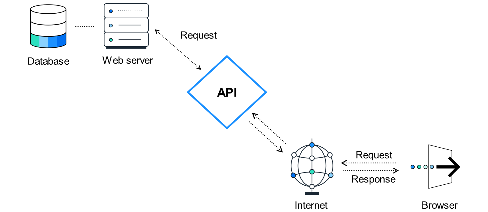
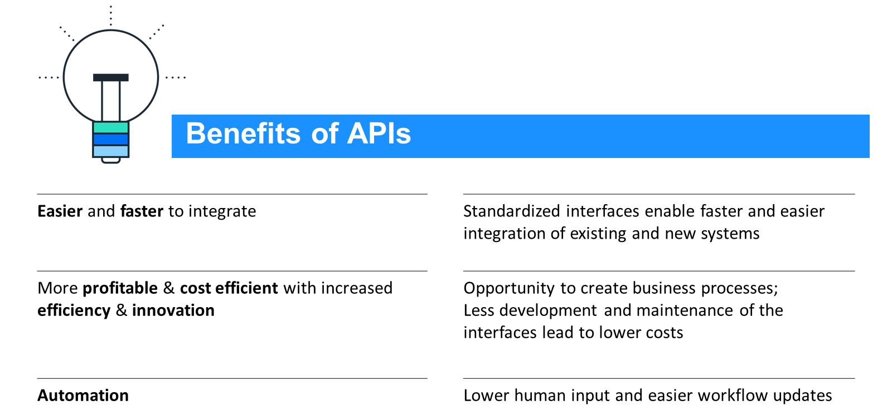
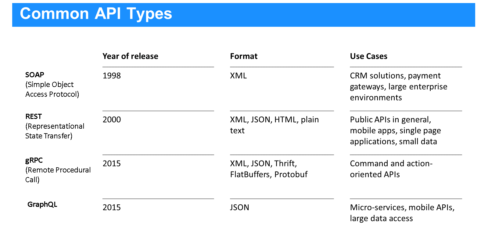
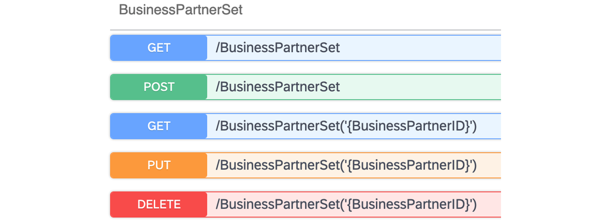

# ♠ 1 [DESCRIBING APPLICATION PROGRAMMING INTERFACES (APIs)](https://learning.sap.com/learning-journeys/discover-sap-business-technology-platform/describing-apis_e2995d2c-4b4c-4c09-848f-48283c7dd6e3)

> :exclamation: Objectifs
>
> - [ ] Describe APIs and their needs.
>
> - [ ] Identify the benefits of APIs.
>
> - [ ] Analyze the anatomy of APIs.

## :closed_book: BUSINESS INTRODUCTION TO API

[Link Video](https://learning.sap.com/learning-journeys/discover-sap-business-technology-platform/describing-apis_e2995d2c-4b4c-4c09-848f-48283c7dd6e3)

Vous pourriez être confronté à des défis lors de la transformation de votre entreprise en une entreprise intelligente et durable. Par exemple, vous devez intégrer des applications et des processus métier dans un environnement diversifié de systèmes cloud ou hybrides. Vous disposez également de solutions de fournisseurs non SAP ; dans ce cas, vous devez intégrer des processus SAP à des processus non SAP. Vous pouvez utiliser SAP Integration Suite pour intégrer des processus SAP à des processus SAP, et des processus non SAP à des processus SAP. Votre entreprise peut également commercialiser et gérer ses API grâce à SAP Integration Suite.

## :closed_book: API OVERVIEW

API est l'acronyme de « Application Programming Interface ». Il s'agit de l'intermédiaire (représenté par un logiciel) entre les applications/sites web et vous, en tant qu'utilisateur. Elle est donc essentielle à la communication entre différentes instances pour l'échange d'informations.

Vous rencontrez des API au quotidien sans même vous en rendre compte. Prenons l'exemple de Google Search : chaque fois que vous saisissez un mot-clé dans la barre de recherche, le service back-end de Google recherche vos mots-clés dans sa base de données et affiche les résultats de votre requête sur le site web. En réalité, le site web affiche le résultat de l'API. L'URL de la recherche correspondante en est un indicateur.

Si l'on pense à une recherche pour « SAP », l'URL est : www.google.com/search?q=sap.

Décomposons maintenant la question :

www.google.com est l'adresse du serveur, /search indique la fonctionnalité que vous souhaitez utiliser, ou mieux, l'API que vous souhaitez appeler, en l'occurrence l'API Google Search, et q (pour query) indique qu'une valeur pour query est désormais transmise, correspondant au terme de recherche.

Il en va de même pour la page d'aide de SAP (https://help.sap.com). Lorsque vous saisissez API dans la barre de recherche, l'URL suivante s'affiche : https://help.sap.com/docs/search?q=api.

Cependant, un appel d'API ne doit pas nécessairement être initié par un ordinateur. Les systèmes d'assistance vocale illustrent également l'intégration et l'utilisation des API. Demander à votre assistant vocal de rechercher quelque chose lui fournit votre requête. Cette requête est ensuite stockée sous forme de texte et ajoutée à l'appel d'API. L'assistant transmet ensuite le résultat de l'API par voix.

Ainsi, quelle que soit votre utilisation de vos appareils connectés, vous utilisez plusieurs API par heure sans vous en rendre compte. C'est pourquoi les API sont si importantes : omniprésentes, elles permettent aux utilisateurs et aux développeurs de se concentrer sur « ce » à faire plutôt que sur « comment ». Avez-vous déjà réfléchi à la manière dont votre message WhatsApp est envoyé à un destinataire ?

Comme son nom l'indique, une API n'est qu'un type d'interface parmi tant d'autres permettant de déclencher des fonctions spécifiques, par exemple la lecture de musique. Vous connaissez peut-être déjà d'autres types d'interfaces, comme l'interface utilisateur graphique (GUI), que nous utilisons pour naviguer entre applications et sites web à l'aide d'une souris ou d'un écran tactile.

## :closed_book: BENEFITS OF API

### THE NEED FOR APIs

Les API sont aujourd'hui indispensables aux architectures informatiques. Si l'accès des front-ends aux back-ends, la gestion des interfaces et la communication point à point occupent une place importante dans les architectures informatiques depuis des années, les API ont révolutionné la communication entre applications et sites web. Elles ont ainsi apporté de nombreux avantages à la création et à la gestion des environnements informatiques. Les plus importants, et donc les principales raisons pour lesquelles les entreprises doivent les intégrer à leur architecture informatique, peuvent être résumés comme suit :

Les API, par essence, séparent la communication de la tâche. Ainsi, si un service communique via une API, l'utilisateur (ou consommateur) de l'API se concentre entièrement sur les fonctionnalités qu'elle fournit. Il utilise uniquement les fonctionnalités de l'API sans se soucier de la tâche elle-même. L'attention se porte sur la requête et le résultat (la réponse), et rien d'autre.

## :closed_book: ANATOMY OF API

### API TYPES

Pour définir et implémenter des API, différentes normes mondiales sont disponibles. En voici quelques-unes (les plus courantes sont les API REST) :

Les API REST étant le type d'API le plus populaire, nous allons approfondir brièvement leurs fonctions. Lorsqu'on travaille avec des API, on parle généralement de ressources. Cela signifie que l'on souhaite généralement :

- Créer quelque chose (comme ajouter une entrée à un livre d'or) ;

- Lire ou obtenir quelque chose de l'API (rappelez-vous votre recherche Google : vous avez essayé d'obtenir une liste de sites web) ;

- Mettre à jour ou modifier quelque chose (généralement lorsque vous avez créé quelque chose qui doit être modifié, comme le statut d'un élément ou une faute de frappe) ;

- Supprimer quelque chose.

Ensemble, ces actions sont abrégées : CRUD.

Pour les API REST, ces verbes sont très similaires aux verbes CRUD :

### COMPARISON BETWEEN CRUD AND REST VERBS

| **CRUD**        | **REST**    |
| --------------- | ----------- |
| READ (RETRIEVE) | GET         |
| CREATE          | POST        |
| UPDATE          | PUT / PATCH |
| DELETE          | DELETE      |

Vous remarquerez peut-être que « update » possède deux verbes possibles : PUT et PATCH.

Patcher ne modifie qu'une partie de la ressource à laquelle vous faites référence. Imaginez votre entrée dans le livre d'or : vous corrigez un seul mot et informez le livre d'or que le mot numéro 42 doit être remplacé. Il s'agit d'un patch, c'est-à-dire d'une réparation ou d'une modification ponctuelle. PUT, quant à lui, modifie l'intégralité du texte, même s'il est quasiment identique, mais avec l'erreur corrigée (par exemple, effacer tout le texte et tout recoller).

En général, dans la spécification d'une API, ces verbes sont présentés comme illustré ci-dessous (extrait d'un exemple de déploiement sur SAP BTP Integration Suite). Une API ne prend pas nécessairement en charge tous les verbes.

## :closed_book: KEY TAKEWAYS OF THIS LESSON

Les interfaces de programmation d'applications (API) permettent de communiquer et d'échanger des données avec une application. Leur utilisation permet de réduire les efforts humains, de réaliser des économies et d'accélérer l'intégration système. Il existe différents types d'API pour définir et implémenter une API, mais la plus courante est l'API REST.
