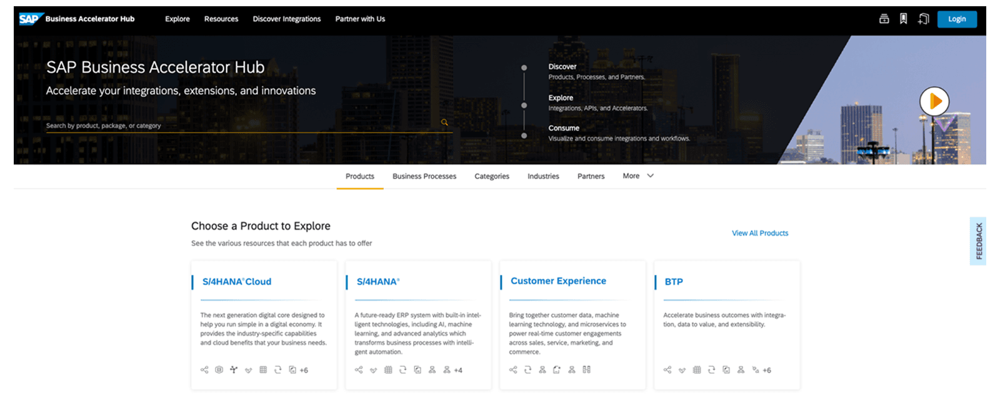
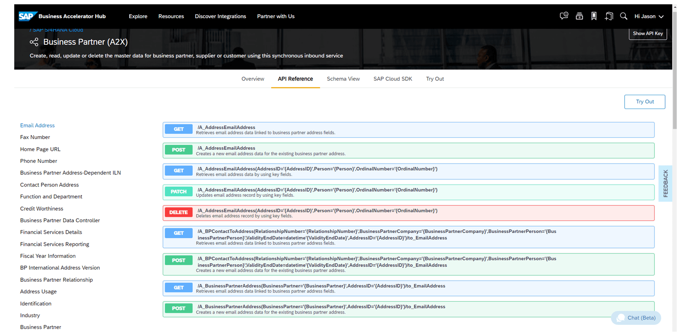

# ♠ 1 [ILLUSTRATING SAP BUSINESS ACCELERATOR HUB](https://learning.sap.com/learning-journeys/discover-sap-business-technology-platform/illustrating-the-sap-business-accelerator-hub_c913055d-dbfb-4b85-84c9-508eb7468236)

> :exclamation: Objectifs
>
> - [ ] Illustrate SAP Business Accelerator Hub.

## :closed_book: SAP BUSINESS ACCELERATOR HUB

Le SAP Business Accelerator Hub vous propose une large gamme d'API sandbox pour plusieurs produits SAP tels que SAP S/4HANA, SAP BTP, SAP SucessFactors, SAP Concur, etc. Vous pouvez utiliser ces API sandbox pour créer des extensions, des applications ou des intégrations et les tester avec les données de test fournies par l'API sandbox. Il vous suffit de disposer de la clé API pour authentifier vos requêtes. Vous pouvez obtenir vos clés API en vous connectant avec un compte SAP ID sur le SAP Business Accelerator Hub et en sélectionnant « Afficher la clé API » sur la page API correspondante.

Accédez au SAP Business Accelerator Hub ici : https://api.sap.com/

### API REFERENCE IN THE SAP BUSINESS ACCELERATOR HUB

Vous pouvez parcourir plusieurs API sandbox de différents produits SAP, comme l'API Business Partner de SAP S/4HANA. Vous pouvez obtenir la référence et le schéma de l'API. Vous pouvez même tester les API directement. Le SAP Business Accelerator Hub est l'endroit idéal pour les développeurs et les intégrateurs pour découvrir, explorer et utiliser les API.

## :closed_book: KEY TAKEWAYS OF THIS LESSON

SAP API Business Hub est une application web qui vous permet de tester et d'obtenir des informations sur différentes API de différents produits, par exemple SAP S/4HANA, SAP SuccessFactors ou SAP BTP. Une API sandbox est également souvent disponible. Pour l'authentification, une clé API suffit, que vous pouvez générer dans SAP API Business Hub. Ces fonctionnalités permettent aux développeurs de découvrir, tester et utiliser différentes API.
