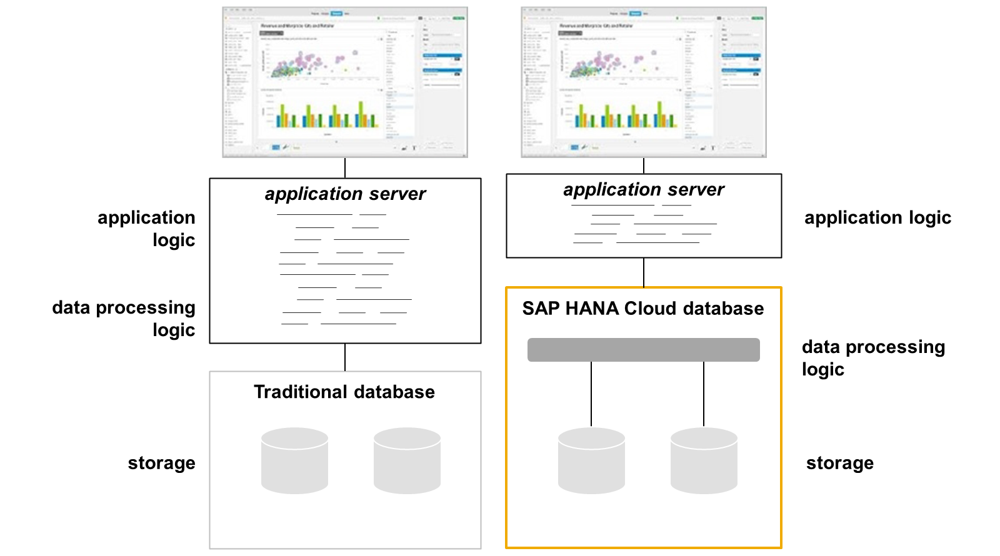
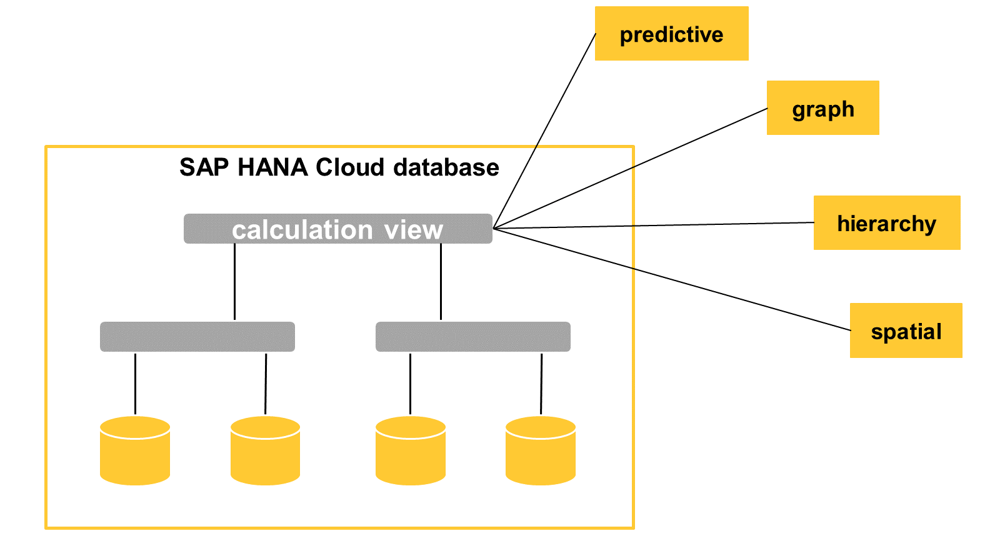
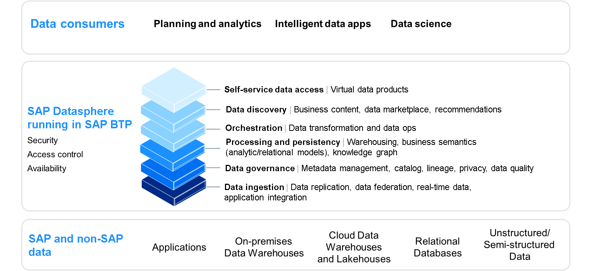
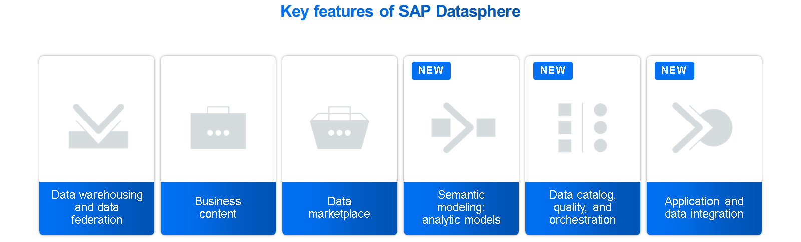

# ♠ 1 [PARAPHRASING DATA MANAGEMENT AND DATA WAREHOUSING](link)

> :exclamation: Objectifs
>
> - [ ] Describe SAP HANA Cloud Modeling.
>
> - [ ] Identify the capabilities and use cases of SAP Datasphere.

## :closed_book: SAP HANA CLOUD MODELING

Les bases de données traditionnelles offraient des capacités de stockage et des capacités de traitement de données limitées, voire inexistantes. Cela signifie que les applications lisaient les données brutes de la base de données et, à l'aide de code applicatif tel qu'ABAP ou JAVA, développaient un code de traitement de données complexe à exécuter sur le serveur d'applications.

La base de données SAP HANA Cloud offre un stockage de données sophistiqué à plusieurs niveaux, ainsi que des capacités de traitement de données avancées. Ainsi, au lieu de demander des données brutes à la base de données, une application peut demander des informations. Le traitement des données est désormais transféré de la couche applicative vers la base de données en mémoire de SAP HANA Cloud. Ainsi, non seulement le traitement des données est plus rapide, mais les applications sont plus légères, car elles n'ont pas à gérer la logique de traitement des données. Des applications plus légères sont synonymes de plus d'agilité.

### ADVANCED MULTI-MODELS WITH SAP HANA CLOUD

Les vues de calcul sont définies au-dessus des tables pour fournir la couche de traitement des données. Elles sont généralement empilées, de sorte que les vues de calcul inférieures offrent des possibilités de réutilisation en définissant uniquement la couche de données de base. Au-dessus de celles-ci se trouvent d'autres vues de calcul qui ajoutent des calculs et une sémantique supplémentaires jusqu'à ce qu'elles soient prêtes à être utilisées par les clients. Les vues de calcul ne conservent pas les données, mais calculent les résultats à la volée à partir des données en temps réel des tables sources. Les tables sources peuvent être des tables locales dans la base de données SAP HANA Cloud ou des tables distantes dans n'importe quelle base de données.

SAP HANA Cloud inclut des moteurs de traitement de données avancés qui, combinés aux vues de calcul, permettent de stocker et de traiter nativement des données spatiales, graphiques, hiérarchiques et prédictives :

#### :small_red_triangle_down: Predictive :

Développer des modèles prédictifs à l’aide d’algorithmes intégrés, notamment l’apprentissage automatique.

#### :small_red_triangle_down: Graph :

Stockez et interrogez des modèles de données hautement connectés en réseau tels que des chaînes d'approvisionnement ou des communautés en ligne (par exemple, les contacts LinkedIn).

#### :small_red_triangle_down: Hierarchy :

Interrogez les hiérarchies pour extraire des sémantiques précieuses telles que les ancêtres, les personnes à charge, la distance entre les nœuds ou les frères et sœurs.

#### :small_red_triangle_down: Spatial :

Stockez et interrogez des données géométriques pour ajouter des informations spatiales aux analyses telles que la cartographie.

Avec SAP HANA Cloud, vous pouvez combiner tout type de données : texte, géométries, données IoT, etc., pour créer des multi-modèles qui alimentent des analyses avancées et hautes performances.

### LEARN MORE

Apprenez-en davantage sur la [modélisation dans SAP HANA Cloud dans notre parcours d’apprentissage](https://learning.sap.com/learning-journeys/develop-data-models-with-sap-hana-cloud).

## :closed_book: SAP DATASPHERE AS FOUNDATION FOR A BUSINESS DATA FABRIC ARCHITECTURE

Aujourd'hui, nous sommes constamment à la recherche de nouvelles technologies pour gérer les données. Mais dans ces recherches incessantes, nous avons négligé un problème majeur : nous nous concentrons uniquement sur la technologie elle-même, sans nous concentrer sur les données, véritables sources de valeur. La transition vers le cloud a encore aggravé le problème. Nous essayons désormais d'extraire le contexte via différents systèmes cloud et sur site.

La meilleure approche pour résoudre ce problème ne consiste donc pas à déplacer des données dans l'espoir de reconstituer les données perdues. La meilleure solution consiste à adopter une architecture de données métier, une architecture de gestion des données axée sur le provisionnement d'une couche de données intégrée et riche en sémantique sur les environnements de données sous-jacents, afin de fournir un accès fluide et évolutif aux données sans duplication.

### THE ROLE OF SAP DATASPHERE IN SAP BUSINESS DATA CLOUD

SAP Datasphere joue un rôle crucial dans SAP Business Data Cloud. Bien que SAP Business Data Cloud puisse techniquement fonctionner sans, SAP Datasphere est indispensable pour les applications Insight Apps prêtes à l'emploi et les analyses avancées. Il permet aux utilisateurs de créer des modèles analytiques personnalisés en intégrant des produits de données gérés par SAP et des produits tiers, avec un potentiel futur de partage de données zéro copie. De plus, il offre des espaces sécurisés pour les modèles gérés par SAP et permet une autorisation au niveau des lignes pour des analyses personnalisées.

SAP Datasphere accompagnera nos clients dans ce domaine. Il s'agit de la nouvelle génération et du nouveau nom de SAP Data Warehouse Cloud. SAP Datasphere est un service de données complet, basé sur la plateforme SAP Business Technology et constituant le socle d'une infrastructure de données métier. Il permet à toute organisation de fournir des données pertinentes à tous les utilisateurs, tout en préservant le contexte et la logique métier.

Une étape importante pour notre secteur et nos clients est de collaborer avec un écosystème de données ouvertes composé de fournisseurs de technologies de premier plan afin de permettre une intégration sur mesure entre SAP Datasphere et leurs solutions, facilitant ainsi la simplification, l'intégration, la sécurisation et le contrôle de l'environnement de données des entreprises.

Le premier groupe de fournisseurs de données et d'IA leaders du secteur comprend Confluent, Databricks et DataRobot. L'objectif est de collaborer pour promouvoir et consolider SAP Business Data Fabric en tant que nouvelle norme industrielle pour une stratégie de données interopérable. Il offre des fonctionnalités allant de la saisie de données à l'accès en libre-service aux données SAP et non SAP.

Avec l'introduction de SAP Datasphere, nous avons conservé toutes les puissantes fonctions de SAP Data Warehouse Cloud et ajouté de nouvelles capacités de modélisation sémantique sophistiquées avec le modèle analytique, un nouveau catalogue de données et une intégration d'applications et de données.

### EVOLVING SAP DATA WAREHOUS CLOUD TOWARDS A BUSINESS DATA FABRIC

Avec SAP Datasphere, vous pouvez :

#### :small_red_triangle_down: Access authoritative data :

en fournissant des données commerciales dans leur contexte commercial, en modélisant sans effort votre entreprise et en garantissant la gouvernance tout au long du cycle de vie de vos données.

#### :small_red_triangle_down: Enrich all data projects :

tout en accédant virtuellement à vos données ou en les stockant physiquement depuis n'importe où, en tirant parti de partenaires de données de confiance et en intégrant des plateformes de données et d'IA de pointe.

#### :small_red_triangle_down: Simplify the data landscape :

grâce à des innovations dans les architectures hybrides, l'accès aux données en libre-service et l'exploitation des modèles et transformations SAP BW existants.

### LEARN MORE

Pour en savoir plus sur SAP Datasphere, consultez la [page officielle du produit](https://www.sap.com/products/technology-platform/datasphere.html).

Obtenez de l'aide sur le produit grâce à la documentation officielle : [SAP_DATASPHERE](https://help.sap.com/docs/SAP_DATASPHERE).

## :closed_book: KEY TAKEWAYS OF THIS LESSON

Intégrez, préparez, cataloguez, gérez et modélisez vos données grâce aux fonctionnalités de gestion et d'entreposage de données de SAP BTP et commencez à utiliser des offres telles que SAP Datasphere, SAP BW Bridge : Présentation et analyse technique approfondie, Modélisation avec SAP HANA Cloud et SAP Master Data Governance Cloud.
