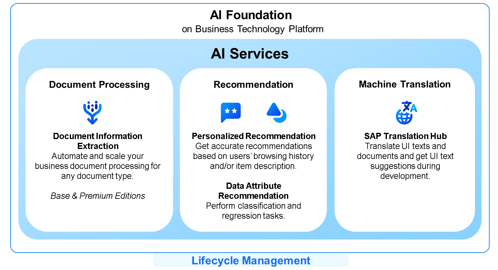

# ♠ 1 [DESCRIBING SAP API SERVICES](https://learning.sap.com/learning-journeys/discover-sap-business-technology-platform/describing-sap-ai-business-services_b8b4d646-4469-41dc-b33d-6cb92053601c)

> :exclamation: Objectifs
>
> - [ ] Describe SAP AI Services.

## :closed_book: SAP AI SERVICES

Les services d'IA SAP, intégrés à la plateforme IA Foundation on Business Technology Platform, fournissent des services et applications stratégiques qui automatisent et optimisent les processus d'entreprise et enrichissent l'expérience client. Ils sont proposés sous forme de services réutilisables aux clients de la plateforme SAP Business Technology Platform. Ils offrent un accès API aux fonctionnalités d'IA que vous pouvez exploiter dans vos scénarios et projets de développement grâce à des services complémentaires à la plateforme SAP Business Technology Platform.

Par exemple, vous pouvez intégrer des recommandations personnalisées à vos utilisateurs en fonction de vos données et des leurs. Vous pouvez également accélérer le traitement des documents grâce aux services de traitement des documents d'entreprise : Extraction d'informations documentaires et Reconnaissance d'entités métier. Par exemple, les scénarios de demande de renseignements auprès des fournisseurs ou de boîte de réception centralisée peuvent être optimisés.

SAP Translation Hub optimise le processus de traduction des textes et documents d'interface utilisateur grâce à un référentiel approuvé par SAP, à la traduction automatique et à des termes personnalisés. Par exemple, il pourrait automatiser la traduction de l'interface utilisateur dans l'extension ABAP d'une multinationale, garantissant ainsi la cohérence entre les langues. Il améliore encore l'efficacité en proposant des suggestions en phase de développement, en activant des fonctionnalités API pour d'autres applications et en permettant l'intégration de données linguistiques spécifiques à un secteur pour améliorer la qualité de la traduction.

### LEARN MORE

Apprenez-en plus sur SAP AI Business Services dans la [documentation officielle du produit](https://help.sap.com/docs/ai-services).

## :closed_book: KEY TAKEWAYS OF THIS LESSON

SAP propose de nombreux services ou applications intégrant l'IA, comme les SAP AI Business Services. Leur utilisation au sein de votre entreprise vous permet de transformer vos tâches manuelles en processus métier automatisés.
