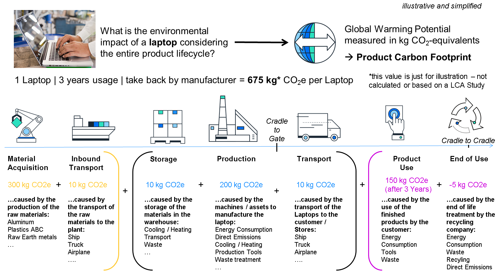
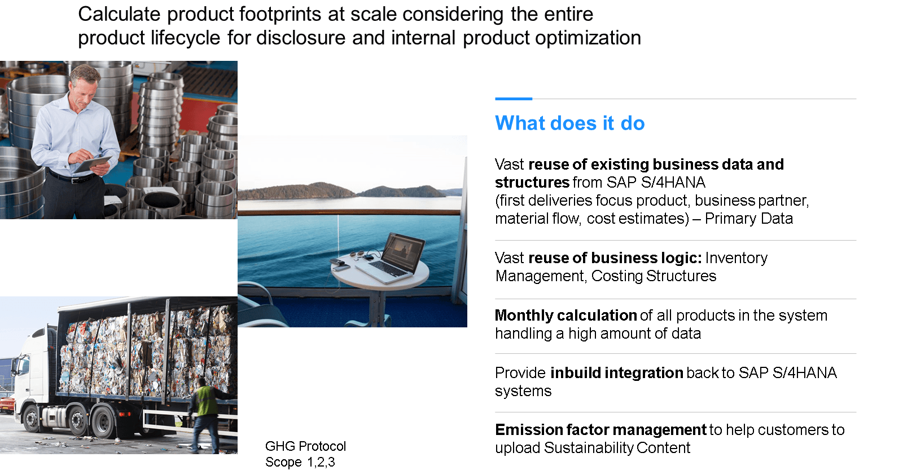
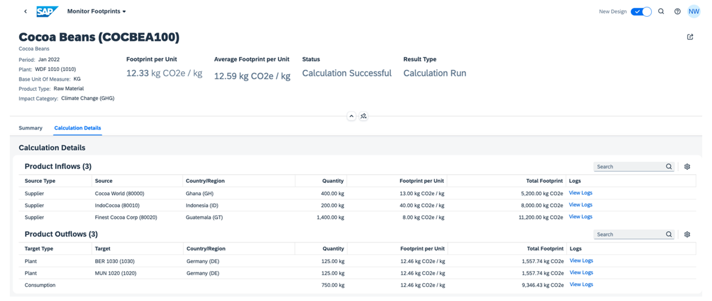
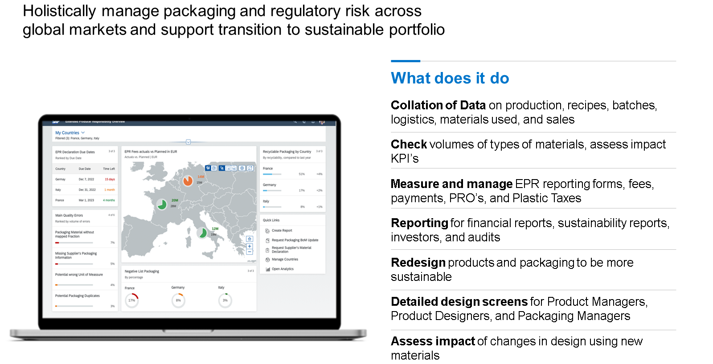
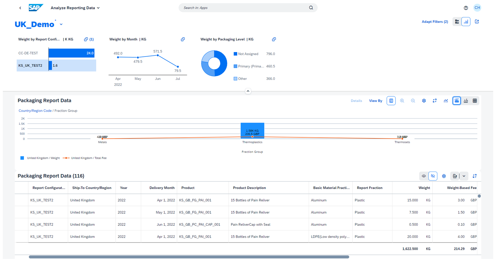

# ♠ 1 [IDENTIFYING THE CAPABILITIES OF SAP CLOUD FOR SUSTAINABLE ENTERPRISE](https://learning.sap.com/learning-journeys/discover-sap-business-technology-platform/identifying-the-capabilities-of-sap-cloud-for-sustainable-enterprises_df8ec75c-9e0a-435c-b0d1-5dbba6fe5e53)

> :exclamation: Objectifs
>
> - [ ] Identify the capabilities of SAP Product Footprint Management.
>
> - [ ] Identify the benefits of SAP Responsible Design and Production.

## :closed_book: OUTLINE SAP PRODUCT FOOTPRINT MANAGEMENT

La production de presque tous les produits, et même l'utilisation d'un produit spécifique, génère une empreinte carbone. Votre entreprise doit surveiller l'empreinte carbone de tous ses produits. Ce suivi permet d'optimiser le cycle de vie de vos produits et de réduire les émissions de gaz à effet de serre. C'est là qu'intervient SAP Product Footprint Management. Avec SAP Product Footprint Management, vous pouvez surveiller et gérer votre empreinte carbone. Grâce à ces informations, vous pouvez optimiser vos émissions de gaz à effet de serre tout au long du cycle de vie de vos produits.

### SAP PRODUCT FOOTPRINT MANAGEMENT

Avec SAP Product Footprint Management, vous disposez d'une solution pour gérer vos empreintes grâce aux fonctionnalités suivantes :

#### :small_red_triangle_down: Integrate with supported business systems :

SAP Product Footprint Management prend en charge l'intégration avec les systèmes d'entreprise (par exemple, SAP S/4HANA Cloud) pour importer vos données métier. Vous pouvez ainsi étendre les fonctionnalités par défaut de SAP S/4HANA avec des fonctionnalités supplémentaires pour la gestion de l'empreinte produit.

#### :small_red_triangle_down: Publish footprint information :

SAP Product Footprint Management vous permet de publier des informations d'empreinte en tant que données de base sur les systèmes d'entreprise pris en charge.

#### :small_red_triangle_down: Import emission factors :

Importez des facteurs d'émission depuis des sources telles que des bases de données d'analyse du cycle de vie (ACV) vers la solution. Vous pouvez importer des données de plusieurs sources tierces pour répondre aux besoins de votre entreprise.

#### :small_red_triangle_down: Run calculations and monitor footprints :

Utilisez un modèle de calcul pour exécuter des calculs de masse pour les empreintes de produit et surveiller les résultats.

#### :small_red_triangle_down: Perform footprint analytics :

Obtenez un aperçu de l’empreinte de vos produits en exploitant les services d’analyse fournis par SAP Product Footprint Management.

> Plus d'informations sur [SAP Product Footprint Management ici](https://www.sap.com/products/product-footprint-management.html#:~:text=SAP%20Product%20Footprint%20Management%20is,internal%20product%20and%20process%20optimization.). Vous pouvez également regarder cette courte [vidéo de présentation](https://www.youtube.com/watch?v=xtMaubgYT_0).

## :closed_book: SAP PRODUCT FOOTPRINT MANAGEMENT: ANALYZE CARBON FOOTPRINT

Après avoir collecté les données métier et les facteurs d'émission pertinents, les bases du calcul des empreintes sont posées. SAP Product Footprint Management propose un modèle de calcul préconfiguré pour définir le périmètre à inclure dans le calcul. Ce modèle sélectionne un sous-ensemble de données d'activité nécessaires au calcul. Pour l'acquisition de matières, ces données incluent la quantité de matières achetées auprès des fournisseurs, les transferts de stock depuis d'autres usines et les matières achetées consommées dans les produits manufacturés pour la période. Les produits sont ensuite associés aux facteurs d'émission de la base de données LCI pour permettre un calcul ascendant de l'empreinte. Cette association s'effectue via des modèles de tables de mappage pré-installés, configurables par des experts en développement durable, leur permettant de déterminer la meilleure correspondance entre les données métier et les facteurs d'émission en fonction des caractéristiques des matières, des fournisseurs, des pays et des codes produits.

Une fois le calcul effectué, l'application Monitor Footprints vous permet de visualiser les résultats de l'empreinte. Les résultats sont affichés par type de produit, par unité et au total, et sont ventilés selon différents niveaux de granularité, comme par exemple les fournisseurs de matières achetées. De plus, une moyenne mensuelle cohérente est calculée automatiquement. Vous pouvez également comparer les empreintes sur différentes périodes afin d'observer les tendances. Pour rendre les empreintes disponibles dans SAP S/4HANA Cloud ou sur SAP S/4HANA, cette application vous permet également de les publier sur ces systèmes métier.

### LEARN MORE

Apprenez-en plus sur [SAP Product Footprint Management grâce à notre parcours d'apprentissage](https://learning.sap.com/learning-journey/taking-action-on-climate-change-with-sap-sustainability-footprint-management).

Pour en savoir plus sur [SAP Product Footprint Management, consultez la documentation officielle du produit ici](https://help.sap.com/docs/SAP_BTP_PFM?locale=en-US).

## :closed_book: OUTLINE SAP RESPONSIBLE DESIGN AND PRODUCTION

Avec la solution cloud SAP, SAP Responsible Design and Production, gérez facilement vos tâches de Responsabilité Élargie des Producteurs (REP). Calculez et déclarez les frais de REP, les taxes sur le plastique et les engagements de l'entreprise en connectant les données primaires, les structures et la logique métier existantes de SAP ERP et de SAP Product Lifecycle Management à votre solution SAP Responsible Design and Production. Vous pouvez également connecter des systèmes tiers pour collecter des données, voire des modèles Microsoft Excel fournis par SAP Responsible Design and Production. Avec SAP Responsible Design and Production, vous pouvez analyser l'impact des réglementations sur les scénarios de produits et de matériaux d'emballage, ou suivre vos exigences mondiales en matière de reporting pour les programmes de REP, les taxes sur le plastique et les engagements publics.

SAP Responsible Design and Production est la solution idéale pour calculer vos obligations de REP, vos taxes sur le plastique et vos engagements d'entreprise afin d'optimiser les choix de matériaux pour votre entreprise et vos produits.

> Note
>
> REP : Responsabilité Élargie du Producteur - un concept dans lequel les fabricants et les importateurs de produits devraient assumer un degré important de responsabilité quant aux impacts environnementaux de leur produit

### SAP RESPONSIBLE DESIGN AND PRODUCTION

L'application Analyse des données de reporting offre un aperçu des données relatives à la REP et à la fiscalité. Dans cette application, vous pouvez enregistrer votre configuration d'affichage. Vous pouvez également la partager avec d'autres utilisateurs ou utiliser les configurations publiées par d'autres utilisateurs. Afin de répondre aux demandes ponctuelles concernant les données des rapports d'emballage provenant de différentes parties prenantes, l'application vous permet de suivre les résultats du reporting et de piloter l'analyse selon différents critères de filtrage. Par exemple, le graphique à barres affiche les poids des emballages regroupés par fraction de matériau pour un rapport néerlandais. De plus, les filtres visuels situés dans la partie supérieure vous permettent de filtrer davantage les données affichées ci-dessous. Vous pouvez enregistrer votre configuration d'affichage et vos combinaisons de filtres, et également la partager avec d'autres utilisateurs ou utiliser les configurations publiées par d'autres utilisateurs.

### LEARN MORE

Apprenez-en plus sur la [conception et la production responsables SAP grâce à notre parcours d'apprentissage](https://learning.sap.com/learning-journey/responsible-design-and-production-for-the-circular-economy).

Plus d'informations sur la [conception et la production responsables SAP ici](https://www.sap.com/products/responsible-design-and-production.html).

Vous pouvez également consulter la [documentation produit](https://help.sap.com/docs/SAP_RESPONSIBLE_DESIGN_AND_PRODUCTION/01d581e7150c42f59b5234a76f5e8d2d/ebc5d85b618f492790229b23156b771d.html?locale=en-US).

## :closed_book: KEY TAKEWAYS OF THIS LESSON

SAP propose déjà plusieurs solutions cloud autonomes fonctionnant sur SAP BTP, sous le nom de SAP Cloud for Sustainable Enterprises. Elles peuvent être utilisées pour différents cas d'usage axés sur le développement durable, comme le calcul de l'empreinte produit ou la réflexion sur l'économie circulaire. SAP ajoute également des fonctionnalités permettant un reporting durable global.
