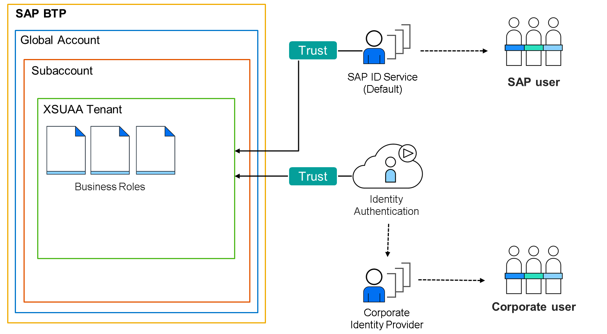

# ♠ 1 [ILLUSTRATING SAP AUTHORIZATION AND TRUST MANAGEMENT SERVICE](https://learning.sap.com/learning-journeys/discover-sap-business-technology-platform/illustrating-sap-authorization-and-trust-management-service-xsuaa-_b9fde282-4cff-4dca-b146-7c8f8dde9955)

> :exclamation: Objectifs
>
> - [ ] Illustrate SAP Authorization and Trust Management Service (XSUAA).
>
> - [ ] Describe App Router.

## :closed_book: SAP AUTHORIZATION AND TRUST MANAGEMENT SERVICE (XSUAA)

Le service XSUAA, intégré à SAP BTP, gère le flux d'autorisation entre les utilisateurs, les fournisseurs d'identité et les applications ou services. Ce service est un développement interne de SAP dédié à SAP BTP. Le projet Cloud Foundry inclut un composant open source appelé UAA. UAA est un fournisseur OAuth qui gère l'authentification et l'autorisation. SAP a utilisé la base d'UAA et l'a étendue avec des fonctionnalités spécifiques à SAP pour SAP BTP.

Le service XSUAA gère l'authentification et l'autorisation dans SAP BTP et Cloud Foundry afin d'accorder des autorisations aux utilisateurs métier via des rôles métier. Le service XSUAA ne stocke pas les données ni les enregistrements utilisateurs. Il nécessite une connexion sécurisée à un fournisseur d'identité. Il peut s'agir du service d'identification SAP ou d'un autre fournisseur d'identité d'entreprise intégré à SAP BTP. Cette connexion peut être établie via SAP Cloud Identity Services - Identity Authentication Service (IAS).

Le service XSUAA constitue le composant d'infrastructure central de l'environnement Cloud Foundry chez SAP BTP pour l'authentification et l'autorisation des utilisateurs métier. SAP a amélioré l'UAA Cloud Foundry en ajoutant un courtier de services, une architecture mutualisée, des fonctions d'API de gestion et quelques améliorations mineures. XSUAA utilise OAuth pour l'authentification entre plusieurs services et la connexion au fournisseur d'identité.

OAuth est une norme ouverte permettant aux applications et aux sites web de gérer les autorisations. OAuth ne partage pas les données de mot de passe, mais utilise des jetons d'autorisation pour prouver l'identité des utilisateurs et des fournisseurs de services. Ce protocole d'authentification vous permet d'autoriser une application à interagir avec une autre en votre nom sans divulguer votre mot de passe. Les jetons utilisés par OAuth sont appelés jetons JWT. JWT (prononcé « jot ») est une norme ouverte qui définit un moyen compact et autonome de transmettre des informations de manière sécurisée entre les parties. JWT est largement utilisé dans OAuth pour la transmission sécurisée des informations et des droits d'accès des utilisateurs.

### LEARN MORE

Pour en savoir plus sur [Cloud Foundry UAA, cliquez ici](https://docs.cloudfoundry.org/concepts/architecture/uaa.html).

Pour en savoir plus sur le[ service XSUAA de SAP](https://help.sap.com/docs/CP_AUTHORIZ_TRUST_MNG/ae8e8427ecdf407790d96dad93b5f723/649961f8d4ad463daca33b3a20deba4c.html?locale=en-US), cliquez ici et [ici](https://help.sap.com/docs/BTP/65de2977205c403bbc107264b8eccf4b/2ce1a962c3be48dd8035513b0a2d7397.html?locale=en-US).

Pour en savoir plus sur [OAuth, cliquez ici](https://oauth.net/2/) et sur les [jetons JWT, cliquez ici](https://jwt.io/introduction).

## :closed_book: APP ROUTER

[Link Video](https://learning.sap.com/learning-journeys/discover-sap-business-technology-platform/illustrating-sap-authorization-and-trust-management-service-xsuaa-_b9fde282-4cff-4dca-b146-7c8f8dde9955)

Lorsqu'une application métier est composée de plusieurs applications (microservices), le routeur d'applications sert de point d'entrée unique vers l'application métier. Techniquement, un routeur d'applications est une application Node.js, disponible dans le registre NPM public. Un routeur d'applications est démarré à partir d'un fichier de configuration appelé xs-app.json. Ce fichier définit les routes desservies par ce routeur d'applications et l'instance de service XSUAA qui lui est liée pour gérer les requêtes d'authentification.

Un routeur d'applications sert à :

- Servir du contenu ou des fichiers statiques ;

- Authentifier les utilisateurs ;

- Distribuer les requêtes aux applications back-end (microservices).

En conclusion : le routeur d'applications transmet les requêtes d'authentification au service XSUAA, assurant le routage entre les applications ou les microservices. S'il existe dans le projet, il sert également des ressources statiques telles que des documents ou des images dans une structure de système de fichiers.

### LEARN MORE

Pour en savoir plus sur [SAP App Router, consultez la documentation](https://www.npmjs.com/package/@sap/approuter#overview).

Vous pouvez consulter la section [Sécurité de la documentation SAP BTP ici](https://help.sap.com/docs/BTP/65de2977205c403bbc107264b8eccf4b/e129aa20c78c4a9fb379b9803b02e5f6.html?locale=en-US).

Vous trouverez ici d'autres [ressources d'apprentissage sur la sécurité avec SAP BTP](https://help.sap.com/learning-journeys/69aca66b45a74a73b4cc0efddd6ae63f).

## :closed_book: KEY TAKEWAYS OF THIS LESSON

Le service XSUAA assure la connexion entre les applications et les fournisseurs d'identité. Il garantit la sécurité et accorde l'accès via les rôles, sans stocker les données ni les enregistrements des utilisateurs. Il utilise OAuth pour l'authentification entre plusieurs services et la connexion au fournisseur d'identité. De plus, le routeur d'applications fait office de point d'entrée central et de passerelle entre les applications, les utilisateurs et le service XSUAA.
