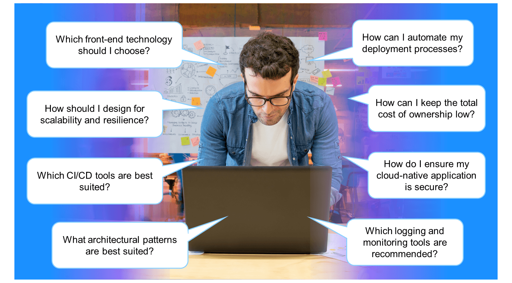
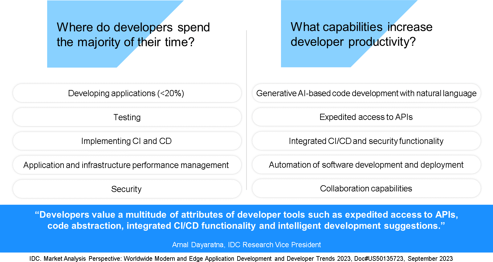
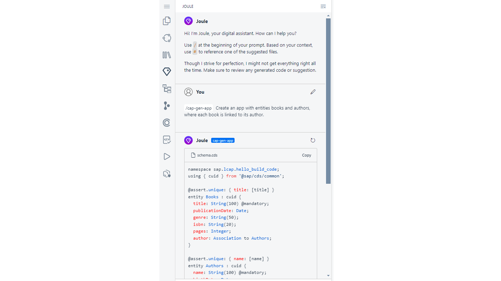
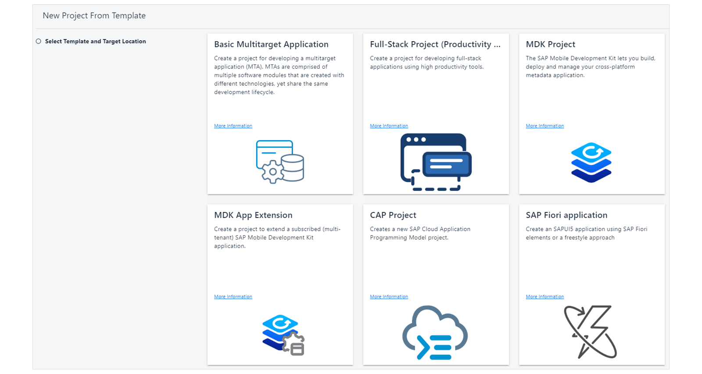
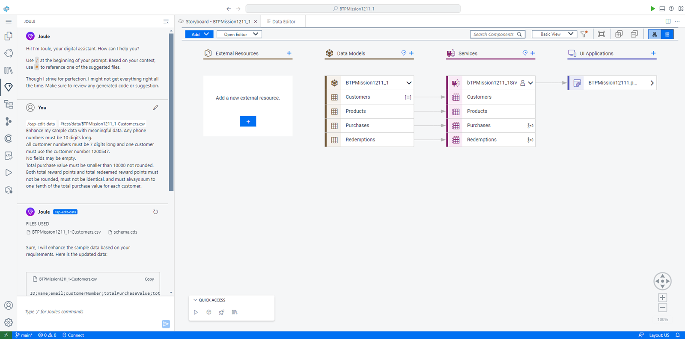
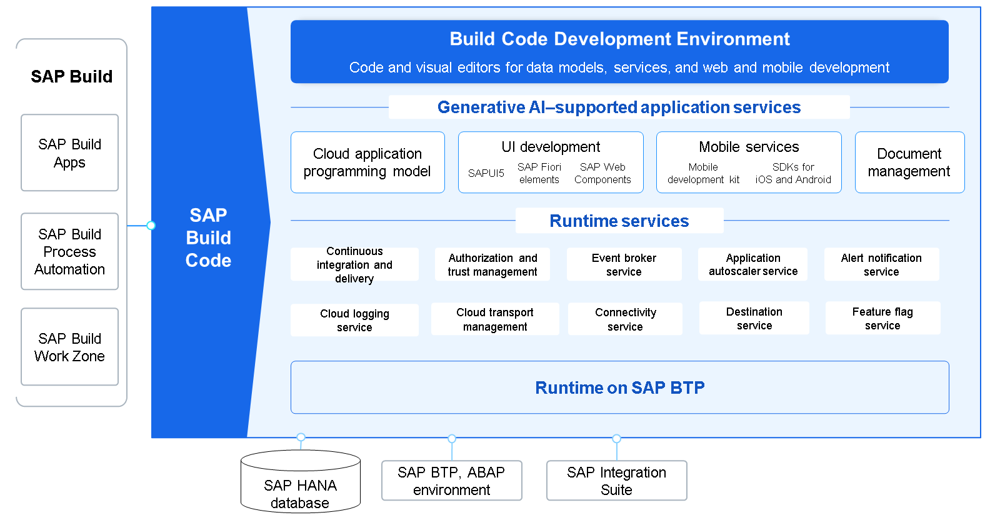
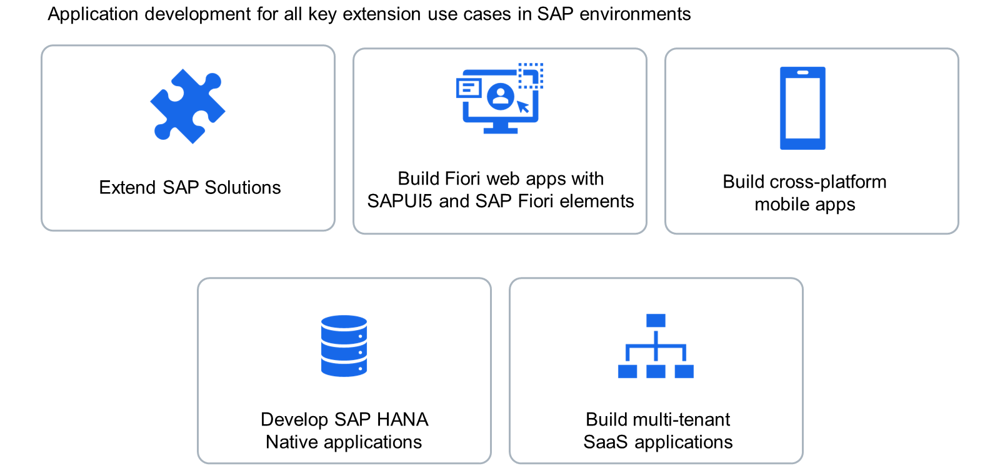
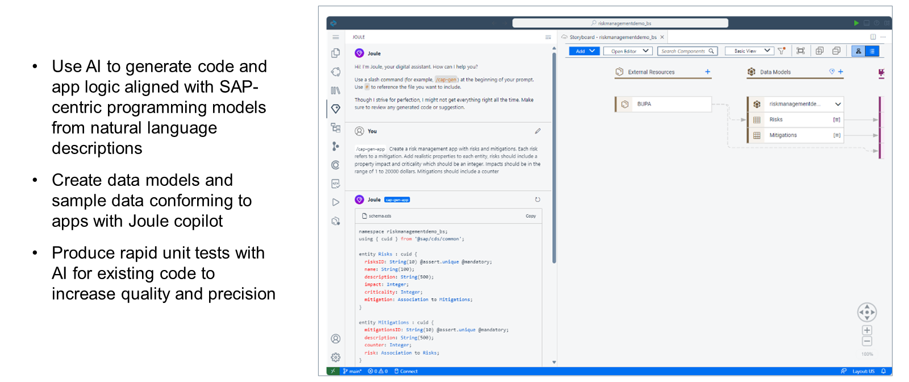

# ♠ 1 [INTRODUCING SAP BUILD CODE](https://learning.sap.com/learning-journeys/creating-applications-and-extensions-using-sap-build-code/exploring-the-sap-build-lobby)

> :exclamation: Objectifs
>
> - [ ] Introduce SAP Build Code

## :closed_book: INTRODUCTING SAP BUILD CODE

### HOW CAN DEVELOPERS INCREASE PRODUCTIVITY?

Dans le paysage technologique actuel, les entreprises sont confrontées à un défi majeur : d’une part, la demande de nouvelles applications et de solutions cloud est en hausse. D’autre part, elles souffrent d’une grave pénurie de professionnels de l’informatique qualifiés. De nombreux postes sont déjà vacants, et ce nombre ne cesse d’augmenter. IDC prévoit qu’en 2026, 9 organisations sur 10 souffriront d’un manque de compétences informatiques ([la pénurie de compétences informatiques devrait toucher neuf organisations sur dix d’ici 2026, avec un coût de 5 500 milliards de dollars en retards, problèmes de qualité et pertes de revenus, selon IDC](https://www.idc.com/getdoc.jsp?containerId=prUS52128824#:~:text=IDC%20predicts%20that%20by%202026,competitiveness%2C%20and%20loss%20of%20business.)).

Cette situation dramatique est d’autant plus grave que de nombreux professionnels du développement déclarent ne consacrer qu’une faible partie de leur temps de travail au développement d’applications. Nombreux sont les développeurs qui connaissent des situations comme celle illustrée dans l’image suivante : au lieu d’écrire du code, ils réfléchissent à une multitude d’autres questions. Selon IDC, les développeurs professionnels consacrent moins de 20 % de leur temps au développement d'applications (IDC, Market Analysis Perspective: Worldwide Modern and Edge Application Development and Developer Trends 2023, Doc #US50135723, septembre 2023). Ils consacrent le reste de leur temps à d'autres tâches, notamment les tests, la mise en œuvre du CI/CD, la gestion des performances des applications et de l'infrastructure, et la sécurité.

Les outils de développement comblent cette lacune en offrant des capacités pour augmenter l'efficacité des développeurs, notamment le développement de code génératif basé sur l'IA avec une entrée en langage naturel, un accès accéléré aux API, des fonctionnalités CI/CD et de sécurité intégrées, l'automatisation du développement et du déploiement de logiciels et des capacités de collaboration (Source : IDC, Market Analysis Perspective : Worldwide Modern and Edge Application Development and Developer Trends 2023, Doc #US50135723, septembre 2023).

### BOOSTING DEVELOPER PRODUCTIVITY WITH SAP BUILD CODE

Comme indiqué précédemment, améliorer la productivité des développeurs est crucial. [SAP Build Code](https://www.sap.com/products/technology-platform/developer-tools.html) est l'environnement clé en main de SAP pour le codage, les tests, les intégrations et la gestion du cycle de vie des applications. Il offre de nombreuses fonctionnalités pour optimiser l'efficacité des développeurs. Il inclut la combinaison unique de fonctionnalités suivante :

#### :small_red_triangle_down: AI-powered assistance :

SAP Build Code offre une assistance optimisée par l'IA pour aider les développeurs à créer leurs applications plus rapidement et plus efficacement. Cette assistance comprend notamment la génération de code et de logique applicative, de modèles de données et de scripts de test.

#### :small_red_triangle_down: Prebuilt components and templates :

SAP Build Code propose divers composants et modèles prédéfinis, basés sur les meilleures pratiques, que les développeurs peuvent utiliser pour accélérer leurs applications. Ces composants incluent des éléments d'interface utilisateur, une logique métier et des intégrations. La capture d'écran suivante présente les modèles disponibles pour la création de projets.

#### :small_red_triangle_down: Clean Core Strategy :

SAP Build Code permet de préserver les systèmes ERP centraux (comme SAP S/4HANA) de toute personnalisation. Avec SAP Build Code, les développements et extensions personnalisés sont basés sur SAP Business Technology Platform (SAP BTP), conformément à la [stratégie ERP « clean core » de SAP](https://www.sap.com/products/erp/rise/migration/clean-core.html). Cette approche garantit un système central stable et facilement évolutif. (Voir « [Gérer Clean Core pour SAP S/4HANA Cloud](https://learning.sap.com/learning-journeys/managing-clean-core-for-sap-s-4hana-cloud) » et « [Practice Clean Core Extensibility pour SAP S/4HANA Cloud](https://learning.sap.com/learning-journeys/practicing-clean-core-extensibility-for-sap-s-4hana-cloud) » pour plus d'informations sur l'extensibilité « clean core ».)

#### :small_red_triangle_down: Cloud-based development :

SAP Build Code is a fully cloud-based solution, so developers can access it from anywhere using an internet connection.

#### :small_red_triangle_down: Optimized for SAP software development :

SAP Build Code est conçu pour le développement SAP et inclut des intégrations, des API et des services métier prédéfinis. Basé sur SAP BTP, il bénéficie de nombreuses fonctionnalités éprouvées, notamment une sécurité fiable.

#### :small_red_triangle_down: Visual programming tools and guided wizards :

SAP Build Code propose de nombreux outils de productivité augmentant l'efficacité et garantissant le respect des meilleures pratiques et des conseils décrits dans le Guide du développeur SAP BTP.

### SAP CUILD CODE COMPONENTS

SAP Build Code est un outil puissant basé sur SAP BTP. Il intègre de nombreuses fonctionnalités logicielles SAP éprouvées, offrant des fonctionnalités de conception et d'exécution.

Voici une liste de certains des services inclus dans SAP Build Code :

- Services applicatifs

  - Le modèle de programmation d'applications SAP Cloud (CAP) est un framework permettant de créer des services et applications d'entreprise. Offrant des solutions prêtes à l'emploi pour de nombreuses tâches récurrentes et des conseils basés sur des bonnes pratiques éprouvées, il optimise l'expérience de développement.

  - Développement d'interface utilisateur :

    - SAPUI5 fournit un ensemble complet de contrôles d'interface utilisateur et un framework pour la création d'applications web réactives, garantissant une expérience utilisateur homogène et de haute qualité sur différents appareils et plateformes.

    - SAP Fiori Elements est un framework proposant un ensemble de plans d'étage standardisés pour le développement d'applications SAP Fiori cohérentes, évolutives et faciles à maintenir. Tandis que SAPUI5 constitue la technologie front-end de base, SAP Fiori Elements simplifie la création d'une interface utilisateur standardisée, mais personnalisable, conforme aux directives de conception SAP Fiori.

    - Les composants Web SAP sont des composants d'interface utilisateur réutilisables et prêts à l'emploi pour l'entreprise, utilisables avec SAPUI5 ou tout autre framework de développement web.

  - SAP Mobile Services prend en charge le développement, la configuration et la gestion d'applications mobiles natives et multiplateformes. Il offre une gamme de fonctionnalités et d'outils prenant en charge l'ensemble du cycle de vie des applications mobiles. Il est complété par plusieurs outils de développement tels que les kits de développement logiciel (SDK) natifs pour iOS et Android, le kit de développement mobile ou les cartes mobiles SAP.

  - SAP Document Management offre des fonctionnalités de gestion et de stockage de différents types de documents commerciaux et de pièces jointes.

- Services d'exécution

  - SAP Continuous Integration and Delivery vous permet d'automatiser et de simplifier le processus de développement d'applications en configurant et en exécutant des pipelines CI/CD prédéfinis pour automatiser la création, les tests et le déploiement des modifications de code. Les développeurs peuvent ainsi déployer les modifications de code rapidement et de manière fiable.

  - Le service SAP Authorization and Trust Management vous aide à gérer les autorisations des utilisateurs et la confiance accordée aux fournisseurs d'identité.

  - SAP Event Broker pour les applications cloud SAP vous aide à gérer la distribution des événements dans l'environnement cloud SAP.

  - Application Autoscaler met automatiquement à l'échelle les applications en fonction des politiques que vous avez définies.

  - Le service SAP Alert Notification vous permet de recevoir des notifications concernant les ressources, les services et les applications personnalisées SAP BTP.

  - Le service SAP Cloud Logging permet de stocker, de visualiser et d'analyser les journaux, les métriques et les traces des applications provenant de SAP BTP Cloud Foundry, Kyma, Kubernetes et d'autres environnements d'exécution.

  - Le service SAP Cloud Transport Management vous permet de gérer le transport des applications et du contenu au sein d'un environnement SAP BTP.

  - Le service SAP Connectivity assure une connectivité fluide entre les applications cloud et les systèmes sur site.

  - Le service SAP Destination vous permet de récupérer et de stocker des informations techniques sur la destination à laquelle vous souhaitez connecter votre application.

  - Le service SAP Feature Flags permet l'activation et la désactivation dynamiques des fonctionnalités de l'application.

### USE CASES: CREAT AND EXTEND SEAMLESSLY WITH SAP BUILD CODE

Les cas d'utilisation suivants peuvent être couverts par SAP Build Code. Ils couvrent tous les principaux scénarios des environnements SAP.

1. SAP Build Code est conçu pour étendre les solutions SAP. Il simplifie considérablement le processus de création et d'extension des applications, en offrant aux développeurs des modèles de code prêts à l'emploi conformes aux meilleures pratiques SAP.

2. Avec SAP Build Code, les développeurs peuvent facilement créer et étendre des applications SAP Fiori et SAPUI5 à l'aide de points d'extension prédéfinis et adapter l'interface utilisateur des applications SAP Fiori Elements.

3. Pour le développement d'applications mobiles, SAP Build Code offre un environnement hautement contrôlé, où les développeurs peuvent créer, tester, développer et déployer des applications mobiles hybrides. De plus, il prend en charge le développement d'applications sans code, piloté par les métadonnées, et exploite l'intégration des services mobiles pour une expérience fluide.

4. Pour le développement d'applications natives SAP HANA, SAP Build Code fournit tous les outils nécessaires à la création de projets d'application SAP HANA ou à l'ajout de modules de base de données SAP HANA à des projets existants. Il prend en charge la création et le déploiement de divers artefacts SAP HANA grâce à des outils tels qu'un éditeur SQL, un éditeur graphique de vue de calcul, un éditeur graphique de graphe de flux et un explorateur de bases de données.

5. Enfin, SAP Build Code vous permet de développer et d'étendre facilement des applications SaaS multi-tenant. L'activation du multi-tenant offre des avantages significatifs, notamment une réduction des coûts, une évolutivité accrue et une sécurité renforcée.

En substance, SAP Build Code offre aux développeurs un environnement robuste et polyvalent pour créer des applications sophistiquées et performantes au sein de l'écosystème SAP.

### AN AI-POWERED COPILOT FOR DEVEOPERS

SAP Build Code introduit la génération de code IA avec le copilote Joule, améliorant le processus de développement en fournissant une assistance de codage intelligente et automatisée, notamment en utilisant des descriptions en langage naturel pour générer la logique de l'application.

Joule agit comme un copilote et vous accompagne à plusieurs étapes de votre processus de développement :

1. Vous pouvez utiliser le langage naturel pour décrire votre cas d'utilisation. Joule génère le modèle de données et les entités de service à partir de vos données. De plus, des exemples de données contextuelles sont créés à votre demande.

2. Joule permet de modifier le modèle de données, les services et les exemples de données de votre projet.

3. Joule permet d'ajouter une logique applicative.

4. Joule vous aide également à générer et à exécuter des tests unitaires.

5. Joule permet de créer une application d'interface utilisateur SAP Fiori.

Pour découvrir comment créer une application full-stack avec l'interface utilisateur SAP Fiori en utilisant Joule dans SAP Build Code, suivez ce tutoriel.

Pour plus d'informations sur Joule, nous vous recommandons :

- Documentation Joule

- Communauté Joule

### WHO IS SAP BUILD CODE FOR?

SAP Build Code s'adresse aussi bien aux développeurs professionnels qu'aux experts métier. En partageant des composants applicatifs tels que l'expérience utilisateur, la logique métier et les processus, les deux groupes d'utilisateurs gagnent en productivité grâce à leur collaboration. Appartenant à la famille SAP Build, SAP Build Code offre aux développeurs le choix entre SAP Build low-code, SAP Build Code pour Java/JavaScript et l'environnement ABAP pour le développement d'applications et d'extensions. SAP Build Code sécurise la collaboration entre les différents utilisateurs grâce à une gouvernance unifiée et une gestion simplifiée du cycle de vie des applications.

Joule agit comme copilote et offre divers avantages qui accélèrent et optimisent le processus de développement.

### SUMMARY

En substance, SAP Build Code est bien plus qu'un simple outil de développement : c'est un outil d'optimisation de la productivité qui permet aux développeurs de créer des applications robustes et dynamiques. Avec SAP Build Code, vous pouvez :

- Obtenir un cœur propre en développant des extensions côte à côte avec SAP Build Code sur SAP BTP ;

- Optimiser l'efficacité des développeurs grâce à l'IA générative, aux outils de productivité et à la gestion du cycle de vie des applications ;

- Créer et étendre des applications métier performantes de bout en bout ;

- Exploiter l'interopérabilité entre les outils de développement classiques et low-code.
